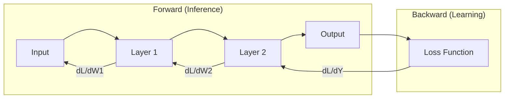

# 🔄 Backpropagation Deep Dive: The Mathematical Heart of Learning
> **Level:** Advanced | **Language:** Hinglish | **Goal:** Neural networks kaise seekhte hain iske end-to-end mechanism ko master karein, jisme forward pass, loss computation, chain rule, aur weight update process shamil hain.

---

## 🧭 1. Beginner-Friendly Hinglish Explanation
Backpropagation AI ka wo "Feedback Loop" hai jo use har baar pehle se behtar banata hai.

Sochiye, aap archery (teer-andazi) seekh rahe hain. 
1. **Forward Pass:** Aapne teer chalaya (Input $\to$ Model $\to$ Output). Teer target se 10 inch door laga.
2. **Loss Calculation:** Aapne dekha ki galti 10 inch ki hai (Loss).
3. **Backpropagation:** Ab aap apne dimaag mein peeche ki taraf sochte hain: "Galti kahan hui? Kya mera hath (Weight 1) dhila tha? Kya meri nazar (Weight 2) sahi nahi thi?". 
4. **Weight Update:** Aap agli baar apna hath thoda tight karte hain aur apni nazar fix karte hain. 

Neural Network mein ye "Peeche sochna" hi **Backpropagation** hai. Ye calculus ko use karke har layer ko batata hai ki use kitna "thoda sa" badalna hai taaki agli baar loss kam ho jaye.

---

## 🧠 2. Deep Technical Explanation
Backpropagation calculus ke **Chain Rule** ka ek application hai, jiske through network ke har ek weight ke respect me loss function ka gradient calculate kiya jata hai.

### The 4 Phases (4 Phases):
1. **Forward Pass:** Input data layers ke through aage badhta hai. Intermediate activations $a^{(l)}$ aur weighted sums $z^{(l)}$ memory me store hote hain (isi wajah se training ke time zyada VRAM ki need hoti hai).
2. **Loss Computation:** Loss function $L$ ka use karke final output ko target se compare kiya jata hai.
3. **Backward Pass (The Calculus):**
   - Output layer par error calculate karna: $\delta^{(L)} = \nabla_a L \odot \sigma'(z^{(L)})$.
   - Chain rule ka use karke error ko previous layers me backward propagate karna: $\delta^{(l)} = ((W^{(l+1)})^T \delta^{(l+1)}) \odot \sigma'(z^{(l)})$.
   - Ye gradient ko output se wapas input ki taraf "flow" karwata hai.
4. **Weight Update:** Ek optimizer (jaise SGD) ke through weights ko update karne ke liye calculated gradients ka use karna: $W = W - \eta \cdot \frac{\partial L}{\partial W}$.

---

## 🏗️ 3. The Backprop Components
| Step | Mechanism (Prakriya) | Mathematical Term |
| :--- | :--- | :--- |
| **Prediction** | Linear Transform + Activation | $a = \sigma(Wx + b)$ |
| **Error** | Target se difference | $L(y, \hat{y})$ |
| **Gradient Flow** | Chain Rule | $\frac{\partial L}{\partial w} = \frac{\partial L}{\partial \hat{y}} \cdot \frac{\partial \hat{y}}{\partial z} \cdot \frac{\partial z}{\partial w}$ |
| **Adjustment** | Learning Rate Step | $w_{new} = w_{old} - \eta \cdot Grad$ |

---

## 📐 4. Mathematical Intuition
- **The Chain Rule:** Ye ek relay race ki tarah hai. Har person (layer) agle person ko ek baton (gradient) pass karta hai. Agar koi bhi person baton drop kar deta hai (gradient 0 ho jata hai), toh race ruk jati hai (Learning ruk jati hai).
- **Partial Derivatives:** Hum sirf is baat par focus karte hain ki kaise KOI EK specific weight $w$ loss $L$ ko affect karta hai, ye assume karte hue ki us split second ke liye baaki sab kuch fixed hai.
- **Auto-Differentiation:** PyTorch jaise modern tools ek **Dynamic Computational Graph** build karte hain. Har operation (`+`, `*`, `exp`) ke liye ek corresponding "Backward function" pehle se likha hota hai.

---

## 📊 5. Forward vs. Backward (Diagram)

```mermaid
graph LR
    subgraph "Forward (Inference)"
    X[Input] --> W1[Layer 1]
    W1 --> W2[Layer 2]
    W2 --> Y[Output]
    end
    
    Y --> Loss[Loss Function]
    
    subgraph "Backward (Learning)"
    Loss -- "dL/dY" --> W2
    W2 -- "dL/dW2" --> W1
    W1 -- "dL/dW1" --> X
    end
```

---

## 💻 6. Production-Ready Examples (Manual Backprop Logic)
```python
# 2026 Pro-Tip: Samajhna ki hum PyTorch me .backward() kyun call karte hain.
import torch

# Inputs aur target define karna
x = torch.tensor([1.0], requires_grad=False)
y_true = torch.tensor([5.0], requires_grad=False)

# Weights define karna (jinhe hum learn karna chahte hain)
w = torch.tensor([2.0], requires_grad=True)
b = torch.tensor([0.0], requires_grad=True)

# 1. Forward Pass
y_hat = x * w + b

# 2. Loss Calculation
loss = (y_hat - y_true)**2

# 3. Backward Pass (The Magic)
# Ye dLoss/dw aur dLoss/db automatically calculate karta hai
loss.backward()

print(f"Gradient for w: {w.grad}") # w kitna change hona chahiye
print(f"Gradient for b: {b.grad}") # b kitna change hona chahiye

# 4. Optimization Step
with torch.no_grad():
    w -= 0.01 * w.grad # Learning rate = 0.01
    b -= 0.01 * b.grad
```

---

## ❌ 7. Failure Cases
- **Vanishing Gradients:** Deep networks (50+ layers) me, small numbers (jaise 0.1) ko 50 times multiply karne se gradient $10^{-50}$ ho jata hai. Pehli layers kabhi learn nahi kar paati. **Fix:** **Residual Connections** (ResNet) ka use karein.
- **Exploding Gradients:** RNNs me, gradients multiply hokar $10^{50}$ tak pahunch sakte hain. Weights `NaN` ho jate hain. **Fix:** **Gradient Clipping** ka use karein.
- **Broken Graph:** Galti se loop ke beech me PyTorch tensor ko NumPy array me convert kar dena. Isse link toot jata hai, aur `.backward()` fail ho jayega.

---

## 🛠️ 8. Debugging Guide
- **Symptom:** Gradients sabhi Zero hain.
- **Check:** **Activations**. Kya aap Sigmoid ka use kar rahe hain? ReLU par switch karein.
- **Check:** **Freezing**. Kya aapne galti se `requires_grad=False` set kar diya hai?
- **Symptom:** Training bahut zyada slow hai.
- **Check:** **Batch Size**. Agar ye bahut small hai, toh gradients bahut "Noisy" hote hain aur backprop ko converge hone me bahut zyada steps lagte hain.

---

## ⚖️ 9. Tradeoffs
- **Exact Gradient vs. Batch Gradient:** Exact gradient (poore data par) perfect hota hai par isme bahut time lagta hai. Stochastic Gradient (1 sample par) fast hota hai par messy hota hai. **Standard:** **Mini-batch** (32-128 samples) ka use karein.
- **Memory vs. Time:** Backprop ke dauran activations ko store karne ke bajaye unhe re-calculate karke aap VRAM save kar sakte hain (**Gradient Checkpointing**), par isme $30\%$ zyada time lagta hai.

---

## 🛡️ 10. Security Concerns
- **Gradient Inversion:** Agar aap "Federated Learning" (user ke phones par training) kar rahe hain, toh attacker server par bheje gaye gradients ko intercept kar sakta hai aur unka use user ke private photos ya messages ko reconstruct karne ke liye kar sakta hai. **Fix:** **Differential Privacy** ka use karein.

---

## 📈 11. Scaling Challenges
- **FP8 Training:** 2026 me, hum memory save karne ke liye 8-bit me train karte hain, par backpropagation me small gradients ke liye high precision ki need hoti hai. Hum **Mixed Precision** (weights ko 16-bit me rakhna, math 8-bit me karna) ka use karte hain.

---

## 💸 12. Cost Considerations
- Backpropagation AI ka sabse expensive part hai. Ye forward pass se $3x$ zyada compute leta hai.
- **Optimization:** **Fused Kernels** (multiple steps ko ek GPU operation me combine karna) ka use karne se backprop cost $40\%$ tak kam ho sakti hai.

---

## ✅ 13. Best Practices
- **Standardize Inputs:** Backprop sabse behtar tab kaam karta hai jab inputs ka mean 0 aur variance 1 ho.
- **Use Better Init:** Weights ko `He` ya `Xavier` se initialize karein taaki start me gradients vanish na hon.
- **Monitor Gradients:** W&B ka use karke check karein ki kya kisi layer me "zero" gradients hain—ye aapke model ke dead part ko indicate karta hai.

---

## ⚠️ 14. Common Mistakes
- **Not zeroing gradients:** PyTorch me, `w.grad` overwrite nahi hota; balki usme add kiya jata hai. Agar aap `optimizer.zero_grad()` call nahi karte hain, toh aapka model pichle saare errors ke sum se seekhne lagega.
- **Using `.data`:** Tensor par kabhi bhi `.data` use na karein; `.detach()` ya `with torch.no_grad()` ka use karein.

---

## 📝 15. Interview Questions
1. **"Backpropagation ka mathematical foundation kya hai?"** (Chain Rule).
2. **"Forward pass ke dauran hume memory me activations store karne ki zaroorat kyun hoti hai?"** (Kyunki backward pass ke dauran derivatives calculate karne ke liye inki zaroorat hoti hai).
3. **"Residual Connections vanishing gradient problem ko kaise solve karte hain?"** (Ye gradient ko earlier layers tak directly flow karne ke liye ek 'shortcut' provide karte hain).

---

## 🚀 16. Latest 2026 Industry Patterns
- **Forward-Forward Algorithm:** Geoffrey Hinton's new proposal to replace Backpropagation with two forward passes (one positive, one negative), mimicking how biological brains might actually learn.
- **Reversible Networks:** Networks where you can calculate the input from the output, removing the need to store activations and saving $90\%$ of training VRAM.
- **Memory-Efficient Backprop:** Using **FlashAttention-3** to compute gradients of attention layers without ever materializing the massive $N \times N$ attention matrix.
