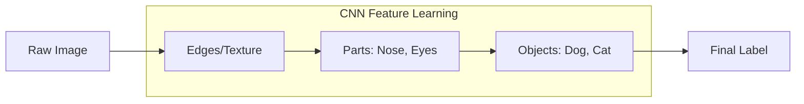

# 🖼️ CNN Architectures: The Eyes of Artificial Intelligence
> **Level:** Intermediate | **Language:** Hinglish | **Goal:** Master Convolutional Neural Networks, from basic kernels and pooling to advanced architectures like ResNet, EfficientNet, and modern Vision Transformers.

---

## 🧭 1. Beginner-Friendly Hinglish Explanation
CNN (Convolutional Neural Network) wo technology hai jo computer ko "Dekhna" sikhati hai. 

Normal Neural Network ek photo ko "Numbers ki lambi list" ki tarah dekhta hai, jisse photo ka "Spatial Structure" (kaunsi cheez kahan hai) kho jata hai. 
CNN ek **"Magnifying Glass" (Filter)** ki tarah kaam karta hai jo photo par ghumta hai aur patterns dhoondhta hai:
- Pehle layers "Lines" aur "Edges" pehchanti hain.
- Bich ki layers "Shapes" (Aankh, Naak) pehchanti hain.
- Last layers poora "Object" (Billi, Insaan, Gaadi) pehchanti hain.

Agar aap Face ID use karte hain ya self-driving car dekhte hain, toh uske peeche CNN hi hai.

---

## 🧠 2. Deep Technical Explanation
CNNs are designed to process grid-like data (Images) by leveraging three key ideas: **Local Receptive Fields**, **Shared Weights**, and **Pooling**.

### Core Operations:
1. **Convolution:** A small matrix (Kernel/Filter) slides over the image and performs element-wise multiplication and summation. This extracts features like vertical or horizontal edges.
2. **Stride:** The number of pixels the filter moves at each step. High stride = smaller output.
3. **Padding:** Adding zeros around the image to ensure the filter can cover the edges and the output size stays consistent.
4. **Pooling (Max/Average):** Reducing the spatial size (Width x Height) of the feature map to reduce parameters and computation. It also makes the model robust to small translations.
5. **Fully Connected (FC) Layer:** The final layers that take the high-level features and perform classification.

---

## 🏗️ 3. Evolution of CNN Architectures
| Era | Model | Innovation |
| :--- | :--- | :--- |
| **1998** | **LeNet-5** | First successful CNN for handwriting (ZIP codes). |
| **2012** | **AlexNet** | Used GPUs & ReLU; started the Deep Learning revolution. |
| **2014** | **VGG-16** | Proved that "Deeper is Better" using very small (3x3) filters. |
| **2015** | **ResNet** | Introduced **Skip Connections** to train 100+ layer networks. |
| **2019** | **EfficientNet** | Systematically scaled width, depth, and resolution together. |
| **2021+** | **ViT / ConvNeXt** | Mixing CNNs with Transformers for superior global context. |

---

## 📐 4. Mathematical Intuition
- **The Convolution Formula:** 
  $$(I * K)(i, j) = \sum_m \sum_n I(i+m, j+n) K(m, n)$$
  $I$ is the image, $K$ is the kernel.
- **Output Size Calculation:** 
  $$\text{Output} = \frac{W - F + 2P}{S} + 1$$
  ($W$=Input size, $F$=Filter size, $P$=Padding, $S$=Stride).
- **Parameter Sharing:** A 3x3 filter only has 9 weights, but it's applied to the whole image. This makes CNNs much more efficient than dense networks.

---

## 📊 5. Feature Extraction Hierarchy (Diagram)


---

## 💻 6. Production-Ready Examples (Building a CNN in PyTorch)
```python
# 2026 Pro-Tip: Use 3x3 filters; they are the most efficient for hardware.
import torch
import torch.nn as nn

class SimpleCNN(nn.Module):
    def __init__(self, num_classes=10):
        super().__init__()
        # 1. Feature Extraction (Convolutional Base)
        self.features = nn.Sequential(
            nn.Conv2d(3, 32, kernel_size=3, padding=1), # 3 input channels (RGB)
            nn.ReLU(),
            nn.MaxPool2d(2, 2), # Reduces size by half
            
            nn.Conv2d(32, 64, kernel_size=3, padding=1),
            nn.ReLU(),
            nn.MaxPool2d(2, 2)
        )
        
        # 2. Classification (Fully Connected Head)
        self.classifier = nn.Sequential(
            nn.Flatten(),
            nn.Linear(64 * 56 * 56, 512), # Assuming 224x224 input
            nn.ReLU(),
            nn.Linear(512, num_classes)
        )

    def forward(self, x):
        x = self.features(x)
        x = self.classifier(x)
        return x

# model = SimpleCNN()
```

---

## ❌ 7. Failure Cases
- **Overfitting on Textures:** CNNs sometimes learn the "Texture" (fur) instead of the "Shape" (cat). An image of an elephant with cat fur might be classified as a cat.
- **Translation Invariance Limit:** If an object is rotated 90 degrees, a standard CNN might fail to recognize it unless it was trained with rotated images.
- **High Computational Cost:** Large images (4K) require massive VRAM for intermediate feature maps.

---

## 🛠️ 8. Debugging Guide
- **Symptom:** "RuntimeError: size mismatch" at the Linear layer.
- **Check:** **Flatten size**. Calculate the output of your last Conv layer manually using the formula.
- **Symptom:** Accuracy is not improving.
- **Check:** **Data Augmentation**. CNNs need lots of variety. Are you using `RandomFlip`, `RandomRotation`, and `ColorJitter`?

---

## ⚖️ 9. Tradeoffs
- **Depth vs. Resolution:** A deeper model can understand more, but it might lose small details. High-resolution input is better for detecting small objects (like far-away cars) but costs $4x$ more memory.
- **CNN vs. ViT:** CNNs are better for small datasets (Inductive bias). Vision Transformers (ViT) are better for massive datasets (Global context).

---

## 🛡️ 10. Security Concerns
- **Adversarial Patches:** A small, colorful sticker placed on a "Stop" sign can make a CNN see it as a "Speed Limit" sign.
- **Deepfakes:** CNN-based Generative Adversarial Networks (GANs) are the core technology behind creating realistic fake videos and images.

---

## 📈 11. Scaling Challenges
- **Video Processing:** A video is a stack of 2D images. Processing 30 frames per second requires **3D Convolutions**, which are $10x-30x$ more expensive than 2D.
- **Real-time Mobile AI:** Running CNNs on a phone requires **Quantization** (8-bit) and **Depthwise Separable Convolutions** (MobileNet style).

---

## 💸 12. Cost Considerations
- **Transfer Learning:** Don't train from scratch. Download a model pre-trained on ImageNet (like ResNet-50) and only fine-tune the last layer. This saves $99\%$ of training time and money.
- **Inference Optimization:** Use **TensorRT** to compile your CNN for Nvidia GPUs; it can double your FPS for free.

---

## ✅ 13. Best Practices
- **Use Batch Normalization:** After every Conv layer. It stabilizes training.
- **Start with ResNet:** It's the most stable baseline for any computer vision task.
- **Global Average Pooling:** Use `GlobalAvgPool2d` before the final linear layer instead of a massive Flatten to reduce parameters and overfitting.

---

## ⚠️ 14. Common Mistakes
- **No Padding:** Losing 1-2 pixels at every layer will make your feature maps too small very quickly.
- **Huge Filters:** Using 11x11 or 7x7 filters. Use multiple 3x3 filters instead—they have the same "view" but fewer parameters and more non-linearity.

---

## 📝 15. Interview Questions
1. **"What is the difference between a Convolutional layer and a Dense layer?"**
2. **"Why is Max Pooling used in CNNs?"** (Translation invariance and dimension reduction).
3. **"Explain 'Residual Connections' and why they are necessary for very deep networks."**

---

## 🚀 15. Latest 2026 Industry Patterns
- **Multimodal CNNs:** CNNs that don't just see images but also process "Depth" (LiDAR) and "Thermal" data for 2026 autonomous robots.
- **Diffusion Backbones:** Most modern image generators (DALL-E 3) use a **U-Net** architecture (a type of CNN) as their core engine to denoise images.
- **Neural Architecture Search (NAS):** Using AI to "design" the perfect CNN for a specific hardware chip (like an iPhone or an NVIDIA H200).
