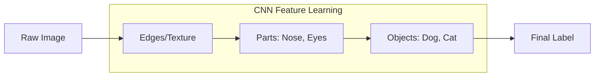

# 🖼️ CNN Architectures: The Eyes of Artificial Intelligence
> **Level:** Intermediate | **Language:** Hinglish | **Goal:** Convolutional Neural Networks ko master karein, basic kernels aur pooling se lekar ResNet, EfficientNet, aur modern Vision Transformers jaise advanced architectures tak.

---

## 🧭 1. Beginner-Friendly Hinglish Explanation
CNN (Convolutional Neural Network) wo technology hai jo computer ko "Dekhna" sikhati hai. 

Normal Neural Network ek photo ko "Numbers ki lambi list" ki tarah dekhta hai, jisse photo ka "Spatial Structure" (kaunsi cheez kahan hai) kho jata hai. 
CNN ek **"Magnifying Glass" (Filter)** ki tarah kaam karta hai jo photo par ghumta hai aur patterns dhoondhta hai:
- Pehle layers "Lines" aur "Edges" pehchanti hain.
- Bich ki layers "Shapes" (Aankh, Naak) pehchanti hain.
- Last layers poora "Object" (Billi, Insaan, Gaadi) pehchanti hain.

Agar aap Face ID use karte hain ya self-driving car dekhte hain, toh uske peeche CNN hi hai.

---

## 🧠 2. Deep Technical Explanation
CNNs ko grid-like data (Images) process karne ke liye design kiya gaya hai, teen key ideas ka use karke: **Local Receptive Fields**, **Shared Weights**, aur **Pooling**.

### Core Operations (Main Operations):
1. **Convolution:** Ek small matrix (Kernel/Filter) image par slide karta hai aur element-wise multiplication aur summation perform karta hai. Ye vertical ya horizontal edges jaise features ko extract karta hai.
2. **Stride:** Pixels ka wo number jo filter har ek step par move karta hai. High stride = smaller output.
3. **Padding:** Image ke charo taraf zeros add karna taaki ensure ho sake ki filter edges ko cover kar sake aur output size consistent rahe.
4. **Pooling (Max/Average):** Parameters aur computation ko reduce karne ke liye feature map ke spatial size (Width x Height) ko decrease karna. Ye model ko small translations ke prati robust bhi banata hai.
5. **Fully Connected (FC) Layer:** Final layers jo high-level features leti hain aur classification perform karti hain.

---

## 🏗️ 3. Evolution of CNN Architectures
| Era (Daur) | Model | Innovation (Naya Kadam) |
| :--- | :--- | :--- |
| **1998** | **LeNet-5** | Handwriting (ZIP codes) ke liye pehla successful CNN. |
| **2012** | **AlexNet** | GPUs aur ReLU ka use kiya; Deep Learning revolution ki shuruat ki. |
| **2014** | **VGG-16** | Bahut small (3x3) filters ka use karke ye prove kiya ki "Deeper is Better". |
| **2015** | **ResNet** | 100+ layer networks ko train karne ke liye **Skip Connections** introduce kiye. |
| **2019** | **EfficientNet** | Width, depth, aur resolution ko systematically ek sath scale kiya. |
| **2021+** | **ViT / ConvNeXt** | Superior global context ke liye CNNs ko Transformers ke sath mix kiya. |

---

## 📐 4. Mathematical Intuition
- **The Convolution Formula (Convolution Formula):** 
  $$(I * K)(i, j) = \sum_m \sum_n I(i+m, j+n) K(m, n)$$
  $I$ image hai, $K$ kernel hai.
- **Output Size Calculation (Output Size Calculation):** 
  $$\text{Output} = \frac{W - F + 2P}{S} + 1$$
  ($W$=Input size, $F$=Filter size, $P$=Padding, $S$=Stride).
- **Parameter Sharing:** Ek 3x3 filter me sirf 9 weights hote hain, par ye poori image par apply hota hai. Ye CNNs ko dense networks se bahut zyada efficient banata hai.

---

## 📊 5. Feature Extraction Hierarchy (Diagram)

```mermaid
graph LR
    Input[Raw Image] --> E[Edges/Texture]
    E --> P[Parts: Nose, Eyes]
    P --> O[Objects: Dog, Cat]
    O --> Class[Final Label]
    
    subgraph "CNN Feature Learning"
    E
    P
    O
    end
```

---

## 💻 6. Production-Ready Examples (Building a CNN in PyTorch)
```python
# 2026 Pro-Tip: 3x3 filters ka use karein; ye hardware ke liye sabse efficient hain.
import torch
import torch.nn as nn

class SimpleCNN(nn.Module):
    def __init__(self, num_classes=10):
        super().__init__()
        # 1. Feature Extraction (Convolutional Base)
        self.features = nn.Sequential(
            nn.Conv2d(3, 32, kernel_size=3, padding=1), # 3 input channels (RGB)
            nn.ReLU(),
            nn.MaxPool2d(2, 2), # Size ko half reduce karta hai
            
            nn.Conv2d(32, 64, kernel_size=3, padding=1),
            nn.ReLU(),
            nn.MaxPool2d(2, 2)
        )
        
        # 2. Classification (Fully Connected Head)
        self.classifier = nn.Sequential(
            nn.Flatten(),
            nn.Linear(64 * 56 * 56, 512), # Assuming 224x224 input
            nn.ReLU(),
            nn.Linear(512, num_classes)
        )

    def forward(self, x):
        x = self.features(x)
        x = self.classifier(x)
        return x

# model = SimpleCNN()
```

---

## ❌ 7. Failure Cases
- **Overfitting on Textures:** CNNs kabhi-kabhi "Shape" (cat) ke bajaye "Texture" (fur) seekh lete hain. Cat fur wale elephant ki image ko ye cat classify kar sakta hai.
- **Translation Invariance Limit:** Agar kisi object ko 90 degrees rotate kar diya jaye, toh standard CNN use recognize karne me fail ho sakta hai, jab tak ki use rotated images par train na kiya gaya ho.
- **High Computational Cost:** Large images (4K) ke intermediate feature maps ke liye massive VRAM ki need hoti hai.

---

## 🛠️ 8. Debugging Guide
- **Symptom:** Linear layer par "RuntimeError: size mismatch".
- **Check:** **Flatten size**. Formula ka use karke apne last Conv layer ke output ko manually calculate karein.
- **Symptom:** Accuracy improve nahi ho rahi hai.
- **Check:** **Data Augmentation**. CNNs ko bahut variety ki need hoti hai. Kya aap `RandomFlip`, `RandomRotation`, aur `ColorJitter` ka use kar rahe hain?

---

## ⚖️ 9. Tradeoffs
- **Depth vs. Resolution:** Ek deeper model zyada samajh sakta hai, par wo small details ko lose kar sakta hai. High-resolution input small objects (jaise door khadi cars) ko detect karne ke liye behtar hai par ye $4x$ zyada memory cost karta hai.
- **CNN vs. ViT:** CNNs small datasets ke liye behtar hain (Inductive bias). Vision Transformers (ViT) massive datasets ke liye behtar hain (Global context).

---

## 🛡️ 10. Security Concerns
- **Adversarial Patches:** "Stop" sign par ek chota, colorful sticker lagane se CNN use "Speed Limit" sign dekh sakta hai.
- **Deepfakes:** CNN-based Generative Adversarial Networks (GANs) realistic fake videos aur images create karne ke peeche ki core technology hain.

---

## 📈 11. Scaling Challenges
- **Video Processing:** Ek video 2D images ka stack hota hai. 30 frames per second process karne ke liye **3D Convolutions** ki zaroorat hoti hai, jo 2D se $10x-30x$ zyada expensive hote hain.
- **Real-time Mobile AI:** Phone par CNNs run karne ke liye **Quantization** (8-bit) aur **Depthwise Separable Convolutions** (MobileNet style) ki zaroorat hoti hai.

---

## 💸 12. Cost Considerations
- **Transfer Learning:** Scratch se train mat karein. ImageNet par pre-trained model (jaise ResNet-50) download karein aur sirf last layer ko fine-tune karein. Isse training time aur money ka $99\%$ save hota hai.
- **Inference Optimization:** Nvidia GPUs ke liye apne CNN ko compile karne ke liye **TensorRT** ka use karein; ye free me aapke FPS ko double kar sakta hai.

---

## ✅ 13. Best Practices
- **Use Batch Normalization:** Har Conv layer ke baad. Ye training ko stabilize karta.
- **Start with ResNet:** Kisi bhi computer vision task ke liye ye sabse stable baseline hai.
- **Global Average Pooling:** Parameters aur overfitting ko reduce karne ke liye massive Flatten ke bajaye final linear layer se pehle `GlobalAvgPool2d` ka use karein.

---

## ⚠️ 14. Common Mistakes
- **No Padding:** Har layer par 1-2 pixels lose karne se aapke feature maps bahut jaldi bahut small ho jayenge.
- **Huge Filters:** 11x11 ya 7x7 filters ka use karna. Unke bajaye multiple 3x3 filters ka use karein—unka "view" same hota hai par parameters kam hote hain aur non-linearity zyada hoti hai.

---

## 📝 15. Interview Questions
1. **"Convolutional layer aur Dense layer me kya difference hai?"**
2. **"CNNs me Max Pooling kyun use kiya jata hai?"** (Translation invariance aur dimension reduction).
3. **"'Residual Connections' ko explain karein aur ye bahut deep networks ke liye kyun zaroori hain?"**

---

## 🚀 16. Latest 2026 Industry Patterns
- **Multimodal CNNs:** CNNs jo sirf images nahi dekhte balki 2026 ke autonomous robots ke liye "Depth" (LiDAR) aur "Thermal" data ko bhi process karte hain.
- **Diffusion Backbones:** Most modern image generators (DALL-E 3) use a **U-Net** architecture (a type of CNN) as their core engine to denoise images.
- **Neural Architecture Search (NAS):** Using AI to "design" the perfect CNN for a specific hardware chip (like an iPhone or an NVIDIA H200).
