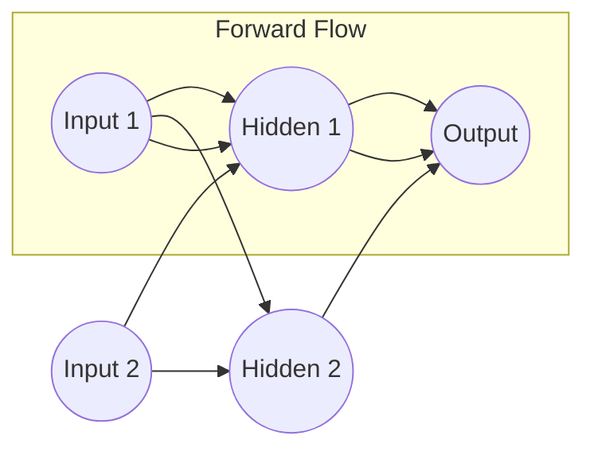

# 🧠 Neural Networks Basics: The Architecture of Artificial Brains
> **Level:** Beginner | **Language:** Hinglish | **Goal:** Master the fundamental components of Neural Networks, including Perceptrons, Multi-Layer Perceptrons (MLP), and the flow of information through weights and biases.

---

## 🧭 1. Beginner-Friendly Hinglish Explanation
Neural Network (NN) insaan ke dimaag (neurons) se inspired ek mathematical model hai. 

Sochiye, aap ek decision le rahe hain: "Kya mujhe ye job join karni chahiye?". Aapke dimaag mein kuch factor (Inputs) honge:
1. Salary (Input 1)
2. Location (Input 2)
3. Learning (Input 3)

Har factor aapke liye alag "Zaruri" (Weight) hai. Agar aapke liye Salary sabse important hai, toh uska **Weight** zyada hoga.
Dimaag in sabko multiply karta hai aur ek "Threshold" (Bias) ke baad decide karta hai: "YES" ya "NO".

Ek Neural Network hazaaron aise "Faisle lene wale neurons" ka ek jaal (Network) hai jo mil kar complex problems (jaise photo pehchanna ya gaadi chalana) solve karte hain.

---

## 🧠 2. Deep Technical Explanation
A Neural Network is a series of algorithms that endeavors to recognize underlying relationships in a set of data through a process that mimics the way the human brain operates. 

### Key Components:
1. **The Perceptron:** The simplest unit. It takes $n$ inputs, multiplies them by weights $w$, adds a bias $b$, and passes the sum through an **Activation Function** $\sigma$.
   $$y = \sigma(\sum_{i=1}^{n} w_i x_i + b)$$
2. **Layers:**
   - **Input Layer:** Receives the raw features.
   - **Hidden Layers:** Where the "Learning" happens. Each layer extracts more abstract features (e.g., edges $\to$ shapes $\to$ eyes).
   - **Output Layer:** Provides the final prediction (Probability of a class or a continuous value).
3. **Forward Propagation:** The process of moving data from Input to Output to get a prediction.
4. **Weights ($W$):** The strength of the connection between neurons. These are what the model "learns."
5. **Biases ($b$):** Allows the activation function to be shifted left or right, helping the model fit data that doesn't pass through the origin.

---

## 🏗️ 3. The Anatomy of a Neuron
| Component | Biological Analog | Mathematical Role |
| :--- | :--- | :--- |
| **Inputs ($x$)** | Dendrites | Feature values from data |
| **Weights ($w$)** | Synapse Strength | Importance of each feature |
| **Bias ($b$)** | Threshold | Shifting the activation point |
| **Summation ($\sum$)** | Cell Body | Accumulating signals |
| **Activation ($\sigma$)** | Axon Fire | Deciding if the neuron "fires" |

---

## 📐 4. Mathematical Intuition
A Neural Network is a **Universal Function Approximator**.
- If you have enough neurons and at least one hidden layer with a non-linear activation function, you can approximate ANY continuous function.
- **Why Non-Linearity?** If we didn't use activation functions (like ReLU), multiple layers would just collapse into a single linear regression ($W_2(W_1x) = W_{combined}x$). Non-linearity is what gives the network "Depth" and intelligence.

---

## 📊 5. Multi-Layer Perceptron (Diagram)


---

## 💻 6. Production-Ready Examples (Manual NN in PyTorch)
```python
# 2026 Pro-Tip: Understanding the low-level structure of a Neural Net.
import torch
import torch.nn as nn

class SimpleNN(nn.Module):
    def __init__(self, input_dim, hidden_dim, output_dim):
        super(SimpleNN, self).__init__()
        # 1. Defining the layers
        self.layer1 = nn.Linear(input_dim, hidden_dim) # Matrix: [input x hidden]
        self.relu = nn.ReLU()                          # Non-linearity
        self.layer2 = nn.Linear(hidden_dim, output_dim) # Matrix: [hidden x output]
        
    def forward(self, x):
        # 2. Forward Propagation
        x = self.layer1(x)
        x = self.relu(x)
        x = self.layer2(x)
        return x

# Usage
model = SimpleNN(input_dim=10, hidden_dim=32, output_dim=1)
sample_input = torch.randn(1, 10) # 1 row, 10 features
prediction = model(sample_input)
print(f"Prediction: {prediction.item()}")
```

---

## ❌ 7. Failure Cases
- **Dead Neurons:** If you use ReLU and the weights become such that the input is always negative, the neuron will always output $0$ and never learn (Gradient is $0$). **Fix:** Use **Leaky ReLU**.
- **Symmetry Breaking Failure:** If you initialize all weights to $0$, all neurons in a layer will learn the exact same thing. They become redundant. **Fix:** Use **Random Initialization**.
- **Vanishing Gradients:** In very deep networks, the signal "dies out" before reaching the first layers.

---

## 🛠️ 8. Debugging Guide
- **Symptom:** Model loss is not decreasing.
- **Check:** **Normalization**. Are your inputs scaled between 0 and 1? Neural nets hate large numbers ($>100$).
- **Check:** **Learning Rate**. If it's too high, the weights will "explode" and become `NaN`.
- **Check:** **Activation Function**. Are you using Sigmoid in the hidden layers? (Don't do it in 2026).

---

## ⚖️ 9. Tradeoffs
- **Width vs. Depth:** A "Wide" network (many neurons per layer) can memorize data faster. A "Deep" network (many layers) can understand more complex relationships (like reasoning or logic).
- **Inference Latency:** Every extra layer adds milliseconds to the response time. For real-time AI, we prefer "Shallow but Smart" networks.

---

## 🛡️ 10. Security Concerns
- **Weight Extraction:** An attacker can observe the outputs of your model to "Guess" the internal weights, effectively stealing your intellectual property.
- **Model Poisoning:** Changing the input slightly (noise) can make a neuron misfire, leading to a wrong classification (Adversarial attack).

---

## 📈 11. Scaling Challenges
- **VRAM Management:** A model with 100 million parameters needs about 400MB of GPU memory just for the weights. A 70B model needs $140GB+$.
- **Distributed Weights:** How to split a single neural network across 8 GPUs so they can work together? Use **Model Parallelism**.

---

## 💸 12. Cost Considerations
- **Floating Point Precision:** Training in `float32` is $2x$ more expensive than `float16`. 2026 standards use `bfloat16` for the best balance of cost and accuracy.
- **Parameter Efficiency:** Using techniques like **LoRA** or **Pruning** to reduce the number of active neurons, saving $\$1,000s$ in compute.

---

## ✅ 13. Best Practices
- **Use ReLU/GeLU:** The standard for hidden layers in 2026.
- **Batch Normalization:** Add it after every linear layer to keep the math "Stable" and training fast.
- **He Initialization:** Use specialized random initialization for weights to ensure they don't start too large or too small.

---

## ⚠️ 14. Common Mistakes
- **Sigmoid for Hidden Layers:** Leads to vanishing gradients.
- **No Non-Linearity:** Forgetting the activation function between layers.
- **Not zeroing Gradients:** PyTorch accumulates gradients by default.

---

## 📝 15. Interview Questions
1. **"Why can't we use Linear Activation functions for hidden layers?"** (Because they collapse into a single layer).
2. **"What is the difference between a Weight and a Bias?"**
3. **"What happens if you initialize all weights to the same value?"** (Symmetry problem; neurons learn identically).

---

## 🚀 15. Latest 2026 Industry Patterns
- **Liquid Neural Networks:** Neurons that can change their "time constants" dynamically, allowing them to adapt to new data much faster than traditional NNs.
- **KAN (Kolmogorov-Arnold Networks):** A new alternative to MLPs where the "Activation Function" is on the connection (Weight) itself, not the neuron, potentially making them $10x$ more efficient.
- **Spiking Neural Networks (SNN):** Hardware-specific networks that only consume energy when a neuron "fires," mimicking the brain's energy efficiency for mobile AI.
