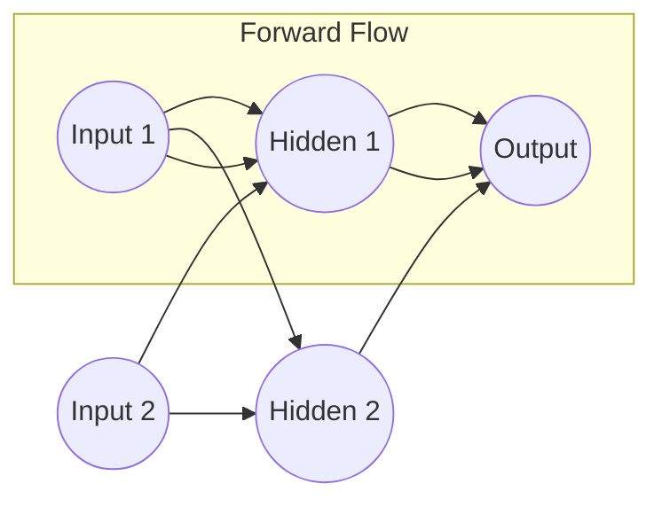

# 🧠 Neural Networks Basics: The Architecture of Artificial Brains
> **Level:** Beginner | **Language:** Hinglish | **Goal:** Neural Networks ke fundamental components ko master karein, jisme Perceptrons, Multi-Layer Perceptrons (MLP), aur weights aur biases ke through information flow shamil hain.

---

## 🧭 1. Beginner-Friendly Hinglish Explanation
Neural Network (NN) insaan ke dimaag (neurons) se inspired ek mathematical model hai. 

Sochiye, aap ek decision le rahe hain: "Kya mujhe ye job join karni chahiye?". Aapke dimaag mein kuch factor (Inputs) honge:
1. Salary (Input 1)
2. Location (Input 2)
3. Learning (Input 3)

Har factor aapke liye alag "Zaruri" (Weight) hai. Agar aapke liye Salary sabse important hai, toh uska **Weight** zyada hoga.
Dimaag in sabko multiply karta hai aur ek "Threshold" (Bias) ke baad decide karta hai: "YES" ya "NO".

Ek Neural Network hazaaron aise "Faisle lene wale neurons" ka ek jaal (Network) hai jo mil kar complex problems (jaise photo pehchanna ya gaadi chalana) solve karte hain.

---

## 🧠 2. Deep Technical Explanation
Ek Neural Network algorithms ki ek aisi series hai jo data ke set me underlying relationships ko recognize karne ki koshish karti hai, ek aisi process ke through jo human brain ke kaam karne ke tarike ko mimic karti hai.

### Key Components (Main Hisse):
1. **The Perceptron:** Sabse simple unit. Ye $n$ inputs leta hai, unhe weights $w$ se multiply karta hai, ek bias $b$ add karta hai, aur sum ko ek **Activation Function** $\sigma$ se pass karta hai.
   $$y = \sigma(\sum_{i=1}^{n} w_i x_i + b)$$
2. **Layers:**
   - **Input Layer:** Raw features ko receive karta hai.
   - **Hidden Layers:** Jahan "Learning" hoti hai. Har layer aur bhi abstract features ko extract karti hai (e.g., edges $\to$ shapes $\to$ eyes).
   - **Output Layer:** Final prediction provide karta hai (kisi class ki Probability ya continuous value).
3. **Forward Propagation:** Prediction paane ke liye Input se Output tak data ko move karne ki process.
4. **Weights ($W$):** Neurons ke beech ke connection ki strength. Ye wahi parameters hain jinhe model "learn" karta hai.
5. **Biases ($b$):** Ye activation function ko left ya right shift karne ki permission deta hai, jisse model ko us data ko fit karne me help milti hai jo origin se pass nahi hota.

---

## 🏗️ 3. The Anatomy of a Neuron
| Component | Biological Analog | Mathematical Role (Ganitye Bhumika) |
| :--- | :--- | :--- |
| **Inputs ($x$)** | Dendrites | Data se feature values lena |
| **Weights ($w$)** | Synapse Strength | Har feature ki importance |
| **Bias ($b$)** | Threshold | Activation point ko shift karna |
| **Summation ($\sum$)** | Cell Body | Signals ko accumulate karna |
| **Activation ($\sigma$)** | Axon Fire | Ye decide karna ki neuron "fire" hoga ya nahi |

---

## 📐 4. Mathematical Intuition
Ek Neural Network ek **Universal Function Approximator** hai.
- Agar aapke paas enough neurons hain aur at least ek hidden layer hai jisme non-linear activation function ho, toh aap KISI bhi continuous function ko approximate kar sakte hain.
- **Why Non-Linearity?** Agar hum activation functions (jaise ReLU) ka use na karein, toh multiple layers collapse hokar ek single linear regression ($W_2(W_1x) = W_{combined}x$) ban jayengi. Non-linearity hi network ko "Depth" aur intelligence deti hai.

---

## 📊 5. Multi-Layer Perceptron (Diagram)

```mermaid
graph LR
    I1((Input 1)) --> H1((Hidden 1))
    I2((Input 2)) --> H1
    I1 --> H2((Hidden 2))
    I2 --> H2
    
    H1 --> O1((Output))
    H2 --> O1
    
    subgraph "Forward Flow"
    I1 --> H1 --> O1
    end
```

---

## 💻 6. Production-Ready Examples (Manual NN in PyTorch)
```python
# 2026 Pro-Tip: Neural Net ki low-level structure ko samajhna.
import torch
import torch.nn as nn

class SimpleNN(nn.Module):
    def __init__(self, input_dim, hidden_dim, output_dim):
        super(SimpleNN, self).__init__()
        # 1. Layers ko define karna
        self.layer1 = nn.Linear(input_dim, hidden_dim) # Matrix: [input x hidden]
        self.relu = nn.ReLU()                          # Non-linearity
        self.layer2 = nn.Linear(hidden_dim, output_dim) # Matrix: [hidden x output]
        
    def forward(self, x):
        # 2. Forward Propagation
        x = self.layer1(x)
        x = self.relu(x)
        x = self.layer2(x)
        return x

# Usage
model = SimpleNN(input_dim=10, hidden_dim=32, output_dim=1)
sample_input = torch.randn(1, 10) # 1 row, 10 features
prediction = model(sample_input)
print(f"Prediction: {prediction.item()}")
```

---

## ❌ 7. Failure Cases
- **Dead Neurons:** Agar aap ReLU ka use karte hain aur weights aise ho jate hain ki input hamesha negative rahe, toh neuron hamesha $0$ output karega aur kabhi seekh nahi payega (Gradient $0$ ho jata hai). **Fix:** **Leaky ReLU** ka use karein.
- **Symmetry Breaking Failure:** Agar aap saare weights ko $0$ initialize kar dete hain, toh ek layer ke saare neurons bilkul same cheez seekhenge. Wo redundant ho jayenge. **Fix:** **Random Initialization** ka use karein.
- **Vanishing Gradients:** Bahut deep networks me, signal pehli layers tak pahunchne se pehle hi "die out" (gayab) ho jata hai.

---

## 🛠️ 8. Debugging Guide
- **Symptom:** Model loss decrease nahi ho raha hai.
- **Check:** **Normalization**. Kya aapke inputs 0 aur 1 ke beech scaled hain? Neural nets ko bade numbers ($>100$) pasand nahi hote.
- **Check:** **Learning Rate**. Agar ye bahut high hai, toh weights "explode" ho jayenge aur `NaN` ban jayenge.
- **Check:** **Activation Function**. Kya aap hidden layers me Sigmoid ka use kar rahe hain? (2026 me aisa bilkul mat karein).

---

## ⚖️ 9. Tradeoffs
- **Width vs. Depth:** Ek \"Wide\" network (ek layer me kai neurons) data ko fast memorize kar sakta hai. Ek \"Deep\" network (kai layers) aur bhi complex relationships (jaise reasoning ya logic) ko samajh sakta hai.
- **Inference Latency:** Har extra layer response time me milliseconds add karti hai. Real-time AI ke liye, hum \"Shallow but Smart\" networks prefer karte hain.

---

## 🛡️ 10. Security Concerns
- **Weight Extraction:** Attacker aapke model ke outputs ko observe karke internal weights ko \"Guess\" kar sakta hai, jisse wo aapki intellectual property ko chura sakta hai.
- **Model Poisoning:** Input me thoda sa change (noise) karne se neuron misfire ho sakta hai, jisse wrong classification ho sakti hai (Adversarial attack).

---

## 📈 11. Scaling Challenges
- **VRAM Management:** 100 million parameters ke model ko weights ke liye lagbhag 400MB GPU memory ki need hoti hai. Ek 70B model ko $140GB+$ ki need hoti hai.
- **Distributed Weights:** Kaise ek single neural network ko 8 GPUs me split karein taaki wo ek sath kaam kar sakein? **Model Parallelism** ka use karein.

---

## 💸 12. Cost Considerations
- **Floating Point Precision:** `float32` me train karna `float16` se $2x$ zyada expensive hai. 2026 standards me cost aur accuracy ke best balance ke liye `bfloat16` ka use kiya jata hai.
- **Parameter Efficiency:** Active neurons ke number ko reduce karne ke liye **LoRA** ya **Pruning** jaise techniques ka use karna, jisse compute me thousands of dollars ($\$1,000s$) save hote hain.

---

## ✅ 13. Best Practices
- **Use ReLU/GeLU:** 2026 me hidden layers ke liye standard.
- **Batch Normalization:** Math ko "Stable" rakhne aur training ko fast karne ke liye ise har linear layer ke baad add karein.
- **He Initialization:** Weights ke liye specialized random initialization ka use karein taaki ensure ho sake ki wo bahut bade ya bahut chote start na hon.

---

## ⚠️ 14. Common Mistakes
- **Sigmoid for Hidden Layers:** Isse vanishing gradients ki problem hoti hai.
- **No Non-Linearity:** Layers ke beech activation function lagana bhool jana.
- **Not zeroing Gradients:** PyTorch by default gradients ko accumulate karta hai.

---

## 📝 15. Interview Questions
1. **"Hum hidden layers ke liye Linear Activation functions kyun use nahi kar sakte?"** (Kyunki wo collapse hokar ek single layer ban jate hain).
2. **"Weight aur Bias me kya difference hai?"**
3. **"Agar aap saare weights ko same value se initialize kar dein toh kya hoga?"** (Symmetry problem; neurons identical cheezein seekhne lagte hain).

---

## 🚀 16. Latest 2026 Industry Patterns
- **Liquid Neural Networks:** Neurons that can change their "time constants" dynamically, allowing them to adapt to new data much faster than traditional NNs.
- **KAN (Kolmogorov-Arnold Networks):** A new alternative to MLPs where the "Activation Function" is on the connection (Weight) itself, not the neuron, potentially making them $10x$ more efficient.
- **Spiking Neural Networks (SNN):** Hardware-specific networks that only consume energy when a neuron "fires," mimicking the brain's energy efficiency for mobile AI.
