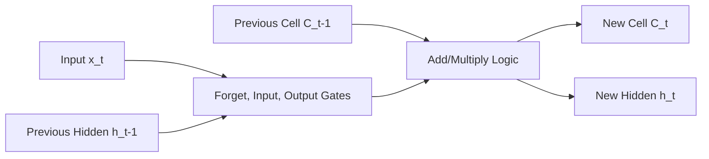

# 🔄 RNN & LSTM: The Memory of Artificial Intelligence
> **Level:** Intermediate | **Language:** Hinglish | **Goal:** Master Recurrent Neural Networks and Long Short-Term Memory units to process sequential data like text, audio, and time-series.

---

## 🧭 1. Beginner-Friendly Hinglish Explanation
RNN (Recurrent Neural Network) wo AI hai jisme **"Yaad-daasht" (Memory)** hoti hai. 

Sochiye aap ek movie dekh rahe hain. Agla scene samajhne ke liye aapko pichla scene yaad hona chahiye. Standard Neural Networks ko pichla kuch yaad nahi rehta, wo har input ko fresh dekhte hain. 
RNN mein ek "Loop" hota hai jo purani information ko agle step par bhejta hai. 
- **The Problem:** RNN ki memory bahut choti hoti hai. Wo sentence ka start bhool jata hai (**Vanishing Gradient**).
- **The Solution (LSTM):** LSTM ek "Smart Memory" hai. Isme dimaag (Gates) hote hain jo decide karte hain: "Kya yaad rakhna hai?" aur "Kya bhool jana hai?". 

Agar aap "Auto-complete" use karte hain ya "Stock Market" predict karna chahte hain, toh uske peeche RNN aur LSTM hi hote hain.

---

## 🧠 2. Deep Technical Explanation
RNNs are designed for **Sequence Modeling**. They maintain a **Hidden State** $h_t$ that acts as a summary of all inputs seen so far.

### Core RNN:
- **Formula:** $h_t = \sigma(W_{hh} h_{t-1} + W_{xh} x_t + b_h)$
- **Constraint:** Since the same weight $W$ is multiplied at every step, gradients either vanish (become 0) or explode (become $\infty$) during backpropagation through time (BPTT).

### LSTM (The Fix):
LSTM introduces a **Cell State** ($C_t$) and three **Gates**:
1. **Forget Gate:** Decides what information from the previous cell state to discard.
2. **Input Gate:** Decides which new information to store in the cell state.
3. **Output Gate:** Decides what part of the cell state to output as the hidden state.
- **GRU (Gated Recurrent Unit):** A simplified version of LSTM with only two gates (Reset and Update). Often faster and nearly as accurate.

---

## 🏗️ 3. RNN vs. LSTM vs. Transformers
| Feature | RNN | LSTM / GRU | Transformers |
| :--- | :--- | :--- | :--- |
| **Sequential Memory**| Short (5-10 steps) | Medium (100-200 steps) | Infinite (Context Window) |
| **Computation** | Sequential (Slow) | Sequential (Slow) | Parallel (Fast) |
| **Gradients** | Vanishing/Exploding | Stable | Very Stable |
| **Best For** | Short time-series | Long audio/sensor data | Text / LLMs |

---

## 📐 4. Mathematical Intuition
- **BPTT (Backpropagation Through Time):** When we train an RNN, we "unroll" it into a very deep network (one layer per time step). The chain rule now involves multiplying the same weight matrix $W$ many times.
- **The Identity Path:** LSTM's Cell State has a "Linear" path that allows gradients to flow through time without being multiplied by weights, solving the vanishing gradient problem.

---

## 📊 5. LSTM Gate Logic (Diagram)


---

## 💻 6. Production-Ready Examples (LSTM for Sentiment)
```python
# 2026 Pro-Tip: Always use 'batch_first=True' in PyTorch for cleaner code.
import torch
import torch.nn as nn

class SentimentLSTM(nn.Module):
    def __init__(self, vocab_size, embed_dim, hidden_dim):
        super().__init__()
        self.embedding = nn.Embedding(vocab_size, embed_dim)
        # 1. LSTM Layer: bidirectional=True helps capture context from both sides
        self.lstm = nn.LSTM(embed_dim, hidden_dim, batch_first=True, bidirectional=True)
        self.fc = nn.Linear(hidden_dim * 2, 1) # *2 for bidirectional
        self.sigmoid = nn.Sigmoid()

    def forward(self, x):
        # x shape: [batch, seq_len]
        x = self.embedding(x) # [batch, seq_len, embed_dim]
        # output contains hidden states for every step
        # hidden contains the FINAL summary state
        output, (hidden, cell) = self.lstm(x)
        
        # Concatenate final hidden states from both directions
        last_hidden = torch.cat((hidden[-2,:,:], hidden[-1,:,:]), dim=1)
        return self.sigmoid(self.fc(last_hidden))

# model = SentimentLSTM(10000, 128, 256)
```

---

## ❌ 7. Failure Cases
- **Sequential Bottleneck:** You can't calculate Step 100 without calculating Step 99. This makes training LSTMs on GPUs $10x$ slower than Transformers.
- **Long-term Forgetfulness:** Even LSTMs forget things after ~500 tokens. They can't "Remember" a character's name from Chapter 1 to Chapter 10 of a book.
- **Exploding Gradients in RNNs:** If weights are $>1$, the hidden state becomes $10^{100}$ in a few steps. **Fix:** Use **Gradient Clipping**.

---

## 🛠️ 8. Debugging Guide
- **Symptom:** Loss is not changing at all.
- **Check:** **Vanishing Gradient**. Are you using a plain RNN? Switch to LSTM or GRU.
- **Symptom:** Model is "hallucinating" but the logic is right.
- **Check:** **Hidden State Initialization**. Are you resetting the hidden state between unrelated batches?

---

## ⚖️ 9. Tradeoffs
- **LSTM vs. GRU:** GRU has fewer parameters and is faster. Use GRU for mobile/edge apps. Use LSTM for complex tasks where every bit of memory counts.
- **Unidirectional vs. Bidirectional:** Bidirectional is better for "Understanding" (reading a whole sentence). Unidirectional is mandatory for "Generation" (predicting the next word).

---

## 🛡️ 10. Security Concerns
- **Sequence Injection:** Providing a specific sequence of "Trigger" words (like a spell) that forces the LSTM hidden state into a specific "malicious" configuration, bypassing filters.

---

## 📈 11. Scaling Challenges
- **Parallelism:** This is the #1 reason why RNNs/LSTMs lost the war to Transformers. They simply cannot scale to $1000$ GPUs effectively because of their sequential nature.

---

## 💸 12. Cost Considerations
- **Training Time:** Because they are sequential, training an LSTM on a massive dataset costs $5x$ more in GPU hours than a Transformer of the same size.
- **Efficiency:** LSTMs are still great for **Sensor Data** (IoT/Heart rate) because they need very little memory compared to Transformers.

---

## ✅ 13. Best Practices
- **Use Gradient Clipping:** `torch.nn.utils.clip_grad_norm_(model.parameters(), 1.0)`.
- **Pack Padded Sequences:** If your sentences have different lengths, use `pack_padded_sequence` to save $30\%$ of compute by not processing "zeros" (padding).
- **Dropout:** Use `dropout` on the hidden-to-hidden connections (Recurrent Dropout).

---

## ⚠️ 14. Common Mistakes
- **Using RNNs for Text:** Use Transformers or at least LSTMs. Plain RNNs are only for very short toy sequences.
- **Forgetting to Hidden.detach():** If you are doing "Truncated BPTT" (training on long sequences in chunks), forgetting to detach the hidden state will cause a memory leak.

---

## 📝 15. Interview Questions
1. **"Why do RNNs suffer from the vanishing gradient problem?"**
2. **"Explain the function of the 'Forget Gate' in an LSTM."**
3. **"Difference between LSTM and GRU?"**

---

## 🚀 15. Latest 2026 Industry Patterns
- **RWKV / Mamba:** New architectures (State Space Models) that act like RNNs during inference (fast & low memory) but train like Transformers (parallel). They are the "Hybrid" kings of 2026.
- **Long-context RNNs:** Optimized CUDA kernels that allow LSTMs to handle $1M+$ length sequences for DNA sequencing and high-frequency trading.
- **Linear Attention:** A mathematical trick that turns the Transformer's "Attention" into something that looks and acts like an RNN hidden state.
