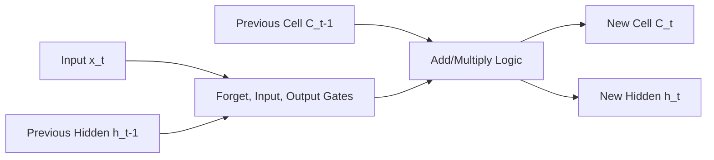

# 🔄 RNN & LSTM: The Memory of Artificial Intelligence
> **Level:** Intermediate | **Language:** Hinglish | **Goal:** Text, audio, aur time-series jaise sequential data ko process karne ke liye Recurrent Neural Networks aur Long Short-Term Memory units ko master karein.

---

## 🧭 1. Beginner-Friendly Hinglish Explanation
RNN (Recurrent Neural Network) wo AI hai jisme **"Yaad-daasht" (Memory)** hoti hai. 

Sochiye aap ek movie dekh rahe hain. Agla scene samajhne ke liye aapko pichla scene yaad hona chahiye. Standard Neural Networks ko pichla kuch yaad nahi rehta, wo har input ko fresh dekhte hain. 
RNN mein ek "Loop" hota hai jo purani information ko agle step par bhejta hai. 
- **The Problem:** RNN ki memory bahut choti hoti hai. Wo sentence ka start bhool jata hai (**Vanishing Gradient**).
- **The Solution (LSTM):** LSTM ek "Smart Memory" hai. Isme dimaag (Gates) hote hain jo decide karte hain: "Kya yaad rakhna hai?" aur "Kya bhool jana hai?". 

Agar aap "Auto-complete" use karte hain ya "Stock Market" predict karna chahte hain, toh uske peeche RNN aur LSTM hi hote hain.

---

## 🧠 2. Deep Technical Explanation
RNNs ko **Sequence Modeling** ke liye design kiya gaya hai. Ye ek **Hidden State** $h_t$ maintain karte hain jo ab tak ke saare inputs ke summary ki tarah kaam karti hai.

### Core RNN:
- **Formula:** $h_t = \sigma(W_{hh} h_{t-1} + W_{xh} x_t + b_h)$
- **Constraint:** Kyunki har step par same weight $W$ multiply hota hai, isiliye backpropagation through time (BPTT) ke dauran gradients ya toh vanish (0 ho jate hain) ya explode ($\infty$ ban jate hain) ho jate hain.

### LSTM (The Fix):
LSTM ek **Cell State** ($C_t$) aur teen **Gates** introduce karta hai:
1. **Forget Gate:** Ye decide karta hai ki pichle cell state se kaunsi information ko discard (bhoolna) karna hai.
2. **Input Gate:** Ye decide karta hai ki cell state me kaunsi new information ko store karna hai.
3. **Output Gate:** Ye decide karta hai ki cell state ke kis part ko hidden state ki tarah output karna hai.
- **GRU (Gated Recurrent Unit):** LSTM ka ek simplified version jisme sirf do gates (Reset aur Update) hote hain. Ye aksar fast hota hai aur lagbhag same accuracy deta hai.

---

## 🏗️ 3. RNN vs. LSTM vs. Transformers
| Feature (Lakshan) | RNN | LSTM / GRU | Transformers |
| :--- | :--- | :--- | :--- |
| **Sequential Memory**| Short (5-10 steps) | Medium (100-200 steps) | Infinite (Context Window) |
| **Computation** | Sequential (Slow) | Sequential (Slow) | Parallel (Fast) |
| **Gradients** | Vanishing/Exploding | Stable | Very Stable |
| **Best For** | Short time-series | Long audio/sensor data | Text / LLMs |

---

## 📐 4. Mathematical Intuition
- **BPTT (Backpropagation Through Time):** Jab hum RNN ko train karte hain, toh hum ise ek bahut deep network (har time step ke liye ek layer) me "unroll" karte hain. Chain rule me ab same weight matrix $W$ ko kai baar multiply karna shamil hota hai.
- **The Identity Path:** LSTM ke Cell State me ek "Linear" path hota hai jo gradients ko weights se multiply hue bina time ke across flow karne deta hai, jisse vanishing gradient problem solve ho jati hai.

---

## 📊 5. LSTM Gate Logic (Diagram)

```mermaid
graph LR
    Input[Input x_t] --> Gates[Forget, Input, Output Gates]
    PrevH[Previous Hidden h_t-1] --> Gates
    PrevC[Previous Cell C_t-1] --> Logic[Add/Multiply Logic]
    Gates --> Logic
    Logic --> NextC[New Cell C_t]
    Logic --> NextH[New Hidden h_t]
```

---

## 💻 6. Production-Ready Examples (LSTM for Sentiment)
```python
# 2026 Pro-Tip: PyTorch me cleaner code ke liye hamesha 'batch_first=True' ka use karein.
import torch
import torch.nn as nn

class SentimentLSTM(nn.Module):
    def __init__(self, vocab_size, embed_dim, hidden_dim):
        super().__init__()
        self.embedding = nn.Embedding(vocab_size, embed_dim)
        # 1. LSTM Layer: bidirectional=True dono sides se context capture karne me help karta hai
        self.lstm = nn.LSTM(embed_dim, hidden_dim, batch_first=True, bidirectional=True)
        self.fc = nn.Linear(hidden_dim * 2, 1) # *2 bidirectional ke liye
        self.sigmoid = nn.Sigmoid()

    def forward(self, x):
        # x shape: [batch, seq_len]
        x = self.embedding(x) # [batch, seq_len, embed_dim]
        # output me har step ke liye hidden states hote hain
        # hidden me FINAL summary state hoti hai
        output, (hidden, cell) = self.lstm(x)
        
        # Dono directions se final hidden states ko concatenate karna
        last_hidden = torch.cat((hidden[-2,:,:], hidden[-1,:,:]), dim=1)
        return self.sigmoid(self.fc(last_hidden))

# model = SentimentLSTM(10000, 128, 256)
```

---

## ❌ 7. Failure Cases
- **Sequential Bottleneck:** Aap Step 99 ko calculate kiye bina Step 100 calculate nahi kar sakte. Ye GPUs par LSTMs ki training ko Transformers se $10x$ slow bana deta hai.
- **Long-term Forgetfulness:** LSTMs bhi ~500 tokens ke baad cheezein bhoolne lagte hain. Wo kisi book ke Chapter 1 se Chapter 10 tak character ka naam "Remember" nahi rakh sakte.
- **Exploding Gradients in RNNs:** Agar weights $>1$ hain, toh hidden state kuch hi steps me $10^{100}$ ho jati hai. **Fix:** **Gradient Clipping** ka use karein.

---

## 🛠️ 8. Debugging Guide
- **Symptom:** Loss is not changing at all.
- **Check:** **Vanishing Gradient**. Kya aap plain RNN use kar rahe hain? LSTM ya GRU par switch karein.
- **Symptom:** Model is "hallucinating" but the logic is right.
- **Check:** **Hidden State Initialization**. Kya aap unrelated batches ke beech hidden state ko reset kar rahe hain?

---

## ⚖️ 9. Tradeoffs
- **LSTM vs. GRU:** GRU me parameters kam hote hain aur ye fast hota hai. Mobile/edge apps ke liye GRU ka use karein. Aise complex tasks ke liye LSTM ka use karein jahan memory ka har ek bit count karta ho.
- **Unidirectional vs. Bidirectional:** Bidirectional "Understanding" (poora sentence read karne) ke liye behtar hai. Unidirectional "Generation" (agle word ko predict karne) ke liye mandatory hai.

---

## 🛡️ 10. Security Concerns
- **Sequence Injection:** "Trigger" words (jaise spell) ki ek specific sequence provide karna jo LSTM hidden state ko kisi specific "malicious" configuration me force kare, bypass filters karte hue.

---

## 📈 11. Scaling Challenges
- **Parallelism:** Ye sabse bada reason hai jiski wajah se RNNs/LSTMs Transformers se war haar gaye. Apne sequential nature ki wajah se wo simply $1000$ GPUs par effectively scale nahi kar sakte.

---

## 💸 12. Cost Considerations
- **Training Time:** Sequential hone ki wajah se, massive dataset par LSTM ko train karne me same size ke Transformer ke comparison me $5x$ zyada GPU hours cost aati hai.
- **Efficiency:** LSTMs abhi bhi **Sensor Data** (IoT/Heart rate) ke liye great hain kyunki Transformers ke comparison me inhe bahut kam memory ki need hoti hai.

---

## ✅ 13. Best Practices
- **Use Gradient Clipping:** `torch.nn.utils.clip_grad_norm_(model.parameters(), 1.0)` ka use karein.
- **Pack Padded Sequences:** Agar aapke sentences ki length different hai, toh padding (zeros) ko process na karke compute ka $30\%$ save karne ke liye `pack_padded_sequence` ka use karein.
- **Dropout:** Hidden-to-hidden connections par `dropout` (Recurrent Dropout) ka use karein.

---

## ⚠️ 14. Common Mistakes
- **Using RNNs for Text:** Text ke liye Transformers ya at least LSTMs ka use karein. Plain RNNs sirf bahut short toy sequences ke liye hote hain.
- **Forgetting to Hidden.detach():** Agar aap "Truncated BPTT" (long sequences ko chunks me train karna) kar rahe hain, toh hidden state ko detach karna bhulne se memory leak ho sakta hai.

---

## 📝 15. Interview Questions
1. **"RNNs vanishing gradient problem se kyun suffer karte hain?"**
2. **"LSTM me 'Forget Gate' ke function ko explain karein."**
3. **"LSTM aur GRU me kya difference hai?"**

---

## 🚀 16. Latest 2026 Industry Patterns
- **RWKV / Mamba:** New architectures (State Space Models) that act like RNNs during inference (fast & low memory) but train like Transformers (parallel). They are the "Hybrid" kings of 2026.
- **Long-context RNNs:** Optimized CUDA kernels that allow LSTMs to handle $1M+$ length sequences for DNA sequencing and high-frequency trading.
- **Linear Attention:** A mathematical trick that turns the Transformer's "Attention" into something that looks and acts like an RNN hidden state.
