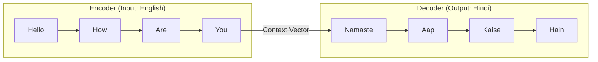

# 🔄 Sequence to Sequence (Seq2Seq) Models: The Engine of Translation
> **Level:** Advanced | **Language:** Hinglish | **Goal:** Master the Encoder-Decoder architecture, its applications in Machine Translation and Summarization, and its evolution before the Transformer era.

---

## 🧭 1. Beginner-Friendly Hinglish Explanation
Seq2Seq ek aisi machine hai jo ek sequence (jaise English sentence) ko doosre sequence (jaise Hindi sentence) mein badalti hai. 

Sochiye, aap ek translator hain:
1. **The Encoder (Samajhna):** Aap poora English sentence padhte hain aur uska "Main Idea" dimaag mein rakhte hain. Is Idea ko hum **Context Vector** kehte hain.
2. **The Decoder (Bolna):** Ab aap us context vector ko dekh kar ek-ek karke Hindi words bolna shuru karte hain. 

Seq2Seq models hi pehli baar Google Translate ko "Professional" banaye the. Isse pehle hum sirf words translate karte the, par Seq2Seq ne poore sentence ka "Meaning" samajhna shuru kiya.

---

## 🧠 2. Deep Technical Explanation
Seq2Seq (or Encoder-Decoder) architecture consists of two neural networks (usually RNNs or LSTMs):

### 1. The Encoder:
- It processes the input sequence $x_1, x_2, ..., x_n$ one by one.
- At each step, it updates its hidden state. 
- The final hidden state $h_n$ is called the **Context Vector**. It is a "Bottleneck" that represents the summary of the entire input.

### 2. The Decoder:
- It takes the Context Vector as its initial hidden state.
- It predicts the first output token $y_1$ using a special `<START>` token.
- Crucially, it uses its own previous output $y_{t-1}$ as input for the next step $t$.
- This continues until it generates an `<END>` token.

### The Problem (The Bottleneck):
The Context Vector is a fixed-size list of numbers. Trying to fit a $100$-word sentence into a $512$-size vector is like trying to summarize a whole book in one sentence—you lose information. (This led to the invention of **Attention**).

---

## 🏗️ 3. Seq2Seq Components
| Component | Mathematical Role | Analogy |
| :--- | :--- | :--- |
| **Encoder** | Maps Input to Latent Space | The Reader |
| **Context Vector**| The Fixed-length Bottleneck | The Memory |
| **Decoder** | Maps Latent Space to Output | The Writer |
| **Teacher Forcing**| Training technique | Guiding a student |
| **Beam Search** | Optimization for inference | Choosing the best path |

---

## 📐 4. Mathematical Intuition
- **The Objective:** Maximize the probability of the output sequence given the input:
  $$P(y_1, ..., y_m | x_1, ..., x_n)$$
- **Conditioning:** Each output $y_t$ depends on the context $c$ and all previous outputs $y_{<t}$:
  $$P(y_t | y_{<t}, c)$$
- **The Loss:** Categorical Cross-Entropy at every time step of the decoder.

---

## 📊 5. Seq2Seq Architecture (Diagram)


---

## 💻 6. Production-Ready Examples (Seq2Seq with PyTorch)
```python
# 2026 Pro-Tip: Seq2Seq is the base for 'Chat' models.
import torch
import torch.nn as nn

class Encoder(nn.Module):
    def __init__(self, input_dim, emb_dim, hid_dim):
        super().__init__()
        self.embedding = nn.Embedding(input_dim, emb_dim)
        self.rnn = nn.LSTM(emb_dim, hid_dim)
        
    def forward(self, src):
        # src: [seq_len, batch]
        embedded = self.embedding(src)
        outputs, (hidden, cell) = self.rnn(embedded)
        # return hidden/cell states as Context Vector
        return hidden, cell

class Decoder(nn.Module):
    def __init__(self, output_dim, emb_dim, hid_dim):
        super().__init__()
        self.embedding = nn.Embedding(output_dim, emb_dim)
        self.rnn = nn.LSTM(emb_dim, hid_dim)
        self.fc_out = nn.Linear(hid_dim, output_dim)
        
    def forward(self, input, hidden, cell):
        # input: [batch] (single token)
        input = input.unsqueeze(0)
        embedded = self.embedding(input)
        output, (hidden, cell) = self.rnn(embedded, (hidden, cell))
        prediction = self.fc_out(output.squeeze(0))
        return prediction, hidden, cell
```

---

## ❌ 7. Failure Cases
- **Long Sequence Failure:** The model "forgets" the beginning of a long sentence.
- **Repetitive Output:** The decoder gets stuck in a loop (e.g., "I am I am I am..."). **Fix:** Use **Penalty** during decoding.
- **Exposure Bias:** During training, the model sees the "Correct" previous word. During testing, it sees its "Own" previous word. If it makes one mistake, the whole sentence fails.

---

## 🛠️ 8. Debugging Guide
- **Symptom:** Translation is garbage but training loss is low.
- **Check:** **Greedy Search vs Beam Search**. Are you only picking the most likely word at each step? Beam search (checking top 5 paths) usually works $20\%$ better.
- **Symptom:** Model only outputs `<END>` token immediately.
- **Check:** **Loss Weighting**. Is your `<END>` token appearing too early in the training data?

---

## ⚖️ 9. Tradeoffs
- **Fixed Context vs. Attention:** Fixed context is faster and uses less memory, but Attention is $100x$ more accurate for long text.
- **RNN vs. CNN Seq2Seq:** CNNs can be faster for Seq2Seq because they can process input in parallel, but LSTMs are better for very long sequences.

---

## 🛡️ 10. Security Concerns
- **Poisoned Translation:** An attacker can provide training data that translates a specific name to a specific slur.
- **Inference Hijacking:** Tricking the decoder into outputting sensitive data by providing a carefully crafted "Partial" sequence.

---

## 📈 11. Scaling Challenges
- **The Sequential Bottleneck:** You cannot parallelize the Decoder. To generate 100 words, you must run the model 100 times. This is why LLM inference is expensive.

---

## 💸 12. Cost Considerations
- **Training Seq2Seq:** Needs pairs of data (English-Hindi). This data is expensive to create.
- **Inference Optimization:** Use **KV-Caching** to reuse the hidden states of previous words, saving $50-70\%$ of the computation at each step.

---

## ✅ 13. Best Practices
- **Teacher Forcing:** During the first few epochs, give the decoder the "Correct" previous word to help it learn faster.
- **Reverse Input:** In the early days, researchers found that reversing the input (e.g., "You Are How Hello") helped the encoder remember the first word better.
- **Bucketing:** Group sentences of similar lengths together to avoid wasting compute on "Padding" zeros.

---

## ⚠️ 14. Common Mistakes
- **No Beam Search:** Using simple `argmax` for final translation.
- **Not handling OOV:** Not having an `<UNK>` (Unknown) token strategy.

---

## 📝 15. Interview Questions
1. **"What is the 'Bottleneck' in a standard Seq2Seq model?"** (The fixed-size context vector).
2. **"Difference between training and inference in Seq2Seq?"** (Teacher forcing vs. Autoregressive).
3. **"How does Beam Search improve translation quality?"**

---

## 🚀 15. Latest 2026 Industry Patterns
- **Non-Autoregressive Translation (NAT):** New models that try to predict ALL words of a translation in ONE go (like a CNN), speeding up inference by $10x$.
- **Cross-Lingual Transfer:** Training a Seq2Seq model on 50 languages so it can translate between two languages it has never seen together (e.g., Icelandic to Tamil).
- **Multimodal Seq2Seq:** Taking an "Image" as a sequence of pixels and outputting a "Description" as a sequence of words (Image Captioning).
