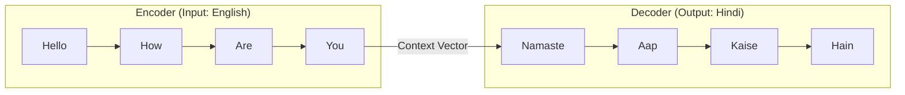

# 🔄 Sequence to Sequence (Seq2Seq) Models: The Engine of Translation
> **Level:** Advanced | **Language:** Hinglish | **Goal:** Encoder-Decoder architecture ko master karein, Machine Translation aur Summarization mein iske applications, aur Transformer era se pehle iske evolution ko explore karein.

---

## 🧭 1. Beginner-Friendly Hinglish Explanation
Seq2Seq ek aisi machine hai jo ek sequence (jaise English sentence) ko doosre sequence (jaise Hindi sentence) mein badalti hai. 

Sochiye, aap ek translator hain:
1. **The Encoder (Samajhna):** Aap poora English sentence padhte hain aur uska "Main Idea" dimaag mein rakhte hain. Is Idea ko hum **Context Vector** kehte hain.
2. **The Decoder (Bolna):** Ab aap us context vector ko dekh kar ek-ek karke Hindi words bolna shuru karte hain. 

Seq2Seq models hi pehli baar Google Translate ko "Professional" banaye the. Isse pehle hum sirf words translate karte the, par Seq2Seq ne poore sentence ka "Meaning" samajhna shuru kiya.

---

## 🧠 2. Deep Technical Explanation
Seq2Seq (ya Encoder-Decoder) architecture me do neural networks (usually RNNs ya LSTMs) hote hain:

### 1. The Encoder:
- Ye input sequence $x_1, x_2, ..., x_n$ ko ek-ek karke process karta hai.
- Ye apni hidden state ko update karta hai. 
- Final hidden state $h_n$ ko **Context Vector** kaha jata hai. Ye ek "Bottleneck" hai jo poore input ke summary ko represent karta hai.

### 2. The Decoder:
- Ye Context Vector ko apni initial hidden state ki tarah leta hai.
- Ye ek special `<START>` token ka use karke pehla output token $y_1$ predict karta hai.
- Crucially, ye next step $t$ ke liye input ke roop me apne hi previous output $y_{t-1}$ ka use karta hai.
- Ye tab tak continue rehta hai jab tak ki ek `<END>` token generate na ho jaye.

### The Problem (The Bottleneck):
Context Vector numbers ki ek fixed-size list hoti hai. Kisi $100$-word ke sentence ko $512$-size ke vector me fit karne ki koshish karna bilkul waisa hi hai jaise poori book ko ek sentence me summarize karna—isme information lose ho jati hai. (Isi wajah se **Attention** ka invention hua).

---

## 🏗️ 3. Seq2Seq Components
| Component (Hissa) | Mathematical Role (Mathematical Role) | Analogy (Udaharan) |
| :--- | :--- | :--- |
| **Encoder** | Input ko Latent Space me map karta hai | The Reader |
| **Context Vector**| Fixed-length Bottleneck | The Memory |
| **Decoder** | Latent Space ko Output me map karta hai | The Writer |
| **Teacher Forcing**| Training technique | Guiding a student |
| **Beam Search** | Inference ke liye optimization | Choosing the best path |

---

## 📐 4. Mathematical Intuition
- **The Objective:** Input diye hone par output sequence ki probability ko maximize karna:
  $$P(y_1, ..., y_m | x_1, ..., x_n)$$
- **Conditioning:** Har ek output $y_t$ context $c$ aur pichle sabhi outputs $y_{<t}$ par depend karta hai:
  $$P(y_t | y_{<t}, c)$$
- **The Loss:** Decoder ke har ek time step par Categorical Cross-Entropy.

---

## 📊 5. Seq2Seq Architecture (Diagram)

```mermaid
graph LR
    subgraph "Encoder (Input: English)"
    E1[Hello] --> E2[How]
    E2 --> E3[Are]
    E3 --> E4[You]
    end
    
    E4 -- "Context Vector" --> D1
    
    subgraph "Decoder (Output: Hindi)"
    D1[Namaste] --> D2[Aap]
    D2 --> D3[Kaise]
    D3 --> D4[Hain]
    end
```

---

## 💻 6. Production-Ready Examples (Seq2Seq with PyTorch)
```python
# 2026 Pro-Tip: Seq2Seq 'Chat' models ka base hota hai.
import torch
import torch.nn as nn

class Encoder(nn.Module):
    def __init__(self, input_dim, emb_dim, hid_dim):
        super().__init__()
        self.embedding = nn.Embedding(input_dim, emb_dim)
        self.rnn = nn.LSTM(emb_dim, hid_dim)
        
    def forward(self, src):
        # src: [seq_len, batch]
        embedded = self.embedding(src)
        outputs, (hidden, cell) = self.rnn(embedded)
        # hidden/cell states ko Context Vector ke roop me return karna
        return hidden, cell

class Decoder(nn.Module):
    def __init__(self, output_dim, emb_dim, hid_dim):
        super().__init__()
        self.embedding = nn.Embedding(output_dim, emb_dim)
        self.rnn = nn.LSTM(emb_dim, hid_dim)
        self.fc_out = nn.Linear(hid_dim, output_dim)
        
    def forward(self, input, hidden, cell):
        # input: [batch] (single token)
        input = input.unsqueeze(0)
        embedded = self.embedding(input)
        output, (hidden, cell) = self.rnn(embedded, (hidden, cell))
        prediction = self.fc_out(output.squeeze(0))
        return prediction, hidden, cell
```

---

## ❌ 7. Failure Cases
- **Long Sequence Failure:** Model kisi lambe sentence ke starting part ko "bhool" jata hai.
- **Repetitive Output:** Decoder ek loop me phas jata hai (e.g., "I am I am I am..."). **Fix:** Decoding ke dauran **Penalty** ka use karein.
- **Exposure Bias:** Training ke dauran model "Correct" previous word dekhta hai. Testing ke dauran ye apna "Own" previous word dekhta hai. Agar ye ek galti bhi karta hai, toh poora sentence fail ho jata hai.

---

## 🛠️ 8. Debugging Guide
- **Symptom:** Translation completely bekar hai par training loss low hai.
- **Check:** **Greedy Search vs Beam Search**. Kya aap har step par sirf sabse likely word select kar rahe hain? Beam search (top 5 paths check karna) usually $20\%$ behtar kaam karta hai.
- **Symptom:** Model immediately sirf `<END>` token output kar raha hai.
- **Check:** **Loss Weighting**. Kya aapke training data me `<END>` token bahut jaldi aa raha hai?

---

## ⚖️ 9. Tradeoffs
- **Fixed Context vs. Attention:** Fixed context fast hota hai aur kam memory use karta hai, par long text ke liye Attention $100x$ zyada accurate hota hai.
- **RNN vs. CNN Seq2Seq:** CNNs Seq2Seq ke liye fast ho sakte hain kyunki wo input ko parallel me process kar sakte hain, par bahut long sequences ke liye LSTMs behtar hote hain.

---

## 🛡️ 10. Security Concerns
- **Poisoned Translation:** Attacker aisa training data provide kar sakta hai jo kisi specific name ko specific slur me translate kare.
- **Inference Hijacking:** Ek carefully crafted "Partial" sequence provide karke decoder ko sensitive data output karne ke liye trick karna.

---

## 📈 11. Scaling Challenges
- **The Sequential Bottleneck:** Aap Decoder ko parallelize nahi kar sakte. 100 words generate karne ke liye, aapko model ko 100 baar run karna hoga. Yahi reason hai ki LLM inference expensive hota hai.

---

## 💸 12. Cost Considerations
- **Training Seq2Seq:** Iske liye pairs of data (English-Hindi) ki zaroorat hoti hai. Aisa data create karna expensive hota hai.
- **Inference Optimization:** Pichle words ke hidden states ko reuse karne ke liye **KV-Caching** ka use karein, jisse har step par $50-70\%$ computation save hoti hai.

---

## ✅ 13. Best Practices
- **Teacher Forcing:** Pehle kuch epochs ke dauran, decoder ko "Correct" previous word dein taaki use fast learn karne me help mile.
- **Reverse Input:** Early days me, researchers ne paya ki input ko reverse karna (e.g., "You Are How Hello") helped the encoder remember the first word better.
- **Bucketing:** Similar lengths wale sentences ko ek sath group karein taaki "Padding" zeros par compute waste na ho.

---

## ⚠️ 14. Common Mistakes
- **No Beam Search:** Final translation ke liye simple `argmax` ka use karna.
- **Not handling OOV:** Koi `<UNK>` (Unknown) token strategy na hona.

---

## 📝 15. Interview Questions
1. **"Standard Seq2Seq model me 'Bottleneck' kya hai?"** (The fixed-size context vector).
2. **"Seq2Seq me training aur inference me kya difference hai?"** (Teacher forcing vs. Autoregressive).
3. **"Beam Search kaise translation quality ko improve karta hai?"**

---

## 🚀 16. Latest 2026 Industry Patterns
- **Non-Autoregressive Translation (NAT):** New models jo ek hi go me translation ke SABHI words ko predict karne ki koshish karte hain (CNN ki tarah), jisse inference speed $10x$ fast ho jati hai.
- **Cross-Lingual Transfer:** Training a Seq2Seq model on 50 languages so it can translate between two languages it has never seen together (e.g., Icelandic to Tamil).
- **Multimodal Seq2Seq:** Taking an "Image" as a sequence of pixels and outputting a "Description" as a sequence of words (Image Captioning).
