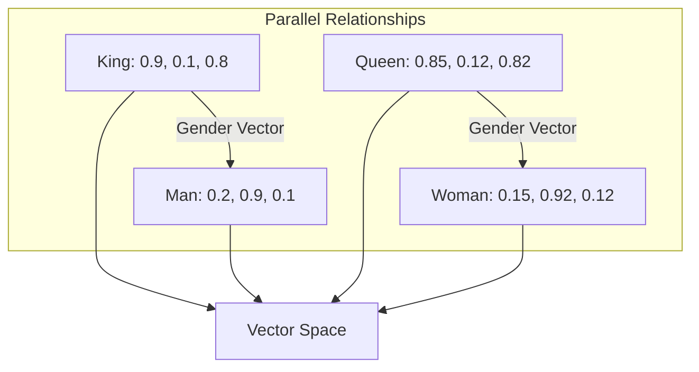

# 🌐 Word Embeddings: Giving Words a Mathematical Identity
> **Level:** Intermediate | **Language:** Hinglish | **Goal:** Master the concept of Dense Vector Representations, covering historical breakthroughs like Word2Vec and GloVe, and understanding how they capture semantic meaning.

---

## 🧭 1. Beginner-Friendly Hinglish Explanation
Computer ko text samajh nahi aata, use sirf "Numbers" samajh aate hain. 

Pehle hum "One-Hot Encoding" use karte the: `[1, 0, 0, 0]` (Apple), `[0, 1, 0, 0]` (Orange). Par isme computer ko ye nahi pata chalta tha ki Apple aur Orange dono "Phal" (Fruits) hain. 
**Word Embeddings** ne is problem ko solve kiya. Ye har word ko ek 300 ya 1536 numbers ki list (Vector) mein badal deta hai. 
- **The Magic:** Agar hum "King" ke vector mein se "Man" ko minus karein aur "Woman" ko add karein, toh answer "Queen" ke vector ke bahut paas aata hai. 
  $$King - Man + Woman \approx Queen$$

Embeddings ka matlab hai ki computer ab words ke beech ka "Rishta" (Relationship) samajhta hai.

---

## 🧠 2. Deep Technical Explanation
Word Embeddings are **Dense, Low-Dimensional, Continuous** vector representations of words.

### 1. Word2Vec (Google, 2013):
Uses a shallow neural network to learn embeddings from context. Two architectures:
- **CBOW (Continuous Bag of Words):** Predicts a target word from its context (e.g., "The [?] is red").
- **Skip-Gram:** Predicts the context words from a target word (e.g., "[?] apple [?]"). Skip-gram works better for rare words.

### 2. GloVe (Global Vectors - Stanford, 2014):
Instead of local windows, GloVe looks at the **Global Co-occurrence Matrix** of the entire dataset. It uses matrix factorization logic to ensure that the ratio of co-occurrence probabilities represents semantic meaning.

### 3. FastText (Facebook, 2016):
An improvement over Word2Vec that treats words as a bag of **Character N-grams** (e.g., "apple" = "app", "ppl", "ple"). This allows it to generate embeddings for words it has never seen before (OOV).

---

## 🏗️ 3. Embedding Comparison Table
| Feature | Word2Vec | GloVe | FastText |
| :--- | :--- | :--- | :--- |
| **Logic** | Neural (Predictive) | Matrix (Count-based) | Sub-word (N-gram) |
| **Context** | Local Window | Global Corpus | Sub-word local |
| **OOV Support** | No | No | Yes |
| **Training Speed**| Fast | Slow (Large Matrix) | Fast |
| **Best For** | Semantic Analogies | Statistical patterns | Slang, Typos, Morphology |

---

## 📐 4. Mathematical Intuition
- **The Dot Product ($u \cdot v$):** If two word vectors are similar, their dot product will be high.
- **Cosine Similarity:** Measures the angle between two vectors. 
  $$\cos(\theta) = \frac{A \cdot B}{||A|| ||B||}$$
- **Dimensionality:** Why 300? Too small (e.g., 2) and you can't capture complexity. Too large (e.g., 10,000) and you overfit and waste memory. 300-1536 is the "Sweet Spot."

---

## 📊 5. Vector Space Relationship (Diagram)


---

## 💻 6. Production-Ready Examples (Using Gensim for Word2Vec)
```python
# 2026 Pro-Tip: Use pre-trained embeddings for small tasks to save time.
import gensim.downloader as api

# 1. Load pre-trained Word2Vec (trained on Google News)
print("Loading model...")
model = api.load("word2vec-google-news-300")

# 2. Finding similar words
similar = model.most_similar("tesla", topn=3)
print(f"Similar to Tesla: {similar}")

# 3. Mathematical Analogy: King - Man + Woman = ?
result = model.most_similar(positive=['king', 'woman'], negative=['man'], topn=1)
print(f"Analogy Result: {result}") # Should be [('queen', 0.71...)]
```

---

## ❌ 7. Failure Cases
- **Polysemy Problem (The Biggest Failure):** "Bank" (Nadi ka kinara) and "Bank" (Paisa jama karne wali jagah) have the SAME vector. These models are **Static**. (Solved later by BERT/GPT).
- **Antonym Problem:** "Good" and "Bad" often appear in the same context, so Word2Vec might think they are similar.
- **Bias:** If the training data is biased, the embeddings will be biased (e.g., `Doctor - Man + Woman = Nurse`).

---

## 🛠️ 8. Debugging Guide
- **Symptom:** Words like "Apple" and "Microsoft" are far apart.
- **Check:** **Training Corpus**. Was your model trained on Wikipedia or a Cookbook? If it's a cookbook, "Apple" is a fruit, not a tech company.
- **Symptom:** Memory is full.
- **Check:** **Vocabulary size**. Word2Vec stores every word in RAM. Use `model.init_sims(replace=True)` to normalize and save space.

---

## ⚖️ 9. Tradeoffs
- **Static Embeddings (Word2Vec/GloVe):** Light, fast, can be used on CPU. Great for simple search and classification.
- **Contextual Embeddings (BERT/OpenAI):** Heavy, need GPU, slow. Necessary for complex reasoning and chat.

---

## 🛡️ 10. Security Concerns
- **Property Inference:** By looking at the distance between specific sensitive words in your custom embedding model, an attacker can guess what kind of private data your company is processing.
- **Bias Injection:** Maliciously injecting text into the training set to make certain brands or names appear "more positive" in the vector space.

---

## 📈 11. Scaling Challenges
- **Matrix Bloat:** GloVe requires a co-occurrence matrix of $V \times V$. If $V=1M$, that's $1$ Trillion entries. This requires massive RAM and distributed computing.
- **Dimension Reduction:** Using PCA or t-SNE to visualize 300D embeddings in 2D without losing the clusters.

---

## 💸 12. Cost Considerations
- **Storage:** Storing a high-quality embedding for $100k$ words takes about $1GB$.
- **Training:** Training Word2Vec on the whole internet is expensive. 2026 standards say: "Use pre-trained weights" unless you have very specific domain data (like medical or legal).

---

## ✅ 13. Best Practices
- **Use Cosine Similarity:** Don't use Euclidean distance ($L2$) for high-dimensional text vectors; it's less reliable.
- **Normalize:** Always normalize your vectors to unit length before using them.
- **Domain Adaptation:** If you are building a "Medical AI," don't use Google News vectors. Use "BioWord2Vec."

---

## ⚠️ 14. Common Mistakes
- **Training from scratch on small data:** If you have only 1000 reviews, your embeddings will be terrible. Use pre-trained ones.
- **Treating Embeddings as "Logic":** Remember, embeddings are just "Associations," not "Knowledge."

---

## 📝 15. Interview Questions
1. **"Difference between CBOW and Skip-gram?"**
2. **"Why is the king-man+woman analogy possible in Word2Vec?"** (Because the vector direction represents the semantic relationship).
3. **"How does GloVe differ from Word2Vec?"** (Count-based global stats vs. Neural-based local prediction).

---

## 🚀 15. Latest 2026 Industry Patterns
- **Sparse Embeddings:** Moving away from 300D dense vectors to 10,000D sparse vectors where each dimension represents a clear human concept (Interpretability).
- **Matryoshka Embeddings:** A new OpenAI technique where a single 1536D vector can be "truncated" to 64D or 128D without losing much accuracy, saving $90\%$ of vector database space.
- **Dynamic Multimodal Embeddings:** Vectors that represent not just the word "Dog," but also the image of a dog and the sound of a bark in the exact same location in space.
