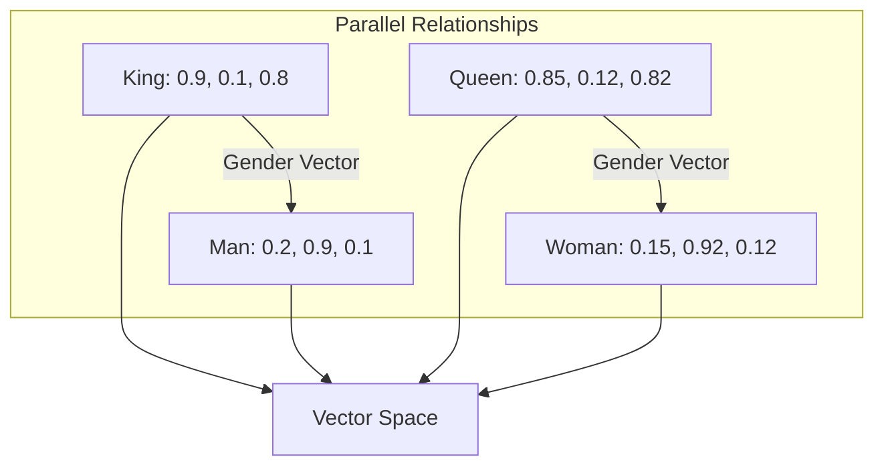

# 🌐 Word Embeddings: Giving Words a Mathematical Identity
> **Level:** Intermediate | **Language:** Hinglish | **Goal:** Dense Vector Representations ke concept ko master karein, jisme Word2Vec aur GloVe jaise historical breakthroughs aur ye semantic meaning kaise capture karte hain, shamil hai.

---

## 🧭 1. Beginner-Friendly Hinglish Explanation
Computer ko text samajh nahi aata, use sirf "Numbers" samajh aate hain. 

Pehle hum "One-Hot Encoding" use karte the: `[1, 0, 0, 0]` (Apple), `[0, 1, 0, 0]` (Orange). Par isme computer ko ye nahi pata chalta tha ki Apple aur Orange dono "Phal" (Fruits) hain. 
**Word Embeddings** ne is problem ko solve kiya. Ye har word ko ek 300 ya 1536 numbers ki list (Vector) mein badal deta hai. 
- **The Magic:** Agar hum "King" ke vector mein se "Man" ko minus karein aur "Woman" ko add karein, toh answer "Queen" ke vector ke bahut paas aata hai. 
  $$King - Man + Woman \approx Queen$$

Embeddings ka matlab hai ki computer ab words ke beech ka "Rishta" (Relationship) samajhta hai.

---

## 🧠 2. Deep Technical Explanation
Word Embeddings words ke **Dense, Low-Dimensional, Continuous** vector representations hote hain.

### 1. Word2Vec (Google, 2013):
Context se embeddings learn karne ke liye ek shallow neural network ka use karta hai. Iski do architectures hain:
- **CBOW (Continuous Bag of Words):** Context se kisi target word ko predict karta hai (e.g., "The [?] is red").
- **Skip-Gram:** Target word se context words ko predict karta hai (e.g., "[?] apple [?]"). Rare words ke liye Skip-gram behtar kaam karta hai.

### 2. GloVe (Global Vectors - Stanford, 2014):
Local windows ke bajaye, GloVe poore dataset ke **Global Co-occurrence Matrix** ko dekhta hai. Ye matrix factorization logic ka use karta hai taaki ensure ho sake ki co-occurrence probabilities ka ratio semantic meaning ko represent kare.

### 3. FastText (Facebook, 2016):
Word2Vec par ek improvement jo words ko **Character N-grams** ke bag ki tarah treat karta hai (e.g., "apple" = "app", "ppl", "ple"). Ye ise un words ke liye bhi embeddings generate karne ki permission deta hai jinhe usne pehle kabhi nahi dekha (OOV).

---

## 🏗️ 3. Embedding Comparison Table
| Feature (Lakshan) | Word2Vec | GloVe | FastText |
| :--- | :--- | :--- | :--- |
| **Logic** | Neural (Predictive) | Matrix (Count-based) | Sub-word (N-gram) |
| **Context** | Local Window | Global Corpus | Sub-word local |
| **OOV Support** | No | No | Yes |
| **Training Speed**| Fast | Slow (Large Matrix) | Fast |
| **Best For** | Semantic Analogies | Statistical patterns | Slang, Typos, Morphology |

---

## 📐 4. Mathematical Intuition
- **The Dot Product ($u \cdot v$):** Agar do word vectors similar hain, toh unka dot product high hoga.
- **Cosine Similarity:** Do vectors ke beech ke angle ko measure karta hai. 
  $$\cos(\theta) = \frac{A \cdot B}{||A|| ||B||}$$
- **Dimensionality:** 300 hi kyun? Bahut small (e.g., 2) hone par aap complexity capture nahi kar sakte. Bahut large (e.g., 10,000) hone par aap overfit ho jayenge aur memory waste karenge. 300-1536 iska "Sweet Spot" hai.

---

## 📊 5. Vector Space Relationship (Diagram)

```mermaid
graph TD
    King[King: 0.9, 0.1, 0.8] --> Space[Vector Space]
    Queen[Queen: 0.85, 0.12, 0.82] --> Space
    Man[Man: 0.2, 0.9, 0.1] --> Space
    Woman[Woman: 0.15, 0.92, 0.12] --> Space
    
    subgraph "Parallel Relationships"
    King -- Gender Vector --> Man
    Queen -- Gender Vector --> Woman
    end
```

---

## 💻 6. Production-Ready Examples (Using Gensim for Word2Vec)
```python
# 2026 Pro-Tip: Time save karne ke liye small tasks me pre-trained embeddings ka use karein.
import gensim.downloader as api

# 1. Pre-trained Word2Vec load karna (Google News par trained)
print("Loading model...")
model = api.load("word2vec-google-news-300")

# 2. Similar words find karna
similar = model.most_similar("tesla", topn=3)
print(f"Similar to Tesla: {similar}")

# 3. Mathematical Analogy: King - Man + Woman = ?
result = model.most_similar(positive=['king', 'woman'], negative=['man'], topn=1)
print(f"Analogy Result: {result}") # Output: [('queen', 0.71...)]
```

---

## ❌ 7. Failure Cases
- **Polysemy Problem (The Biggest Failure):** "Bank" (Nadi ka kinara) aur "Bank" (Paisa jama karne wali jagah) dono ka SAME vector hota hai. Ye models **Static** hote hain. (Jise baad me BERT/GPT dwara solve kiya gaya).
- **Antonym Problem:** "Good" aur "Bad" aksar same context me aate hain, isiliye Word2Vec soch sakta hai ki wo dono similar hain.
- **Bias:** Agar training data biased hai, toh embeddings bhi biased honge (e.g., `Doctor - Man + Woman = Nurse`).

---

## 🛠️ 8. Debugging Guide
- **Symptom:** "Apple" aur "Microsoft" jaise words bahut door-door hain.
- **Check:** **Training Corpus**. Kya aapka model Wikipedia par train hua tha ya kisi Cookbook par? Agar cookbook par hua tha, toh "Apple" ek fruit hai, tech company nahi.
- **Symptom:** Memory full ho gayi hai.
- **Check:** **Vocabulary size**. Word2Vec har word ko RAM me store karta hai. Space save aur normalize karne ke liye `model.init_sims(replace=True)` ka use karein.

---

## ⚖️ 9. Tradeoffs
- **Static Embeddings (Word2Vec/GloVe):** Light, fast hote hain, aur CPU par bhi run kiye ja sakte hain. Simple search aur classification ke liye behtar hain.
- **Contextual Embeddings (BERT/OpenAI):** Heavy hote hain, GPU ki zaroorat hoti hai, aur slow hote hain. Complex reasoning aur chat ke liye zaroori hain.

---

## 🛡️ 10. Security Concerns
- **Property Inference:** Aapke custom embedding model me specific sensitive words ke beech ki distance ko dekh kar, attacker ye guess kar sakta hai ki aapki company kis type ka private data process kar rahi hai.
- **Bias Injection:** Vector space me certain brands ya names ko "more positive" dikhane ke liye training set me maliciously text inject karna.

---

## 📈 11. Scaling Challenges
- **Matrix Bloat:** GloVe ke liye $V \times V$ size ka co-occurrence matrix chahiye hota hai. Agar $V=1M$ hai, toh ye $1$ Trillion entries ban jati hain. Iske liye massive RAM aur distributed computing ki need hoti hai.
- **Dimension Reduction:** Clusters ko bina lose kiye 2D space me 300D embeddings ko visualize karne ke liye PCA ya t-SNE ka use karna.

---

## 💸 12. Cost Considerations
- **Storage:** $100k$ words ke liye high-quality embedding ko store karne me lagbhag $1GB$ space lagta hai.
- **Training:** Poore internet par Word2Vec train karna bahut expensive hai. 2026 standards kehte hain: "Use pre-trained weights" jab tak ki aapke paas koi bahut specific domain data (jaise medical ya legal) na ho.

---

## ✅ 13. Best Practices
- **Use Cosine Similarity:** High-dimensional text vectors ke liye Euclidean distance ($L2$) ka use na karein; ye less reliable hota hai.
- **Normalize:** Vectors ko use karne se pehle hamesha unhe unit length me normalize karein.
- **Domain Adaptation:** Agar aap koi "Medical AI" bana rahe hain, toh Google News vectors ka use na karein. "BioWord2Vec" ka use karein.

---

## ⚠️ 14. Common Mistakes
- **Training from scratch on small data:** Agar aapke paas sirf 1000 reviews hain, toh aapki embeddings bahut kharab banegi. Pre-trained embeddings ka use karein.
- **Treating Embeddings as "Logic":** Yaad rakhein, embeddings sirf "Associations" hain, "Knowledge" nahi.

---

## 📝 15. Interview Questions
1. **"CBOW aur Skip-gram me kya difference hai?"**
2. **"Word2Vec me king-man+woman analogy kyun possible hai?"** (Kyunki vector direction semantic relationship ko represent karta hai).
3. **"GloVe, Word2Vec se kaise different hai?"** (Count-based global stats vs. Neural-based local prediction).

---

## 🚀 16. Latest 2026 Industry Patterns
- **Sparse Embeddings:** 300D dense vectors se 10,000D sparse vectors ki taraf shift hona jahan har dimension ek clear human concept ko represent kare (Interpretability).
- **Matryoshka Embeddings:** A new OpenAI technique where a single 1536D vector can be "truncated" to 64D or 128D without losing much accuracy, saving $90\%$ of vector database space.
- **Dynamic Multimodal Embeddings:** Vectors that represent not just the word "Dog," but also the image of a dog and the sound of a bark in the exact same location in space.
