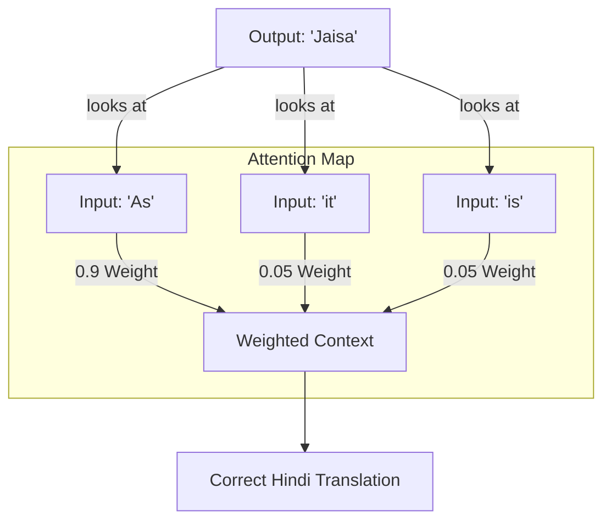

# 🔍 Attention Mechanism: Focus is Everything
> **Level:** Advanced | **Language:** Hinglish | **Goal:** Master the concept of Attention, from Bahdanau Attention to Self-Attention, and understand how it revolutionized NLP by removing the "Context Bottleneck."

---

## 🧭 1. Beginner-Friendly Hinglish Explanation
Attention Mechanism ka matlab hai "Zaruri cheezon par dhyan dena". 

Sochiye, aap ek bada sentence padh rahe hain: *"The boy who was wearing a red shirt and carrying a blue bag, finally reached the **home**."* 
Jab aap "home" word par pahunchte hain, toh aapka dimaag poore sentence mein se "boy" par sabse zyada dhyan deta hai, aur "red shirt" ya "blue bag" ko thoda ignore kar deta hai. 

Purane models (Seq2Seq) poore sentence ko ek chote "Vector" mein thonsne (squeeze) ki koshish karte the. 
**Attention** ne ye badal diya. Ab model translation ke waqt poore sentence ko dekh sakta hai aur decide karta hai: "Abhi is word ke liye mujhe input ke kaunse part par focus karna chahiye?". 

Yahi wo "Attention" hai jisne AI ko insaano ki tarah smart banaya hai.

---

## 🧠 2. Deep Technical Explanation
Attention is a mechanism that assigns **Weights** to different parts of the input sequence based on their relevance to the current output step.

### 1. Bahdanau Attention (Additive):
The first version of attention. For every output word, it calculates an **Alignment Score** between the current decoder state and all encoder hidden states. It then takes a **Weighted Sum** of these states to create a "Dynamic Context Vector."

### 2. Self-Attention (The Transformer Core):
Instead of Encoder vs. Decoder, words in a single sentence look at each other to understand context.
- **Query ($Q$):** What am I looking for?
- **Key ($K$):** What do I contain?
- **Value ($V$):** What information do I provide?
The score is calculated as:
$$\text{Attention}(Q, K, V) = \text{Softmax}\left(\frac{QK^T}{\sqrt{d_k}}\right)V$$

### 3. Multi-Head Attention:
Instead of one focus, the model has multiple "Heads" (e.g., 8 or 12). One head might focus on Grammar, another on Entities, and another on Verb-Subject relationships.

---

## 🏗️ 3. Attention Components
| Term | Role | Analogy |
| :--- | :--- | :--- |
| **Score** | Importance | Volume of a voice |
| **Softmax** | Probability | Normalizing attention to $1$ |
| **Scaled Dot-Product** | Efficiency | Calculating similarity |
| **Context Vector**| Dynamic Summary | The "Focus" of the moment |
| **Masked Attention**| Generation constraint | Don't look at the future |

---

## 📐 4. Mathematical Intuition
- **The Dot Product:** If Query and Key are similar (aligned), their dot product is high $\implies$ Attention is high.
- **The Scaling Factor ($\sqrt{d_k}$):** As dimensions grow, dot products can become very large, pushing Softmax into regions with tiny gradients. Scaling prevents this, keeping the training stable.
- **Parallelism:** Unlike RNNs, all $Q, K, V$ for an entire sentence can be calculated in ONE matrix multiplication ($O(1)$ time for the whole sequence).

---

## 📊 5. Attention Weights Visualization (Diagram)


---

## 💻 6. Production-Ready Examples (Implementing Self-Attention)
```python
# 2026 Pro-Tip: Multi-head attention is the engine of all modern LLMs.
import torch
import torch.nn as nn
import torch.nn.functional as F

class SimpleSelfAttention(nn.Module):
    def __init__(self, embed_dim):
        super().__init__()
        # Linear layers to project inputs into Q, K, V
        self.q = nn.Linear(embed_dim, embed_dim)
        self.k = nn.Linear(embed_dim, embed_dim)
        self.v = nn.Linear(embed_dim, embed_dim)
        self.scale = torch.sqrt(torch.tensor(embed_dim, dtype=torch.float32))

    def forward(self, x):
        # x shape: [batch, seq_len, embed_dim]
        Q = self.q(x)
        K = self.k(x)
        V = self.v(x)
        
        # 1. Calculate Scores (Dot Product)
        scores = torch.matmul(Q, K.transpose(-2, -1)) / self.scale
        
        # 2. Softmax to get Weights
        weights = F.softmax(scores, dim=-1)
        
        # 3. Apply Weights to Values
        output = torch.matmul(weights, V)
        return output, weights
```

---

## ❌ 7. Failure Cases
- **Quadratic Complexity ($O(N^2)$):** If a sentence is $1,000$ words, attention calculates $1,000,000$ relationships. For $1$ Million words, it's impossible. **Fix:** Use **Sparse Attention** or **Flash Attention**.
- **Positional Loss:** Attention doesn't care about the "Order" of words. "Dog bites man" and "Man bites dog" have the same attention. **Fix:** Use **Positional Encodings**.
- **Over-Attention:** Sometimes a model focuses too much on a single "Noise" word and ignores the real context.

---

## 🛠️ 8. Debugging Guide
- **Symptom:** Attention map is all "Uniform" (every word looks at every other word equally).
- **Check:** **Initialization**. Your weights might be too small.
- **Check:** **Scaling**. Did you forget to divide by $\sqrt{d_k}$?
- **Symptom:** Model is "Cheating" in translation (looking at the answer).
- **Check:** **Causal Masking**. Are you masking the future tokens during training?

---

## ⚖️ 9. Tradeoffs
- **Self-Attention vs. Cross-Attention:** Self-attention is within one sequence. Cross-attention is between two sequences (e.g., Encoder and Decoder).
- **Hard vs. Soft Attention:** Soft attention (Standard) uses all inputs with weights. Hard attention picks only ONE input (faster but not differentiable).

---

## 🛡️ 10. Security Concerns
- **Prompt Leaking via Attention:** By analyzing the "Attention Maps" of a model, an attacker can sometimes see which part of the "Hidden System Prompt" the model is currently focusing on, revealing private instructions.

---

## 📈 11. Scaling Challenges
- **The KV Cache:** During inference, we save the $K$ and $V$ vectors to avoid re-calculating them for every word. For long conversations, this cache can take $10GB+$ of VRAM.

---

## 💸 12. Cost Considerations
- **Attention is Memory-Bound:** Most of the cost of attention is moving $Q, K, V$ from GPU memory to the GPU core. **Flash Attention** optimizes this "Movement," making models $3x$ faster for free.

---

## ✅ 13. Best Practices
- **Multi-Head is better than Single-Head:** It allows the model to "attend" to multiple aspects of a word (Context + Grammar + Entity) simultaneously.
- **Use Dropout:** Apply dropout on the attention weights to prevent the model from becoming too reliant on a single word.

---

## ⚠️ 14. Common Mistakes
- **Forgetting the Square Root Scale:** This is the most common mathematical error in implementing Transformers.
- **Confusion between $Q$ and $K$:** Query is "what I want", Key is "what I have". Swapping them doesn't change the score, but it ruins the conceptual flow.

---

## 📝 15. Interview Questions
1. **"What problem does Attention solve in Seq2Seq models?"** (The fixed-length bottleneck).
2. **"Explain the Query, Key, and Value intuition."**
3. **"Why is the Softmax score divided by the square root of the dimension?"**

---

## 🚀 15. Latest 2026 Industry Patterns
- **FlashAttention-3:** Hardware-specific kernels that use the H100 Tensor Cores to compute attention $2x$ faster than FlashAttention-2.
- **Sliding Window Attention:** (Used in Mistral) Instead of looking at everything, each word only looks at the last $1000$ words, allowing for "Infinite" sequence lengths.
- **Linear Attention (Mamba/SSM):** New math that reduces the $O(N^2)$ cost to $O(N)$, potentially killing the standard Transformer in 2027.
