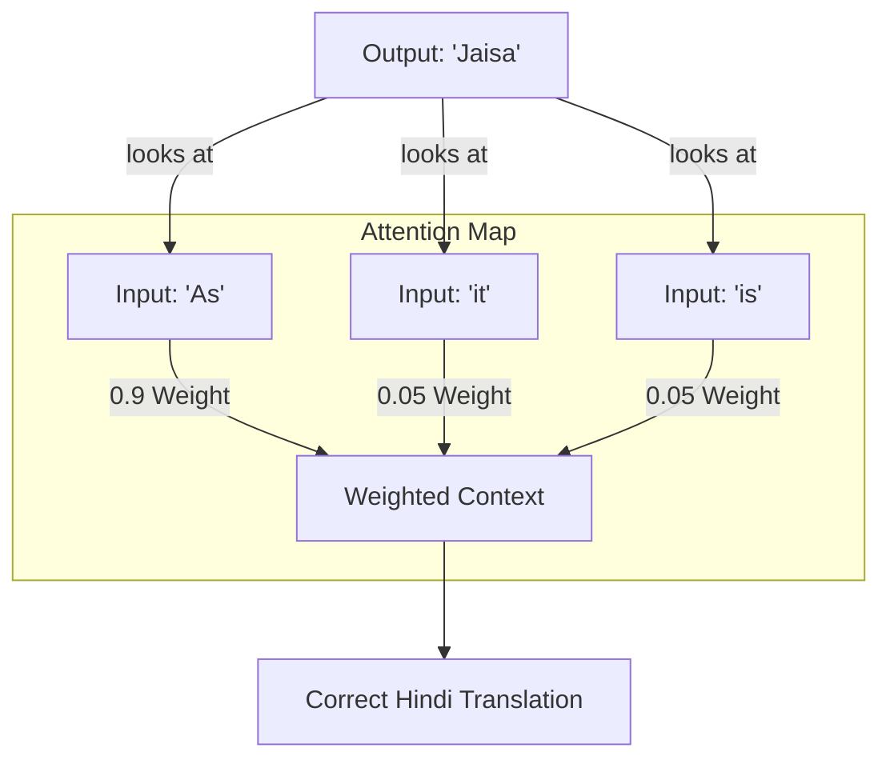

# 🔍 Attention Mechanism: Focus is Everything
> **Level:** Advanced | **Language:** Hinglish | **Goal:** Bahdanau Attention se lekar Self-Attention tak ke Attention concept ko master karein, aur samjhein ki kaise isne "Context Bottleneck" ko remove karke NLP ko revolutionize kiya.

---

## 🧭 1. Beginner-Friendly Hinglish Explanation
Attention Mechanism ka matlab hai "Zaruri cheezon par dhyan dena". 

Sochiye, aap ek bada sentence padh rahe hain: *"The boy who was wearing a red shirt and carrying a blue bag, finally reached the **home**."* 
Jab aap "home" word par pahunchte hain, toh aapka dimaag poore sentence mein se "boy" par sabse zyada dhyan deta hai, aur "red shirt" ya "blue bag" ko thoda ignore kar deta hai. 

Purane models (Seq2Seq) poore sentence ko ek chote "Vector" mein thonsne (squeeze) ki koshish karte the. 
**Attention** ne ye badal diya. Ab model translation ke waqt poore sentence ko dekh sakta hai aur decide karta hai: "Abhi is word ke liye mujhe input ke kaunse part par focus karna chahiye?". 

Yahi wo "Attention" hai jisne AI ko insaano ki tarah smart banaya hai.

---

## 🧠 2. Deep Technical Explanation
Attention ek aisi mechanism hai jo current output step ke relevance ke basis par input sequence ke different parts ko **Weights** assign karti hai.

### 1. Bahdanau Attention (Additive):
Attention ka pehla version. Har ek output word ke liye, ye current decoder state aur sabhi encoder hidden states ke beech ek **Alignment Score** calculate karta hai. Fir ye ek "Dynamic Context Vector" create karne ke liye in states ka **Weighted Sum** leta hai.

### 2. Self-Attention (The Transformer Core):
Encoder vs. Decoder ke bajaye, ek single sentence ke words context ko samajhne ke liye ek-dusre ko dekhte hain.
- **Query ($Q$):** Main kya dhoondh raha hoon?
- **Key ($K$):** Mere paas kya hai?
- **Value ($V$):** Main kya information provide karta hoon?
Score ko is tarah calculate kiya jata hai:
$$\text{Attention}(Q, K, V) = \text{Softmax}\left(\frac{QK^T}{\sqrt{d_k}}\right)V$$

### 3. Multi-Head Attention:
Ek hi focus ke bajaye, model ke paas multiple "Heads" (e.g., 8 ya 12) hote hain. Ek head Grammar par focus kar sakta hai, dusra Entities par, aur teesra Verb-Subject relationships par.

---

## 🏗️ 3. Attention Components
| Term (Shabd) | Role (Bhumika) | Analogy (Udaharan) |
| :--- | :--- | :--- |
| **Score** | Importance | Volume of a voice |
| **Softmax** | Probability | Normalizing attention to $1$ |
| **Scaled Dot-Product** | Efficiency | Calculating similarity |
| **Context Vector**| Dynamic Summary | The "Focus" of the moment |
| **Masked Attention**| Generation constraint | Don't look at the future |

---

## 📐 4. Mathematical Intuition
- **The Dot Product:** Agar Query aur Key similar (aligned) hain, toh unka dot product high hoga $\implies$ Attention high hoga.
- **The Scaling Factor ($\sqrt{d_k}$):** Jaise-jaise dimensions grow karte hain, dot products bahut large ho sakte hain, jo Softmax ko tiny gradients wale regions me push kar dete hain. Scaling ise rokti hai aur training ko stable rakhti.
- **Parallelism:** RNNs ke opposite, poore sentence ke liye sabhi $Q, K, V$ ko ONE matrix multiplication ($O(1)$ time poori sequence ke liye) me calculate kiya ja sakta hai.

---

## 📊 5. Attention Weights Visualization (Diagram)

```mermaid
graph TD
    Query[Output: 'Jaisa'] -- looks at --> K1[Input: 'As']
    Query -- looks at --> K2[Input: 'it']
    Query -- looks at --> K3[Input: 'is']
    
    subgraph "Attention Map"
    K1 -- "0.9 Weight" --> Sum[Weighted Context]
    K2 -- "0.05 Weight" --> Sum
    K3 -- "0.05 Weight" --> Sum
    end
    
    Sum --> Result[Correct Hindi Translation]
```

---

## 💻 6. Production-Ready Examples (Implementing Self-Attention)
```python
# 2026 Pro-Tip: Multi-head attention is the engine of all modern LLMs.
import torch
import torch.nn as nn
import torch.nn.functional as F

class SimpleSelfAttention(nn.Module):
    def __init__(self, embed_dim):
        super().__init__()
        # Inputs ko Q, K, V me project karne ke liye Linear layers
        self.q = nn.Linear(embed_dim, embed_dim)
        self.k = nn.Linear(embed_dim, embed_dim)
        self.v = nn.Linear(embed_dim, embed_dim)
        self.scale = torch.sqrt(torch.tensor(embed_dim, dtype=torch.float32))

    def forward(self, x):
        # x shape: [batch, seq_len, embed_dim]
        Q = self.q(x)
        K = self.k(x)
        V = self.v(x)
        
        # 1. Calculate Scores (Dot Product)
        scores = torch.matmul(Q, K.transpose(-2, -1)) / self.scale
        
        # 2. Softmax to get Weights
        weights = F.softmax(scores, dim=-1)
        
        # 3. Apply Weights to Values
        output = torch.matmul(weights, V)
        return output, weights
```

---

## ❌ 7. Failure Cases
- **Quadratic Complexity ($O(N^2)$):** Agar sentence $1,000$ words ka hai, toh attention $1,000,000$ relationships calculate karta hai. $1$ Million words ke liye ye impossible hai. **Fix:** **Sparse Attention** ya **Flash Attention** ka use karein.
- **Positional Loss:** Attention ko words ke "Order" (kram) se koi matlab nahi hota. "Dog bites man" aur "Man bites dog" dono ka same attention hota hai. **Fix:** **Positional Encodings** ka use karein.
- **Over-Attention:** Kabhi-kabhi model kisi single "Noise" word par bahut zyada focus karne lagta hai aur real context ko ignore kar deta hai.

---

## 🛠️ 8. Debugging Guide
- **Symptom:** Attention map completely "Uniform" hai (har word dusre har word ko barabar dekh raha hai).
- **Check:** **Initialization**. Aapke weights bahut small ho sakte hain.
- **Check:** **Scaling**. Kya aap $\sqrt{d_k}$ se divide karna bhool gaye?
- **Symptom:** Model translation me "Cheating" kar raha hai (answer ko dekh raha hai).
- **Check:** **Causal Masking**. Kya aap training ke dauran future tokens ko mask kar rahe hain?

---

## ⚖️ 9. Tradeoffs
- **Self-Attention vs. Cross-Attention:** Self-attention ek hi sequence ke andar hota hai. Cross-attention do sequences ke beech hota hai (e.g., Encoder aur Decoder).
- **Hard vs. Soft Attention:** Soft attention (Standard) weights ke sath sabhi inputs ka use karta hai. Hard attention sirf ONE input ko pick karta hai (fast hai par differentiable nahi hai).

---

## 🛡️ 10. Security Concerns
- **Prompt Leaking via Attention:** Model ke "Attention Maps" ko analyze karke, attacker kabhi-kabhi ye dekh sakta hai ki model current me "Hidden System Prompt" ke kis part par focus kar raha hai, jisse private instructions reveal ho sakti hain.

---

## 📈 11. Scaling Challenges
- **The KV Cache:** Inference ke dauran, hum har word ke liye $K$ aur $V$ vectors ko re-calculate karne se bachne ke liye unhe save karte hain. Long conversations ke liye, ye cache $10GB+$ VRAM le sakta hai.

---

## 💸 12. Cost Considerations
- **Attention is Memory-Bound:** Attention ki most of the cost $Q, K, V$ ko GPU memory se GPU core me move karne ki hoti hai. **Flash Attention** is "Movement" ko optimize karta hai, jisse models free me $3x$ fast ho jate hain.

---

## ✅ 13. Best Practices
- **Multi-Head is better than Single-Head:** Ye model ko ek word ke multiple aspects (Context + Grammar + Entity) par ek sath "attend" (dhyan dene) ki permission deta hai.
- **Use Dropout:** Model ko kisi single word par bahut zyada reliant hone se rokne ke liye attention weights par dropout apply karein.

---

## ⚠️ 14. Common Mistakes
- **Forgetting the Square Root Scale:** Transformers ko implement karne me ye sabse common mathematical error hai.
- **Confusion between $Q$ and $K$:** Query ka matlab "what I want" hai, Key ka matlab "what I have". Unhe swap karne se score change nahi hota, par conceptual flow kharab ho jata hai.

---

## 📝 15. Interview Questions
1. **"Seq2Seq models me Attention kis problem ko solve karta hai?"** (The fixed-length bottleneck).
2. **"Query, Key, aur Value ke intuition ko explain karein."**
3. **"Softmax score ko dimension ke square root se kyun divide kiya jata hai?"**

---

## 🚀 16. Latest 2026 Industry Patterns
- **FlashAttention-3:** Hardware-specific kernels jo attention ko FlashAttention-2 se $2x$ fast compute karne ke liye H100 Tensor Cores ka use karte hain.
- **Sliding Window Attention:** (Used in Mistral) Instead of looking at everything, each word only looks at the last $1000$ words, allowing for "Infinite" sequence lengths.
- **Linear Attention (Mamba/SSM):** New math that reduces the $O(N^2)$ cost to $O(N)$, potentially killing the standard Transformer in 2027.
