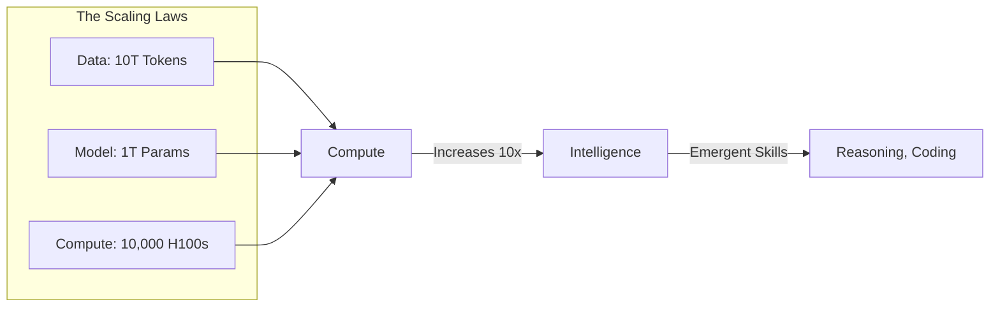

# 🚀 From NLP to LLMs: The Great Convergence
> **Level:** Advanced | **Language:** Hinglish | **Goal:** Trace the historical and technical shift from specialized NLP tasks to unified Large Language Models, and understand the "Scaling Laws" that enabled this revolution.

---

## 🧭 1. Beginner-Friendly Hinglish Explanation
NLP ki duniya mein 2018 se pehle har kaam ke liye ek alag model banana padta tha. 
- Translation ke liye alag model.
- Summarization ke liye alag.
- Sentiment ke liye alag.

Par **LLMs (Large Language Models)** ne sab badal diya. Ab humne ek hi "Super Model" banaya jisne poora Internet padh liya. Is ek model ko ab sab kuch aata hai. 
- **The Shift:** Pehle hum model ko "Train" karte the specific kaam ke liye. Ab hum model ko sirf **"Prompt"** karte hain. 
- **The Secret:** Jitna zyada Data aur Compute humne dala, AI achanak "Smart" (Reasoning) karne laga. 

Is module mein hum wahi safar dekhenge ki kaise humne chote-chote tools se ek "Global Brain" tak ka safar tai kiya.

---

## 🧠 2. Deep Technical Explanation
The transition from Traditional NLP to LLMs is marked by three major shifts:

### 1. From Task-Specific to Unified Models:
Earlier, we used **Fine-tuning** (BERT style). You take a pre-trained model and update ALL its weights for a specific task.
Now, we use **In-Context Learning** (GPT style). You don't change the model; you just provide examples in the prompt (Few-shot/Zero-shot).

### 2. The Power of Self-Supervision:
Instead of human-labeled data, LLMs use **Causal Language Modeling (CLM)**. They predict the next token on trillions of words from the web. This is "Free" labeling at infinite scale.

### 3. Scaling Laws:
Researchers discovered that as you increase three variables—**Model Size ($N$)**, **Dataset Size ($D$)**, and **Compute ($C$)**—the model's error (Loss) decreases predictably following a power law. 
$$\text{Loss}(N, D, C) \propto \frac{1}{C^\alpha}$$
This led to the "Race for Trillions" of parameters.

---

## 🏗️ 3. Pre-LLM vs. LLM Era
| Feature | Traditional NLP (2014-2018) | LLM Era (2022-2026) |
| :--- | :--- | :--- |
| **Model Architecture** | LSTMs, GRUs, BERT | Transformers (Decoder-only) |
| **Data Size** | Megabytes (Curated) | Terabytes (The whole Web) |
| **User Interface** | Python Code / APIs | Natural Language (Chat) |
| **Capability** | Single-task (NER, Classify) | Multi-task (Code, Write, Reason) |
| **Training Paradigm** | Supervised Fine-tuning | Self-supervised + RLHF |

---

## 📐 4. Mathematical Intuition
- **Emergent Abilities:** At a certain scale (usually > 10B parameters), models suddenly develop skills they weren't explicitly trained for, like doing 3-digit multiplication or explaining a joke.
- **Perplexity:** The primary metric for LLMs. It measures how "surprised" the model is by a sequence of text. Lower perplexity = Better model.
- **The Chinchilla Scaling Law:** Proved that most early models (like GPT-3) were actually "Under-trained." To be optimal, for every 2x increase in model size, you should also 2x the dataset size.

---

## 📊 5. The Scaling Wall (Diagram)


---

## 💻 6. Production-Ready Examples (Zero-shot NLP with LLMs)
```python
# 2026 Pro-Tip: Stop fine-tuning models for simple classification. Use LLMs.
from openai import OpenAI

client = OpenAI()

def zero_shot_nlp(text: str, task: str):
    # Instead of training a model, we just ask the LLM
    response = client.chat.completions.create(
        model="gpt-4o",
        messages=[
            {"role": "system", "content": f"You are a specialized NLP tool for {task}."},
            {"role": "user", "content": f"Analyze this text: {text}"}
        ]
    )
    return response.choices[0].message.content

# Usage: 1 model for 3 different tasks!
print(zero_shot_nlp("I hate this app!", "Sentiment Analysis"))
print(zero_shot_nlp("Apple is based in Cupertino.", "Entity Extraction"))
print(zero_shot_nlp("Once upon a time...", "Story Completion"))
```

---

## ❌ 7. Failure Cases
- **Hallucinations:** Because LLMs are "Next-token predictors," they can confidently output "Facts" that are mathematically likely but factually wrong.
- **Instruction Following Failure:** In small models (<7B), the model might ignore your instructions and just continue the sentence (e.g., "Summarize this: [Text]" -> model starts writing more text).
- **Compute Waste:** Using a 70B model to capitalize a sentence is $1,000x$ more expensive than a simple Python `.upper()` function.

---

## 🛠️ 8. Debugging Guide
- **Symptom:** The model is not reasoning well.
- **Check:** **Scale**. Are you using a 1B model? Reasoning typically emerges after 7B-10B parameters.
- **Check:** **Data Quality**. Was the model trained on garbage? (e.g., Common Crawl without filtering).
- **Symptom:** Model is biased or toxic.
- **Check:** **Alignment (RLHF/DPO)**. Was the model properly aligned with human values?

---

## ⚖️ 9. Tradeoffs
- **Base Model vs. Chat Model:** Base models are better for completion and research. Chat (Instruct) models are better for user-facing apps and tools.
- **Closed vs. Open Source:** Closed (OpenAI) is easier to use. Open (Llama-3) gives you $100\%$ control and privacy.

---

## 🛡️ 10. Security Concerns
- **Data Contamination:** If the "Test" data for a benchmark is leaked on the internet, the model will "memorize" it, giving fake high scores.
- **Red-Teaming:** Since LLMs are "black boxes," we need specialized teams to find ways to make the model output dangerous info (e.g., "How to make a bomb").

---

## 📈 11. Scaling Challenges
- **The GPU Wall:** To train a 1 Trillion parameter model, you need $50,000+$ GPUs working in perfect sync for months. One hardware failure can crash the whole run.
- **The Data Wall:** We have already used almost all high-quality text on the internet. Future scaling requires **Synthetic Data** (AI-generated data) or **Multimodal Data** (Video).

---

## 💸 12. Cost Considerations
- **Training Cost:** A state-of-the-art LLM in 2026 costs $\$100M$ to $\$1B$ in compute alone.
- **Inference Optimization:** Using **Speculative Decoding** (using a small model to predict and a large model to verify) can reduce inference costs by $50\%$.

---

## ✅ 13. Best Practices
- **Standardize on Benchmarks:** Use MMLU, GSM8K, and HumanEval to compare models.
- **Prompt Engineering:** Treat prompts like code. Version them, test them, and use "Chain of Thought" (Let's think step by step).
- **RAG over Long-Context:** Even if a model has a 1M context window, "Searching" for the right info (RAG) is usually cheaper and more accurate.

---

## ⚠️ 14. Common Mistakes
- **Expecting LLMs to be "Database":** They are "Reasoning Engines," not "Knowledge Bases." Always verify their facts.
- **Ignoring Token Limits:** Forgetting that "Words" are not "Tokens." A 100-word sentence might be 150 tokens.

---

## 📝 15. Interview Questions
1. **"What are 'Scaling Laws' and how do they predict AI performance?"**
2. **"Difference between Zero-shot, One-shot, and Few-shot prompting?"**
3. **"Why did LLMs replace specialized NLP models for most tasks?"**

---

## 🚀 15. Latest 2026 Industry Patterns
- **Mixture of Experts (MoE):** Instead of one giant model, use 8 specialized models. Only activate the "Math expert" for math questions. (Used in Mixtral and GPT-4).
- **Small Language Models (SLMs):** Training 1B-3B models so well that they beat the original GPT-3, allowing LLMs to run on smartwatches.
- **On-Device Learning:** Models that "learn" from your personal interactions on your phone without ever sending data to the cloud.
