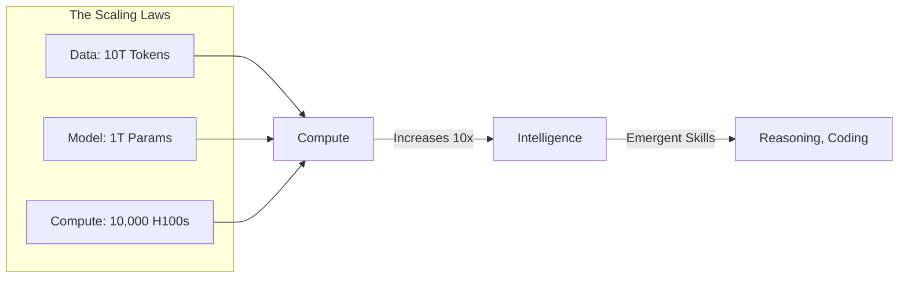

# 🚀 From NLP to LLMs: The Great Convergence
> **Level:** Advanced | **Language:** Hinglish | **Goal:** Specialized NLP tasks se unified Large Language Models ki taraf historical aur technical shift ko trace karein, aur is revolution ko enable karne wale "Scaling Laws" ko samjhein.

---

## 🧭 1. Beginner-Friendly Hinglish Explanation
NLP ki duniya mein 2018 se pehle har kaam ke liye ek alag model banana padta tha. 
- Translation ke liye alag model.
- Summarization ke liye alag.
- Sentiment ke liye alag.

Par **LLMs (Large Language Models)** ne sab badal diya. Ab humne ek hi "Super Model" banaya jisne poora Internet padh liya. Is ek model ko ab sab kuch aata hai. 
- **The Shift:** Pehle hum model ko "Train" karte the specific kaam ke liye. Ab hum model ko sirf **"Prompt"** karte hain. 
- **The Secret:** Jitna zyada Data aur Compute humne dala, AI achanak "Smart" (Reasoning) karne laga. 

Is module mein hum wahi safar dekhenge ki kaise humne chote-chote tools se ek "Global Brain" tak ka safar tai kiya.

---

## 🧠 2. Deep Technical Explanation
Traditional NLP se LLMs ki taraf transition teen major shifts se marked hai:

### 1. From Task-Specific to Unified Models:
Pehle, hum **Fine-tuning** (BERT style) ka use karte the. Aap ek pre-trained model lete hain aur kisi specific task ke liye iske SABHI weights ko update karte hain.
Ab, hum **In-Context Learning** (GPT style) ka use karte hain. Aap model ko change nahi karte; aap bas prompt me examples provide karte hain (Few-shot/Zero-shot).

### 2. The Power of Self-Supervision:
Human-labeled data ke bajaye, LLMs **Causal Language Modeling (CLM)** ka use karte hain. Wo web ke trillions of words par agle token ko predict karte hain. Ye infinite scale par "Free" labeling hai.

### 3. Scaling Laws:
Researchers ne discover kiya ki jaise hi aap teen variables—**Model Size ($N$)**, **Dataset Size ($D$)**, aur **Compute ($C$)**—ko increase karte hain, toh model ka error (Loss) predictably ek power law ko follow karte hue decrease hota hai. 
$$\text{Loss}(N, D, C) \propto \frac{1}{C^\alpha}$$
Isne parameters ke "Race for Trillions" ki shuruat ki.

---

## 🏗️ 3. Pre-LLM vs. LLM Era
| Feature (Lakshan) | Traditional NLP (2014-2018) | LLM Era (2022-2026) |
| :--- | :--- | :--- |
| **Model Architecture** | LSTMs, GRUs, BERT | Transformers (Decoder-only) |
| **Data Size** | Megabytes (Curated) | Terabytes (The whole Web) |
| **User Interface** | Python Code / APIs | Natural Language (Chat) |
| **Capability** | Single-task (NER, Classify) | Multi-task (Code, Write, Reason) |
| **Training Paradigm** | Supervised Fine-tuning | Self-supervised + RLHF |

---

## 📐 4. Mathematical Intuition
- **Emergent Abilities:** Ek certain scale par (usually > 10B parameters), models me achanak aisi skills develop ho jati hain jinke liye unhe explicitly train nahi kiya gaya tha, jaise 3-digit multiplication karna ya kisi joke ko explain karna.
- **Perplexity:** LLMs ke liye primary metric. Ye measure karta hai ki model text ke sequence se kitna "surprised" hai. Lower perplexity = Better model.
- **The Chinchilla Scaling Law:** Isne prove kiya ki most early models (jaise GPT-3) actually "Under-trained" the. Optimal hone ke liye, model size me har 2x increase ke liye aapko dataset size ko bhi 2x karna chahiye.

---

## 📊 5. The Scaling Wall (Diagram)

```mermaid
graph LR
    C[Compute] -- "Increases 10x" --> M[Intelligence]
    M -- "Emergent Skills" --> R[Reasoning, Coding]
    
    subgraph "The Scaling Laws"
    S1[Data: 10T Tokens]
    S2[Model: 1T Params]
    S3[Compute: 10,000 H100s]
    end
    
    S1 & S2 & S3 --> C
```

---

## 💻 6. Production-Ready Examples (Zero-shot NLP with LLMs)
```python
# 2026 Pro-Tip: Simple classification ke liye models ko fine-tune karna stop karein. Use LLMs.
from openai import OpenAI

client = OpenAI()

def zero_shot_nlp(text: str, task: str):
    # Model train karne ke bajaye, hum bas LLM se puchte hain
    response = client.chat.completions.create(
        model="gpt-4o",
        messages=[
            {"role": "system", "content": f"You are a specialized NLP tool for {task}."},
            {"role": "user", "content": f"Analyze this text: {text}"}
        ]
    )
    return response.choices[0].message.content

# Usage: 3 different tasks ke liye 1 model!
print(zero_shot_nlp("I hate this app!", "Sentiment Analysis"))
print(zero_shot_nlp("Apple is based in Cupertino.", "Entity Extraction"))
print(zero_shot_nlp("Once upon a time...", "Story Completion"))
```

---

## ❌ 7. Failure Cases
- **Hallucinations:** Kyunki LLMs "Next-token predictors" hote hain, isiliye wo confidently aise "Facts" output kar sakte hain jo mathematically likely ho par factually galat hon.
- **Instruction Following Failure:** Small models (<7B) me, model aapke instructions ko ignore kar sakta hai aur bas sentence ko continue kar sakta hai (e.g., "Summarize this: [Text]" -> model aur text likhna shuru kar deta hai).
- **Compute Waste:** Kisi sentence ko capitalize karne ke liye 70B model ka use karna simple Python `.upper()` function ke comparison me $1,000x$ zyada expensive hai.

---

## 🛠️ 8. Debugging Guide
- **Symptom:** Model achhi tarah reasoning nahi kar raha hai.
- **Check:** **Scale**. Are you using a 1B model? Reasoning typically 7B-10B parameters ke baad hi emerge hoti hai.
- **Check:** **Data Quality**. Kya model ko garbage data par train kiya gaya tha? (e.g., bina filtering ke Common Crawl).
- **Symptom:** Model biased ya toxic hai.
- **Check:** **Alignment (RLHF/DPO)**. Kya model ko human values ke sath properly align kiya gaya tha?

---

## ⚖️ 9. Tradeoffs
- **Base Model vs. Chat Model:** Base models completion aur research ke liye behtar hote hain. Chat (Instruct) models user-facing apps aur tools ke liye behtar hote hain.
- **Closed vs. Open Source:** Closed (OpenAI) use karne me easy hai. Open (Llama-3) aapko $100\%$ control aur privacy deta hai.

---

## 🛡️ 10. Security Concerns
- **Data Contamination:** Agar kisi benchmark ke liye "Test" data internet par leak ho jata hai, toh model use "memorize" kar lega, jisse fake high scores milenge.
- **Red-Teaming:** Kyunki LLMs "black boxes" hain, hume specialized teams ki need hoti hai jo ye find karein ki model se dangerous info (e.g., "How to make a bomb") kaise output karwayi jaye.

---

## 📈 11. Scaling Challenges
- **GPU Wall:** 1 Trillion parameter model ko train karne ke liye, aapko months tak perfect sync me $50,000+$ GPUs ki need hoti hai. Ek bhi hardware failure poori run ko crash kar sakta hai.
- **Data Wall:** Humne pehle hi internet ke lagbhag sabhi high-quality text ka use kar liya hai. Future scaling ke liye **Synthetic Data** (AI-generated data) ya **Multimodal Data** (Video) ki zaroorat padegi.

---

## 💸 12. Cost Considerations
- **Training Cost:** 2026 me ek state-of-the-art LLM ki cost sirf compute me hi $\$100M$ se $\$1B$ tak hoti hai.
- **Inference Optimization:** **Speculative Decoding** (predict karne ke liye small model aur verify karne ke liye large model ka use karna) ka use karne se inference costs $50\%$ tak reduce ho sakti hai.

---

## ✅ 13. Best Practices
- **Standardize on Benchmarks:** Models ko compare karne ke liye MMLU, GSM8K, aur HumanEval ka use karein.
- **Prompt Engineering:** Prompts ko code ki tarah treat karein. Unhe version karein, test karein, aur "Chain of Thought" (Let's think step by step) ka use karein.
- **RAG over Long-Context:** Bhale hi model ki 1M context window ho, par right info ko "Search" karna (RAG) usually sasta (cheaper) aur zyada accurate hota hai.

---

## ⚠️ 14. Common Mistakes
- **Expecting LLMs to be "Database":** Wo "Reasoning Engines" hain, "Knowledge Bases" nahi. Hamesha unke facts ko verify karein.
- **Ignoring Token Limits:** Ye bhool jana ki "Words" aur "Tokens" same nahi hote. Ek 100-word ka sentence 150 tokens ho sakta hai.

---

## 📝 15. Interview Questions
1. **"'Scaling Laws' kya hain aur ye AI performance ko kaise predict karte hain?"**
2. **"Zero-shot, One-shot, aur Few-shot prompting me kya difference hai?"**
3. **"LLMs ne most tasks ke liye specialized NLP models ko kyun replace kar diya?"**

---

## 🚀 16. Latest 2026 Industry Patterns
- **Mixture of Experts (MoE):** Instead of one giant model, use 8 specialized models. Only activate the "Math expert" for math questions. (Used in Mixtral and GPT-4).
- **Small Language Models (SLMs):** Training 1B-3B models so well that they beat the original GPT-3, allowing LLMs to run on smartwatches.
- **On-Device Learning:** Models that "learn" from your personal interactions on your phone without ever sending data to the cloud.
