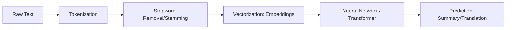

# 🗣️ Introduction to NLP: Teaching Machines the Human Tongue
> **Level:** Beginner | **Language:** Hinglish | **Goal:** Master the core concepts, challenges, and evolution of Natural Language Processing, from rule-based systems to the statistical foundations of modern LLMs.

---

## 🧭 1. Beginner-Friendly Hinglish Explanation
NLP (Natural Language Processing) AI ki wo branch hai jo computer ko humari bhasha (English, Hindi, Hinglish) samajhna aur bolna sikhati hai. 

Sochiye, computer ke liye "Apple" sirf ek word nahi, balki usne millions of context dekhe hain:
1. "I ate an apple" (Fruit)
2. "I bought an iPhone from Apple" (Company)

NLP ka kaam hai bhasha ki is "Bariki" (Nuance) aur "Complexity" ko mathematical vectors mein badalna taaki computer "Reasoning" kar sake. 2026 mein NLP sirf translation nahi, balki "Insaan jaisa dimaag" banane ka rasta ban chuka hai.

---

## 🧠 2. Deep Technical Explanation
NLP is the intersection of Linguistics, Computer Science, and Artificial Intelligence. It involves several levels of analysis:
1. **Phonology:** The study of sounds (Speech-to-Text).
2. **Morphology:** The study of word structure (e.g., "running" = "run" + "ing").
3. **Syntax:** The study of sentence structure (Grammar, POS Tagging).
4. **Semantics:** The study of meaning (Context, Entity recognition).
5. **Pragmatics:** The study of context-dependent meaning (Sarcasm, Intent).

**The Evolution:**
- **Symbolic NLP (1950s-1990s):** Rule-based systems (If word == "Good" then Sentiment = Positive).
- **Statistical NLP (1990s-2010s):** Using probabilities (N-grams) to guess the next word.
- **Neural NLP (2014-2018):** Using RNNs/LSTMs and Word Embeddings.
- **Large Scale NLP (2018-Present):** Using Transformers (Attention) on internet-scale data.

---

## 🏗️ 3. Core NLP Task Map
| Task | Description | Real-world Use Case |
| :--- | :--- | :--- |
| **Sentiment Analysis** | Detecting emotions (Happy/Sad/Angry) | Customer Review Analysis |
| **NER (Named Entity Recognition)** | Identifying Names, Dates, Locations | Automating Legal Documents |
| **Machine Translation** | Converting Language A to B | Google Translate |
| **Summarization** | Long text to Short summary | News App Summaries |
| **Q&A Systems** | Finding answers in a document | Customer Support Bots |

---

## 📐 4. Mathematical Intuition
- **The Vector Space Model:** Every word is a point in a high-dimensional space. "King" and "Queen" are close together; "King" and "Laptop" are far apart.
- **Probability Modeling:** NLP is about predicting the next token $x_{n+1}$ given context $x_{1...n}$.
  $$P(x_{n+1} | x_{1...n})$$
- **Similarity:** We use **Cosine Similarity** to measure how close two sentences are in meaning.

---

## 📊 5. NLP Pipeline (Diagram)


---

## 💻 6. Production-Ready Examples (Basic NLP with SpaCy)
```python
# 2026 Pro-Tip: Use SpaCy for production-grade entity and syntax analysis.
import spacy

# Load the modern English transformer model
nlp = spacy.load("en_core_web_trf")

text = "Apple is looking at buying U.K. startup for $1 billion."

doc = nlp(text)

# 1. Named Entity Recognition (NER)
for ent in doc.ents:
    print(f"Entity: {ent.text}, Label: {ent.label_}")
    # Output: Apple (ORG), U.K. (GPE), $1 billion (MONEY)

# 2. Part-of-Speech Tagging
for token in doc:
    if token.pos_ == "VERB":
        print(f"Action: {token.text}")
```

---

## ❌ 7. Failure Cases
- **Ambiguity Failure:** "I saw a man with a telescope." (Did I use the telescope, or was the man holding it?). **Fix:** Use context-aware models like BERT/GPT.
- **Slang & Sarcasm:** Standard NLP models often fail at sarcasm: "Oh great, my car broke down again." (Model might think 'great' = Positive).
- **Out-of-Vocabulary (OOV):** Old models failed if they saw a word they weren't trained on (e.g., a new slang like "Skibidi"). **Fix:** Use **Sub-word Tokenization**.

---

## 🛠️ 8. Debugging Guide
- **Symptom:** NER is missing important names.
- **Check:** **Casing**. Is your text all lowercase? Some models rely on Capitalization to find Names.
- **Symptom:** Sentiment analysis is wrong $50\%$ of the time.
- **Check:** **Negation**. Is the model ignoring "not"? (e.g., "not good").

---

## ⚖️ 9. Tradeoffs
- **Rule-based:** 100% predictable, 0% flexible. (Good for simple chatbots).
- **Statistical:** Fast, but lacks "Understanding."
- **Neural:** High "Understanding," but requires GPUs and is a "Black Box."

---

## 🛡️ 10. Security Concerns
- **PII Leakage:** NLP models can accidentally extract and store private info like Social Security Numbers from documents. Always use **Anonymization** layers.
- **Biased Toxicity:** If trained on toxic internet comments, the model will output toxic/racist responses.

---

## 📈 11. Scaling Challenges
- **The Context Window:** Early NLP could only "look" at 50 words. Modern LLMs can look at 1 Million+ words. Scaling this "Attention" is the #1 engineering challenge.
- **Low-Resource Languages:** NLP works great for English but fails for regional languages (Bhojpuri, Swahili) due to lack of data.

---

## 💸 12. Cost Considerations
- **Preprocessing Cost:** Cleaning TBs of text data for training can cost thousands in **CPU/Spark** time.
- **Inference Cost:** Using a 70B model for simple sentiment analysis is a waste. Use a small **DistilBERT** or **FastText** model to save $99\%$ of costs.

---

## ✅ 13. Best Practices
- **Clean Your Data:** "Garbage In, Garbage Out." Remove HTML tags, emojis, and noise before training.
- **Use Sub-words:** Always use tokenizers like BPE (Byte Pair Encoding) or WordPiece.
- **Evaluate with Humans:** NLP metrics like BLEU or ROUGE are flawed. Always include a human evaluation step.

---

## ⚠️ 14. Common Mistakes
- **Stemming for Modern AI:** Stemming (cutting words like 'running' to 'run') is outdated for Deep Learning. Use the full word or sub-words.
- **Ignoring Stopwords in Context:** Removing "not", "no", "above" can completely change the meaning for a Transformer.

---

## 📝 15. Interview Questions
1. **"What is the 'Stopword' and why do we sometimes keep them?"**
2. **"Difference between Stemming and Lemmatization?"** (Stemming is crude cutting; Lemmatization uses a dictionary to find the 'root' word).
3. **"How does Word Embedding solve the 'Curse of Dimensionality' in NLP?"**

---

## 🚀 15. Latest 2026 Industry Patterns
- **Native Multilingual Models:** No more translation needed. Models like Llama-3-Multilingual understand 100+ languages natively in the same space.
- **Retrieval Augmented NLP (RAG):** Instead of the model "memorizing" facts, it "searches" a database and then "explains" it.
- **Zero-shot Everything:** Using a general model to do specific tasks (like NER or Sentiment) without any task-specific training.
