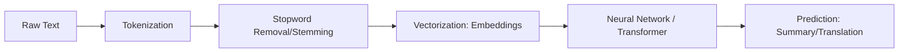

# 🗣️ Introduction to NLP: Teaching Machines the Human Tongue
> **Level:** Beginner | **Language:** Hinglish | **Goal:** Natural Language Processing ke core concepts, challenges, aur evolution ko master karein, rule-based systems se lekar modern LLMs ke statistical foundations tak.

---

## 🧭 1. Beginner-Friendly Hinglish Explanation
NLP (Natural Language Processing) AI ki wo branch hai jo computer ko humari bhasha (English, Hindi, Hinglish) samajhna aur bolna sikhati hai. 

Sochiye, computer ke liye "Apple" sirf ek word nahi, balki usne millions of context dekhe hain:
1. "I ate an apple" (Fruit)
2. "I bought an iPhone from Apple" (Company)

NLP ka kaam hai bhasha ki is "Bariki" (Nuance) aur "Complexity" ko mathematical vectors mein badalna taaki computer "Reasoning" kar sake. 2026 mein NLP sirf translation nahi, balki "Insaan jaisa dimaag" banane ka rasta ban chuka hai.

---

## 🧠 2. Deep Technical Explanation
NLP Linguistics, Computer Science, aur Artificial Intelligence ka intersection hai. Isme analysis ke kai saare levels shamil hote hain:
1. **Phonology:** Sounds ki study (Speech-to-Text).
2. **Morphology:** Word structure ki study (e.g., "running" = "run" + "ing").
3. **Syntax:** Sentence structure ki study (Grammar, POS Tagging).
4. **Semantics:** Meaning ki study (Context, Entity recognition).
5. **Pragmatics:** Context-dependent meaning ki study (Sarcasm, Intent).

**The Evolution (Kramik Vikas):**
- **Symbolic NLP (1950s-1990s):** Rule-based systems (If word == "Good" then Sentiment = Positive).
- **Statistical NLP (1990s-2010s):** Agle word ko guess karne ke liye probabilities (N-grams) ka use karna.
- **Neural NLP (2014-2018):** RNNs/LSTMs aur Word Embeddings ka use karna.
- **Large Scale NLP (2018-Present):** Internet-scale data par Transformers (Attention) ka use karna.

---

## 🏗️ 3. Core NLP Task Map
| Task | Description | Real-world Use Case |
| :--- | :--- | :--- |
| **Sentiment Analysis** | Emotions (Happy/Sad/Angry) ko detect karna | Customer Review Analysis |
| **NER (Named Entity Recognition)** | Names, Dates, Locations ko identify karna | Automating Legal Documents |
| **Machine Translation** | Converting Language A to B | Google Translate |
| **Summarization** | Long text ko Short summary me convert karna | News App Summaries |
| **Q&A Systems** | Document me answers find karna | Customer Support Bots |

---

## 📐 4. Mathematical Intuition
- **Vector Space Model:** Har word high-dimensional space me ek point hota hai. "King" aur "Queen" paas-paas hote hain; "King" aur "Laptop" bahut door hote hain.
- **Probability Modeling:** NLP ka matlab context $x_{1...n}$ diye hone par agle token $x_{n+1}$ ko predict karna hai.
  $$P(x_{n+1} | x_{1...n})$$
- **Similarity:** Do sentences meaning me kitne close hain, ise measure karne ke liye hum **Cosine Similarity** ka use karte hain.

---

## 📊 5. NLP Pipeline (Diagram)

```mermaid
graph LR
    Raw[Raw Text] --> Token[Tokenization]
    Token --> Clean[Stopword Removal/Stemming]
    Clean --> Vector[Vectorization: Embeddings]
    Vector --> Model[Neural Network / Transformer]
    Model --> Result[Prediction: Summary/Translation]
```

---

## 💻 6. Production-Ready Examples (Basic NLP with SpaCy)
```python
# 2026 Pro-Tip: Production-grade entity aur syntax analysis ke liye SpaCy ka use karein.
import spacy

# Modern English transformer model load karna
nlp = spacy.load("en_core_web_trf")

text = "Apple is looking at buying U.K. startup for $1 billion."

doc = nlp(text)

# 1. Named Entity Recognition (NER)
for ent in doc.ents:
    print(f"Entity: {ent.text}, Label: {ent.label_}")
    # Output: Apple (ORG), U.K. (GPE), $1 billion (MONEY)

# 2. Part-of-Speech Tagging
for token in doc:
    if token.pos_ == "VERB":
        print(f"Action: {token.text}")
```

---

## ❌ 7. Failure Cases
- **Ambiguity Failure:** "I saw a man with a telescope." (Did I use the telescope, or was the man holding it?). **Fix:** BERT/GPT jaise context-aware models ka use karein.
- **Slang & Sarcasm:** Standard NLP models aksar sarcasm me fail ho jate hain: "Oh great, my car broke down again." (Model soch sakta hai ki 'great' = Positive).
- **Out-of-Vocabulary (OOV):** Purane models tab fail ho jate the jab wo koi aisa word dekhte the jispar unhe train nahi kiya gaya tha (e.g., new slang jaise "Skibidi"). **Fix:** **Sub-word Tokenization** ka use karein.

---

## 🛠️ 8. Debugging Guide
- **Symptom:** NER important names ko miss kar raha hai.
- **Check:** **Casing**. Kya aapka text saara lowercase me hai? Kuch models Names find karne ke liye Capitalization par rely karte hain.
- **Symptom:** Sentiment analysis $50\%$ baar galat hota hai.
- **Check:** **Negation**. Kya model "not" ko ignore kar raha hai? (e.g., "not good").

---

## ⚖️ 9. Tradeoffs
- **Rule-based:** $100\%$ predictable, $0\%$ flexible. (Simple chatbots ke liye behtar hai).
- **Statistical:** Fast hai par isme "Understanding" (samajh) nahi hoti.
- **Neural:** High "Understanding" hoti hai par GPUs ki need hoti hai aur ye ek "Black Box" hai.

---

## 🛡️ 10. Security Concerns
- **PII Leakage:** NLP models galti se documents se private info jaise Social Security Numbers extract aur store kar sakte hain. Hamesha **Anonymization** layers ka use karein.
- **Biased Toxicity:** Agar toxic internet comments par train kiya jaye, toh model toxic/racist responses output karega.

---

## 📈 11. Scaling Challenges
- **The Context Window:** Early NLP sirf 50 words tak hi "dekh" sakta tha. Modern LLMs 1 Million+ words dekh sakte hain. Is "Attention" ko scale karna sabse bada engineering challenge hai.
- **Low-Resource Languages:** NLP English ke liye toh great kaam karta hai par regional bhashaon (Bhojpuri, Swahili) ke liye fail ho jata hai kyunki unka data kam hai.

---

## 💸 12. Cost Considerations
- **Preprocessing Cost:** Training ke liye TBs of text data ko clean karne me **CPU/Spark** time me thousands of dollars cost aa sakti hai.
- **Inference Cost:** Simple sentiment analysis ke liye 70B model ka use karna paise waste karna hai. $99\%$ cost save karne ke liye small **DistilBERT** ya **FastText** model ka use karein.

---

## ✅ 13. Best Practices
- **Clean Your Data:** "Garbage In, Garbage Out." Training se pehle HTML tags, emojis, aur noise ko remove karein.
- **Use Sub-words:** Hamesha BPE (Byte Pair Encoding) ya WordPiece jaise tokenizers ka use karein.
- **Evaluate with Humans:** BLEU ya ROUGE jaise NLP metrics perfect nahi hote. Hamesha ek human evaluation step shamil karein.

---

## ⚠️ 14. Common Mistakes
- **Stemming for Modern AI:** Stemming (jaise 'running' ko cut karke 'run' banana) Deep Learning ke liye outdated ho chuka hai. Poore word ya sub-words ka use karein.
- **Ignoring Stopwords in Context:** "not", "no", "above" jaise stopwords ko remove karne se Transformer ke liye meaning completely change ho sakta hai.

---

## 📝 15. Interview Questions
1. **"Stopword kya hote hain aur hum unhe kabhi-kabhi kyun rakhte hain?"**
2. **"Stemming aur Lemmatization me kya difference hai?"** (Stemming crude cutting hai; Lemmatization root word dhoondhne ke liye dictionary ka use karta hai).
3. **"Word Embedding kaise NLP me 'Curse of Dimensionality' ko solve karta hai?"**

---

## 🚀 16. Latest 2026 Industry Patterns
- **Native Multilingual Models:** No more translation needed. Models like Llama-3-Multilingual understand 100+ languages natively in the same space.
- **Retrieval Augmented NLP (RAG):** Instead of the model "memorizing" facts, it "searches" a database and then "explains" it.
- **Zero-shot Everything:** Using a general model to do specific tasks (like NER or Sentiment) without any task-specific training.
