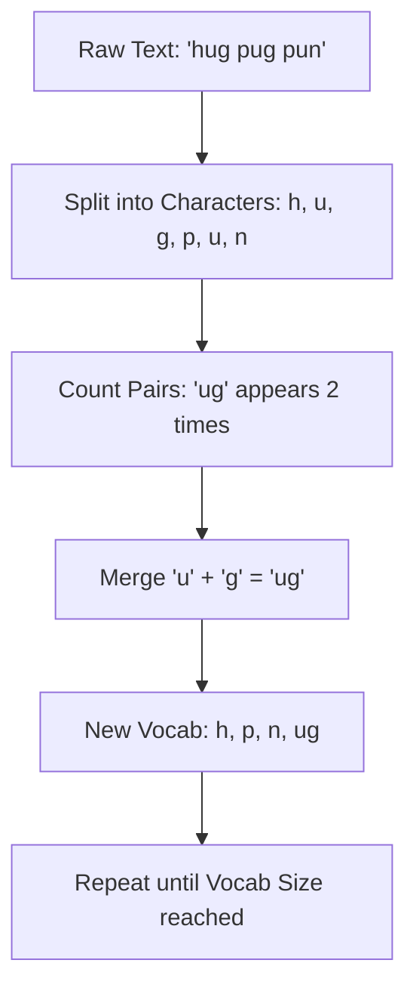

# ✂️ Tokenization and Text Processing: Breaking Down Language
> **Level:** Intermediate | **Language:** Hinglish | **Goal:** Master the art of converting raw text into machine-readable tokens, covering various strategies from Word-level to modern Sub-word BPE and WordPiece algorithms.

---

## 🧭 1. Beginner-Friendly Hinglish Explanation
Tokenization ka matlab hai "Sentence ko chote tukdon mein todna". 

Sochiye, computer ko "I love AI" samajhna hai. Computer ko poora sentence ek saath nahi samajh aata. Humein use todna padega: `["I", "love", "AI"]`. 
Par 2026 mein hum sirf "Words" mein nahi todte. 
- **Problem:** Agar humne sirf words use kiye, toh "Running" aur "Runner" do alag words ban jayenge aur computer unke beech ka relation nahi samajh payega. 
- **Solution (Sub-words):** Hum word ko aur chota todte hain: `["Run", "ning"]`. Isse computer ko pata chalta hai ki dono ka root "Run" hai. 

Tokenization hi wo pehla aur sabse zaruri step hai jo decide karta hai ki aapka model kitna "Samajhdar" hoga aur kitna "Fast" chalega.

---

## 🧠 2. Deep Technical Explanation
Tokenization is the process of mapping strings to a sequence of integers (Token IDs).

### Types of Tokenization:
1. **Word-level Tokenization:** Splitting by spaces. 
   - **Pro:** Simple. 
   - **Con:** Huge vocabulary (millions of words), cannot handle "Out-of-Vocabulary" (OOV) words like typos.
2. **Character-level Tokenization:** Splitting by every letter. 
   - **Pro:** Small vocabulary (26 letters + symbols), no OOV. 
   - **Con:** Sequences become too long; losing semantic meaning of words.
3. **Sub-word Tokenization (The Gold Standard):** 
   - **BPE (Byte Pair Encoding):** Used by GPT models. It iteratively merges the most frequent pair of characters into a single token.
   - **WordPiece:** Used by BERT. Similar to BPE but merges based on likelihood rather than frequency.
   - **SentencePiece:** Handles text as a stream of bytes, meaning it doesn't need "spaces" to split (Great for Chinese/Japanese).

---

## 🏗️ 3. Tokenizer Comparison Table
| Algorithm | Used By | Key Logic | Handling of Spaces |
| :--- | :--- | :--- | :--- |
| **BPE** | GPT-2, GPT-3, GPT-4 | Frequent Pair Merging | Treated as characters |
| **WordPiece** | BERT | Likelihood Merging | Special `##` prefix |
| **SentencePiece**| Llama, T5 | Unigram model / BPE | Space as `_` character |
| **Tiktoken** | OpenAI gpt-4o | Fast Rust-based BPE | Optimized for code/math |

---

## 📐 4. Mathematical Intuition
- **Vocabulary Size ($V$):** The number of unique tokens. If $V$ is too large, the model's "Output Layer" becomes too heavy. Standard LLMs use $V \approx 50,000$ to $128,000$.
- **Compression Ratio:** How many characters are represented per token? 
  - English: ~4 chars per token.
  - Code: ~3 chars per token.
  - Higher compression = model can "read" more text in the same context window.

---

## 📊 5. BPE Algorithm Flow (Diagram)


---

## 💻 6. Production-Ready Examples (Using Tiktoken & HuggingFace)
```python
# 2026 Pro-Tip: Always use the exact tokenizer that the model was trained on.
import tiktoken
from transformers import AutoTokenizer

# 1. OpenAI's Tiktoken (The fastest BPE)
encoding = tiktoken.get_encoding("cl100k_base") # for gpt-4
text = "Tokenization is amazing!"
tokens = encoding.encode(text)
print(f"Token IDs: {tokens}")
print(f"Decoded: {encoding.decode(tokens)}")

# 2. HuggingFace Tokenizer (for Llama-3)
tokenizer = AutoTokenizer.from_pretrained("meta-llama/Meta-Llama-3-8B")
llama_tokens = tokenizer.encode(text)
print(f"Llama Tokens: {llama_tokens}")

# Observation: Different models see the SAME text differently!
```

---

## ❌ 7. Failure Cases
- **The "Whitespace" Bug:** Some tokenizers ignore double spaces, while others treat them as important. This can ruin Python code indentation during AI generation.
- **Hallucinated Sub-words:** A tokenizer might break a chemical formula (like `H2O`) into random tokens that the model doesn't understand.
- **Emoji Failure:** Old tokenizers crash or turn Emojis into `[UNK]` (Unknown) tokens.

---

## 🛠️ 8. Debugging Guide
- **Symptom:** Model is failing at simple Math (e.g., `123 + 456`).
- **Check:** **Tokenization of numbers**. Is `123` one token or three (`1`, `2`, `3`)? If it's one token, the model has to "memorize" every number. Most 2026 models tokenize digits individually for better math.
- **Symptom:** Context window is filling up too fast.
- **Check:** **Compression**. Your tokenizer might be too "fine-grained" (too many small tokens).

---

## ⚖️ 9. Tradeoffs
- **Large Vocab:** Model understands complex words better but is slower and needs more VRAM.
- **Small Vocab:** Model is fast and light but has to use many tokens for simple words.

---

## 🛡️ 10. Security Concerns
- **Token Injection:** An attacker can provide a sequence of UTF-8 characters that are "valid" but "unexpected" for the tokenizer, causing the model to output private system prompts (Glitch tokens).
- **Adversarial Tokens:** Finding tokens like `SolidGoldMagikarp` that were in the training set but never used, causing the model to behave weirdly when it sees them.

---

## 📈 11. Scaling Challenges
- **Multilingual Tokenization:** How to make one tokenizer that works for English (short tokens) and Hindi (long tokens) without bloating the vocabulary.
- **Byte-level BPE:** Converting text to bytes first ensures $100\%$ coverage of every language and symbol in the world.

---

## 💸 12. Cost Considerations
- **Efficiency = Money:** If your tokenizer is $10\%$ more efficient (fewer tokens for same text), you save $10\%$ on your **OpenAI/Anthropic** bill every month.
- **Tiktoken speed:** Tiktoken is $10x$ faster than standard Python tokenizers, reducing the latency for your users.

---

## ✅ 13. Best Practices
- **Never Change Tokenizers:** If you trained a model with BPE, you cannot switch to WordPiece during inference.
- **Save Tokenizer Config:** Always save the `tokenizer.json` with your model weights.
- **Special Tokens:** Always handle `[CLS]`, `[SEP]`, `<|endoftext|>` correctly in your code logic.

---

## ⚠️ 14. Common Mistakes
- **Applying lower-case manually:** Most modern tokenizers handle casing internally. Manual lowering can destroy the "Identity" of named entities (e.g., `Apple` vs `apple`).
- **Ignoring Padding:** Not using `padding_token` in batches will cause shape errors in PyTorch.

---

## 📝 15. Interview Questions
1. **"Why is BPE better than Word-level tokenization?"** (Handles OOV and reduces vocab size).
2. **"How does a tokenizer handle a word it has never seen before?"** (It breaks it down into individual characters/bytes).
3. **"What is a 'Glitch Token'?"** (A token that exists in the vocab but has no/bad embeddings, causing model failure).

---

## 🚀 15. Latest 2026 Industry Patterns
- **Vision-Language Tokenization:** Tokenizing pixels and text into the same space so the model can "see" and "read" simultaneously.
- **Dynamic Vocabulary:** Models that can "add" new tokens to their vocabulary during fine-tuning without retraining the whole model.
- **Token-free Models:** Research into "Canine" or "ByT5" which work directly on bytes, removing the need for tokenizers entirely (The future of 2027).
