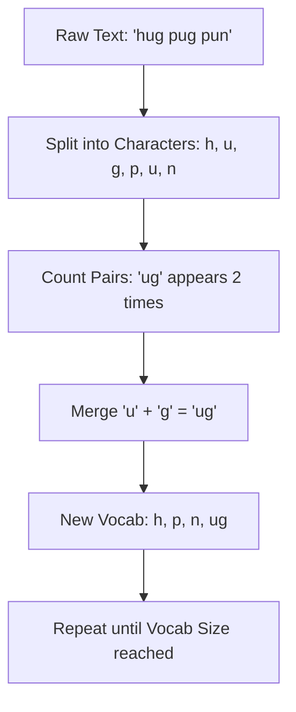

# ✂️ Tokenization and Text Processing: Breaking Down Language
> **Level:** Intermediate | **Language:** Hinglish | **Goal:** Raw text ko machine-readable tokens mein convert karne ki art ko master karein, jisme Word-level se lekar modern Sub-word BPE aur WordPiece algorithms tak ki alag-alag strategies shamil hain.

---

## 🧭 1. Beginner-Friendly Hinglish Explanation
Tokenization ka matlab hai "Sentence ko chote tukdon mein todna". 

Sochiye, computer ko "I love AI" samajhna hai. Computer ko poora sentence ek saath nahi samajh aata. Humein use todna padega: `["I", "love", "AI"]`. 
Par 2026 mein hum sirf "Words" mein nahi todte. 
- **Problem:** Agar humne sirf words use kiye, toh "Running" aur "Runner" do alag words ban jayenge aur computer unke beech ka relation nahi samajh payega. 
- **Solution (Sub-words):** Hum word ko aur chota todte hain: `["Run", "ning"]`. Isse computer ko pata chalta hai ki dono ka root "Run" hai. 

Tokenization hi wo pehla aur sabse zaruri step hai jo decide karta hai ki aapka model kitna "Samajhdar" hoga aur kitna "Fast" chalega.

---

## 🧠 2. Deep Technical Explanation
Tokenization strings ko integers ke ek sequence (Token IDs) me map karne ki process hai.

### Types of Tokenization (Tokenization ke Types):
1. **Word-level Tokenization:** Spaces ke basis par split karna. 
   - **Pro:** Simple. 
   - **Con:** Huge vocabulary (millions of words), aur ye typos jaise "Out-of-Vocabulary" (OOV) words ko handle nahi kar sakta.
2. **Character-level Tokenization:** Har ek letter ke basis par split karna. 
   - **Pro:** Small vocabulary (26 letters + symbols), isme koi OOV nahi hota.
   - **Con:** Sequences bahut lambi ho jati hain; jisse words ka semantic meaning kho jata hai.
3. **Sub-word Tokenization (The Gold Standard):** 
   - **BPE (Byte Pair Encoding):** GPT models me use hota hai. Ye character ke sabse frequent pair ko iteratively ek single token me merge karta hai.
   - **WordPiece:** BERT me use hota hai. Ye BPE ke similar hai par frequency ke bajaye likelihood ke basis par merge karta hai.
   - **SentencePiece:** Text ko bytes ke stream ki tarah handle karta hai, jiska matlab hai ki ise split karne ke liye "spaces" ki need nahi hoti (Chinese/Japanese ke liye bahut achha hai).

---

## 🏗️ 3. Tokenizer Comparison Table
| Algorithm | Used By | Key Logic | Handling of Spaces (Spaces ka Handling) |
| :--- | :--- | :--- | :--- |
| **BPE** | GPT-2, GPT-3, GPT-4 | Frequent Pair Merging | Treated as characters |
| **WordPiece** | BERT | Likelihood Merging | Special `##` prefix |
| **SentencePiece**| Llama, T5 | Unigram model / BPE | Space as `_` character |
| **Tiktoken** | OpenAI gpt-4o | Fast Rust-based BPE | Optimized for code/math |

---

## 📐 4. Mathematical Intuition
- **Vocabulary Size ($V$):** Unique tokens ka number. Agar $V$ bahut bada ho, toh model ki "Output Layer" bahut heavy ho jati hai. Standard LLMs $V \approx 50,000$ se $128,000$ ka use karte hain.
- **Compression Ratio:** Har token se kitne characters represent hote hain? 
  - English: ~4 chars per token.
  - Code: ~3 chars per token.
  - Higher compression = model same context window me aur bhi zyada text "read" kar sakta hai.

---

## 📊 5. BPE Algorithm Flow (Diagram)

```mermaid
graph TD
    Input[Raw Text: 'hug pug pun'] --> Char[Split into Characters: h, u, g, p, u, n]
    Char --> Pair[Count Pairs: 'ug' appears 2 times]
    Pair --> Merge[Merge 'u' + 'g' = 'ug']
    Merge --> New[New Vocab: h, p, n, ug]
    New --> Repeat[Repeat until Vocab Size reached]
```

---

## 💻 6. Production-Ready Examples (Using Tiktoken & HuggingFace)
```python
# 2026 Pro-Tip: Hamesha usi exact tokenizer ka use karein jispar model ko train kiya gaya tha.
import tiktoken
from transformers import AutoTokenizer

# 1. OpenAI's Tiktoken (The fastest BPE)
encoding = tiktoken.get_encoding("cl100k_base") # gpt-4 ke liye
text = "Tokenization is amazing!"
tokens = encoding.encode(text)
print(f"Token IDs: {tokens}")
print(f"Decoded: {encoding.decode(tokens)}")

# 2. HuggingFace Tokenizer (Llama-3 ke liye)
tokenizer = AutoTokenizer.from_pretrained("meta-llama/Meta-Llama-3-8B")
llama_tokens = tokenizer.encode(text)
print(f"Llama Tokens: {llama_tokens}")

# Observation: Different models SAME text ko alag-alag tarike se dekhte hain!
```

---

## ❌ 7. Failure Cases
- **The "Whitespace" Bug:** Kuch tokenizers double spaces ko ignore karte hain, jabki dusre unhe important treat karte hain. Ye AI generation ke dauran Python code ki indentation ko kharab kar sakta hai.
- **Hallucinated Sub-words:** Tokenizer kisi chemical formula (jaise `H2O`) ko random tokens me tod sakta hai jise model samajh hi na paye.
- **Emoji Failure:** Purane tokenizers crash ho jate hain ya Emojis ko `[UNK]` (Unknown) tokens me convert kar dete hain.

---

## 🛠️ 8. Debugging Guide
- **Symptom:** Model simple Math (e.g., `123 + 456`) me fail ho raha hai.
- **Check:** **Tokenization of numbers**. Kya `123` ek token hai ya teen (`1`, `2`, `3`)? Agar ye ek token hai, toh model ko har number ko "memorize" karna hoga. Zyada behtar math ke liye most 2026 models digits ko individually tokenize karte hain.
- **Symptom:** Context window bahut fast fill ho rahi hai.
- **Check:** **Compression**. Aapka tokenizer bahut "fine-grained" (bahut saare small tokens) ho sakta hai.

---

## ⚖️ 9. Tradeoffs
- **Large Vocab:** Model complex words ko behtar samajhta hai par ye slow hota hai aur iske liye zyada VRAM ki need hoti hai.
- **Small Vocab:** Model fast aur light hota hai par use simple words ke liye kai saare tokens ka use karna padta hai.

---

## 🛡️ 10. Security Concerns
- **Token Injection:** Attacker UTF-8 characters ka ek aisa sequence provide kar sakta hai jo "valid" toh ho par tokenizer ke liye "unexpected" ho, jisse model private system prompts (Glitch tokens) output karne lagta hai.
- **Adversarial Tokens:** Aise tokens (jaise `SolidGoldMagikarp`) dhoondhna jo training set me toh the par kabhi use nahi hue, jiski wajah se model unhe dekh kar weirdly behave karne lagta hai.

---

## 📈 11. Scaling Challenges
- **Multilingual Tokenization:** Kaise ek aisa tokenizer banayein jo English (short tokens) aur Hindi (long tokens) dono ke liye kaam kare bina vocabulary ko bloat kiye.
- **Byte-level BPE:** Text ko pehle bytes me convert karne se duniya ki har language aur symbol ki $100\%$ coverage ensure hoti hai.

---

## 💸 12. Cost Considerations
- **Efficiency = Money:** Agar aapka tokenizer $10\%$ zyada efficient hai (same text ke liye kam tokens), toh aap har month apne **OpenAI/Anthropic** bill par $10\%$ save karte hain.
- **Tiktoken speed:** Tiktoken standard Python tokenizers se $10x$ fast hai, jo users ke liye latency ko reduce karta hai.

---

## ✅ 13. Best Practices
- **Never Change Tokenizers:** Agar aapne BPE ke sath model train kiya hai, toh aap inference ke dauran WordPiece par switch nahi kar sakte.
- **Save Tokenizer Config:** Hamesha model weights ke sath `tokenizer.json` ko save karein.
- **Special Tokens:** Apne code logic me `[CLS]`, `[SEP]`, `<|endoftext|>` ko hamesha correctly handle karein.

---

## ⚠️ 14. Common Mistakes
- **Applying lower-case manually:** Most modern tokenizers casing ko internally handle karte hain. Manually lower-case karne se named entities ki "Identity" destroy ho sakti hai (e.g., `Apple` vs `apple`).
- **Ignoring Padding:** Batches me `padding_token` ka use na karne se PyTorch me shape errors ho sakti hain.

---

## 📝 15. Interview Questions
1. **"BPE, Word-level tokenization se behtar kyun hai?"** (Ye OOV ko handle karta hai aur vocab size ko reduce karta hai).
2. **"Ek tokenizer us word ko kaise handle karta hai jise usne pehle kabhi nahi dekha?"** (Ye use individual characters/bytes me break kar deta hai).
3. **" 'Glitch Token' kya hai?"** (Ek aisa token jo vocab me toh exists karta hai par uski embeddings bad ya zero hoti hain, jiski wajah se model fail ho jata hai).

---

## 🚀 16. Latest 2026 Industry Patterns
- **Vision-Language Tokenization:** Pixels aur text ko same space me tokenize karna taaki model ek sath "see" aur "read" kar sake.
- **Dynamic Vocabulary:** Models that can "add" new tokens to their vocabulary during fine-tuning without retraining the whole model.
- **Token-free Models:** Research into "Canine" or "ByT5" which work directly on bytes, removing the need for tokenizers entirely (The future of 2027).
