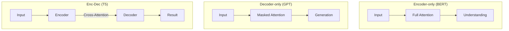

# ⚖️ Encoder vs. Decoder vs. Encoder-Decoder: Choosing the Right Transformer
> **Level:** Intermediate | **Language:** Hinglish | **Goal:** Master the three primary flavors of the Transformer architecture, understand their structural differences, and learn which one to use for specific AI tasks.

---

## 🧭 1. Beginner-Friendly Hinglish Explanation
Transformer architecture ek "Modular" design hai. Aap iske parts ko alag-alag tarah se jod kar alag-alag AI bana sakte hain.

1. **Encoder-only (The Reader):** Ye sirf sentence ko "Padhta" aur "Samajhta" hai. Ye poore sentence ko ek saath dekhta hai (Bi-directional).
   - **Analogy:** Ek scholar jo exam paper padh kar answer dhoondh raha hai. (BERT style).
2. **Decoder-only (The Writer):** Ye ek-ek karke word "Likhta" hai. Ye peeche nahi dekh sakta, sirf agla word predict karta hai (Auto-regressive).
   - **Analogy:** Ek writer jo kahani likh raha hai aur har naya word pichle words par depend karta hai. (GPT style).
3. **Encoder-Decoder (The Translator):** Ye pehle samajhta hai (Encoder) aur phir likhta hai (Decoder).
   - **Analogy:** Ek professional translator jo English sentence sunta hai aur Hindi mein bolta hai. (T5 / BART style).

Aaj kal ki duniya mein **Decoder-only** (GPT) sabse zyada popular hai, par complexity ke hisab se har ek ka apna role hai.

---

## 🧠 2. Deep Technical Explanation
The core difference lies in the **Attention Masking** and the **Input/Output flow**.

### 1. Encoder-only (Bi-directional)
- **Mechanism:** Every token can attend to every other token (Full Attention).
- **Goal:** Create a high-quality vector representation of the input.
- **Example:** BERT, RoBERTa.
- **Best for:** Classification, NER, Sentiment Analysis.

### 2. Decoder-only (Auto-regressive)
- **Mechanism:** Each token can ONLY attend to previous tokens. Future tokens are "Masked" during training.
- **Goal:** Predict the next token in a sequence.
- **Example:** GPT-3, GPT-4, Llama-3, Mistral.
- **Best for:** Text Generation, Chat, Coding.

### 3. Encoder-Decoder (Sequence-to-Sequence)
- **Mechanism:** An Encoder processes the input, and a Decoder generates the output. The Decoder also has **Cross-Attention** layers to look at the Encoder's final state.
- **Goal:** Map one sequence to another of a different length.
- **Example:** T5, BART, Original 2017 Transformer.
- **Best for:** Translation, Summarization, Question Answering.

---

## 🏗️ 3. Comparative Architecture Matrix
| Feature | Encoder (BERT) | Decoder (GPT) | Encoder-Decoder (T5) |
| :--- | :--- | :--- | :--- |
| **Attention Type** | Full (Bi-directional) | Masked (Causal) | Mixed |
| **Input processing** | All at once | Step-by-step | All-at-once $\to$ Step-by-step |
| **Primary Task** | Understanding | Generation | Transformation |
| **Hidden States** | One for each token | One for each token | Context Cross-Attention |
| **Training Objective**| Masked Language Model | Causal Language Model | Span Corruption / Denoising |

---

## 📐 4. Mathematical Intuition
- **Encoder Masking:** The attention matrix is full of non-zero values. All tokens $i$ can see all tokens $j$.
- **Decoder Masking:** The attention matrix is **Lower Triangular**. For token $i$, all values for $j > i$ are set to $-\infty$ before Softmax, making their attention weight $0$.
- **Cross-Attention:** In Encoder-Decoder models, the Decoder's Query ($Q$) comes from the decoder, but the Key ($K$) and Value ($V$) come from the Encoder's output. This is how the "Translation" connection is made.

---

## 📊 5. Architecture Flows (Diagram)


---

## 💻 6. Production-Ready Examples (Choosing the model in HuggingFace)
```python
# 2026 Pro-Tip: Match the model type to your task to save compute.
from transformers import AutoModelForSequenceClassification, AutoModelForCausalLM, AutoModelForSeq2SeqLM

# 1. Use Encoder for Sentiment (Fast & Accurate)
classifier = AutoModelForSequenceClassification.from_pretrained("bert-base-uncased")

# 2. Use Decoder for Chat (Generative)
generator = AutoModelForCausalLM.from_pretrained("gpt2")

# 3. Use Encoder-Decoder for Translation
translator = AutoModelForSeq2SeqLM.from_pretrained("t5-small")

# Note: Using GPT-4 for sentiment is like using a bazooka to kill a fly. 
# A small BERT is 100x cheaper and often better for that specific task.
```

---

## ❌ 7. Failure Cases
- **Using Decoder for Extraction:** Decoders are "Generative." If you ask a Decoder to extract a name, it might "hallucinate" a better-sounding name instead of the actual one. Encoders are strictly "Extractors."
- **Encoder for Long Conversations:** Encoders have a "Context Limit" and cannot generate long stories because they weren't trained to predict the next word sequentially.
- **Cross-Attention Overload:** In Encoder-Decoder models, if the input is too long, the cross-attention layer becomes a massive bottleneck.

---

## 🛠️ 8. Debugging Guide
- **Symptom:** Decoder output is gibberish/random words.
- **Check:** **Attention Mask**. Are you accidentally letting the model see the future during training?
- **Symptom:** Encoder-only model is very slow.
- **Check:** **Input Length**. Since it's $O(N^2)$, doubling the input sentence makes it $4x$ slower.

---

## ⚖️ 9. Tradeoffs
- **Decoder-only is the Winner (2026):** It turns out that if you make a Decoder-only model large enough (LLMs), it can do EVERYTHING (Translation, Extraction, Summarization) using just prompts. This is why the industry has shifted away from BERT/T5 towards GPT/Llama.
- **Compute Efficiency:** Encoder-only models are much smaller (100M-300M params) and can run on a single CPU, making them better for high-speed edge devices.

---

## 🛡️ 10. Security Concerns
- **Model Stealing:** Encoders are easier to steal via "Knowledge Distillation" because their outputs (embeddings) contain a lot of information about the internal representation of a sentence.

---

## 📈 11. Scaling Challenges
- **Training Stability:** Encoder-Decoder models are famously harder to train at massive scale compared to Decoder-only models, which is another reason why GPT-style is dominant.

---

## 💸 12. Cost Considerations
- **Serving Cost:** If you only need to classify emails, an Encoder-only model costs $\$0.001$ per 1000 emails. A GPT-4 API call costs $\$10.00$. Know the difference!

---

## ✅ 13. Best Practices
- **Classification $\to$ Encoder.**
- **Chat/Reasoning $\to$ Decoder.**
- **Strict Grammar Translation $\to$ Encoder-Decoder.**
- **Use "Instruction Fine-tuned" Decoders** if you want them to act like Encoders (e.g., Llama-3-Instruct).

---

## ⚠️ 14. Common Mistakes
- **Training a BERT from scratch:** Don't do it. Use RoBERTa or DeBERTa; they are improved versions of the original BERT.
- **Forgetting that Decoders are Autoregressive:** They generate words one-by-one, which is inherently slower than an Encoder which processes the whole sentence at once.

---

## 📝 15. Interview Questions
1. **"Why does BERT use Masked Language Modeling (MLM)?"** (Because it's Bi-directional and can't just predict the next word).
2. **"Difference between Causal Attention and Full Attention?"**
3. **"Why is GPT-4 a Decoder-only model?"** (Because next-token prediction is the most scalable way to learn world knowledge).

---

## 🚀 15. Latest 2026 Industry Patterns
- **Unified Models:** Models that can switch between Encoder and Decoder modes (like GLM-4) depending on the task.
- **Encoder-Head Decoders:** Using a massive Decoder-only LLM as a "Feature Extractor" for an Encoder-style task.
- **Prefix-Tuning:** A technique to make Decoder-only models act like Encoder-Decoders by prepending a "Task Vector" to the input.
