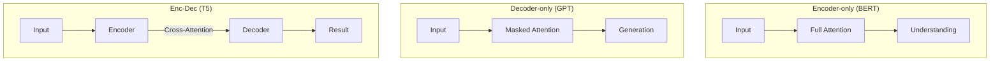

# ⚖️ Encoder vs. Decoder vs. Encoder-Decoder: Choosing the Right Transformer
> **Level:** Intermediate | **Language:** Hinglish | **Goal:** Transformer architecture ke teen primary flavors ko master karein, unke structural differences ko samjhein, aur seekhein ki specific AI tasks ke liye kaunsa use karna hai.

---

## 🧭 1. Beginner-Friendly Hinglish Explanation
Transformer architecture ek "Modular" design hai. Aap iske parts ko alag-alag tarah se jod kar alag-alag AI bana sakte hain.

1. **Encoder-only (The Reader):** Ye sirf sentence ko "Padhta" aur "Samajhta" hai. Ye poore sentence ko ek saath dekhta hai (Bi-directional).
   - **Analogy:** Ek scholar jo exam paper padh kar answer dhoondh raha hai. (BERT style).
2. **Decoder-only (The Writer):** Ye ek-ek karke word "Likhta" hai. Ye peeche nahi dekh sakta, sirf agla word predict karta hai (Auto-regressive).
   - **Analogy:** Ek writer jo kahani likh raha hai aur har naya word pichle words par depend karta hai. (GPT style).
3. **Encoder-Decoder (The Translator):** Ye pehle samajhta hai (Encoder) aur phir likhta hai (Decoder).
   - **Analogy:** Ek professional translator jo English sentence sunta hai aur Hindi mein bolta hai. (T5 / BART style).

Aaj kal ki duniya mein **Decoder-only** (GPT) sabse zyada popular hai, par complexity ke hisab se har ek ka apna role hai.

---

## 🧠 2. Deep Technical Explanation
Core difference **Attention Masking** aur **Input/Output flow** me hota hai.

### 1. Encoder-only (Bi-directional)
- **Mechanism:** Har token dusre har token par attend kar sakta hai (Full Attention).
- **Goal:** Input ka ek high-quality vector representation create karna.
- **Example:** BERT, RoBERTa.
- **Best for:** Classification, NER, Sentiment Analysis.

### 2. Decoder-only (Auto-regressive)
- **Mechanism:** Har token ONLY previous tokens par hi attend kar sakta hai. Future tokens training ke dauran "Masked" rehte hain.
- **Goal:** Sequence me agle token ko predict karna.
- **Example:** GPT-3, GPT-4, Llama-3, Mistral.
- **Best for:** Text Generation, Chat, Coding.

### 3. Encoder-Decoder (Sequence-to-Sequence)
- **Mechanism:** Encoder input ko process karta hai, aur Decoder output ko generate karta hai. Decoder me Encoder ke final state ko dekhne ke liye **Cross-Attention** layers bhi hoti hain.
- **Goal:** Ek sequence ko kisi different length ki dusri sequence me map karna.
- **Example:** T5, BART, Original 2017 Transformer.
- **Best for:** Translation, Summarization, Question Answering.

---

## 🏗️ 3. Comparative Architecture Matrix
| Feature (Lakshan) | Encoder (BERT) | Decoder (GPT) | Encoder-Decoder (T5) |
| :--- | :--- | :--- | :--- |
| **Attention Type** | Full (Bi-directional) | Masked (Causal) | Mixed |
| **Input processing** | Ek sath (All at once) | Step-by-step | Ek sath $\to$ Step-by-step |
| **Primary Task** | Understanding | Generation | Transformation |
| **Hidden States** | Har token ke liye ek | Har token ke liye ek | Context Cross-Attention |
| **Training Objective**| Masked Language Model | Causal Language Model | Span Corruption / Denoising |

---

## 📐 4. Mathematical Intuition
- **Encoder Masking:** Attention matrix non-zero values se bhara hota hai. Sabhi tokens $i$ sabhi tokens $j$ ko dekh sakte hain.
- **Decoder Masking:** Attention matrix **Lower Triangular** hota hai. Token $i$ ke liye, Softmax se pehle $j > i$ ki sabhi values ko $-\infty$ set kiya jata hai, jisse unka attention weight $0$ ho jata hai.
- **Cross-Attention:** Encoder-Decoder models me, Decoder ki Query ($Q$) decoder se aati hai, par Key ($K$) aur Value ($V$) Encoder ke output se aati hain. Is tarah "Translation" connection banta hai.

---

## 📊 5. Architecture Flows (Diagram)

```mermaid
graph TD
    subgraph "Encoder-only (BERT)"
    E[Input] --> EA[Full Attention] --> ER[Understanding]
    end
    
    subgraph "Decoder-only (GPT)"
    D[Input] --> DA[Masked Attention] --> DR[Generation]
    end
    
    subgraph "Enc-Dec (T5)"
    T1[Input] --> T2[Encoder]
    T2 -- Cross-Attention --> T3[Decoder]
    T3 --> T4[Result]
    end
```

---

## 💻 6. Production-Ready Examples (Choosing the model in HuggingFace)
```python
# 2026 Pro-Tip: Compute save karne ke liye model type ko apne task se match karein.
from transformers import AutoModelForSequenceClassification, AutoModelForCausalLM, AutoModelForSeq2SeqLM

# 1. Sentiment ke liye Encoder ka use karein (Fast & Accurate)
classifier = AutoModelForSequenceClassification.from_pretrained("bert-base-uncased")

# 2. Chat ke liye Decoder ka use karein (Generative)
generator = AutoModelForCausalLM.from_pretrained("gpt2")

# 3. Translation ke liye Encoder-Decoder ka use karein
translator = AutoModelForSeq2SeqLM.from_pretrained("t5-small")

# Note: Sentiment ke liye GPT-4 ka use karna makkhi marne ke liye top (bazooka) chalane jaisa hai. 
# Ek chota BERT 100x sasta hai aur aksar is specific task ke liye behtar hota hai.
```

---

## ❌ 7. Failure Cases
- **Using Decoder for Extraction:** Decoders \"Generative\" hote hain. Agar aap Decoder se koi name extract karne ko kahenge, toh wo actual name ke bajaye koi achha sunai dene wala name \"hallucinate\" kar sakta hai. Encoders strictly \"Extractors\" hote hain.
- **Encoder for Long Conversations:** Encoders ki ek "Context Limit" hoti hai aur wo lambi stories generate nahi kar sakte kyunki unhe sequentially agle word ko predict karne ke liye train nahi kiya gaya tha.
- **Cross-Attention Overload:** Encoder-Decoder models me, agar input bahut long ho, toh cross-attention layer ek bada bottleneck ban jati hai.

---

## 🛠️ 8. Debugging Guide
- **Symptom:** Decoder output completely gibberish/random words hai.
- **Check:** **Attention Mask**. Kya aap training ke dauran galti se model ko future dekhne de rahe hain?
- **Symptom:** Encoder-only model bahut slow hai.
- **Check:** **Input Length**. Kyunki ye $O(N^2)$ hai, input sentence ko double karne se ye $4x$ slow ho jata hai.

---

## ⚖️ 9. Tradeoffs
- **Decoder-only is the Winner (2026):** Pata chala hai ki agar aap kisi Decoder-only model ko kafi bada (LLMs) bana dete hain, toh wo sirf prompts ka use karke SAB KUCH (Translation, Extraction, Summarization) kar sakta hai. Yahi reason hai ki industry BERT/T5 se shift hokar GPT/Llama ki taraf chali gayi hai.
- **Compute Efficiency:** Encoder-only models bahut chote hote hain (100M-300M params) aur single CPU par bhi run ho sakte hain, jo inhe high-speed edge devices ke liye behtar banata hai.

---

## 🛡️ 10. Security Concerns
- **Model Stealing:** "Knowledge Distillation" ke through Encoders ko churna (steal) easy hota hai kyunki unke outputs (embeddings) me sentence ke internal representation ke baare me bahut saari information hoti hai.

---

## 📈 11. Scaling Challenges
- **Training Stability:** Decoder-only models ke comparison me, Encoder-Decoder models ko massive scale par train karna kafi mushkil hota hai, jo GPT-style ke dominant hone ka ek aur reason hai.

---

## 💸 12. Cost Considerations
- **Serving Cost:** Agar aapko sirf emails classify karne hain, toh ek Encoder-only model ki cost $\$0.001$ per 1000 emails hoti hai. Jabki GPT-4 API call ki cost $\$10.00$ hoti hai. Difference ko samajhein!

---

## ✅ 13. Best Practices
- **Classification $\to$ Encoder.**
- **Chat/Reasoning $\to$ Decoder.**
- **Strict Grammar Translation $\to$ Encoder-Decoder.**
- **Agar aap chahte hain ki Decoders, Encoders ki tarah act karein toh **"Instruction Fine-tuned" Decoders** ka use karein (e.g., Llama-3-Instruct).

---

## ⚠️ 14. Common Mistakes
- **Training a BERT from scratch:** Aisa na karein. RoBERTa ya DeBERTa ka use karein; ye original BERT ke improved versions hain.
- **Forgetting that Decoders are Autoregressive:** Ye bhool jana ki Decoders Autoregressive hote hain. Wo one-by-one words generate karte hain, jo inherently us Encoder se slow hai jo poore sentence ko ek sath process karta hai.

---

## 📝 15. Interview Questions
1. **"BERT, Masked Language Modeling (MLM) kyun use karta hai?"** (Kyunki ye Bi-directional hai aur sirf agle word ko predict nahi kar sakta).
2. **"Causal Attention aur Full Attention me kya difference hai?"**
3. **"GPT-4 ek Decoder-only model kyun hai?"** (Kyunki next-token prediction world knowledge ko learn karne ka sabse scalable tarika hai).

---

## 🚀 16. Latest 2026 Industry Patterns
- **Unified Models:** Models that can switch between Encoder and Decoder modes (like GLM-4) depending on the task.
- **Encoder-Head Decoders:** Using a massive Decoder-only LLM as a "Feature Extractor" for an Encoder-style task.
- **Prefix-Tuning:** A technique to make Decoder-only models act like Encoder-Decoders by prepending a "Task Vector" to the input.
