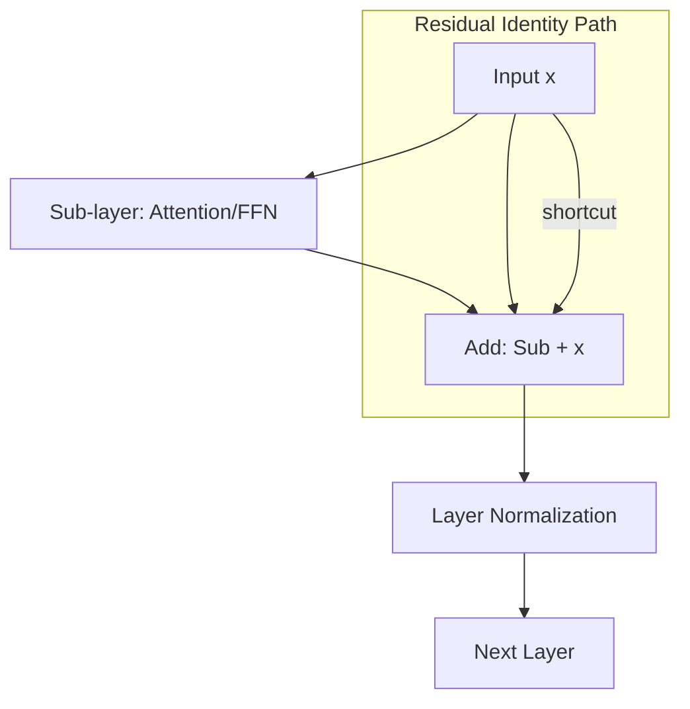

# ⚖️ Layer Normalization and Residuals: The Stabilizers of Deep AI
> **Level:** Advanced | **Language:** Hinglish | **Goal:** Master the techniques that enable training of hundreds of Transformer layers without collapsing, covering the intuition behind Residual Connections (Add) and the mathematics of LayerNorm.

---

## 🧭 1. Beginner-Friendly Hinglish Explanation
Deep Learning mein jab hum bahut saari layers (jaise 100+) jodte hain, toh do badi mushkilein aati hain:
1. **Vanishing Gradients:** Signal peeche jaate-jaate khatam ho jata hai.
2. **Internal Covariate Shift:** Har layer data ko itna change kar deti hai ki agli layer "Confuse" ho jati hai.

Transformer ne do "Superpowers" use kiye:
- **Residual Connections (The Shortcut):** Ye ek "High-way" hai. Agar ek layer kuch galat seekh rahi hai, toh signal shortcut se bina change hue aage nikal sakta hai. (Aapne dekha hoga: `Add & Norm`).
- **Layer Normalization (The Scale):** Ye har layer ke output ko "Standardize" karta hai (Mean 0, Variance 1). Ye bilkul waise hi hai jaise har gaane ko same "Volume" par set karna taaki listener ko baar-baar volume kam-zyada na karna padhe.

Inki wajah se hi hum **GPT-4** jaise giant models bana paaye hain.

---

## 🧠 2. Deep Technical Explanation
Residual Connections and LayerNorm are essential for optimization stability in deep networks.

### 1. Residual Connections (Skip Connections):
Instead of learning a direct mapping $H(x)$, the layer learns the **Residual** $F(x) = H(x) - x$. The final output is $y = F(x) + x$.
- **Why?** It ensures that the gradient can flow directly through the "identity" path ($+x$) without being multiplied by small weights. This solves the **Vanishing Gradient** problem.

### 2. Layer Normalization (LayerNorm):
Unlike Batch Normalization (which normalizes across the batch), LayerNorm normalizes across the **Features** for each individual sample.
- **Formula:** 
  $$\hat{x} = \frac{x - \mu}{\sqrt{\sigma^2 + \epsilon}} \cdot \gamma + \beta$$
- **Why?** It makes the model independent of the batch size and ensures that the hidden states remain within a healthy numerical range.

---

## 🏗️ 3. Normalization Strategy Matrix
| Feature | Batch Norm | Layer Norm | RMSNorm (2026 Standard) |
| :--- | :--- | :--- | :--- |
| **Normalization Axis**| Batch | Features | Features (Root Mean Square) |
| **Batch Size Dep.** | High (Bad for small batches)| Zero (Excellent) | Zero (Fastest) |
| **Best For** | CNNs / Images | Transformers / NLP | LLMs (Llama, Gemma) |
| **Parameters** | $\gamma, \beta$ | $\gamma, \beta$ | $\gamma$ only (No bias) |

---

## 📐 4. Mathematical Intuition
- **The Gradients of Residuals:** 
  $\frac{\partial y}{\partial x} = \frac{\partial F(x)}{\partial x} + 1$. 
  The "$+1$" term is the hero. Even if the derivative of the layer $\frac{\partial F}{\partial x}$ is zero, the gradient is still at least $1$. Information NEVER dies.
- **LayerNorm vs. Batch项目Norm:** In NLP, sentence lengths vary. Normalizing across the batch (Batch项目Norm) is messy because of padding. LayerNorm is local to the sentence, making it much more robust for text.

---

## 📊 5. Add & Norm Flow (Diagram)


---

## 💻 6. Production-Ready Examples (LayerNorm & RMSNorm)
```python
# 2026 Pro-Tip: Use RMSNorm for faster inference in large models.
import torch
import torch.nn as nn

# 1. Standard LayerNorm (Used in GPT-2, BERT)
ln = nn.LayerNorm(512)
x = torch.randn(2, 10, 512)
out_ln = ln(x)

# 2. RMSNorm (Modern Llama implementation - Faster!)
class RMSNorm(nn.Module):
    def __init__(self, dim, eps=1e-6):
        super().__init__()
        self.eps = eps
        self.weight = nn.Parameter(torch.ones(dim))

    def forward(self, x):
        # Only normalize by the Root Mean Square (No Mean subtraction)
        norm_x = x * torch.rsqrt(x.pow(2).mean(-1, keepdim=True) + self.eps)
        return norm_x * self.weight

rmsn = RMSNorm(512)
out_rms = rmsn(x)
```

---

## ❌ 7. Failure Cases
- **Internal Overflow:** If you don't use Normalization, the hidden states will grow exponentially ($1, 10, 100, 1000...$) until they become `NaN`.
- **Vanishing Identity:** If you accidentally multiply the residual by a small number (e.g., $0.1 \cdot x + F(x)$), you destroy the vanishing gradient protection.
- **Post-Norm Instability:** Original Transformer used `Norm(x + F(x))`. This is unstable for large models. **Fix:** Use **Pre-Norm** `x + F(Norm(x))`.

---

## 🛠️ 8. Debugging Guide
- **Symptom:** Training works for 5 layers but fails for 50 layers.
- **Check:** **Residual Connections**. Did you forget the `+ x` at every block?
- **Symptom:** Weights are becoming `NaN`.
- **Check:** **LayerNorm Epsilon**. Ensure you have a small constant (e.g., $1e-5$) in the denominator to avoid division by zero.

---

## ⚖️ 9. Tradeoffs
- **Pre-Norm vs. Post-Norm:** 
  - Pre-Norm: Easier to train, more stable.
  - Post-Norm: Harder to train but can achieve slightly higher accuracy if you get it right.
- **LayerNorm vs. RMSNorm:** RMSNorm is $10-40\%$ faster and achieves nearly identical results.

---

## 🛡️ 10. Security Concerns
- **Numerical Instability Attack:** Providing inputs with extremely large values that "Saturate" the LayerNorm, causing the model to output constant values or crash (Denial of Service).

---

## 📈 11. Scaling Challenges
- **Precision:** When using FP16, the "Sum of Squares" inside LayerNorm can easily overflow $65,504$ (the max for FP16). This is why 2026 models use **BFloat16** or specialized kernels.

---

## 💸 12. Cost Considerations
- **RMSNorm saves compute:** By removing the "Mean" calculation, it reduces the number of operations per layer, saving millions of dollars at the scale of GPT-4 training.

---

## ✅ 13. Best Practices
- **Default to Pre-Norm:** Almost every modern LLM uses it.
- **Use RMSNorm:** For any new model you are building in 2026.
- **High Epsilon:** Use $1e-5$ or $1e-6$ for numerical stability.

---

## ⚠️ 14. Common Mistakes
- **Applying LayerNorm to the Batch axis:** This is Batch Norm, not Layer Norm.
- **Normalizing the target labels:** Never normalize your output classes.

---

## 📝 15. Interview Questions
1. **"Why is LayerNorm preferred over Batch Norm in Transformers?"** (Sequence length variance and batch size independence).
2. **"How do Residual Connections solve the vanishing gradient problem?"**
3. **"What is the 'Pre-Norm' vs 'Post-Norm' debate?"**

---

## 🚀 15. Latest 2026 Industry Patterns
- **Parallel Layers:** Instead of `Norm -> Attn -> Norm -> FFN`, some models run Attention and FFN in parallel to save time.
- **Adaptive Normalization:** Layers that learn whether they need to be normalized or not depending on the input context.
- **DeepNorm:** A new initialization technique that allows Post-Norm to be as stable as Pre-Norm, getting the best of both worlds.
