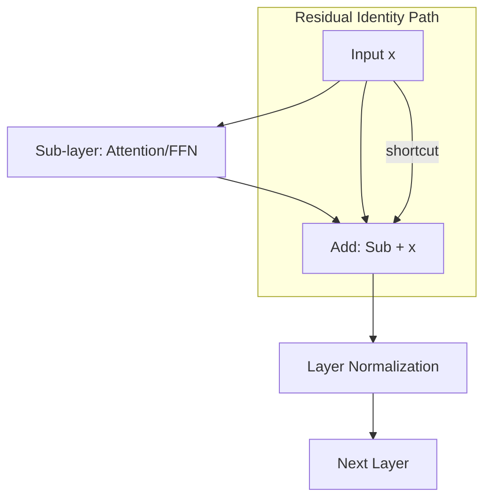

# ⚖️ Layer Normalization and Residuals: The Stabilizers of Deep AI
> **Level:** Advanced | **Language:** Hinglish | **Goal:** Bina collapse huye hundreds of Transformer layers ko train karne wali techniques ko master karein, jisme Residual Connections (Add) ke peeche ki intuition aur LayerNorm ki mathematics shamil hain.

---

## 🧭 1. Beginner-Friendly Hinglish Explanation
Deep Learning mein jab hum bahut saari layers (jaise 100+) jodte hain, toh do badi mushkilein aati hain:
1. **Vanishing Gradients:** Signal peeche jaate-jaate khatam ho jata hai.
2. **Internal Covariate Shift:** Har layer data ko itna change kar deti hai ki agli layer "Confuse" ho jati hai.

Transformer ne do "Superpowers" use kiye:
- **Residual Connections (The Shortcut):** Ye ek "High-way" hai. Agar ek layer kuch galat seekh rahi hai, toh signal shortcut se bina change hue aage nikal sakta hai. (Aapne dekha hoga: `Add & Norm`).
- **Layer Normalization (The Scale):** Ye har layer ke output ko "Standardize" karta hai (Mean 0, Variance 1). Ye bilkul waise hi hai jaise har gaane ko same "Volume" par set karna taaki listener ko baar-baar volume kam-zyada na karna padhe.

Inki wajah se hi hum **GPT-4** jaise giant models bana paaye hain.

---

## 🧠 2. Deep Technical Explanation
Residual Connections aur LayerNorm deep networks me optimization stability ke liye essential hain.

### 1. Residual Connections (Skip Connections):
Direct mapping $H(x)$ seekhne ke bajaye, layer **Residual** $F(x) = H(x) - x$ ko learn karti hai. Final output $y = F(x) + x$ hota hai.
- **Why?** Ye ensure karta hai ki gradient bina small weights se multiply hue directly "identity" path ($+x$) se flow kar sake. Ye **Vanishing Gradient** problem ko solve karta hai.

### 2. Layer Normalization (LayerNorm):
Batch Normalization (jo batch ke across normalize karta hai) ke opposite, LayerNorm har ek individual sample ke liye **Features** ke across normalize karta hai.
- **Formula:** 
  $$\hat{x} = \frac{x - \mu}{\sqrt{\sigma^2 + \epsilon}} \cdot \gamma + \beta$$
- **Why?** Ye model ko batch size se independent banata hai aur ensure karta hai ki hidden states ek healthy numerical range ke andar rahein.

---

## 🏗️ 3. Normalization Strategy Matrix
| Feature (Lakshan) | Batch Norm | Layer Norm | RMSNorm (2026 Standard) |
| :--- | :--- | :--- | :--- |
| **Normalization Axis**| Batch | Features | Features (Root Mean Square) |
| **Batch Size Dep.** | High (small batches ke liye bad)| Zero (Excellent) | Zero (Fastest) |
| **Best For** | CNNs / Images | Transformers / NLP | LLMs (Llama, Gemma) |
| **Parameters** | $\gamma, \beta$ | $\gamma, \beta$ | $\gamma$ only (No bias) |

---

## 📐 4. Mathematical Intuition
- **The Gradients of Residuals:** 
  $$\frac{\partial y}{\partial x} = \frac{\partial F(x)}{\partial x} + 1$$ 
  Yahan "$+1$" term hi hero hai. Agar layer ka derivative $\frac{\partial F}{\partial x}$ zero bhi ho jaye, toh bhi gradient kam se kam $1$ rehta hai. Information KABHI khatam nahi hoti.
- **LayerNorm vs. BatchNorm:** NLP me sentence lengths vary karti hain. Padding ki wajah se batch ke across normalize karna (BatchNorm) messy hota hai. LayerNorm sentence ke liye local hota hai, jo ise text ke liye bahut zyada robust banata hai.

---

## 📊 5. Add & Norm Flow (Diagram)

```mermaid
graph TD
    X[Input x] --> Sub[Sub-layer: Attention/FFN]
    Sub --> Add[Add: Sub + x]
    X --> Add
    Add --> Norm[Layer Normalization]
    Norm --> Next[Next Layer]
    
    subgraph "Residual Identity Path"
    X -- shortcut --> Add
    end
```

---

## 💻 6. Production-Ready Examples (LayerNorm & RMSNorm)
```python
# 2026 Pro-Tip: Large models me faster inference ke liye RMSNorm ka use karein.
import torch
import torch.nn as nn

# 1. Standard LayerNorm (GPT-2, BERT me use hota hai)
ln = nn.LayerNorm(512)
x = torch.randn(2, 10, 512)
out_ln = ln(x)

# 2. RMSNorm (Modern Llama implementation - Faster!)
class RMSNorm(nn.Module):
    def __init__(self, dim, eps=1e-6):
        super().__init__()
        self.eps = eps
        self.weight = nn.Parameter(torch.ones(dim))

    def forward(self, x):
        # Sirf Root Mean Square se normalize karein (Koi Mean subtraction nahi)
        norm_x = x * torch.rsqrt(x.pow(2).mean(-1, keepdim=True) + self.eps)
        return norm_x * self.weight

rmsn = RMSNorm(512)
out_rms = rmsn(x)
```

---

## ❌ 7. Failure Cases
- **Internal Overflow:** Agar aap Normalization ka use nahi karte hain, toh hidden states exponentially grow karengi ($1, 10, 100, 1000...$) jab tak ki wo `NaN` na ban jayein.
- **Vanishing Identity:** Agar aap galti se residual ko kisi small number se multiply kar dete hain (e.g., $0.1 \cdot x + F(x)$), toh aap vanishing gradient protection ko destroy kar dete hain.
- **Post-Norm Instability:** Original Transformer `Norm(x + F(x))` use karta tha. Large models ke liye ye unstable hai. **Fix:** **Pre-Norm** `x + F(Norm(x))` ka use karein.

---

## 🛠️ 8. Debugging Guide
- **Symptom:** Training 5 layers ke liye toh chal rahi hai par 50 layers ke liye fail ho jati hai.
- **Check:** **Residual Connections**. Did you forget the `+ x` at every block?
- **Symptom:** Weights `NaN` ho rahe hain.
- **Check:** **LayerNorm Epsilon**. Division by zero se bachne ke liye denominator me ek small constant (e.g., $1e-5$) ensure karein.

---

## ⚖️ 9. Tradeoffs
- **Pre-Norm vs. Post-Norm:** 
  - Pre-Norm: Train karne me easy hai, aur zyada stable hai.
  - Post-Norm: Train karna kafi difficult hai par agar sahi se kiya jaye toh ye slightly higher accuracy achieve kar sakta hai.
- **LayerNorm vs. RMSNorm:** RMSNorm $10-40\%$ fast hai aur lagbhag identical results achieve karta hai.

---

## 🛡️ 10. Security Concerns
- **Numerical Instability Attack:** Aise inputs provide karna jinme extremely large values hon jo LayerNorm ko "Saturated" kar dein, jisse model constant values output karne lagta hai ya crash ho jata hai (Denial of Service).

---

## 📈 11. Scaling Challenges
- **Precision:** FP16 ka use karte waqt, LayerNorm ke andar "Sum of Squares" easily $65,504$ (FP16 ke liye maximum limit) ko overflow kar sakta hai. Yahi reason hai ki 2026 ke models **BFloat16** ya specialized kernels ka use karte hain.

---

## 💸 12. Cost Considerations
- **RMSNorm saves compute:** "Mean" calculation ko remove karke, ye per layer operations ke number ko reduce karta hai, jisse GPT-4 training ke scale par millions of dollars save hote hain.

---

## ✅ 13. Best Practices
- **Default to Pre-Norm:** Lagbhag har modern LLM ise use karta hai.
- **Use RMSNorm:** 2026 me aap jo bhi new model bana rahe hain uske liye iska use karein.
- **High Epsilon:** Numerical stability ke liye $1e-5$ ya $1e-6$ ka use karein.

---

## ⚠️ 14. Common Mistakes
- **Applying LayerNorm to the Batch axis:** Ye Batch Norm hai, Layer Norm nahi.
- **Normalizing the target labels:** Apne output classes ko kabhi normalize na karein.

---

## 📝 15. Interview Questions
1. **"Transformers me Batch Norm ke upar LayerNorm ko kyun prefer kiya jata hai?"** (Sequence length variance aur batch size independence).
2. **"Residual Connections vanishing gradient problem ko kaise solve karte hain?"**
3. **" 'Pre-Norm' vs 'Post-Norm' debate kya hai?"**

---

## 🚀 16. Latest 2026 Industry Patterns
- **Parallel Layers:** Instead of `Norm -> Attn -> Norm -> FFN`, some models run Attention and FFN in parallel to save time.
- **Adaptive Normalization:** Layers that learn whether they need to be normalized or not depending on the input context.
- **DeepNorm:** A new initialization technique that allows Post-Norm to be as stable as Pre-Norm, getting the best of both worlds.
