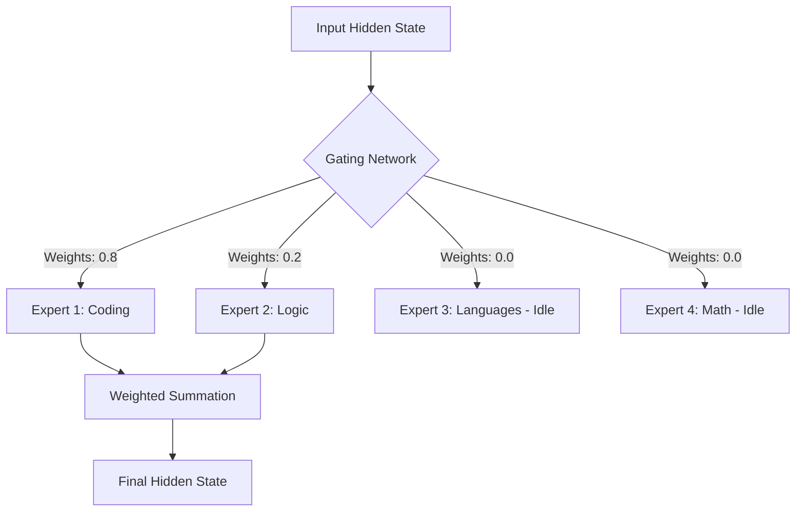

# 🧠 Mixture of Experts (MoE): The Sparse Intelligence
> **Level:** Advanced | **Language:** Hinglish | **Goal:** Master the architecture behind models like Mixtral and GPT-4, exploring how Sparsity, Gating, and Expert Specialization allow for massive model capacity with low computational cost in 2026.

---

## 🧭 1. Beginner-Friendly Hinglish Explanation
Normal LLM ek giant "Brain" ki tarah hota hai. Jab aap koi sawal puchte hain, toh poora brain (saare parameters) activate hota hai. Ye bahut mahanga aur slow hai.

**Mixture of Experts (MoE)** ka matlab hai "Specialists ki team."
- Sochiye ek Hospital hai jahan har tarah ke doctors hain (Cardiologist, Neurologist, etc.). 
- Agar aapke pet mein dard hai, toh pura hospital aapko check nahi karta. Sirf ek "Receptionist" (Gating Network) decide karta hai ki aapko kis doctor (Expert) ke paas bhejna hai.
- Iska fayda? Aapke paas total parameters toh bahut hain (e.g., 8 Experts), par ek waqt par sirf 2 activate hote hain.
- **MoE models** bade hote hain (capacity mein), par unhe chalane ka kharcha chote models jitna hi hota hai.

---

## 🧠 2. Deep Technical Explanation
MoE replaces the standard **Feed-Forward Network (FFN)** layer with a sparse MoE layer.

### 1. The Gating Network (Router):
- It takes the input hidden state $x$ and calculates a probability distribution across $N$ experts.
- Usually, it uses **Top-K Routing** (e.g., Top-2). Only the two experts with the highest score process the token.
- $$G(x) = \text{Softmax}(\text{KeepTopK}(H(x)))$$ where $H(x)$ is a simple linear layer.

### 2. The Experts:
- Each expert is an independent FFN. 
- They don't share weights. Over time, experts naturally "Specialize" (e.g., one expert becomes good at Python, another at French).

### 3. MoE Output:
- The final output is a weighted sum of the selected experts' outputs.
- $$y = \sum_{i=1}^{k} G(x)_i E_i(x)$$

---

## 🏗️ 3. Dense vs. Sparse (MoE) Architecture
| Feature | Dense Model (Llama-3) | Sparse Model (Mixtral) |
| :--- | :--- | :--- |
| **Parameters** | 70B Total / 70B Active | 141B Total / 12B Active |
| **Compute Cost** | High | Low (Equivalent to active params) |
| **Memory (VRAM)** | High | **Extreme** (Must load ALL experts) |
| **Training Complexity** | Standard | High (Load balancing is hard) |

---

## 📐 4. Mathematical Intuition
- **The Expert Capacity Factor:**
  If you have 8 experts and each token picks 2, you expect a load of $25\%$ per expert. But if all tokens pick the "Smartest" expert, the others sit idle.
- **Load Balancing Loss:**
  To prevent "Expert Collapse," we add a secondary loss function during training that penalizes the model if it doesn't distribute tokens evenly across all experts.

---

## 📊 5. MoE Layer Architecture (Diagram)


---

## 💻 6. Production-Ready Examples (Conceptual MoE Logic in PyTorch)
```python
# 2026 Pro-Tip: MoE is all about the Router.

import torch
import torch.nn as nn

class MoELayer(nn.Module):
    def __init__(self, num_experts, d_model):
        super().__init__()
        self.router = nn.Linear(d_model, num_experts)
        self.experts = nn.ModuleList([nn.Sequential(
            nn.Linear(d_model, d_model * 4),
            nn.ReLU(),
            nn.Linear(d_model * 4, d_model)
        ) for _ in range(num_experts)])

    def forward(self, x):
        # 1. Get routing scores
        logits = self.router(x)
        # 2. Pick Top-2 Experts
        scores, indices = torch.topk(logits, k=2, dim=-1)
        scores = torch.softmax(scores, dim=-1)
        
        # 3. Combine expert outputs
        final_output = torch.zeros_like(x)
        for i in range(2):
            expert_idx = indices[:, i]
            expert_weight = scores[:, i].unsqueeze(-1)
            # In production, we use optimized kernels to avoid this loop
            final_output += expert_weight * self.experts[expert_idx](x)
            
        return final_output
```

---

## ❌ 7. Failure Cases
- **Expert Collapse:** 99% of tokens go to Expert 1. The model becomes a small dense model and loses its "Swarm Intelligence."
- **Communication Bottleneck:** In distributed MoE, experts are on different GPUs. Moving tokens between GPUs for every layer can be very slow.
- **VRAM Explosion:** A 141B MoE model needs a lot of VRAM to store the weights, even if only 12B are used per token.

---

## 🛠️ 8. Debugging Guide
- **Symptom:** Training loss is not decreasing.
- **Check:** **Router Balance**. Check the "Expert Utilization" stats. If utilization is skewed, increase the `auxiliary_loss` weight.
- **Symptom:** Inference is slower than a dense model of the same active size.
- **Check:** **Memory Bandwidth**. Loading experts from VRAM is the bottleneck. Use **Quantization**.

---

## ⚖️ 9. Tradeoffs
- **Active vs. Total Parameters:** More total params = better world knowledge. Fewer active params = faster generation.
- **Router Complexity:** A complex router is more accurate but adds latency to every single layer.

---

## 🛡️ 10. Security Concerns
- **Routing Leakage:** By observing which experts are activated for a specific prompt, an attacker can sometimes guess the "Internal logic" or "Hidden filters" of the model.

---

## 📈 11. Scaling Challenges
- **Expert Parallelism:** How to split 64 experts across 8 GPUs? Usually, we put 8 experts per GPU. If a token needs an expert on another GPU, it must travel across the network (NVLink).

---

## 💸 12. Cost Considerations
- **Training:** MoE is $3x-5x$ more efficient to train for the same level of performance as a dense model.
- **Serving:** Serving is cheap (low FLOPs) but requires lots of memory (High VRAM cost).

---

## ✅ 13. Best Practices
- **Fine-grained Experts:** 2026 models use many small experts (e.g., 64 or 128) instead of 8 large ones for better specialization.
- **Expert Dropping:** In high-traffic systems, if an expert is too busy, "drop" the token or send it to the next best expert to maintain latency.

---

## ⚠️ 14. Common Mistakes
- **Applying MoE to Attention:** Usually, MoE is only for FFN layers. Applying it to Attention is much harder and often less effective.
- **Ignoring Inference RAM:** Don't forget that you need to fit the WHOLE model in VRAM, not just the active parts.

---

## 📝 15. Interview Questions
1. **"What is the role of the Gating Network in MoE?"**
2. **"Why does MoE need an Auxiliary Loss during training?"**
3. **"How does MoE improve the 'Performance per Dollar' for LLM providers?"**

---

## 🚀 15. Latest 2026 Industry Patterns
- **DeepSeek-style MoE:** Using "Shared Experts" (experts that process every token) combined with "Routed Experts" for maximum stability.
- **Dynamic Routing:** Routers that change their "K" (number of experts) based on the difficulty of the token. (Easy tokens = 1 expert, Hard tokens = 4 experts).
- **Asynchronous Expert Loading:** Loading the next layer's experts while the current layer is still calculating.
