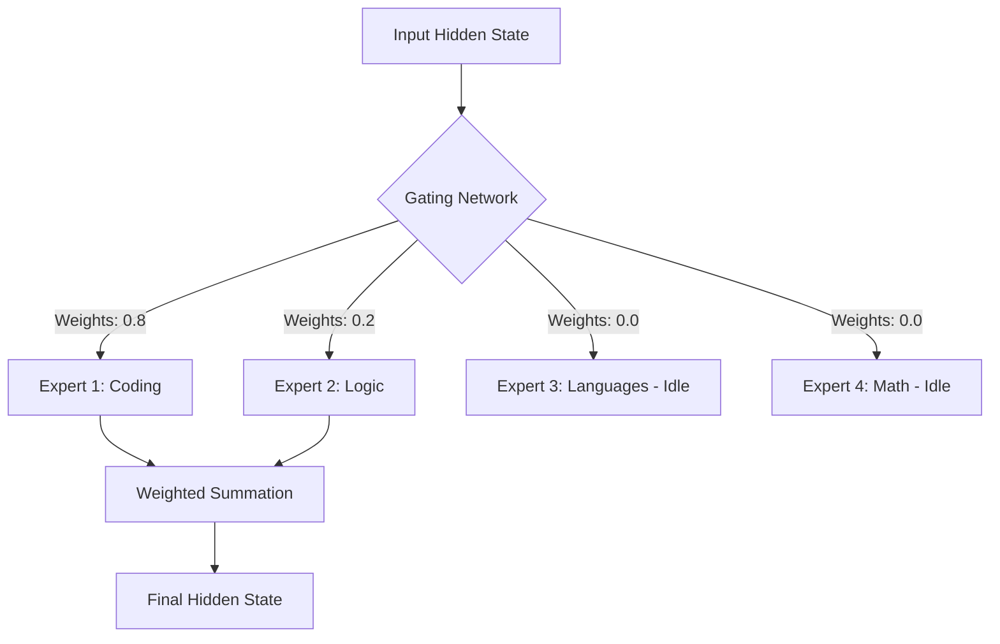

# 🧠 Mixture of Experts (MoE): The Sparse Intelligence
> **Level:** Advanced | **Language:** Hinglish | **Goal:** Mixtral aur GPT-4 jaise models ke peeche ke architecture ko master karein, aur explore karein ki kaise Sparsity, Gating, aur Expert Specialization 2026 mein low computational cost ke sath massive model capacity allow karte hain.

---

## 🧭 1. Beginner-Friendly Hinglish Explanation
Normal LLM ek giant "Brain" ki tarah hota hai. Jab aap koi sawal puchte hain, toh poora brain (saare parameters) activate hota hai. Ye bahut mahanga aur slow hai.

**Mixture of Experts (MoE)** ka matlab hai "Specialists ki team."
- Sochiye ek Hospital hai jahan har tarah ke doctors hain (Cardiologist, Neurologist, etc.). 
- Agar aapke pet mein dard hai, toh pura hospital aapko check nahi karta. Sirf ek "Receptionist" (Gating Network) decide karta hai ki aapko kis doctor (Expert) ke paas bhejna hai.
- Iska fayda? Aapke paas total parameters toh bahut hain (e.g., 8 Experts), par ek waqt par sirf 2 activate hote hain.
- **MoE models** bade hote hain (capacity mein), par unhe chalane ka kharcha chote models jitna hi hota hai.

---

## 🧠 2. Deep Technical Explanation
MoE standard **Feed-Forward Network (FFN)** layer ko ek sparse MoE layer se replace karta hai.

### 1. The Gating Network (Router):
- Ye input hidden state $x$ leta hai aur $N$ experts ke across probability distribution calculate karta hai.
- Usually, ye **Top-K Routing** (e.g., Top-2) ka use karta hai. Sirf wahi do experts token ko process karte hain jinka score highest hota hai.
- $$G(x) = \text{Softmax}(\text{KeepTopK}(H(x)))$$ jahan $H(x)$ ek simple linear layer hai.

### 2. The Experts (Experts):
- Har ek expert ek independent FFN hota hai. 
- Wo weights share nahi karte. Time ke sath, experts naturally "Specialize" ho jate hain (e.g., ek expert Python me achha ho jata hai, dusra French me).

### 3. MoE Output (MoE Output):
- Final output selected experts ke outputs ka weighted sum hota hai.
- $$y = \sum_{i=1}^{k} G(x)_i E_i(x)$$

---

## 🏗️ 3. Dense vs. Sparse (MoE) Architecture
| Feature (Lakshan) | Dense Model (Llama-3) | Sparse Model (Mixtral) |
| :--- | :--- | :--- |
| **Parameters** | 70B Total / 70B Active | 141B Total / 12B Active |
| **Compute Cost** | High (Bada) | Low (Active params ke barabar) |
| **Memory (VRAM)** | High | **Extreme** (SABHI experts load karne honge) |
| **Training Complexity** | Standard | High (Load balancing difficult hai) |

---

## 📐 4. Mathematical Intuition
- **The Expert Capacity Factor:**
  Agar aapke paas 8 experts hain aur har token 2 picks karta hai, toh aap har expert par $25\%$ load expect karte hain. Par agar sabhi tokens "Smartest" expert ko select kar lete hain, toh baaki experts khali (idle) baithe rehte hain.
- **Load Balancing Loss:**
  "Expert Collapse" ko rokne ke liye, hum training ke dauran ek secondary loss function add karte hain jo model ko tab penalize karta hai jag wo tokens ko sabhi experts me evenly distribute nahi karta.

---

## 📊 5. MoE Layer Architecture (Diagram)

```mermaid
graph TD
    Input[Input Hidden State] --> Router{Gating Network}
    Router -- "Weights: 0.8" --> Exp1[Expert 1: Coding]
    Router -- "Weights: 0.2" --> Exp2[Expert 2: Logic]
    Router -- "Weights: 0.0" --> Exp3[Expert 3: Languages - Idle]
    Router -- "Weights: 0.0" --> Exp4[Expert 4: Math - Idle]
    
    Exp1 --> Sum[Weighted Summation]
    Exp2 --> Sum
    Sum --> Output[Final Hidden State]
```

---

## 💻 6. Production-Ready Examples (Conceptual MoE Logic in PyTorch)
```python
# 2026 Pro-Tip: MoE poora Router ke baare me hai.

import torch
import torch.nn as nn

class MoELayer(nn.Module):
    def __init__(self, num_experts, d_model):
        super().__init__()
        self.router = nn.Linear(d_model, num_experts)
        self.experts = nn.ModuleList([nn.Sequential(
            nn.Linear(d_model, d_model * 4),
            nn.ReLU(),
            nn.Linear(d_model * 4, d_model)
        ) for _ in range(num_experts)])

    def forward(self, x):
        # 1. Routing scores paana
        logits = self.router(x)
        # 2. Top-2 Experts select karna
        scores, indices = torch.topk(logits, k=2, dim=-1)
        scores = torch.softmax(scores, dim=-1)
        
        # 3. Expert outputs ko combine karna
        final_output = torch.zeros_like(x)
        for i in range(2):
            expert_idx = indices[:, i]
            expert_weight = scores[:, i].unsqueeze(-1)
            # Production me hum is loop se bachne ke liye optimized kernels ka use karte hain
            final_output += expert_weight * self.experts[expert_idx](x)
            
        return final_output
```

---

## ❌ 7. Failure Cases
- **Expert Collapse:** $99\%$ tokens Expert 1 ke paas chale jate hain. Model ek small dense model ban jata hai aur apni "Swarm Intelligence" lose kar deta hai.
- **Communication Bottleneck:** Distributed MoE me, experts different GPUs par hote hain. Har layer ke liye GPUs ke beech tokens ko move karna bahut slow ho sakta hai.
- **VRAM Explosion:** Ek 141B MoE model ko weights store karne ke liye bahut saari VRAM ki need hoti hai, bhale hi per token sirf 12B use ho rahe hon.

---

## 🛠️ 8. Debugging Guide
- **Symptom:** Training loss decrease nahi ho raha hai.
- **Check:** **Router Balance**. "Expert Utilization" stats check karein. Agar utilization skewed hai, toh `auxiliary_loss` weight badhayein.
- **Symptom:** Inference same active size ke dense model se slow hai.
- **Check:** **Memory Bandwidth**. VRAM se experts ko load karna hi bottleneck hai. **Quantization** ka use karein.

---

## ⚖️ 9. Tradeoffs
- **Active vs. Total Parameters:** Zyada total params = better world knowledge. Kam active params = faster generation.
- **Router Complexity:** Ek complex router zyada accurate hota hai par ye har ek layer me latency add karta hai.

---

## 🛡️ 10. Security Concerns
- **Routing Leakage:** Kisi specific prompt ke liye kaunse experts activate ho rahe hain ye dekh kar, attacker kabhi-kabhi model ke "Internal logic" ya "Hidden filters" ko guess kar sakta hai.

---

## 📈 11. Scaling Challenges
- **Expert Parallelism:** Kaise 64 experts ko 8 GPUs me split karein? Usually, hum per GPU 8 experts rakhte hain. Agar kisi token ko kisi dusre GPU par maujood expert ki need hai, toh use network (NVLink) ke through travel karna hoga.

---

## 💸 12. Cost Considerations
- **Training:** Same performance level ke liye, MoE ko train karna dense model ke comparison me $3x-5x$ zyada efficient hota hai.
- **Serving:** Serving sasti hai (low FLOPs) par iske liye bahut saari memory (High VRAM cost) ki need hoti hai.

---

## ✅ 13. Best Practices
- **Fine-grained Experts:** 2026 ke models behtar specialization ke liye 8 large experts ke bajaye kai saare small experts (e.g., 64 ya 128) ka use karte hain.
- **Expert Dropping:** High-traffic systems me, agar koi expert bahut busy hai, toh token ko "drop" kar dein ya use latency maintain rakhne ke liye next best expert ke paas bhej dein.

---

## ⚠️ 14. Common Mistakes
- **Applying MoE to Attention:** Usually, MoE sirf FFN layers ke liye hota hai. Ise Attention par apply karna kafi mushkil aur aksar less effective hota hai.
- **Ignoring Inference RAM:** Don't forget that you need to fit the WHOLE model in VRAM, not just the active parts.

---

## 📝 15. Interview Questions
1. **"MoE me Gating Network ki kya bhumika hai?"**
2. **"MoE ko training ke dauran Auxiliary Loss ki zaroorat kyun hoti hai?"**
3. **"MoE kaise LLM providers ke liye 'Performance per Dollar' ko improve karta hai?"**

---

## 🚀 16. Latest 2026 Industry Patterns
- **DeepSeek-style MoE:** Using "Shared Experts" (experts that process every token) combined with "Routed Experts" for maximum stability.
- **Dynamic Routing:** Routers that change their "K" (number of experts) based on the difficulty of the token. (Easy tokens = 1 expert, Hard tokens = 4 experts).
- **Asynchronous Expert Loading:** Loading the next layer's experts while the current layer is still calculating.
