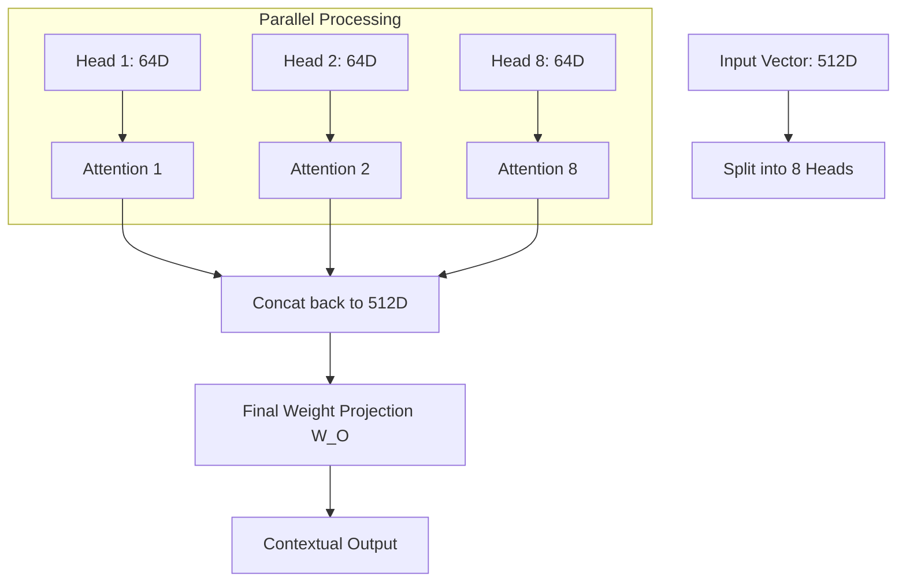

# 🧠 Multi-Head Attention Deep Dive: Parallel Paths of Thought
> **Level:** Advanced | **Language:** Hinglish | **Goal:** Master the internal mechanics of Multi-Head Attention, including the linear projections, head splitting, concatenation, and why multiple heads outperform a single large one.

---

## 🧭 1. Beginner-Friendly Hinglish Explanation
Multi-Head Attention ka matlab hai "Ek hi sentence ko alag-alag nazariye (perspectives) se dekhna". 

Sochiye, ek team hai jo ek complex file padh rahi hai:
- **Head 1:** Sirf Grammar aur Sentence structure check kar raha hai.
- **Head 2:** Sirf Facts aur Entities (Dates, Names) dhoondh raha hai.
- **Head 3:** Sentence ka "Tone" aur "Sentiment" samajh raha hai.

Agar sirf ek hi insaan poori file padhta, toh shayad wo kuch barikiyaan miss kar deta. Par jab 8 ya 12 experts (Heads) ek saath padhte hain aur phir apni knowledge ko merge karte hain, toh wo sentence ko $100\%$ samajh paate hain. 

Neural Network mein hum embedding vector ko chote-chote tukdon mein baant dete hain aur har tukde (Head) ko alag kaam par lagate hain.

---

## 🧠 2. Deep Technical Explanation
Multi-Head Attention (MHA) allows the model to jointly attend to information from different representation subspaces at different positions.

### The Algorithm Steps:
1. **Linear Projections:** Take the input $X$ and multiply it by learned weight matrices $W_Q, W_K, W_V$ to get $Q, K, V$.
2. **Head Splitting:** Split the $Q, K, V$ vectors into $h$ heads. 
   - If `embed_dim` = 512 and `num_heads` = 8, each head has a dimension of $512/8 = 64$.
3. **Scaled Dot-Product Attention:** Perform attention independently for each head.
   $$\text{Head}_i = \text{Attention}(Q_i, K_i, V_i)$$
4. **Concatenation:** Join all the heads back together into a single vector of size 512.
5. **Final Linear Projection:** Multiply by a final weight matrix $W_O$ to allow the heads to "Talk" to each other and merge their findings.

---

## 🏗️ 3. MHA Configuration Table
| Parameter | Standard (Base) | Standard (Large) | Purpose |
| :--- | :--- | :--- | :--- |
| **Embed Dim ($d_{model}$)**| 512 | 1024 | Total vector size. |
| **Num Heads ($h$)** | 8 | 16 | Number of parallel "Experts". |
| **Head Dim ($d_k$)** | 64 | 64 | Dimension of each expert. |
| **Complexity** | $O(N^2 \cdot d)$ | $O(N^2 \cdot d)$ | Computational cost. |

---

## 📐 4. Mathematical Intuition
- **Why Split?** If we have one head of size 512, it calculates one attention map. If we have 8 heads of size 64, we get 8 DIFFERENT attention maps for the SAME compute cost. It's a "Free" way to increase the model's intelligence.
- **Subspace Representation:** Each head learns a different "Subspace." One head might learn the "Subject-Verb" relationship subspace, another might learn "Noun-Adjective."
- **The $W_O$ Matrix:** This is the most underrated part. It allows the model to say: "Take $30\%$ of what Head 1 found and $70\%$ of what Head 4 found for this specific word."

---

## 📊 5. Multi-Head Architecture (Diagram)


---

## 💻 6. Production-Ready Examples (MHA from Scratch in PyTorch)
```python
# 2026 Pro-Tip: Understanding the 'Reshape' and 'Transpose' logic in MHA.
import torch
import torch.nn as nn

class MultiHeadAttention(nn.Module):
    def __init__(self, embed_dim, num_heads):
        super().__init__()
        self.num_heads = num_heads
        self.head_dim = embed_dim // num_heads
        
        self.q_linear = nn.Linear(embed_dim, embed_dim)
        self.k_linear = nn.Linear(embed_dim, embed_dim)
        self.v_linear = nn.Linear(embed_dim, embed_dim)
        self.out_linear = nn.Linear(embed_dim, embed_dim)

    def forward(self, q, k, v, mask=None):
        batch_size = q.size(0)
        
        # 1. Linear Projections and Splitting
        # Reshape to [batch, seq_len, num_heads, head_dim]
        Q = self.q_linear(q).view(batch_size, -1, self.num_heads, self.head_dim).transpose(1, 2)
        K = self.k_linear(k).view(batch_size, -1, self.num_heads, self.head_dim).transpose(1, 2)
        V = self.v_linear(v).view(batch_size, -1, self.num_heads, self.head_dim).transpose(1, 2)
        
        # 2. Scaled Dot-Product Attention (for all heads at once!)
        scores = torch.matmul(Q, K.transpose(-2, -1)) / (self.head_dim ** 0.5)
        if mask is not None:
            scores = scores.masked_fill(mask == 0, -1e9)
        
        weights = torch.softmax(scores, dim=-1)
        attention = torch.matmul(weights, V)
        
        # 3. Concatenate and Project back
        attention = attention.transpose(1, 2).contiguous().view(batch_size, -1, self.num_heads * self.head_dim)
        return self.out_linear(attention)
```

---

## ❌ 7. Failure Cases
- **Head Collapse:** Sometimes, multiple heads end up learning the EXACT same attention map, wasting compute. **Fix:** Use **Diversity Regularization**.
- **Dimension Mismatch:** If `embed_dim` is not perfectly divisible by `num_heads` (e.g., 512 / 10), you will get a runtime error.
- **Memory Inefficiency:** Storing 8 attention maps ($N \times N$) for every layer takes $8x$ more memory than one map.

---

## 🛠️ 8. Debugging Guide
- **Symptom:** The model is not learning complex relations.
- **Check:** **Num Heads**. If you only have 1 head, the model is essentially a "Simple Attention" model.
- **Symptom:** GPU Memory is spiking.
- **Check:** **Attention Matrix**. $N \times N \times \text{Heads}$. If $N=2048$, this matrix is huge. Use **Flash Attention**.

---

## ⚖️ 9. Tradeoffs
- **Many Small Heads vs. Few Large Heads:** Many small heads are better for capturing variety (NLP). Few large heads are better for capturing high-precision details (Math/Scientific data).
- **GQA (Grouped Query Attention):** A 2026 industry standard where we have many Queries but only ONE Key/Value pair shared among a group of queries. This saves $80\%$ of KV-Cache memory!

---

## 🛡️ 10. Security Concerns
- **Head Stealing:** By looking at which heads are active, an attacker can determine the "Type" of task the model is performing (e.g., translating vs. summarizing), which can be used to bypass usage filters.

---

## 📈 11. Scaling Challenges
- **The Interconnect Bottleneck:** Moving the multi-head outputs across different GPU cores for concatenation is the slowest part of a Transformer block.

---

## 💸 12. Cost Considerations
- **MHA is the CPU-GPU Bottleneck:** Most of the cost of LLMs is moving the KV-Cache of these heads in and out of the GPU memory.
- **MQA (Multi-Query Attention):** Used in early Falcon models to reduce costs by having only one Key and one Value for ALL heads.

---

## ✅ 13. Best Practices
- **Standard 8-12 Heads:** A safe bet for any model size between 100M and 7B.
- **Use `head_dim = 64`:** This is the hardware "Sweet Spot" for NVIDIA GPUs.
- **Always Transpose Carefully:** The `(1, 2)` transpose is essential to ensure the attention happens within the sequence length dimension, not the head dimension.

---

## ⚠️ 14. Common Mistakes
- **Applying Softmax on Head Dimension:** Softmax should always be across the "Keys" (columns of the score matrix), not the heads.
- **Forgetting the Final $W_O$:** Without this linear layer, the heads never share their information.

---

## 📝 15. Interview Questions
1. **"What is the mathematical advantage of Multi-Head Attention over Single-Head Attention?"**
2. **"How does the model merge information from 8 different heads?"** (Concatenation + Final Linear Projection).
3. **"Explain Grouped Query Attention (GQA) and why Llama-3 uses it."** (Efficiency in KV-Caching).

---

## 🚀 15. Latest 2026 Industry Patterns
- **FlashAttention-3 Multi-head kernels:** Writing custom C++/CUDA code to run all 8 heads in a single GPU thread block.
- **Sliding Window Multi-Head:** Each head has a different "Window" (Head 1 looks at last 50 words, Head 2 looks at last 5000 words).
- **Infinite Heads (Neural Diff):** A new concept where the number of heads is continuous, not discrete, allowing for smoother attention patterns.
