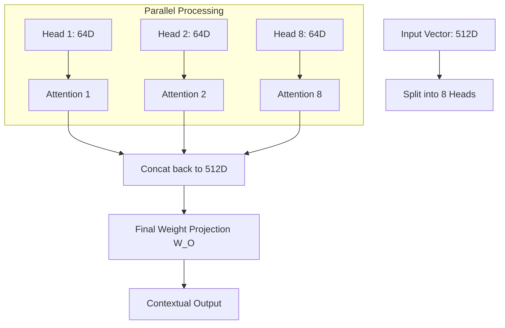

# 🧠 Multi-Head Attention Deep Dive: Parallel Paths of Thought
> **Level:** Advanced | **Language:** Hinglish | **Goal:** Multi-Head Attention ke internal mechanics ko master karein, jisme linear projections, head splitting, concatenation shamil hain, aur samjhein ki kyu multiple heads ek single large head se behtar perform karte hain.

---

## 🧭 1. Beginner-Friendly Hinglish Explanation
Multi-Head Attention ka matlab hai "Ek hi sentence ko alag-alag nazariye (perspectives) se dekhna". 

Sochiye, ek team hai jo ek complex file padh rahi hai:
- **Head 1:** Sirf Grammar aur Sentence structure check kar raha hai.
- **Head 2:** Sirf Facts aur Entities (Dates, Names) dhoondh raha hai.
- **Head 3:** Sentence ka "Tone" aur "Sentiment" samajh raha hai.

Agar sirf ek hi insaan poori file padhta, toh shayad wo kuch barikiyaan miss kar deta. Par jab 8 ya 12 experts (Heads) ek saath padhte hain aur phir apni knowledge ko merge karte hain, toh wo sentence ko $100\%$ samajh paate hain. 

Neural Network mein hum embedding vector ko chote-chote tukdon mein baant dete hain aur har tukde (Head) ko alag kaam par lagate hain.

---

## 🧠 2. Deep Technical Explanation
Multi-Head Attention (MHA) model ko different positions par different representation subspaces se information par jointly attend (dhyan dene) ki permission deta hai.

### The Algorithm Steps (Algorithm ke Steps):
1. **Linear Projections:** Input $X$ lein aur $Q, K, V$ paane ke liye use learned weight matrices $W_Q, W_K, W_V$ se multiply karein.
2. **Head Splitting:** $Q, K, V$ vectors ko $h$ heads me split karein. 
   - Agar `embed_dim` = 512 aur `num_heads` = 8 hai, toh har head ka dimension $512/8 = 64$ hoga.
3. **Scaled Dot-Product Attention:** Har head ke liye independently attention perform karein.
   $$\text{Head}_i = \text{Attention}(Q_i, K_i, V_i)$$
4. **Concatenation:** Sabhi heads ko wapas ek sath join karke size 512 ka ek single vector banayein.
5. **Final Linear Projection:** Final weight matrix $W_O$ se multiply karein taaki heads ek-dusre se "Talk" (communicate) kar sakein aur apni findings ko merge kar sakein.

---

## 🏗️ 3. MHA Configuration Table
| Parameter | Standard (Base) | Standard (Large) | Purpose (Udeshya) |
| :--- | :--- | :--- | :--- |
| **Embed Dim ($d_{model}$)**| 512 | 1024 | Total vector size. |
| **Num Heads ($h$)** | 8 | 16 | Parallel "Experts" ka number. |
| **Head Dim ($d_k$)** | 64 | 64 | Har ek expert ka dimension. |
| **Complexity** | $O(N^2 \cdot d)$ | $O(N^2 \cdot d)$ | Computational cost. |

---

## 📐 4. Mathematical Intuition
- **Why Split?** Agar hamare paas size 512 ka ek head ho, toh ye ek attention map calculate karta hai. Agar hamare paas size 64 ke 8 heads hon, toh hum SAME compute cost me 8 DIFFERENT attention maps paate hain. Ye model ki intelligence ko increase karne ka ek "Free" tarika hai.
- **Subspace Representation:** Har head ek different "Subspace" learn karta hai. Ek head "Subject-Verb" relationship subspace seekh sakta hai, dusra "Noun-Adjective" seekh sakta hai.
- **The $W_O$ Matrix:** Ye sabse underrated part hai. Ye model ko ye kehne ki permission deta hai: "Is specific word ke liye Head 1 ne jo find kiya uska $30\%$ aur Head 4 ne jo find kiya uska $70\%$ lein."

---

## 📊 5. Multi-Head Architecture (Diagram)

```mermaid
graph TD
    Input[Input Vector: 512D] --> Split[Split into 8 Heads]
    
    subgraph "Parallel Processing"
    H1[Head 1: 64D] --> Att1[Attention 1]
    H2[Head 2: 64D] --> Att2[Attention 2]
    H8[Head 8: 64D] --> Att8[Attention 8]
    end
    
    Att1 & Att2 & Att8 --> Concatenate[Concat back to 512D]
    Concatenate --> Linear[Final Weight Projection W_O]
    Linear --> Result[Contextual Output]
```

---

## 💻 6. Production-Ready Examples (MHA from Scratch in PyTorch)
```python
# 2026 Pro-Tip: MHA me 'Reshape' aur 'Transpose' ke logic ko samajhna.
import torch
import torch.nn as nn

class MultiHeadAttention(nn.Module):
    def __init__(self, embed_dim, num_heads):
        super().__init__()
        self.num_heads = num_heads
        self.head_dim = embed_dim // num_heads
        
        self.q_linear = nn.Linear(embed_dim, embed_dim)
        self.k_linear = nn.Linear(embed_dim, embed_dim)
        self.v_linear = nn.Linear(embed_dim, embed_dim)
        self.out_linear = nn.Linear(embed_dim, embed_dim)

    def forward(self, q, k, v, mask=None):
        batch_size = q.size(0)
        
        # 1. Linear Projections aur Splitting
        # [batch, seq_len, num_heads, head_dim] me reshape karna
        Q = self.q_linear(q).view(batch_size, -1, self.num_heads, self.head_dim).transpose(1, 2)
        K = self.k_linear(k).view(batch_size, -1, self.num_heads, self.head_dim).transpose(1, 2)
        V = self.v_linear(v).view(batch_size, -1, self.num_heads, self.head_dim).transpose(1, 2)
        
        # 2. Scaled Dot-Product Attention (sabhi heads ke liye ek sath!)
        scores = torch.matmul(Q, K.transpose(-2, -1)) / (self.head_dim ** 0.5)
        if mask is not None:
            scores = scores.masked_fill(mask == 0, -1e9)
        
        weights = torch.softmax(scores, dim=-1)
        attention = torch.matmul(weights, V)
        
        # 3. Concatenate aur wapas Project karna
        attention = attention.transpose(1, 2).contiguous().view(batch_size, -1, self.num_heads * self.head_dim)
        return self.out_linear(attention)
```

---

## ❌ 7. Failure Cases
- **Head Collapse:** Kabhi-kabhi, multiple heads EXACTLY same attention map seekhne lagte hain, jisse compute waste hota hai. **Fix:** **Diversity Regularization** ka use karein.
- **Dimension Mismatch:** Agar `embed_dim` perfectly divisible nahi hai `num_heads` se (e.g., 512 / 10), toh aapko runtime error milega.
- **Memory Inefficiency:** Har layer ke liye 8 attention maps ($N \times N$) store karne me ek map ke comparison me $8x$ zyada memory lagti hai.

---

## 🛠️ 8. Debugging Guide
- **Symptom:** Model complex relations ko learn nahi kar raha hai.
- **Check:** **Num Heads**. Agar aapke paas sirf 1 head hai, toh model essentially ek "Simple Attention" model hai.
- **Symptom:** GPU Memory spike ho rahi hai.
- **Check:** **Attention Matrix**. $N \times N \times \text{Heads}$. Agar $N=2048$ hai, toh ye matrix huge hota hai. **Flash Attention** ka use karein.

---

## ⚖️ 9. Tradeoffs
- **Many Small Heads vs. Few Large Heads:** Kai saare small heads variety (NLP) ko capture karne ke liye behtar hote hain. Kam par bade (large) heads high-precision details (Math/Scientific data) ko capture karne ke liye behtar hote hain.
- **GQA (Grouped Query Attention):** 2026 ka industry standard jahan hamare paas kai saari Queries hoti hain par queries ke group ke beech sirf ONE Key/Value pair share hota hai. Ye KV-Cache memory ka $80\%$ save karta hai!

---

## 🛡️ 10. Security Concerns
- **Head Stealing:** Kaunse heads active hain ye dekh kar, attacker ye determine kar sakta hai ki model kis "Type" ka task perform kar raha hai (e.g., translating vs. summarizing), jiska use filters ko bypass karne ke liye kiya ja sakta hai.

---

## 📈 11. Scaling Challenges
- **The Interconnect Bottleneck:** Concatenation ke liye different GPU cores ke across multi-head outputs ko move karna Transformer block ka sabse slow part hai.

---

## 💸 12. Cost Considerations
- **MHA is the CPU-GPU Bottleneck:** LLMs ki most of the cost in heads ke KV-Cache ko GPU memory ke in aur out move karne me lagti hai.
- **MQA (Multi-Query Attention):** Early Falcon models me costs ko reduce karne ke liye use kiya gaya tha jisme SABHI heads ke liye sirf ek Key aur ek Value hoti hai.

---

## ✅ 13. Best Practices
- **Standard 8-12 Heads:** 100M se 7B ke beech kisi bhi model size ke liye ek safe choice.
- **Use `head_dim = 64`:** NVIDIA GPUs ke liye ye hardware "Sweet Spot" hai.
- **Always Transpose Carefully:** `(1, 2)` transpose ye ensure karne ke liye essential hai ki attention sequence length dimension ke andar ho, head dimension me nahi.

---

## ⚠️ 14. Common Mistakes
- **Applying Softmax on Head Dimension:** Softmax hamesha "Keys" (score matrix ke columns) ke across hona chahiye, heads ke nahi.
- **Forgetting the Final $W_O$:** Is linear layer ke bina, heads kabhi bhi apni information share nahi kar pate.

---

## 📝 15. Interview Questions
1. **"Single-Head Attention ke upar Multi-Head Attention ka mathematical advantage kya hai?"**
2. **"Model 8 different heads se information ko kaise merge karta hai?"** (Concatenation + Final Linear Projection).
3. **"Grouped Query Attention (GQA) ko explain karein aur Llama-3 ise kyun use karta hai?"** (KV-Caching me efficiency).

---

## 🚀 16. Latest 2026 Industry Patterns
- **FlashAttention-3 Multi-head kernels:** Ek single GPU thread block me sabhi 8 heads ko run karne ke liye custom C++/CUDA code likhna.
- **Sliding Window Multi-Head:** Each head has a different "Window" (Head 1 looks at last 50 words, Head 2 looks at last 5000 words).
- **Infinite Heads (Neural Diff):** A new concept where the number of heads is continuous, not discrete, allowing for smoother attention patterns.
