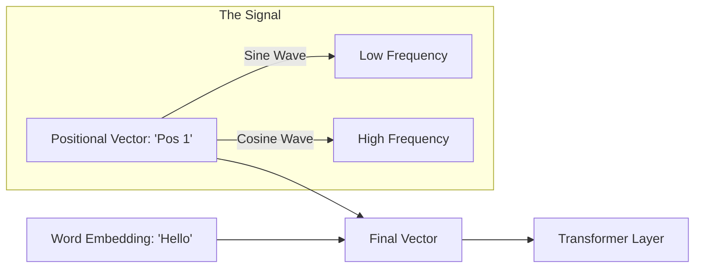

# 📍 Positional Encodings and Embeddings: The Geometry of Sequence
> **Level:** Advanced | **Language:** Hinglish | **Goal:** Master the techniques used to inject "Order" into the order-less Transformer architecture, covering Sinusoidal Encodings, Learned Embeddings, and modern RoPE (Rotary Positional Embeddings).

---

## 🧭 1. Beginner-Friendly Hinglish Explanation
Transformer ek bahut smart student hai, par usme ek badi kami hai: Use "Line" (Sequence) ka concept nahi pata. 

Agar aap use ek sentence dete hain: "Dog bites man", toh Transformer ke liye ye sirf ek words ki "Bucket" hai. Use ye nahi pata ki "Dog" pehle aaya aur "man" baad mein. Uske liye "Dog bites man" aur "Man bites dog" bilkul same hain. 

**Positional Encoding** ka kaam hai har word ko ek "Ghar ka number" (Address) dena. 
- Hum har word ke vector mein ek special mathematical pattern (Sine/Cosine waves) add kar dete hain. 
- Is pattern se Transformer ko pata chal jata hai ki: "Ye word 1st position par hai aur ye 10th par".

Bina iske, AI kabhi bhasha ka sahi matlab nahi samajh pata.

---

## 🧠 2. Deep Technical Explanation
Since Transformers have no recurrence or convolution, they are **Permutation Invariant**. To restore order, we must add positional information to the input embeddings.

### 1. Sinusoidal Encodings (Original Paper):
Uses sine and cosine functions of different frequencies.
- **Formula:** 
  $$PE_{(pos, 2i)} = \sin(pos / 10000^{2i/d})$$
  $$PE_{(pos, 2i+1)} = \cos(pos / 10000^{2i/d})$$
- **Pro:** It allows the model to extrapolate to sequence lengths longer than those seen during training.

### 2. Learned Positional Embeddings:
Treating positions as tokens and learning a vector for each position ($0, 1, 2...$).
- **Pro:** Very accurate for fixed lengths.
- **Con:** Cannot handle any sentence longer than the maximum length seen during training.

### 3. RoPE (Rotary Positional Embeddings - 2026 Standard):
Instead of "Adding" a vector, we "Rotate" the embedding vector in a complex plane.
- **Pro:** Captures the **Relative Distance** between words much better. Used by Llama-3, Mistral, and GPT-4.

---

## 🏗️ 3. Positional Strategy Matrix
| Strategy | Mechanism | Extrapolation | Best For |
| :--- | :--- | :--- | :--- |
| **Sinusoidal** | Fixed Sine waves | Good | Original Transformer |
| **Learned** | Weights learned by model | Zero (Crashes) | BERT, ViT |
| **RoPE** | Rotation matrices | Excellent | Modern LLMs (Llama, GPT) |
| **ALiBi** | Penalty based on distance| Infinite | Models needing 1M+ context|

---

## 📐 4. Mathematical Intuition
- **Absolute vs. Relative:** 
  - Absolute: "I am word #5."
  - Relative: "I am 3 words away from the verb."
- **The Sine/Cosine Logic:** Using waves ensures that the "Distance" between any two positions $k$ and $k+n$ can be expressed as a linear function of the distance $n$. This allows the model to learn the "Pattern" of distance.

---

## 📊 5. Positional Signal (Diagram)


---

## 💻 6. Production-Ready Examples (Implementing Sinusoidal PE in PyTorch)
```python
# 2026 Pro-Tip: Pre-calculate the PE matrix to save GPU cycles.
import torch
import torch.nn as nn
import numpy as np

class PositionalEncoding(nn.Module):
    def __init__(self, d_model, max_len=5000):
        super().__init__()
        # Create a matrix of shape [max_len, d_model]
        pe = torch.zeros(max_len, d_model)
        position = torch.arange(0, max_len, dtype=torch.float).unsqueeze(1)
        div_term = torch.exp(torch.arange(0, d_model, 2).float() * (-np.log(10000.0) / d_model))
        
        # Apply sine to even indices and cosine to odd indices
        pe[:, 0::2] = torch.sin(position * div_term)
        pe[:, 1::2] = torch.cos(position * div_term)
        
        pe = pe.unsqueeze(0) # [1, max_len, d_model]
        self.register_buffer('pe', pe) # Fixed (not learned)

    def forward(self, x):
        # x shape: [batch, seq_len, d_model]
        # Simply add the PE to the input embeddings
        return x + self.pe[:, :x.size(1), :]

# Usage:
# encoding = PositionalEncoding(d_model=512)
```

---

## ❌ 7. Failure Cases
- **The "Fixed Length" Wall:** If you use Learned Embeddings with `max_len=512`, and a user sends a $513$-word prompt, the model will crash or produce gibberish.
- **Loss of Resolution:** In very long sequences (1M+), the "Sine wave" values become so close to each other that the model can't tell the difference between position $1,000,000$ and $1,000,001$.
- **Arithmetic Failure:** PE can sometimes "wash out" the semantic embedding if the embedding values are too small compared to the PE values.

---

## 🛠️ 8. Debugging Guide
- **Symptom:** Model thinks "I love you" is the same as "You love I."
- **Check:** **PE Addition**. Did you forget to add the PE to the input? Did you accidentally "concatenate" instead of "add"?
- **Symptom:** Training is unstable.
- **Check:** **Embedding Scaling**. Standard practice is to multiply the word embedding by $\sqrt{d_{model}}$ before adding PE.

---

## ⚖️ 9. Tradeoffs
- **Addition (Standard) vs. Concatenation:** Addition keeps the dimension small (memory efficient). Concatenation is "purer" but doubles the memory cost of every layer.
- **RoPE vs. Sinusoidal:** RoPE is much better at keeping the relative context but is computationally more expensive to calculate.

---

## 🛡️ 10. Security Concerns
- **Position Hijacking:** An attacker can craft a prompt with repetitive tokens that "overwhelm" the positional signal, making the model forget the earlier parts of the prompt (e.g., system instructions).

---

## 📈 11. Scaling Challenges
- **Context Window Expansion:** To move from 8k to 1M context, we often need to "Rescale" the RoPE frequencies. This is called **YaRN** (Yet another RoPE extension) or **NTK-Aware scaling**.

---

## 💸 12. Cost Considerations
- **Memory Cost:** Positional embeddings are small ($O(max\_len \times d)$). The real cost is the Attention ($O(max\_len^2)$) that uses this positional info.

---

## ✅ 13. Best Practices
- **Use RoPE:** It is the undisputed king of positional encodings in 2026.
- **Pre-calculate your Sin/Cos tables:** Never calculate them inside the `forward` loop.
- **Register as Buffer:** In PyTorch, use `register_buffer` so the PE is saved with the model but not updated by the optimizer.

---

## ⚠️ 14. Common Mistakes
- **Forgetting to Mask:** Even with PE, if you don't mask the future in a decoder, the model will just "look ahead" and find the answer.
- **Using integer positions:** Don't just add `[1, 2, 3]` to your vectors. The model cannot learn from a linear integer increase; it needs the periodic nature of waves.

---

## 📝 15. Interview Questions
1. **"Why do Transformers need Positional Encodings but LSTMs don't?"**
2. **"Difference between Absolute and Relative Positional Encodings?"**
3. **"How does RoPE achieve length extrapolation?"**

---

## 🚀 15. Latest 2026 Industry Patterns
- **Vision Transformer (ViT) 2D PE:** Using sine waves in both $X$ and $Y$ dimensions to tell the model where a patch is in a 2D image.
- **ALiBi (Attention with Linear Biases):** A technique that doesn't use positional embeddings at all, but instead adds a penalty to the attention scores based on how far apart the words are.
- **Recursive Positional Encodings:** Using a small neural network to "generate" the positional vector based on the context, allowing for infinite flexibility.
