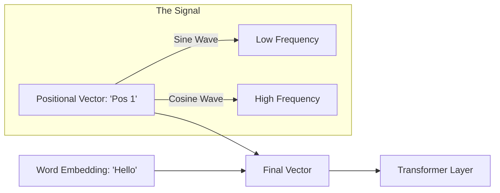

# 📍 Positional Encodings and Embeddings: The Geometry of Sequence
> **Level:** Advanced | **Language:** Hinglish | **Goal:** Order-less Transformer architecture mein "Order" inject karne ke liye use hone wali techniques ko master karein, jisme Sinusoidal Encodings, Learned Embeddings, aur modern RoPE (Rotary Positional Embeddings) shamil hain.

---

## 🧭 1. Beginner-Friendly Hinglish Explanation
Transformer ek bahut smart student hai, par usme ek badi kami hai: Use "Line" (Sequence) ka concept nahi pata. 

Agar aap use ek sentence dete hain: "Dog bites man", toh Transformer ke liye ye sirf ek words ki "Bucket" hai. Use ye nahi pata ki "Dog" pehle aaya aur "man" baad mein. Uske liye "Dog bites man" aur "Man bites dog" bilkul same hain. 

**Positional Encoding** ka kaam hai har word ko ek "Ghar ka number" (Address) dena. 
- Hum har word ke vector mein ek special mathematical pattern (Sine/Cosine waves) add kar dete hain. 
- Is pattern se Transformer ko pata chal jata hai ki: "Ye word 1st position par hai aur ye 10th par".

Bina iske, AI kabhi bhasha ka sahi matlab nahi samajh pata.

---

## 🧠 2. Deep Technical Explanation
Kyunki Transformers me koi recurrence ya convolution nahi hota hai, isiliye wo **Permutation Invariant** hote hain. Order ko restore karne ke liye, hume input embeddings me positional information add karni padti hai.

### 1. Sinusoidal Encodings (Original Paper):
Different frequencies ke sine aur cosine functions ka use karta hai.
- **Formula:** 
  $$PE_{(pos, 2i)} = \sin(pos / 10000^{2i/d})$$
  $$PE_{(pos, 2i+1)} = \cos(pos / 10000^{2i/d})$$
- **Pro:** Ye model ko un sequence lengths par extrapolate karne ki permission deta hai jo training ke dauran dekhi gayi sequences se lambi ho.

### 2. Learned Positional Embeddings:
Positions ko tokens ki tarah treat karna aur har ek position ($0, 1, 2...$) ke liye ek vector learn karna.
- **Pro:** Fixed lengths ke liye bahut accurate hai.
- **Con:** Training ke dauran dekhi gayi maximum length se lambe kisi bhi sentence ko handle nahi kar sakta.

### 3. RoPE (Rotary Positional Embeddings - 2026 Standard):
Vector "Add" karne ke bajaye, hum complex plane me embedding vector ko "Rotate" karte hain.
- **Pro:** Words ke beech ki **Relative Distance** ko bahut behtar capture karta hai. Llama-3, Mistral, aur GPT-4 dwara use kiya jata hai.

---

## 🏗️ 3. Positional Strategy Matrix
| Strategy (Ranniti) | Mechanism (Prakriya) | Extrapolation | Best For (Kiske Liye Best Hai) |
| :--- | :--- | :--- | :--- |
| **Sinusoidal** | Fixed Sine waves | Good | Original Transformer |
| **Learned** | Model dwara learned weights | Zero (Crashes) | BERT, ViT |
| **RoPE** | Rotation matrices | Excellent | Modern LLMs (Llama, GPT) |
| **ALiBi** | Distance ke basis par penalty| Infinite | 1M+ context ki zaroorat wale models |

---

## 📐 4. Mathematical Intuition
- **Absolute vs. Relative:** 
  - Absolute: "Main word #5 hoon."
  - Relative: "Main verb se 3 words door hoon."
- **The Sine/Cosine Logic:** Waves ka use karne se ye ensure hota hai ki kisi bhi do positions $k$ aur $k+n$ ke beech ki "Distance" ko distance $n$ ke linear function ke roop me express kiya ja sake. Ye model ko distance ke "Pattern" ko learn karne me help karta hai.

---

## 📊 5. Positional Signal (Diagram)

```mermaid
graph LR
    Word[Word Embedding: 'Hello'] --> Sum[Final Vector]
    Pos[Positional Vector: 'Pos 1'] --> Sum
    
    subgraph "The Signal"
    Pos -- "Sine Wave" --> S[Low Frequency]
    Pos -- "Cosine Wave" --> C[High Frequency]
    end
    
    Sum --> Trans[Transformer Layer]
```

---

## 💻 6. Production-Ready Examples (Implementing Sinusoidal PE in PyTorch)
```python
# 2026 Pro-Tip: GPU cycles save karne ke liye PE matrix ko pehle se calculate (pre-calculate) kar lein.
import torch
import torch.nn as nn
import numpy as np

class PositionalEncoding(nn.Module):
    def __init__(self, d_model, max_len=5000):
        super().__init__()
        # [max_len, d_model] shape ka ek matrix create karna
        pe = torch.zeros(max_len, d_model)
        position = torch.arange(0, max_len, dtype=torch.float).unsqueeze(1)
        div_term = torch.exp(torch.arange(0, d_model, 2).float() * (-np.log(10000.0) / d_model))
        
        # Even indices par sine aur odd indices par cosine apply karna
        pe[:, 0::2] = torch.sin(position * div_term)
        pe[:, 1::2] = torch.cos(position * div_term)
        
        pe = pe.unsqueeze(0) # [1, max_len, d_model]
        self.register_buffer('pe', pe) # Fixed (not learned)

    def forward(self, x):
        # x shape: [batch, seq_len, d_model]
        # Simply input embeddings me PE ko add karna
        return x + self.pe[:, :x.size(1), :]

# Usage:
# encoding = PositionalEncoding(d_model=512)
```

---

## ❌ 7. Failure Cases
- **The "Fixed Length" Wall:** Agar aap `max_len=512` ke sath Learned Embeddings ka use karte hain, aur koi user $513$-word ka prompt bhejta hai, toh model crash ho jayega ya gibberish produce karega.
- **Loss of Resolution:** Bahut long sequences (1M+) me, "Sine wave" ki values ek-dusre ke itni close ho jati hain ki model position $1,000,000$ aur $1,000,001$ ke beech ka difference nahi bata pata.
- **Arithmetic Failure:** PE kabhi-kabhi semantic embedding ko "wash out" (dhundhla) kar sakta hai agar embedding values PE values ke comparison me bahut small hon.

---

## 🛠️ 8. Debugging Guide
- **Symptom:** Model sochta hai ki "I love you" aur "You love I" same hain.
- **Check:** **PE Optimization**. Kya aap input me PE add karna bhool gaye? Kya aapne galti se "add" karne ke bajaye "concatenate" kar diya?
- **Symptom:** Training unstable hai.
- **Check:** **Embedding Scaling**. Standard practice ye hai ki PE add karne se pehle word embedding ko $\sqrt{d_{model}}$ se multiply kiya jaye.

---

## ⚖️ 9. Tradeoffs
- **Addition (Standard) vs. Concatenation:** Addition dimension ko small rakhta hai (memory efficient). Concatenation "purer" hota hai par ye har layer ke memory cost ko double kar deta hai.
- **RoPE vs. Sinusoidal:** RoPE relative context ko maintain rakhne me bahut behtar hai par ise calculate karna computationally zyada expensive hota hai.

---

## 🛡️ 10. Security Concerns
- **Position Hijacking:** Attacker repetitive tokens ke sath aisa prompt craft kar sakta hai jo positional signal ko "overwhelm" (daba) de, jisse model prompt ke earlier parts (e.g., system instructions) ko bhool jata hai.

---

## 📈 11. Scaling Challenges
- **Context Window Expansion:** 8k se 1M context tak move karne ke liye, hume aksar RoPE frequencies ko "Rescale" karne ki need hoti hai. Ise **YaRN** (Yet another RoPE extension) ya **NTK-Aware scaling** kaha jata hai.

---

## 💸 12. Cost Considerations
- **Memory Cost:** Positional embeddings small hote hain ($O(max\_len \times d)$). Real cost Attention ($O(max\_len^2)$) ki hoti hai jo is positional info ka use karta hai.

---

## ✅ 13. Best Practices
- **Use RoPE:** 2026 me positional encodings ka undisputed king.
- **Pre-calculate your Sin/Cos tables:** Unhe kabhi bhi `forward` loop ke andar calculate na karein.
- **Register as Buffer:** PyTorch me `register_buffer` ka use karein taaki PE model ke sath save ho jaye par optimizer dwara update na ho.

---

## ⚠️ 14. Common Mistakes
- **Forgetting to Mask:** PE hone par bhi, agar aap decoder me future ko mask nahi karte hain, toh model bas "look ahead" (aage dekh) lega aur answer dhoondh lega.
- **Using integer positions:** Don't just add `[1, 2, 3]` to your vectors. Model linear integer increase se learn nahi kar sakta; use waves ke periodic nature ki zaroorat hoti hai.

---

## 📝 15. Interview Questions
1. **"Transformers ko Positional Encodings ki need kyun hoti hai par LSTMs ko nahi?"**
2. **"Absolute aur Relative Positional Encodings me kya difference hai?"**
3. **"RoPE length extrapolation kaise achieve karta hai?"**

---

## 🚀 16. Latest 2026 Industry Patterns
- **Vision Transformer (ViT) 2D PE:** Using sine waves in both $X$ and $Y$ dimensions to tell the model where a patch is in a 2D image.
- **ALiBi (Attention with Linear Biases):** A technique that doesn't use positional embeddings at all, but instead adds a penalty to the attention scores based on how far apart the words are.
- **Recursive Positional Encodings:** Using a small neural network to "generate" the positional vector based on the context, allowing for infinite flexibility.
