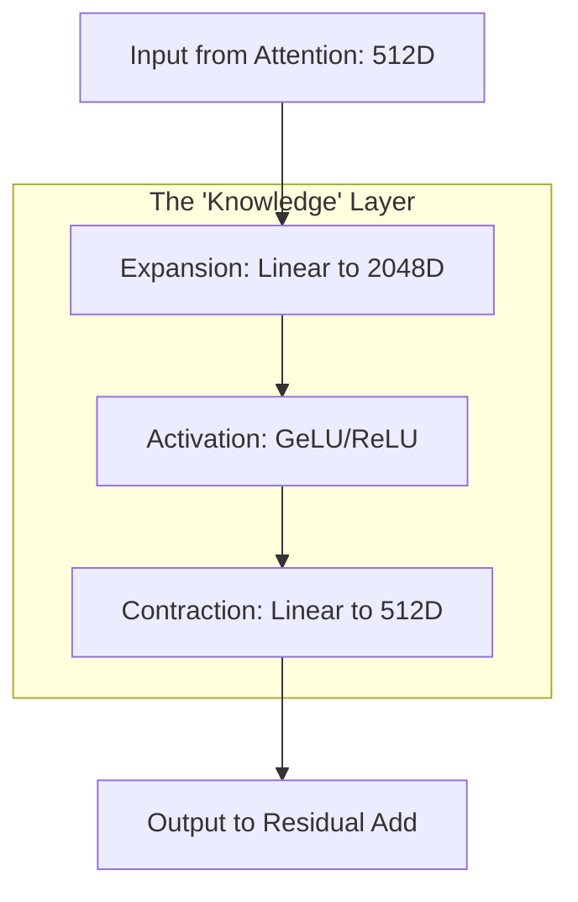

# ⚙️ The Feed Forward Network (FFN): The Knowledge Processor
> **Level:** Intermediate | **Language:** Hinglish | **Goal:** Master the position-wise Feed Forward Network in Transformers, understanding its role as the "Storage" of model knowledge and the importance of its expansion-contraction structure.

---

## 🧭 1. Beginner-Friendly Hinglish Explanation
Transformer mein "Attention" ka kaam hai words ke beech ke "Rishtey" dhoondhna. Par sirf rishtey dhoondhne se baat nahi banti, unhe "Process" bhi karna hota hai. 

**Feed Forward Network (FFN)** Transformer ka wo "Dimaag" hai jahan asli calculation hoti hai. 
Sochiye:
- **Attention:** "Ye 'Apple' word 'iPhone' se connected hai."
- **FFN:** "Ok, iska matlab yahan 'Apple' ka matlab 'Company' hai, fruit nahi. Is information ko save karo."

FFN har word par alag-alag kaam karta hai. Ye pehle information ko "Expand" karta hai (bahut saari detail nikaalta hai) aur phir use "Compress" karke agle layer ke liye ready karta hai.

---

## 🧠 2. Deep Technical Explanation
The Feed Forward Network is a **Position-wise** sub-layer applied to each token independently and identically. It consists of two linear transformations with a non-linear activation function in between.

### Structure:
1. **Expansion Layer:** Projects the embedding ($d_{model}$) to a much higher dimension ($d_{ff}$). Usually, $d_{ff} = 4 \times d_{model}$.
   - For a 512 embedding, the FFN expands it to 2048.
2. **Activation:** Traditionally **ReLU**, but modern models use **GeLU** or **Swish (SiLU)**.
3. **Contraction Layer:** Projects the 2048 dimension back down to the original 512.

### Why Expand?
Higher dimensionality allows the model to separate the input space and store more specialized "Concepts" or "Patterns." Researchers believe that most of the "World Knowledge" in an LLM is stored in these FFN weights.

---

## 🏗️ 3. FFN Configuration Table
| Feature | Standard (Base) | Standard (Large) | Purpose |
| :--- | :--- | :--- | :--- |
| **Input Dim ($d_{model}$)** | 512 | 1024 | Embeddings from Attention. |
| **Expansion Dim ($d_{ff}$)** | 2048 | 4096 | "Hidden" workspace for logic. |
| **Non-linearity** | ReLU / GeLU | SiLU (Swish) | Injecting complexity. |
| **Parameters** | ~66% of Total | ~70% of Total | Major storage for weights. |

---

## 📐 4. Mathematical Intuition
- **The Equation:** 
  $$FFN(x) = \max(0, xW_1 + b_1)W_2 + b_2$$
- **Point-wise:** Notice that there is no summation across the sequence length $N$. The FFN doesn't know about other words in the sentence. It only processes the "Context" that was gathered by the previous Attention layer.
- **Sparse Activation:** In modern models, only some neurons in the FFN "fire" for a specific topic (e.g., "Math" neurons vs "French" neurons).

---

## 📊 5. FFN Workflow (Diagram)


---

## 💻 6. Production-Ready Examples (Modern SwiGLU FFN)
```python
# 2026 Pro-Tip: SwiGLU is the standard for Llama-3 and high-end LLMs.
import torch
import torch.nn as nn
import torch.nn.functional as F

class SwiGLU_FFN(nn.Module):
    def __init__(self, d_model, d_ff):
        super().__init__()
        # SwiGLU uses 3 linear layers instead of 2
        self.w1 = nn.Linear(d_model, d_ff)
        self.w2 = nn.Linear(d_model, d_ff)
        self.w3 = nn.Linear(d_ff, d_model)

    def forward(self, x):
        # Swish(x * W1) * (x * W2) * W3
        swish = F.silu(self.w1(x))
        gate = swish * self.w2(x)
        return self.w3(gate)

# Standard Usage:
# ffn = SwiGLU_FFN(512, 2048)
```

---

## ❌ 7. Failure Cases
- **Over-Compression:** If you make $d_{ff}$ too small (e.g., same as $d_{model}$), the model will have "Low Intelligence" and fail to learn complex facts.
- **Dying ReLU in FFN:** If your FFN neurons stop firing, the model loses large chunks of its memory. **Fix:** Use **GeLU** or **SiLU**.
- **The Computation Bottleneck:** FFNs contain $2/3^{rds}$ of a model's parameters. If you have a 70B model, about 50B parameters are in the FFNs. Moving these across GPUs is very slow.

---

## 🛠️ 8. Debugging Guide
- **Symptom:** Model knows "Concepts" but can't "Reason" across them.
- **Check:** **Attention layer**. FFN can't reason; it only processes.
- **Symptom:** Model is "Forgetful" or hallucinates facts.
- **Check:** **FFN Size**. You might need more parameters in your FFN to store that level of knowledge.

---

## ⚖️ 9. Tradeoffs
- **ReLU vs. SwiGLU:** ReLU is faster for training, but SwiGLU is much smarter for reasoning (though it needs $3x$ more linear layers).
- **Dense vs. Sparse (MoE):** Instead of one large FFN, you can have 8 small ones. For every word, only 2 FFNs fire. This is **Mixture of Experts**, which makes the model $4x$ faster.

---

## 🛡️ 10. Security Concerns
- **Knowledge Erasure:** By specifically attacking the weights of an FFN layer, an attacker can "lobotomize" a model, making it forget a specific topic (like "How to use Python") while keeping everything else intact.

---

## 📈 11. Scaling Challenges
- **Weight Tiling:** Scaling a 50B parameter FFN across 8 GPUs requires splitting the weight matrix into tiles, which leads to high network overhead (All-Reduce).

---

## 💸 12. Cost Considerations
- **FFN is the storage king:** Reducing the size of FFNs (e.g., by $20\%$) has a massive impact on the total VRAM required to run the model, potentially allowing a 7B model to run on a cheap 8GB GPU.

---

## ✅ 13. Best Practices
- **Use $4x$ Expansion:** This is the industry "Gold Standard."
- **Use GeLU/SiLU:** For all models built after 2022.
- **Apply Dropout:** After the second linear layer to prevent the model from just "memorizing" the training set.

---

## ⚠️ 14. Common Mistakes
- **Applying FFN across the Sequence:** Never sum words in an FFN. It must be `Position-wise`.
- **No Bias in FFN:** Modern models (Llama/Gemma) often REMOVE the bias term ($b$) from FFN linear layers to improve training stability at scale.

---

## 📝 15. Interview Questions
1. **"What is the role of the FFN sub-layer in a Transformer?"** (Processing information gathered by attention and storing knowledge).
2. **"Why is the middle dimension of the FFN much larger than the input dimension?"**
3. **"Explain the difference between ReLU and SwiGLU in the context of FFNs."**

---

## 🚀 15. Latest 2026 Industry Patterns
- **Mixture of Experts (MoE) FFNs:** The dominant architecture for GPT-4 and Claude. It allows for models with 1 Trillion parameters to run with the speed of a 100B model.
- **Shared FFNs:** A new research area where multiple layers "share" the same FFN weights to reduce model size by $50\%$ without losing much accuracy.
- **Dynamic FFN Expansion:** Models that can "grow" their FFN workspace dynamically depending on how hard the question is.
