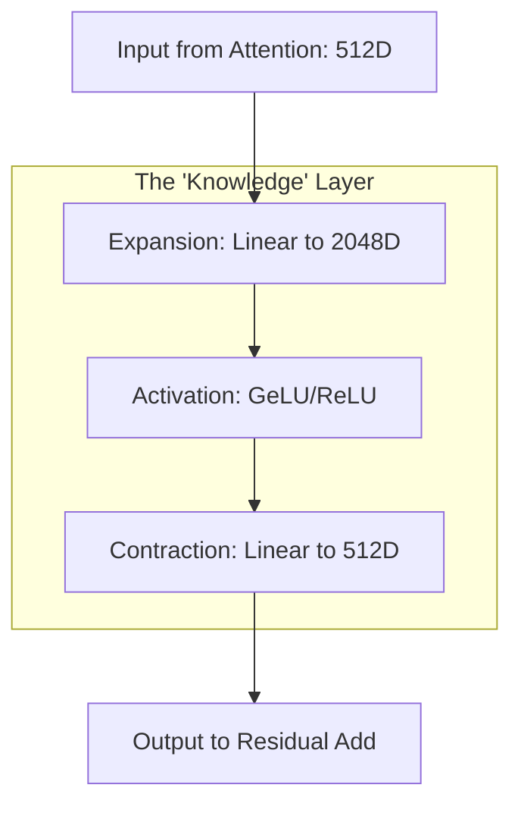

# ⚙️ The Feed Forward Network (FFN): The Knowledge Processor
> **Level:** Intermediate | **Language:** Hinglish | **Goal:** Transformers mein position-wise Feed Forward Network ko master karein, model knowledge ke "Storage" ke roop mein iske role ko samjhein aur iske expansion-contraction structure ki importance ko jaanein.

---

## 🧭 1. Beginner-Friendly Hinglish Explanation
Transformer mein "Attention" ka kaam hai words ke beech ke "Rishtey" dhoondhna. Par sirf rishtey dhoondhne se baat nahi banti, unhe "Process" bhi karna hota hai. 

**Feed Forward Network (FFN)** Transformer ka wo "Dimaag" hai jahan asli calculation hoti hai. 
Sochiye:
- **Attention:** "Ye 'Apple' word 'iPhone' se connected hai."
- **FFN:** "Ok, iska matlab yahan 'Apple' ka matlab 'Company' hai, fruit nahi. Is information ko save karo."

FFN har word par alag-alag kaam karta hai. Ye pehle information ko "Expand" karta hai (bahut saari detail nikaalta hai) aur phir use "Compress" karke agle layer ke liye ready karta hai.

---

## 🧠 2. Deep Technical Explanation
Feed Forward Network ek **Position-wise** sub-layer hai jo har ek token par independently aur identically apply hoti hai. Isme do linear transformations hote hain jinke beech me ek non-linear activation function hota hai.

### Structure:
1. **Expansion Layer:** Embedding ($d_{model}$) ko ek much higher dimension ($d_{ff}$) par project karti hai. Usually, $d_{ff} = 4 \times d_{model}$ hota hai.
   - Ek 512 embedding ke liye, FFN ise 2048 tak expand karta hai.
2. **Activation:** Traditionally **ReLU**, par modern models **GeLU** ya **Swish (SiLU)** ka use karte hain.
3. **Contraction Layer:** 2048 dimension ko wapas original 512 me project karti hai.

### Why Expand (Expand Kyun Karein)?
Higher dimensionality model ko input space ko separate karne aur zyada specialized "Concepts" ya "Patterns" ko store karne ki permission deti hai. Researchers ka manna hai ki LLM me most of the "World Knowledge" inhi FFN weights me store hoti hai.

---

## 🏗️ 3. FFN Configuration Table
| Feature (Lakshan) | Standard (Base) | Standard (Large) | Purpose (Udeshya) |
| :--- | :--- | :--- | :--- |
| **Input Dim ($d_{model}$)** | 512 | 1024 | Attention se embeddings. |
| **Expansion Dim ($d_{ff}$)** | 2048 | 4096 | Logic ke liye "Hidden" workspace. |
| **Non-linearity** | ReLU / GeLU | SiLU (Swish) | Complexity inject karna. |
| **Parameters** | ~66% of Total | ~70% of Total | Weights ke liye major storage. |

---

## 📐 4. Mathematical Intuition
- **The Equation:** 
  $$FFN(x) = \max(0, xW_1 + b_1)W_2 + b_2$$
- **Point-wise:** Notice karein ki sequence length $N$ ke across koi summation nahi hota hai. FFN ko sentence ke dusre words ke baare me nahi pata hota. Ye sirf us "Context" ko process karta hai jise previous Attention layer dwara gather kiya gaya tha.
- **Sparse Activation:** Modern models me, FFN me sirf kuch hi neurons kisi specific topic ke liye "fire" (active) hote hain (e.g., "Math" neurons vs "French" neurons).

---

## 📊 5. FFN Workflow (Diagram)

```mermaid
graph TD
    Att[Input from Attention: 512D] --> Exp[Expansion: Linear to 2048D]
    Exp --> Act[Activation: GeLU/ReLU]
    Act --> Cont[Contraction: Linear to 512D]
    Cont --> Result[Output to Residual Add]
    
    subgraph "The 'Knowledge' Layer"
    Exp
    Act
    Cont
    end
```

---

## 💻 6. Production-Ready Examples (Modern SwiGLU FFN)
```python
# 2026 Pro-Tip: Llama-3 aur high-end LLMs ke liye SwiGLU standard hai.
import torch
import torch.nn as nn
import torch.nn.functional as F

class SwiGLU_FFN(nn.Module):
    def __init__(self, d_model, d_ff):
        super().__init__()
        # SwiGLU 2 ke bajaye 3 linear layers ka use karta hai
        self.w1 = nn.Linear(d_model, d_ff)
        self.w2 = nn.Linear(d_model, d_ff)
        self.w3 = nn.Linear(d_ff, d_model)

    def forward(self, x):
        # Swish(x * W1) * (x * W2) * W3
        swish = F.silu(self.w1(x))
        gate = swish * self.w2(x)
        return self.w3(gate)

# Standard Usage:
# ffn = SwiGLU_FFN(512, 2048)
```

---

## ❌ 7. Failure Cases
- **Over-Compression:** Agar aap $d_{ff}$ ko bahut small kar dete hain (e.g., $d_{model}$ ke barabar), toh model ki "Intelligence" low ho jayegi aur wo complex facts ko learn nahi kar payega.
- **Dying ReLU in FFN:** Agar aapke FFN neurons fire (active) hona band kar dete hain, toh model apni memory ka ek bada chunk lose kar deta hai. **Fix:** **GeLU** ya **SiLU** ka use karein.
- **The Computation Bottleneck:** FFNs me model ke parameters ka $2/3^{rds}$ part hota hai. Agar aapke paas 70B model hai, toh lagbhag 50B parameters FFNs me hote hain. Inhe GPUs ke across move karna bahut slow hota hai.

---

## 🛠️ 8. Debugging Guide
- **Symptom:** Model "Concepts" toh jaanta hai par unke across "Reason" nahi kar sakta.
- **Check:** **Attention layer**. FFN reason nahi kar sakta; ye sirf process karta hai.
- **Symptom:** Model "Forgetful" (bhoolne wala) hai ya facts hallucinate karta hai.
- **Check:** **FFN Size**. Us level ke knowledge ko store karne ke liye aapko apne FFN me aur parameters ki need ho sakti hai.

---

## ⚖️ 9. Tradeoffs
- **ReLU vs. SwiGLU:** Training ke liye ReLU fast hai, par reasoning ke liye SwiGLU bahut zyada smart hai (halanki iske liye $3x$ linear layers ki need hoti hai).
- **Dense vs. Sparse (MoE):** Ek large FFN ke bajaye, aapke paas 8 small ones ho sakte hain. Har word ke liye, sirf 2 FFNs fire hote hain. Ise **Mixture of Experts** kaha jata hai, jo model ko $4x$ fast bana deta hai.

---

## 🛡️ 10. Security Concerns
- **Knowledge Erasure:** FFN layer ke weights ko specifically attack karke, attacker kisi model ko "lobotomize" kar sakta hai, jisse model kisi specific topic (jaise "How to use Python") ko bhool jata hai jabki baaki sab kuch intact rehta hai.

---

## 📈 11. Scaling Challenges
- **Weight Tiling:** 50B parameter FFN ko 8 GPUs par scale karne ke liye weight matrix ko tiles me split karne ki need hoti hai, jisse high network overhead (All-Reduce) hota hai.

---

## 💸 12. Cost Considerations
- **FFN is the storage king:** FFNs ke size ko reduce karne se (e.g., by $20\%$) model ko run karne ke liye required total VRAM par massive impact padta hai, jo potentially kisi 7B model ko cheap 8GB GPU par run karne ki permission de sakta hai.

---

## ✅ 13. Best Practices
- **Use $4x$ Expansion:** Ye industry ka "Gold Standard" hai.
- **Use GeLU/SiLU:** For all models built after 2022.
- **Apply Dropout:** Model ko training set ko sirf "memorize" karne se rokne ke liye second linear layer ke baad dropout apply karein.

---

## ⚠️ 14. Common Mistakes
- **Applying FFN across the Sequence:** FFN me kabhi bhi words ka sum na karein. Ise `Position-wise` hona chahiye.
- **No Bias in FFN:** Modern models (Llama/Gemma) scale par training stability ko improve karne ke liye FFN linear layers se bias term ($b$) ko aksar REMOVE kar dete hain.

---

## 📝 15. Interview Questions
1. **"Transformer me FFN sub-layer ki kya bhumika hai?"** (Attention se gather ki gayi info ko process karna aur knowledge store karna).
2. **"FFN ka middle dimension input dimension se itna bada kyun hota hai?"**
3. **"FFNs ke context me ReLU aur SwiGLU ke beech ke difference ko explain karein."**

---

## 🚀 16. Latest 2026 Industry Patterns
- **Mixture of Experts (MoE) FFNs:** The dominant architecture for GPT-4 and Claude. It allows for models with 1 Trillion parameters to run with the speed of a 100B model.
- **Shared FFNs:** A new research area where multiple layers "share" the same FFN weights to reduce model size by $50\%$ without losing much accuracy.
- **Dynamic FFN Expansion:** Models that can "grow" their FFN workspace dynamically depending on how hard the question is.
