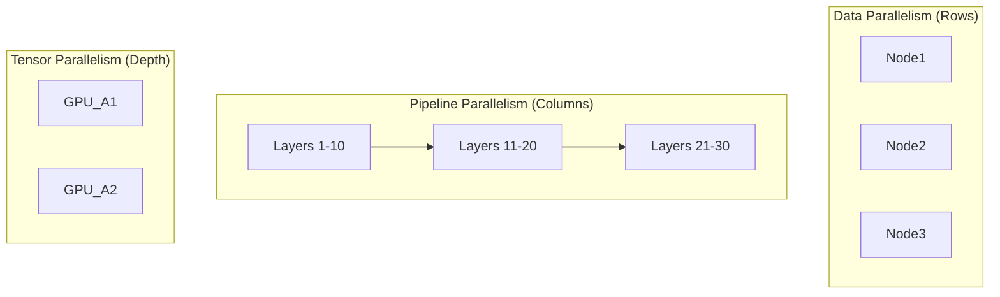

# 🚄 DeepSpeed & Megatron-LM: Engineering for Trillions
> **Level:** Extreme Advanced | **Language:** Hinglish | **Goal:** Master the deep-engineering frameworks used to train the world's largest models, exploring ZeRO Redundancy Optimizer, Pipeline Parallelism, 3D Parallelism, and the 2026 strategies for "Massive-scale" training.

---

## 🧭 1. Beginner-Friendly Hinglish Explanation
Bade AI models ko train karna ek "Management" problem hai.

- **The Problem:** Ek 175B model (GPT-3) ko store karne ke liye hi 700GB VRAM chahiye. Ek normal A100 GPU mein sirf 80GB hoti hai. Toh model ko "Rakhein" kahan?
- **DeepSpeed (by Microsoft)** aur **Megatron-LM (by NVIDIA)** ne iska hal nikala.
  - Unhone model ko "Tukdon" mein kaata aur alag-alag GPUs par phela diya.
  - **ZeRO (Zero Redundancy Optimizer):** Iska matlab hai ki agar 8 GPUs hain, toh har GPU model ka sirf $1/8$ hissa apne paas rakhega, par "Kaam" sab milkar karenge.

2026 mein, agar aapko "Supercomputer" par AI chalana hai, toh aapko ye dono frameworks aane hi chahiye. Ye "AI Engineering" ki backbone hain.

---

## 🧠 2. Deep Technical Explanation
Scaling training across thousands of GPUs requires **3D Parallelism.**

### 1. ZeRO (Zero Redundancy Optimizer) - DeepSpeed:
- **ZeRO-1:** Shards the Optimizer States across GPUs.
- **ZeRO-2:** Shards the Gradients as well.
- **ZeRO-3:** Shards the entire Model Parameters. 
- **Result:** You can train a model that is $100x$ larger than the VRAM of a single GPU.

### 2. Pipeline Parallelism (Megatron):
- Splitting the model's layers across GPUs. 
- **The Problem:** "Bubbles" (Idle time). While GPU 1 is processing layer 1, GPU 8 is waiting.
- **The Solution:** **Interleaved Pipeline Schedules**. Breaking a batch into "Micro-batches" so all GPUs are busy all the time.

### 3. Tensor Parallelism:
- Splitting a single "Linear Layer" (Matrix multiplication) across multiple GPUs. 
- Requires extremely fast **NVLink** connections because GPUs must talk to each other mid-calculation.

### 4. 3D Parallelism:
- Combining Data Parallelism + Pipeline Parallelism + Tensor Parallelism. This is how GPT-4 was trained.

---

## 🏗️ 3. DeepSpeed vs. Megatron-LM
| Feature | Microsoft DeepSpeed | NVIDIA Megatron-LM |
| :--- | :--- | :--- |
| **Philosophy** | Efficiency through 'Memory' (ZeRO) | Efficiency through 'Hardware' |
| **Ease of Use** | **High (Config via JSON)** | Low (Requires C++/CUDA knowledge) |
| **Secret Weapon**| **ZeRO-Offload (Use RAM/NVMe)** | Custom CUDA Kernels |
| **Framework** | PyTorch Wrapper | Raw PyTorch Optimization |
| **Best For** | Massive Models on limited GPUs | **Absolute Peak Performance** |

---

## 📐 4. Mathematical Intuition
- **The Memory Math of a 175B Model:** 
  - Parameters (FP16): $175B \times 2 = 350 GB$.
  - Gradients (FP16): $175B \times 2 = 350 GB$.
  - Optimizer States (Adam): $175B \times 12 = 2100 GB$.
  - **Total:** $\sim 2800 GB$.
  Without ZeRO, you would need $35$ A100 GPUs just to **Load** the model for training. With ZeRO-3, you can spread this $2800 GB$ across those 35 GPUs evenly.

---

## 📊 5. 3D Parallelism Grid (Diagram)


---

## 💻 6. Production-Ready Examples (Launching DeepSpeed Training)
```json
// 2026 Pro-Tip: Use a 'ds_config.json' to manage your training cluster.

{
  "fp16": { "enabled": true },
  "zero_optimization": {
    "stage": 3,
    "offload_optimizer": {
      "device": "cpu",
      "pin_memory": true
    },
    "overlap_comm": true,
    "contiguous_gradients": true
  },
  "train_batch_size": "auto",
  "gradient_accumulation_steps": "auto"
}
```
```bash
# Run the training across 8 GPUs
deepspeed --num_gpus=8 train.py --deepspeed ds_config.json
```

---

## ❌ 7. Failure Cases
- **The 'All-Reduce' Bottleneck:** If your network is slow (No InfiniBand), ZeRO-3 will be very slow because GPUs spend all their time "Syncing" weights over the network. **Fix: Use ZeRO-1 or ZeRO-2 if network is slow.**
- **Pipeline Bubbles:** If your model has very few layers, Pipeline Parallelism won't scale well.
- **CPU Offloading Latency:** Moving data to CPU RAM is $100x$ slower than VRAM. Your training will slow down significantly.

---

## 🛠️ 8. Debugging Guide
- **Symptom:** "Model training is slower than a single GPU."
- **Check:** **Communication vs. Computation ratio**. You are probably sharding a small model (7B) across too many nodes.
- **Symptom:** "Training crashes during 'Weight Syncing'."
- **Check:** **NCCL Timeout**. Increase the `NCCL_ASYNC_ERROR_HANDLING` environment variable.

---

## ⚖️ 9. Tradeoffs
- **ZeRO-3 (Max Memory) vs. ZeRO-1 (Max Speed):** Use ZeRO-3 only when the model doesn't fit.
- **Megatron-DeepSpeed:** A hybrid framework that combines NVIDIA's fast kernels with Microsoft's memory optimization. (The 2026 Choice).

---

## 🛡️ 10. Security Concerns
- **Cluster Isolation:** Ensure that your training data (which might contain company secrets) isn't "Leaked" into the temporary logs or debug dumps of the cluster.

---

## 📈 11. Scaling Challenges
- **The 1-Trillion Parameter Wall:** Beyond 1T parameters, even 3D parallelism starts to fail due to hardware failure rates. **Solution: Periodic 'Checkpointing' every 5 minutes.**

---

## 💸 12. Cost Considerations
- **Egress Costs:** If your GPUs are in two different "Availability Zones," the data transfer costs will be higher than the GPU cost! **Strategy: Always keep your cluster in a single 'Data Center Rack'.**

---

## ✅ 13. Best Practices
- **Use 'FlashAttention-2' with DeepSpeed:** This saves $50\%$ VRAM and increases speed by $2x$.
- **Enable 'Contiguous Gradients':** This reduces memory fragmentation.
- **Profile your training:** Use the **DeepSpeed Flops Profiler** to see where the bottleneck is.

---

## ⚠️ 14. Common Mistakes
- **No 'Overlap' of Communication:** Forgetting to enable `overlap_comm`, which allows the GPU to "Calculate" and "Send Data" at the same time.
- **Small Gradient Accumulation:** Not using enough `gradient_accumulation_steps`, which leads to unstable training.

---

## 📝 15. Interview Questions
1. **"Explain the three stages of ZeRO and how they reduce memory."**
2. **"What is a 'Pipeline Bubble' and how do you minimize it?"**
3. **"When would you use Tensor Parallelism over Data Parallelism?"**

---

## 🚀 15. Latest 2026 Industry Patterns
- **FP8 Training:** Using NVIDIA's H100 "Transformer Engine" to train in 8-bit, doubling the speed with zero loss in accuracy.
- **Auto-Parallelism:** AI frameworks that "Decide" the best 3D Parallelism strategy automatically based on your hardware.
- **Memory-Augmented Training:** Using high-speed NVMe SSDs as "Virtual VRAM" to train 10T parameter models on a single rack.
