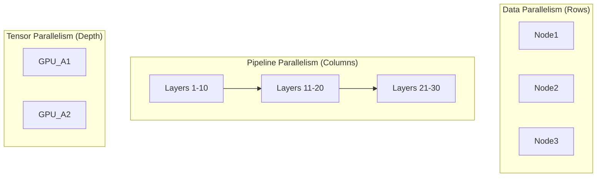

# 🚄 DeepSpeed & Megatron-LM: Engineering for Trillions
> **Level:** Extreme Advanced | **Language:** Hinglish | **Goal:** Dunya ke sabse bade models ko train karne ke liye use hone wale deep-engineering frameworks ko master karein, jisme ZeRO Redundancy Optimizer, Pipeline Parallelism, 3D Parallelism, aur 2026 mein "Massive-scale" training ki strategies shamil hain.

---

## 🧭 1. Beginner-Friendly Hinglish Explanation
Bade AI models ko train karna ek "Management" problem hai.

- **The Problem:** Ek 175B model (GPT-3) ko store karne ke liye hi 700GB VRAM chahiye. Ek normal A100 GPU mein sirf 80GB hoti hai. Toh model ko "Rakhein" kahan?
- **DeepSpeed (by Microsoft)** aur **Megatron-LM (by NVIDIA)** ne iska hal nikala.
  - Unhone model ko "Tukdon" mein kaata aur alag-alag GPUs par phela diya.
  - **ZeRO (Zero Redundancy Optimizer):** Iska matlab hai ki agar 8 GPUs hain, toh har GPU model ka sirf $1/8$ hissa apne paas rakhega, par "Kaam" sab milkar karenge.

2026 mein, agar aapko "Supercomputer" par AI chalana hai, toh aapko ye dono frameworks aane hi chahiye. Ye "AI Engineering" ki backbone hain.

---

## 🧠 2. Deep Technical Explanation
Hazaaron GPUs par training ko scale karne ke liye **3D Parallelism** ki zaroorat hoti hai.

### 1. ZeRO (Zero Redundancy Optimizer) - DeepSpeed:
- **ZeRO-1:** Optimizer States ko GPUs ke across shard (split) karta hai.
- **ZeRO-2:** Gradients ko bhi shard karta hai.
- **ZeRO-3:** Poore Model Parameters ko shard karta hai. 
- **Result:** Aap ek aisa model train kar sakte hain jo single GPU ki VRAM se $100x$ bada ho.

### 2. Pipeline Parallelism (Megatron):
- Model ki layers ko GPUs ke across split karna. 
- **The Problem:** "Bubbles" (Idle time). Jab GPU 1 layer 1 ko process kar raha hota hai, tab GPU 8 wait kar raha hota.
- **The Solution:** **Interleaved Pipeline Schedules**. Batch ko "Micro-batches" me break karna taaki sabhi GPUs har samay busy rahein.

### 3. Tensor Parallelism:
- Kisi single "Linear Layer" (Matrix multiplication) ko multiple GPUs ke across split karna. 
- Iske liye extremely fast **NVLink** connections ki need hoti hai kyunki calculation ke beech me GPUs ko ek-dusre se baat karni padti hai.

### 4. 3D Parallelism:
- Data Parallelism + Pipeline Parallelism + Tensor Parallelism ko combine karna. GPT-4 ko isi tarah train kiya gaya tha.

---

## 🏗️ 3. DeepSpeed vs. Megatron-LM
| Feature (Lakshan) | Microsoft DeepSpeed | NVIDIA Megatron-LM |
| :--- | :--- | :--- |
| **Philosophy** | Efficiency through 'Memory' (ZeRO) | Efficiency through 'Hardware' |
| **Ease of Use (Use karne me aasan)** | **High (JSON ke through config)** | Low (C++/CUDA knowledge ki need hoti hai) |
| **Secret Weapon**| **ZeRO-Offload (Use RAM/NVMe)** | Custom CUDA Kernels |
| **Framework** | PyTorch Wrapper | Raw PyTorch Optimization |
| **Best For (Kiske liye best hai)** | Limited GPUs par Massive Models | **Absolute Peak Performance** |

---

## 📐 4. Mathematical Intuition
- **The Memory Math of a 175B Model:** 
  - Parameters (FP16): $175B \times 2 = 350 GB$.
  - Gradients (FP16): $175B \times 2 = 350 GB$.
  - Optimizer States (Adam): $175B \times 12 = 2100 GB$.
  - **Total:** $\sim 2800 GB$.
  ZeRO ke bina, aapko training ke liye model ko sirf **Load** karne ke liye hi $35$ A100 GPUs ki need hogi. ZeRO-3 ke sath, aap is $2800 GB$ ko un 35 GPUs me evenly spread kar sakte hain.

---

## 📊 5. 3D Parallelism Grid (Diagram)

```mermaid
graph TD
    subgraph "Data Parallelism (Rows)"
    Node1 & Node2 & Node3
    end
    
    subgraph "Pipeline Parallelism (Columns)"
    Layer1[Layers 1-10] --> Layer2[Layers 11-20] --> Layer3[Layers 21-30]
    end
    
    subgraph "Tensor Parallelism (Depth)"
    GPU_A1 & GPU_A2
    end
```

---

## 💻 6. Production-Ready Examples (Launching DeepSpeed Training)
```json
// 2026 Pro-Tip: Apne training cluster ko manage karne ke liye 'ds_config.json' ka use karein.

{
  "fp16": { "enabled": true },
  "zero_optimization": {
    "stage": 3,
    "offload_optimizer": {
      "device": "cpu",
      "pin_memory": true
    },
    "overlap_comm": true,
    "contiguous_gradients": true
  },
  "train_batch_size": "auto",
  "gradient_accumulation_steps": "auto"
}
```
```bash
# 8 GPUs par training run karna
deepspeed --num_gpus=8 train.py --deepspeed ds_config.json
```

---

## ❌ 7. Failure Cases
- **The 'All-Reduce' Bottleneck:** Agar aapka network slow hai (No InfiniBand), toh ZeRO-3 bahut slow ho jayega kyunki GPUs apna poora time network par weights ko "Sync" karne me spend karte hain. **Fix: Agar network slow hai toh ZeRO-1 ya ZeRO-2 ka use karein.**
- **Pipeline Bubbles:** Agar aapke model me bahut kam layers hain, toh Pipeline Parallelism achhe se scale nahi hoga.
- **CPU Offloading Latency:** Data ko CPU RAM me move karna VRAM se $100x$ slow hota hai. Aapki training significantly slow ho jayegi.

---

## 🛠️ 8. Debugging Guide
- **Symptom:** "Model training single GPU se bhi slow hai."
- **Check:** **Communication vs. Computation ratio**. Aap shayad kisi small model (7B) ko bahut saare nodes ke across shard kar rahe hain.
- **Symptom:** " 'Weight Syncing' ke dauran training crash ho jati hai."
- **Check:** **NCCL Timeout**. `NCCL_ASYNC_ERROR_HANDLING` environment variable ko badhayein.

---

## ⚖️ 9. Tradeoffs
- **ZeRO-3 (Max Memory) vs. ZeRO-1 (Max Speed):** ZeRO-3 ka use tabhi karein jab model fit na ho raha ho.
- **Megatron-DeepSpeed:** Ek hybrid framework jo NVIDIA ke fast kernels ko Microsoft ke memory optimization ke sath combine karta hai. (2026 ki choice).

---

## 🛡️ 10. Security Concerns
- **Cluster Isolation:** Ensure karein ki aapka training data (jisme company secrets ho sakte hain) cluster ke temporary logs ya debug dumps me "Leak" na ho.

---

## 📈 11. Scaling Challenges
- **The 1-Trillion Parameter Wall:** 1T parameters ke beyond, hardware failure rates ki wajah se 3D parallelism bhi fail hone lagta hai. **Solution: Har 5 minutes me periodic 'Checkpointing' ka use karein.**

---

## 💸 12. Cost Considerations
- **Egress Costs:** Agar aapke GPUs do alag-alag "Availability Zones" me hain, toh data transfer costs GPU cost se bhi higher ho jayegi! **Strategy: Hamesha apne cluster ko ek hi 'Data Center Rack' me rakhein.**

---

## ✅ 13. Best Practices
- **Use 'FlashAttention-2' with DeepSpeed:** Ye $50\%$ VRAM save karta hai aur speed ko $2x$ badhata hai.
- **Enable 'Contiguous Gradients':** Ye memory fragmentation ko reduce karta hai.
- **Profile your training:** Bottleneck kahan hai ye dekhne ke liye **DeepSpeed Flops Profiler** ka use karein.

---

## ⚠️ 14. Common Mistakes
- **No 'Overlap' of Communication:** `overlap_comm` ko enable karna bhool jana, jo GPU ko ek hi time par "Calculate" aur "Send Data" karne ki permission deta hai.
- **Small Gradient Accumulation:** Sahi amount me `gradient_accumulation_steps` ka use na karna, jisse unstable training hoti hai.

---

## 📝 15. Interview Questions
1. **"ZeRO ke teen stages ko explain karein aur ye memory ko kaise reduce karte hain?"**
2. **" 'Pipeline Bubble' kya hai aur aap ise kaise minimize karte hain?"**
3. **"Aap Data Parallelism ke upar Tensor Parallelism ka use kab karenge?"**

---

## 🚀 16. Latest 2026 Industry Patterns
- **FP8 Training:** Using NVIDIA's H100 "Transformer Engine" to train in 8-bit, doubling the speed with zero loss in accuracy.
- **Auto-Parallelism:** AI frameworks that "Decide" the best 3D Parallelism strategy automatically based on your hardware.
- **Memory-Augmented Training:** Using high-speed NVMe SSDs as "Virtual VRAM" to train 10T parameter models on a single rack.
