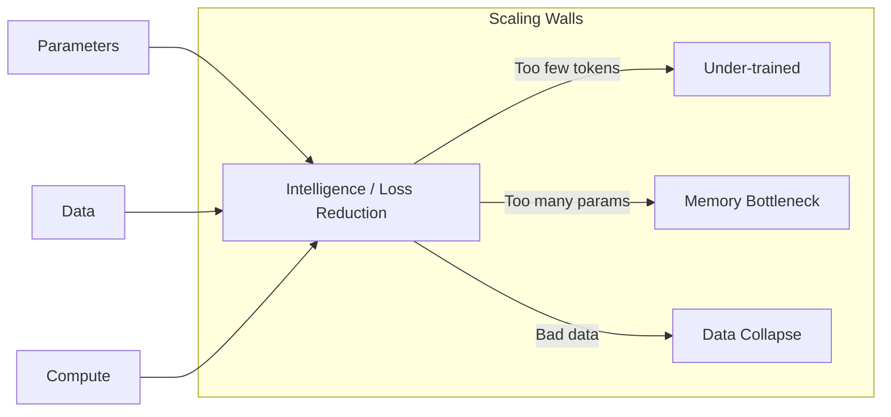

# 🚀 Modern LLMs & LLM Scaling: The Billion-Parameter Frontier
> **Level:** Advanced | **Language:** Hinglish | **Goal:** Master the concepts behind scaling large models, exploring Scaling Laws, Chinchilla Optimality, Mixture of Experts (MoE), and the 2026 strategies for building "Sovereign-scale" AI.

---

## 🧭 1. Beginner-Friendly Hinglish Explanation
Model ko "Bada" banana kyu zaroori hai? 

- **The Observation:** Jaise-jaise hum model mein zyada "Neurons" (Parameters) aur zyada "Data" (Tokens) daalte hain, model ki "Intelligence" sudden badh jati hai. Isse hum **Emergent Abilities** kehte hain.
- **The Problem:** 70B ya 400B model ko ek single computer par train nahi kiya ja sakta. 
- **The Solution:** Humein model ko "Tukdon" (Parallelism) mein todna padta hai aur hazaron GPUs ko ek saath chalana padta hai.

2026 mein, "Scaling" sirf GPUs badhane ka naam nahi hai, ye **mixture-of-experts (MoE)** jaise smart tareekon se efficiency badhane ka naam hai.

---

## 🧠 2. Deep Technical Explanation
Scaling an LLM requires balancing **Compute**, **Data**, and **Parameters.**

### 1. Scaling Laws (Kaplan vs. Chinchilla):
- **Kaplan (2020):** Suggested that more parameters are always better.
- **Chinchilla (2022):** Proved that most models are actually "Under-trained." To get the best performance, you should scale Data and Parameters **equally.** 
  - For every $10x$ increase in compute, you should increase parameters by $3.16x$ and data by $3.16x$.

### 2. Mixture of Experts (MoE):
- Instead of a solid "Dense" model where every neuron works on every word, an MoE model has **Specialist Layers.**
- For a specific word, only $2$ out of $16$ experts might "Fire."
- **Result:** You get the intelligence of a 1 Trillion parameter model but the speed of a 100 Billion parameter model.

### 3. Training Stability:
- As models scale, they become "Unstable" (Loss Spikes). 
- **Fixes:** Using **RMSNorm** instead of LayerNorm, **RoPE** for positions, and **FlashAttention** for speed.

### 4. Data Scaling:
- Moving from 1 Trillion tokens (Llama-1) to 15 Trillion tokens (Llama-3). 
- **Synthetic Data:** Using AI to generate high-quality math and code data to train the next generation of AI.

---

## 🏗️ 3. Dense vs. MoE Architecture
| Feature | Dense Model (Llama-3) | MoE Model (Mixtral / GPT-4) |
| :--- | :--- | :--- |
| **Computation** | All neurons active | **Only a few experts active** |
| **VRAM Requirement**| High | **Extreme (Needs all weights in VRAM)**|
| **Inference Speed** | Slower (per parameter) | **Faster (per parameter)** |
| **Training Complexity**| Moderate | **High (Expert balancing issues)** |
| **Intelligence** | High | **Very High (Diverse experts)** |

---

## 📐 4. Mathematical Intuition
- **The Chinchilla Formula:** 
  The optimal number of tokens $D$ for a model with $N$ parameters is roughly:
  $$D \approx 20 \times N$$
  - If you have a **7B** model, you should train it on at least **140B** tokens.
  - Llama-3-8B was trained on **15T** tokens ($1800 \times N$), making it "Over-trained" and extremely powerful for its size.

---

## 📊 5. LLM Scaling Trend (Diagram)


---

## 💻 6. Production-Ready Examples (Conceptual: Calculating Training Time)
```python
# 2026 Pro-Tip: Always calculate the 'GPU Days' before starting a project.

def calculate_training_days(params_billion, tokens_trillion, gpu_count, tflops_per_gpu):
    # Rule of thumb: 6 * N * D floating point operations
    total_flops = 6 * (params_billion * 1e9) * (tokens_trillion * 1e12)
    
    # Effective TFLOPS (assuming 40% MFU)
    effective_tflops = tflops_per_gpu * gpu_count * 0.40 * 1e12
    
    seconds = total_flops / effective_tflops
    days = seconds / (60 * 60 * 24)
    
    return days

# Training a 70B model on 2T tokens with 512 H100s:
# ~15 to 20 Days! 💸
```

---

## ❌ 7. Failure Cases
- **Expert Collapse (MoE):** In MoE training, sometimes $1$ expert gets chosen for $99\%$ of the words, and the other $15$ experts learn nothing. **Fix: Use 'Load Balancing Loss'.**
- **Data Contamination:** The model is "Too good" on benchmarks because the benchmark questions were in the training data.
- **Catastrophic Loss Spikes:** The model's "Loss" suddenly jumps to infinity in the middle of a \$1M training run. **Fix: Automated 'Rollback' to the last checkpoint.**

---

## 🛠️ 8. Debugging Guide
- **Symptom:** "Model is repeating sentences verbatim from the internet."
- **Check:** **Data Duplication**. Your dataset has the same 1000 pages repeated 1 million times. Deduplicate your data!
- **Symptom:** "Model is losing intelligence after scaling up parameters."
- **Check:** **Learning Rate**. For larger models, you need a **Smaller** learning rate.

---

## ⚖️ 9. Tradeoffs
- **Bigger Model vs. More Data:** 
  - Bigger model is smarter but slower. 
  - More data on a smaller model is faster but has a "Ceiling" of intelligence.
- **MoE vs. Dense:** MoE is the future of "Large" models, Dense is the future of "Edge" models.

---

## 🛡️ 10. Security Concerns
- **Poisoning at Scale:** If 1% of your 15T tokens contain "Malicious logic," the model might become a security risk.

---

## 📈 11. Scaling Challenges
- **The 'Token' Shortage:** We are running out of high-quality human text on the internet. **2026 Solution: Multi-modal data (Video/Audio) and Synthetic Data (AI-to-AI).**

---

## 💸 12. Cost Considerations
- **Training a 'Frontier' Model:** Costs roughly **$\$100M - \$500M$** in 2026. This is why only 5-10 companies can do it.

---

## ✅ 13. Best Practices
- **Standardize Data Cleaning:** Use **MinHash** and **LSH** for deduplication.
- **Monitor MFU (Model Flops Utilization):** If it's below $30\%$, you are wasting money.
- **Small-scale Proxy Training:** Train a 100M model first to find the best hyperparameters before launching the 70B run.

---

## ⚠️ 14. Common Mistakes
- **Ignoring the 'Communication' overhead:** Adding more GPUs doesn't always make training faster if the network is slow.
- **Scaling without 'Evaluation':** Not checking the model's accuracy until the very end of a 3-month training run.

---

## 📝 15. Interview Questions
1. **"What is 'Chinchilla Optimality' and how does it affect data collection?"**
2. **"Explain the 'Mixture of Experts' (MoE) architecture and its benefits."**
3. **"What are 'Emergent Abilities' in LLMs?"**

---

## 🚀 15. Latest 2026 Industry Patterns
- **Infinite Context Scaling:** Using **Ring Attention** and **FlashAttention-3** to handle 10-Million+ token contexts.
- **Sparse Autoencoders:** Using AI to understand what each "Expert" in an MoE model is actually doing.
- **Speculative Training:** Using a small model to "Simulate" the big model's training to find errors early.
