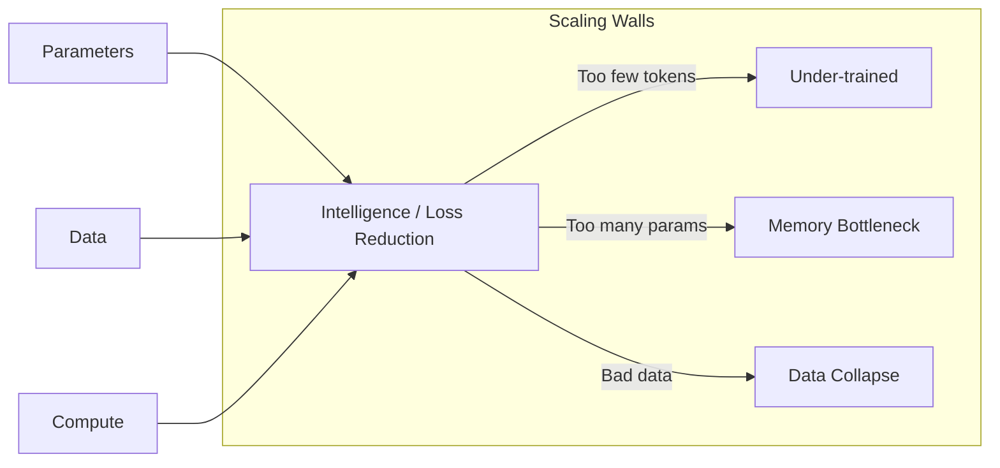

# 🚀 Modern LLMs & LLM Scaling: The Billion-Parameter Frontier
> **Level:** Advanced | **Language:** Hinglish | **Goal:** Large models ko scale karne ke concepts ko master karein, jisme Scaling Laws, Chinchilla Optimality, Mixture of Experts (MoE), aur 2026 mein "Sovereign-scale" AI build karne ki strategies shamil hain.

---

## 🧭 1. Beginner-Friendly Hinglish Explanation
Model ko "Bada" banana kyu zaroori hai? 

- **The Observation:** Jaise-jaise hum model mein zyada "Neurons" (Parameters) aur zyada "Data" (Tokens) daalte hain, model ki "Intelligence" sudden badh jati hai. Isse hum **Emergent Abilities** kehte hain.
- **The Problem:** 70B ya 400B model ko ek single computer par train nahi kiya ja sakta. 
- **The Solution:** Humein model ko "Tukdon" (Parallelism) mein todna padta hai aur hazaron GPUs ko ek saath chalana padta hai.

2026 mein, "Scaling" sirf GPUs badhane ka naam nahi hai, ye **mixture-of-experts (MoE)** jaise smart tareekon se efficiency badhane ka naam hai.

---

## 🧠 2. Deep Technical Explanation
LLM ko scale karne ke liye **Compute**, **Data**, aur **Parameters** ke beech ek balance banana zaroori hota hai.

### 1. Scaling Laws (Kaplan vs. Chinchilla):
- **Kaplan (2020):** Inhone suggest kiya tha ki parameters jitne zyada honge, model utna hi behtar hoga.
- **Chinchilla (2022):** Inhone prove kiya ki zyada tar models actually "Under-trained" hote hain. Best performance paane ke liye humein Data aur Parameters dono ko **equally** scale karna chahiye.
  - Compute mein har $10x$ increase ke liye, humein parameters ko $3.16x$ aur data ko $3.16x$ se badhana chahiye.

### 2. Mixture of Experts (MoE):
- Ek standard "Dense" model ki jagah, jahan har ek neuron har word par kaam karta hai, MoE model mein **Specialist Layers** hoti hain.
- Kisi specific word ke liye, 16 mein se sirf $2$ experts hi "Fire" ya active hote hain.
- **Result:** Isse aapko ek 1 Trillion parameter model jitni intelligence milti hai, lekin speed ek 100 Billion parameter model jitni hi rehti hai.

### 3. Training Stability:
- Jaise-jaise models scale hote hain, wo "Unstable" ho jaate hain (Loss Spikes aane lagte hain).
- **Fixes:** LayerNorm ki jagah **RMSNorm** use karna, positions ke liye **RoPE** use karna, aur speed ke liye **FlashAttention** use karna.

### 4. Data Scaling:
- Llama-1 ke 1 Trillion tokens se Llama-3 ke 15 Trillion tokens tak ka shift dekhne ko mila hai.
- **Synthetic Data:** AI ka use karke high-quality math aur code data generate karna taaki next generation ke AI models ko train kiya ja sake.

---

## 🏗️ 3. Dense vs. MoE Architecture
| Feature | Dense Model (Llama-3) | MoE Model (Mixtral / GPT-4) |
| :--- | :--- | :--- |
| **Computation** | Saare neurons active hote hain | **Sirf kuch experts active hote hain** |
| **VRAM Requirement**| High | **Extreme (Saare weights ko VRAM mein rakhna padta hai)**|
| **Inference Speed** | Slower (per parameter basis par) | **Faster (per parameter basis par)** |
| **Training Complexity**| Moderate | **High (Expert balancing issues aate hain)** |
| **Intelligence** | High | **Very High (Alag-alag tarah ke experts)** |

---

## 📐 4. Mathematical Intuition
- **The Chinchilla Formula:**
  $N$ parameters wale model ke liye optimal number of tokens $D$ lagbhag ye hota hai:
  $$D \approx 20 \times N$$
  - Agar aapke paas ek **7B** model hai, to aapko use kam se kam **140B** tokens par train karna chahiye.
  - Llama-3-8B ko **15T** tokens ($1800 \times N$) par train kiya gaya tha, jisne ise iske size ke hisab se "Over-trained" aur behad powerful bana diya.

---

## 📊 5. LLM Scaling Trend (Diagram)

```mermaid
graph LR
    P[Parameters] & D[Data] & C[Compute] --> S[Intelligence / Loss Reduction]
    
    subgraph "Scaling Walls"
    S -- "Too few tokens" --> UT[Under-trained]
    S -- "Too many params" --> MB[Memory Bottleneck]
    S -- "Bad data" --> DC[Data Collapse]
    end
```

---

## 💻 6. Production-Ready Examples (Conceptual: Calculating Training Time)
```python
# 2026 Pro-Tip: Project start karne se pehle hamesha 'GPU Days' calculate karein.

def calculate_training_days(params_billion, tokens_trillion, gpu_count, tflops_per_gpu):
    # Rule of thumb: 6 * N * D floating point operations
    total_flops = 6 * (params_billion * 1e9) * (tokens_trillion * 1e12)
    
    # Effective TFLOPS (40% MFU assume karte hue)
    effective_tflops = tflops_per_gpu * gpu_count * 0.40 * 1e12
    
    seconds = total_flops / effective_tflops
    days = seconds / (60 * 60 * 24)
    
    return days

# 70B model ko 2T tokens par 512 H100s ke saath train karna:
# ~15 to 20 Days! 💸
```

---

## ❌ 7. Failure Cases
- **Expert Collapse (MoE):** MoE training mein, kabhi-kabhi $1$ expert hi $99\%$ words ke liye select hone lagta hai, aur baaki ke $15$ experts kuch nahi seekh paate. **Fix: 'Load Balancing Loss' use karein.**
- **Data Contamination:** Model benchmarks par "Too good" (bahut achha) perform karta hai kyunki benchmark ke questions training data mein pehle se present the.
- **Catastrophic Loss Spikes:** Ek \$1M training run ke beech mein model ka "Loss" achanak se infinity par jump kar jaata hai. **Fix: Last checkpoint par automated 'Rollback' karein.**

---

## 🛠️ 8. Debugging Guide
- **Symptom:** "Model internet se verbatim (exact wahi) sentences repeat kar raha hai."
- **Check:** **Data Duplication**. Aapke dataset mein wahi same 1000 pages 1 million baar repeat ho rahe hain. Apne data ko deduplicate karein!
- **Symptom:** "Parameters scale up karne ke baad model ki intelligence kam ho rahi hai."
- **Check:** **Learning Rate**. Larger models ke liye, aapko **Smaller** (kam) learning rate ki zaroorat hoti hai.

---

## ⚖️ 9. Tradeoffs
- **Bigger Model vs. More Data:**
  - Bada model zyada smart hota hai lekin slow hota hai.
  - Smaller model ko zyada data par train karna faster hota hai, lekin uski intelligence ki ek "Ceiling" (limit) hoti hai.
- **MoE vs. Dense:** MoE "Large" models ka future hai, jabki Dense "Edge" (local devices) models ka future hai.

---

## 🛡️ 10. Security Concerns
- **Poisoning at Scale:** Agar aapke 15T tokens ka 1% part bhi "Malicious logic" (kharaab code/content) contain karta hai, to model ek security risk ban sakta hai.

---

## 📈 11. Scaling Challenges
- **The 'Token' Shortage:** Internet par high-quality human text khatam ho raha hai. **2026 Solution: Multi-modal data (Video/Audio) aur Synthetic Data (AI-to-AI).**

---

## 💸 12. Cost Considerations
- **Training a 'Frontier' Model:** 2026 mein iski cost lagbhag **$\$100M - \$500M$** aati hai. Yahi wajah hai ki sirf 5-10 companies hi ise afford kar sakti hain.

---

## ✅ 13. Best Practices
- **Standardize Data Cleaning:** Deduplication ke liye **MinHash** aur **LSH** ka use karein.
- **Monitor MFU (Model Flops Utilization):** Agar ye $30\%$ se neeche hai, to aap paise waste kar rahe hain.
- **Small-scale Proxy Training:** 70B run launch karne se pehle best hyperparameters find karne ke liye pehle ek 100M model train karein.

---

## ⚠️ 14. Common Mistakes
- **Ignoring the 'Communication' overhead:** Agar network slow hai, to sirf zyada GPUs add karne se training speed hamesha nahi badhegi.
- **Scaling without 'Evaluation':** 3-month ki training run ke bilkul end tak model ki accuracy ko evaluate na karna.

---

## 📝 15. Interview Questions
1. **"Chinchilla Optimality kya hai aur ye data collection ko kaise affect karti hai?"**
2. **"Mixture of Experts (MoE) architecture aur iske benefits ko explain karein."**
3. **"LLMs mein 'Emergent Abilities' kya hoti hain?"**

---

## 🚀 15. Latest 2026 Industry Patterns
- **Infinite Context Scaling:** 10-Million+ token contexts ko handle karne ke liye **Ring Attention** aur **FlashAttention-3** ka use karna.
- **Sparse Autoencoders:** AI ka use karke ye samajhna ki MoE model mein har ek "Expert" actually kya kar raha hai.
- **Speculative Training:** Errors ko shuruat mein hi pakadne ke liye big model ki training ko "Simulate" karne ke liye ek chote model ka use karna.

