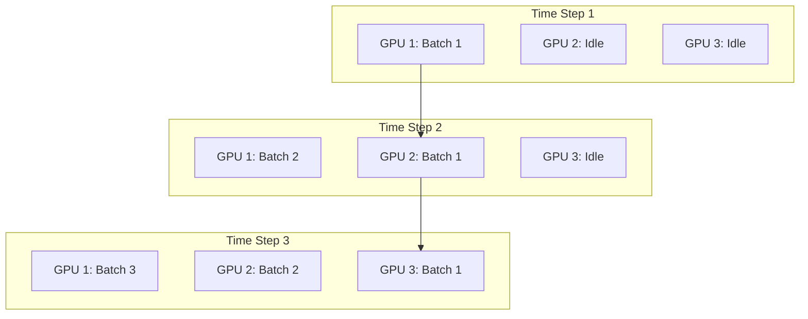

# 🧱 Pipeline Parallelism: The Assembly Line
> **Level:** Advanced | **Language:** Hinglish | **Goal:** Master the art of splitting model layers across multiple GPUs and nodes, exploring Micro-batches, Pipeline Bubbles, and the 2026 strategies for massive-scale training and inference.

---

## 🧭 1. Beginner-Friendly Hinglish Explanation
Sochiye ek Car Factory hai. 
- Car banane ke 4 stages hain: 1. Engine, 2. Body, 3. Paint, 4. Testing.
- Agar ek hi aadmi (GPU) poori car banaye, toh wo bahut slow hoga.
- **Pipeline Parallelism** ka matlab hai: "Ek GPU Engine lagayega, dusra Body, teesra Paint, aur choutha Testing."

**The Problem (The Bubble):** 
Jab GPU-1 Engine laga raha hai, tab GPU-2 (Body) khali baitha hai. Jab GPU-2 kaam shuru karta hai, tab GPU-1 free ho jata hai. Is "Khali time" ko hum **"Bubble"** kehte hain.
- **Solution:** Hum ek saath 10 cars factory mein bhej dete hain. Jab pehli car stage 2 par hoti hai, tab dusri car stage 1 par aa jati hai. Isse saare GPUs hamesha busy rehte hain.

Pipeline Parallelism ka use tab hota hai jab model itna bada ho ki wo ek server mein bhi na aaye (e.g., 400B model).

---

## 🧠 2. Deep Technical Explanation
Pipeline Parallelism (PP) splits the model's layers across multiple devices (Nodes).

### 1. Vertical Splitting:
- Instead of splitting a single layer (like Tensor Parallelism), PP splits the **Depth** of the model.
- GPU 0: Layers 1-20
- GPU 1: Layers 21-40
- ... and so on.

### 2. The Micro-batching Solution:
- To reduce the idle time (The Bubble), we divide a single "Batch" into many small **"Micro-batches."**
- This is called the **Pipeline Schedule** (e.g., GPipe or PipeDream).
- As soon as GPU 0 finishes micro-batch 1, it passes it to GPU 1 and starts working on micro-batch 2.

### 3. Inter-node Communication:
- Unlike Tensor Parallelism, which needs NVLink (inside one box), PP can work over **InfiniBand** or even high-speed Ethernet because communication only happens at the "Boundaries" between groups of layers.

---

## 🏗️ 3. PP vs. TP vs. DP
| Feature | Pipeline Parallel (PP) | Tensor Parallel (TP) | Data Parallel (DP) |
| :--- | :--- | :--- | :--- |
| **What is split?** | Layers (Depth) | Tensors (Width) | Data (Batch) |
| **Communication** | Low (Boundary only) | High (Every layer) | Moderate (End of step) |
| **Latency** | Higher | **Lowest** | Moderate |
| **Hardware** | Ethernet / InfiniBand | **NVLink mandatory** | Standard Network |
| **Complexity** | High (Scheduling) | **Extreme (Kernel)** | Simple |

---

## 📐 4. Mathematical Intuition
- **The Pipeline Bubble Formula:**
  If you have $D$ devices (stages) and $M$ micro-batches:
  $$\text{Bubble Fraction} = \frac{D - 1}{M}$$
  - To make the bubble small, $M$ must be much larger than $D$. 
  - *Example:* If you have 4 GPUs and 40 micro-batches, the bubble is only $\sim 7.5\%$. If you have only 1 batch, the bubble is $75\%$.

---

## 📊 5. Pipeline Scheduling (Diagram)


---

## 💻 6. Production-Ready Examples (Conceptual PP Setup)
```python
# 2026 Pro-Tip: Use 'DeepSpeed' or 'Megatron' for automatic pipelining.

import torch.nn as nn

# A simplified Pipeline Model
class PipelineModel(nn.Module):
    def __init__(self, layers_per_gpu):
        super().__init__()
        # In reality, these would be on different devices
        self.stage1 = nn.Sequential(*[nn.Linear(1024, 1024) for _ in range(layers_per_gpu)])
        self.stage2 = nn.Sequential(*[nn.Linear(1024, 1024) for _ in range(layers_per_gpu)])

    def forward(self, x):
        # 1. GPU 0 processes
        x = self.stage1(x.to('cuda:0'))
        # 2. Data travels across the network (Interconnect)
        x = x.to('cuda:1')
        # 3. GPU 1 processes
        x = self.stage2(x)
        return x
```

---

## ❌ 7. Failure Cases
- **Load Imbalance:** If GPU 1 has 5 complex layers and GPU 2 has 5 simple layers, GPU 2 will always be waiting for GPU 1. **Fix: Profile execution time and re-balance layers.**
- **Inter-node Latency:** If the network cable between Node A and Node B is slow, the whole pipeline slows down to that speed.
- **Memory Imbalance:** The first and last GPUs in the pipeline often use more memory for "Inputs" and "Loss calculation."

---

## 🛠️ 8. Debugging Guide
- **Symptom:** "Low GPU Utilization (e.g. 30%)."
- **Check:** **Micro-batch size**. If you have too few micro-batches, the "Bubble" is too large. Increase $M$.
- **Symptom:** "Stale Gradients" or "Divergence."
- **Check:** **Weight Sync**. Ensure you are using a synchronous schedule like **1F1B (One Forward, One Backward)** to keep weights consistent.

---

## ⚖️ 9. Tradeoffs
- **Memory vs. Latency:** PP is great for saving memory (each GPU only stores $1/N$ of the model), but it increases the "Total Time" for one request to finish.
- **PP vs. Offloading:** PP is $100x$ faster than "Offloading weights to CPU RAM."

---

## 🛡️ 10. Security Concerns
- **Model Stealing:** In a multi-tenant cloud, if an attacker owns "Node 2" in your pipeline, they can see the "Intermediate Activations," which can be used to reverse-engineer your model logic.

---

## 📈 11. Scaling Challenges
- **The 'T-bone' Bottleneck:** In 2026, we combine TP (inside node) and PP (between nodes). If the TP part is too fast and the PP part (network) is too slow, the system is always waiting on the network.

---

## 💸 12. Cost Considerations
- **Networking Cost:** PP requires high-end networking (InfiniBand/RoCE). Buying standard Ethernet servers might save money upfront but will make PP unusable for large models.

---

## ✅ 13. Best Practices
- **Use 'Activation Checkpointing':** Instead of saving all "Activations" for the backward pass (which uses huge VRAM), re-calculate them when needed. This is perfect for PP.
- **1F1B Schedule:** Use the 1-Forward-1-Backward schedule to minimize the memory peak during training.
- **Heterogeneous Pipelines:** In 2026, we can put "Hard" layers on H100s and "Easy" layers on cheaper A100s to save money.

---

## ⚠️ 14. Common Mistakes
- **Assuming PP is for speed:** PP is for **Memory**. If your model fits on one GPU, PP will almost always be slower than single-GPU training.
- **Ignoring the Optimizer:** In PP, the Optimizer update only happens at the end of the full batch. Don't forget to sync the master weights.

---

## 📝 15. Interview Questions
1. **"What is a 'Pipeline Bubble' and how do micro-batches solve it?"**
2. **"Difference between GPipe and PipeDream schedules?"**
3. **"Why is communication less frequent in PP compared to Tensor Parallelism?"**

---

## 🚀 15. Latest 2026 Industry Patterns
- **Asynchronous Pipelines:** New schedules that allow for "overlapping" the next training step before the current one is fully finished.
- **Interleaved Pipelines:** Splitting the model into even smaller chunks (e.g., 2 chunks per GPU) to reduce the bubble size further.
- **Virtual Pipeline Stages:** In 2026, we use "Software-defined stages" that can move between GPUs dynamically if one GPU starts overheating.
