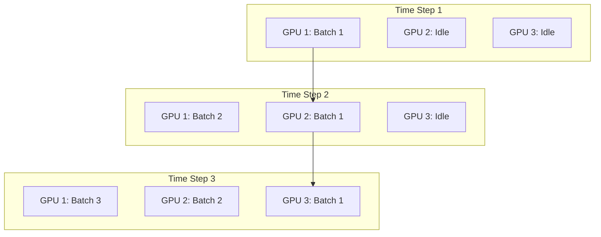

# 🧱 Pipeline Parallelism: The Assembly Line
> **Level:** Advanced | **Language:** Hinglish | **Goal:** Multiple GPUs aur nodes par model layers ko split karne ki art ko master karein, jisme Micro-batches, Pipeline Bubbles, aur 2026 mein massive-scale training aur inference ki strategies shamil hain.

---

## 🧭 1. Beginner-Friendly Hinglish Explanation
Sochiye ek Car Factory hai. 
- Car banane ke 4 stages hain: 1. Engine, 2. Body, 3. Paint, 4. Testing.
- Agar ek hi aadmi (GPU) poori car banaye, toh wo bahut slow hoga.
- **Pipeline Parallelism** ka matlab hai: "Ek GPU Engine lagayega, dusra Body, teesra Paint, aur choutha Testing."

**The Problem (The Bubble):** 
Jab GPU-1 Engine laga raha hai, tab GPU-2 (Body) khali baitha hai. Jab GPU-2 kaam shuru karta hai, tab GPU-1 free ho jata hai. Is "Khali time" ko hum **"Bubble"** kehte hain.
- **Solution:** Hum ek saath 10 cars factory mein bhej dete hain. Jab pehli car stage 2 par hoti hai, tab dusri car stage 1 par aa jati hai. Isse saare GPUs hamesha busy rehte hain.

Pipeline Parallelism ka use tab hota hai jab model itna bada ho ki wo ek server mein bhi na aaye (e.g., 400B model).

---

## 🧠 2. Deep Technical Explanation
Pipeline Parallelism (PP) model ki layers ko multiple devices (Nodes) ke beech split kar deta hai.

### 1. Vertical Splitting:
- Ek single layer ko split karne ki jagah (jaise Tensor Parallelism mein hota hai), PP model ki **Depth** (gehrai/layers) ko split karta hai.
- GPU 0: Layers 1-20
- GPU 1: Layers 21-40
- ... aur isi tarah aage.

### 2. The Micro-batching Solution:
- Idle time (The Bubble) ko kam karne ke liye, hum ek single "Batch" ko bahut saare chhote **"Micro-batches"** mein divide kar dete hain.
- Ise **Pipeline Schedule** kaha jata hai (jaise GPipe ya PipeDream).
- Jaise hi GPU 0 micro-batch 1 ka kaam khatam karta hai, wo use GPU 1 ko pass kar deta hai aur micro-batch 2 par kaam shuru kar deta hai.

### 3. Inter-node Communication:
- Tensor Parallelism ke opposite (jisme ek hi box ke andar NVLink ki zaroorat hoti hai), PP **InfiniBand** ya high-speed Ethernet par bhi kaam kar sakta hai kyunki communication sirf layer groups ke beech ki "Boundaries" par hi hota hai.

---

## 🏗️ 3. PP vs. TP vs. DP
| Feature | Pipeline Parallel (PP) | Tensor Parallel (TP) | Data Parallel (DP) |
| :--- | :--- | :--- | :--- |
| **What is split?** | Layers (Depth) | Tensors (Width) | Data (Batch) |
| **Communication** | Low (Sirf boundary par) | High (Har layer par) | Moderate (Step ke end mein) |
| **Latency** | Higher | **Lowest** | Moderate |
| **Hardware** | Ethernet / InfiniBand | **NVLink mandatory** | Standard Network |
| **Complexity** | High (Scheduling) | **Extreme (Kernel level)** | Simple |

---

## 📐 4. Mathematical Intuition
- **The Pipeline Bubble Formula:**
  Agar aapke paas $D$ devices (stages) hain aur $M$ micro-batches hain:
  $$\text{Bubble Fraction} = \frac{D - 1}{M}$$
  - Bubble ko chhota rakhne ke liye, $M$ ko $D$ se bahut bada hona chahiye.
  - *Example:* Agar aapke paas 4 GPUs aur 40 micro-batches hain, to bubble sirf $\sim 7.5\%$ hota hai. Agar aapke paas sirf 1 batch hai, to bubble $75\%$ ho jayega.

---

## 📊 5. Pipeline Scheduling (Diagram)

```mermaid
graph TD
    subgraph "Time Step 1"
    G1_1[GPU 1: Batch 1]
    G2_1[GPU 2: Idle]
    G3_1[GPU 3: Idle]
    end
    
    subgraph "Time Step 2"
    G1_2[GPU 1: Batch 2]
    G2_2[GPU 2: Batch 1]
    G3_2[GPU 3: Idle]
    end
    
    subgraph "Time Step 3"
    G1_3[GPU 1: Batch 3]
    G2_3[GPU 2: Batch 2]
    G3_3[GPU 3: Batch 1]
    end
    
    G1_1 --> G2_2 --> G3_3
```

---

## 💻 6. Production-Ready Examples (Conceptual PP Setup)
```python
# 2026 Pro-Tip: Automatic pipelining ke liye 'DeepSpeed' ya 'Megatron' ka use karein.

import torch.nn as nn

# Ek simplified Pipeline Model
class PipelineModel(nn.Module):
    def __init__(self, layers_per_gpu):
        super().__init__()
        # Reality mein ye alag-alag devices par honge
        self.stage1 = nn.Sequential(*[nn.Linear(1024, 1024) for _ in range(layers_per_gpu)])
        self.stage2 = nn.Sequential(*[nn.Linear(1024, 1024) for _ in range(layers_per_gpu)])

    def forward(self, x):
        # 1. GPU 0 process karta hai
        x = self.stage1(x.to('cuda:0'))
        # 2. Data network (Interconnect) ke throw travel karta hai
        x = x.to('cuda:1')
        # 3. GPU 1 process karta hai
        x = self.stage2(x)
        return x
```

---

## ❌ 7. Failure Cases
- **Load Imbalance:** Agar GPU 1 ke paas 5 complex layers hain aur GPU 2 ke paas 5 simple layers hain, to GPU 2 hamesha GPU 1 ka wait karta rahega. **Fix: Execution time ko profile karein aur layers ko re-balance karein.**
- **Inter-node Latency:** Agar Node A aur Node B ke beech ki network cable slow hai, to poora pipeline usi slow speed par chalne lagega.
- **Memory Imbalance:** Pipeline ke pehle aur aakhri GPUs aksar "Inputs" aur "Loss calculation" ke liye zyada memory use karte hain.

---

## 🛠️ 8. Debugging Guide
- **Symptom:** "Low GPU Utilization (jaise ki 30%)."
- **Check:** **Micro-batch size**. Agar aapke paas bahut kam micro-batches hain, to "Bubble" bahut bada ho jayega. $M$ ko badhayein.
- **Symptom:** "Stale Gradients" ya "Divergence."
- **Check:** **Weight Sync**. Weights ko consistent rakhne ke liye check karein ki aap **1F1B (One Forward, One Backward)** jaisa synchronous schedule use kar rahe hain.

---

## ⚖️ 9. Tradeoffs
- **Memory vs. Latency:** PP memory bachane ke liye bahut badhiya hai (har GPU model ka sirf $1/N$ part hi store karta hai), lekin ye ek request ko complete karne ke "Total Time" (latency) ko badha deta hai.
- **PP vs. Offloading:** PP "weights ko CPU RAM par offload karne" se $100x$ faster hota hai.

---

## 🛡️ 10. Security Concerns
- **Model Stealing:** Ek multi-tenant cloud mein, agar kisi attacker ke paas aapke pipeline ka "Node 2" hai, to wo "Intermediate Activations" ko dekh sakta hai, jiska use karke aapke model logic ko reverse-engineer kiya ja sakta hai.

---

## 📈 11. Scaling Challenges
- **The 'T-bone' Bottleneck:** 2026 mein, hum TP (inside node) aur PP (between nodes) ko combine karte hain. Agar TP part bahut fast hai aur PP part (network) bahut slow hai, to system hamesha network ka wait karta rahega.

---

## 💸 12. Cost Considerations
- **Networking Cost:** PP ke liye high-end networking (InfiniBand/RoCE) ki zaroorat hoti hai. Standard Ethernet servers khareedne se shuruat mein paise bach sakte hain, lekin ye large models ke liye PP ko unusable bana dega.

---

## ✅ 13. Best Practices
- **Use 'Activation Checkpointing':** Backward pass ke liye saare "Activations" ko save karne ki jagah (jisse bahut zyada VRAM use hota hai), zaroorat padne par unhe fir se calculate karein. Ye PP ke liye perfect hai.
- **1F1B Schedule:** Training ke dauran memory peak ko minimize karne ke liye 1-Forward-1-Backward schedule ka use karein.
- **Heterogeneous Pipelines:** 2026 mein, paise bachane ke liye hum "Hard" layers ko H100s par aur "Easy" layers ko saste A100s par rakh sakte hain.

---

## ⚠️ 14. Common Mistakes
- **Assuming PP is for speed:** PP **Memory** ke liye hota hai. Agar aapka model ek single GPU par fit ho sakta hai, to PP almost always single-GPU training se slow hi hoga.
- **Ignoring the Optimizer:** PP mein, Optimizer update sirf full batch ke end mein hi hota hai. Master weights ko sync karna na bhoolen.

---

## 📝 15. Interview Questions
1. **"Pipeline Bubble kya hai aur micro-batches ise kaise solve karte hain?"**
2. **"GPipe aur PipeDream schedules ke beech kya difference hai?"**
3. **"Tensor Parallelism ke mukable PP mein communication kam frequent kyu hota hai?"**

---

## 🚀 15. Latest 2026 Industry Patterns
- **Asynchronous Pipelines:** Naye schedules jo current training step ke poora hone se pehle hi agle step ko "overlap" karne ki permission dete hain.
- **Interleaved Pipelines:** Bubble size ko aur zyada kam karne ke liye model ko aur bhi chhote chunks mein split karna (jaise har GPU par 2 chunks).
- **Virtual Pipeline Stages:** 2026 mein, hum "Software-defined stages" ka use karte hain jo dynamically GPUs ke beech move kar sakti hain agar koi GPU overheat hone lage.

