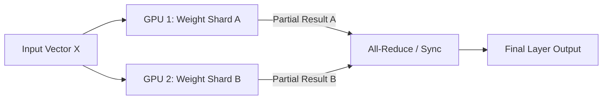

# 💠 Tensor Parallelism: Splitting the Weights
> **Level:** Extreme Advanced | **Language:** Hinglish | **Goal:** Master the lowest level of model distribution, exploring how to split a single matrix multiplication across multiple GPUs, the role of NVLink, and the 2026 patterns for ultra-low latency inference on massive models.

---

## 🧭 1. Beginner-Friendly Hinglish Explanation
Maan lo aapko ek bahut badi "Calculation" karni hai jisme 1000 numbers ko multiply karna hai. 
- Ye calculation itni badi hai ki ek GPU ki "Yaddasht" (VRAM) mein fit nahi aa rahi.
- **Solution:** Hum us calculation ko beech se "Cut" kar dete hain. 
- 500 numbers GPU-A multiply karega, aur baki 500 GPU-B. 
- Phir dono apne results ko "Merge" (Sum) kar denge.

**Tensor Parallelism** ka yahi matlab hai. Hum model ki ek single "Layer" (Tensor) ko tod kar alag-alag GPUs par rakh dete hain.
- Iska fayda? Aap 100GB ka model do 80GB GPUs par chala sakte hain.
- **Challenge:** GPUs ko har layer ke baad aapas mein "Baat" (Communicate) karni padti hai. Agar unke beech ki wire (Interconnect) slow hai, toh ye poora process bekar ho jayega.

---

## 🧠 2. Deep Technical Explanation
Tensor Parallelism (TP) splits individual layers (like Linear, Attention) across multiple devices.

### 1. Row-wise vs. Column-wise Splitting:
- To split a Linear layer $Y = XW$:
  - **Column Parallelism:** Split $W$ into $W_1$ and $W_2$ vertically. Each GPU calculates $XW_1$ and $XW_2$. The outputs are then concatenated.
  - **Row Parallelism:** Split $W$ horizontally. Each GPU gets a slice of $X$ and $W$. The results are then summed using an **All-Reduce** operation.

### 2. Implementation in Transformers:
- In a Transformer block, we typically use **Column Parallelism** for the first Linear layer of the MLP and **Row Parallelism** for the second. This minimizes communication by only requiring two sync points per block.

### 3. The Requirement: NVLink
- TP requires extremely high bandwidth and low latency because communication happens at every single layer of the model. Standard Ethernet is too slow for TP.

---

## 🏗️ 3. Tensor vs. Pipeline Parallelism
| Feature | Tensor Parallelism (TP) | Pipeline Parallelism (PP) |
| :--- | :--- | :--- |
| **Splitting Unit** | **Inside a layer (Tensor)** | Between layers |
| **Communication** | Constant (Every layer) | Occasional (End of block) |
| **Latency** | **Lowest** | Higher (Due to bubbles) |
| **Hardware** | Needs NVLink | Works on InfiniBand/Ethernet |
| **Scaling** | Hard beyond 8 GPUs | Scales to 100s of GPUs |

---

## 📐 4. Mathematical Intuition
- **The Matrix Split:** 
  If $W \in \mathbb{R}^{A \times B}$ is split into 2 GPUs ($W_1, W_2 \in \mathbb{R}^{A \times B/2}$):
  $$Y = X [W_1 | W_2] = [XW_1 | XW_2]$$
  This is "Column Parallelism." Notice that $X$ (the input) is copied to both GPUs. No communication is needed until the very end when we join the results.

---

## 📊 5. Tensor Parallel Workflow (Diagram)


---

## 💻 6. Production-Ready Examples (Conceptual TP in PyTorch)
```python
# 2026 Pro-Tip: Don't write TP from scratch. Use 'Megatron-LM' or 'vLLM'.

import torch
import torch.nn as nn

class ColumnParallelLinear(nn.Module):
    def __init__(self, in_features, out_features, world_size):
        super().__init__()
        # Each GPU only stores a fraction of the output features
        self.shard_out_features = out_features // world_size
        self.weight = nn.Parameter(torch.randn(self.shard_out_features, in_features))

    def forward(self, x):
        # Local matrix multiplication
        output_parallel = torch.matmul(x, self.weight.t())
        # In a real system, we would then use dist.all_gather or dist.all_reduce
        return output_parallel

# This is how vLLM splits Llama-3-70B across 8 GPUs instantly.
```

---

## ❌ 7. Failure Cases
- **Imbalanced Splitting:** Splitting a 4096-dim layer across 3 GPUs (4096 is not divisible by 3). One GPU will have more work, slowing down the other two.
- **NVLink Failure:** If the bridge between two GPUs is loose or broken, TP will fall back to PCIe, making the model $20x$ slower.
- **Deadlock:** If GPU-1 is waiting for GPU-2, but GPU-2 is waiting for a data signal that hasn't arrived.

---

## 🛠️ 8. Debugging Guide
- **Symptom:** "Inference is fast on 1 GPU but slow on 2 GPUs."
- **Check:** **Communication Overhead**. Is your model too small? If the model is small, the time spent "Talking" over NVLink is more than the time saved by splitting. TP is only for GIANT models.
- **Symptom:** "Results are slightly different on multi-GPU."
- **Check:** **Floating Point Precision**. Summing numbers in different orders (on different GPUs) can lead to tiny rounding differences.

---

## ⚖️ 9. Tradeoffs
- **Throughput vs. Memory:** TP is the best way to save memory while keeping latency low, but it is the hardest to scale across multiple physical servers (nodes).
- **TP Size:** Usually, `tp_size` should match the number of GPUs in a single NVLink domain (typically 8).

---

## 🛡️ 10. Security Concerns
- **Data Synchronization:** Ensure that all GPUs are using the exact same "Random Seed" for things like Dropout, otherwise the tensors will diverge and the model will "Break."

---

## 📈 11. Scaling Challenges
- **Inter-node TP:** Trying to do Tensor Parallelism between a GPU in India and a GPU in USA. Impossible. Even between two servers in the same rack, TP is very difficult without **InfiniBand/RDMA.**

---

## 💸 12. Cost Considerations
- **Hardware Lock-in:** To do TP effectively, you MUST buy high-end NVIDIA GPUs with NVLink. You cannot use entry-level gaming GPUs (RTX 4090 doesn't support NVLink).

---

## ✅ 13. Best Practices
- **Use Power-of-2:** Always use $2, 4, 8$ as your TP degree.
- **Combine with Pipeline Parallelism:** Use TP for inside a single server, and PP for between different servers.
- **Profile first:** Use **NVIDIA Nsight Systems** to see exactly how much time is spent in "NCCL Communication" vs. "Computation."

---

## ⚠️ 14. Common Mistakes
- **Applying TP to small models:** Running Llama-7B across 8 GPUs using TP. It will likely be slower than a single GPU because of the communication overhead.
- **Forgetting to shard the Optimizer:** If you use TP for weights but not for optimizer states, you aren't saving much VRAM.

---

## 📝 15. Interview Questions
1. **"Difference between Row Parallelism and Column Parallelism?"**
2. **"Why does Tensor Parallelism require high-speed interconnects like NVLink?"**
3. **"In a Transformer block, which layers are typically split using TP?"**

---

## 🚀 15. Latest 2026 Industry Patterns
- **Context Parallelism (CP):** A new 2026 technique to split the "Sequence Length" across GPUs, allowing for 1 Million+ token context windows.
- **Communication Overlapping:** New kernels that start the "All-Reduce" communication *while* the matrix multiplication is still running.
- **Zero-bubble TP:** Advanced scheduling that eliminates the tiny gaps between GPU sync points.
