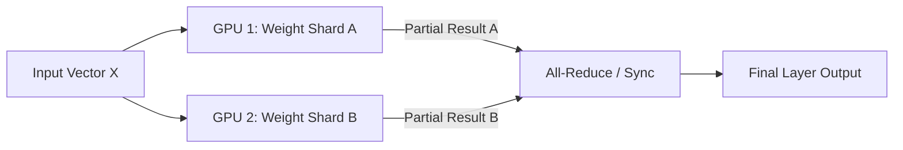

# 💠 Tensor Parallelism: Splitting the Weights
> **Level:** Extreme Advanced | **Language:** Hinglish | **Goal:** Model distribution ke lowest level ko master karein, explore karein ki kaise ek single matrix multiplication ko multiple GPUs par split kiya jata hai, NVLink ke role ko, aur 2026 mein massive models par ultra-low latency inference ke patterns ko.

---

## 🧭 1. Beginner-Friendly Hinglish Explanation
Maan lo aapko ek bahut badi "Calculation" karni hai jisme 1000 numbers ko multiply karna hai. 
- Ye calculation itni badi hai ki ek GPU ki "Yaddasht" (VRAM) mein fit nahi aa rahi.
- **Solution:** Hum us calculation ko beech se "Cut" kar dete hain. 
- 500 numbers GPU-A multiply karega, aur baki 500 GPU-B. 
- Phir dono apne results ko "Merge" (Sum) kar denge.

**Tensor Parallelism** ka yahi matlab hai. Hum model ki ek single "Layer" (Tensor) ko tod kar alag-alag GPUs par rakh dete hain.
- Iska fayda? Aap 100GB ka model do 80GB GPUs par chala sakte hain.
- **Challenge:** GPUs ko har layer ke baad aapas mein "Baat" (Communicate) karni padti hai. Agar unke beech ki wire (Interconnect) slow hai, toh ye poora process bekar ho jayega.

---

## 🧠 2. Deep Technical Explanation
Tensor Parallelism (TP) individual layers (jaise Linear, Attention) ko multiple devices ke beech split karta hai.

### 1. Row-wise vs. Column-wise Splitting:
- Linear layer $Y = XW$ ko split karne ke liye:
  - **Column Parallelism:** $W$ ko vertically $W_1$ aur $W_2$ mein split karein. Har ek GPU $XW_1$ aur $XW_2$ calculate karega. Phir in outputs ko concatenate (jod) kar diya jata hai.
  - **Row Parallelism:** $W$ ko horizontally split karein. Har ek GPU ko $X$ aur $W$ ka ek slice milta hai. Phir in results ko ek **All-Reduce** operation ka use karke sum kiya jata hai.

### 2. Implementation in Transformers:
- Ek Transformer block mein, hum MLP ki pehli Linear layer ke liye aamtaur par **Column Parallelism** aur dusri ke liye **Row Parallelism** use karte hain. Isse har block mein sirf do sync points ki zaroorat padti hai, jisse communication minimize ho jata hai.

### 3. The Requirement: NVLink
- TP ke liye behad high bandwidth aur low latency ki zaroorat hoti hai kyunki communication model ki har ek single layer par hota hai. TP ke liye standard Ethernet bahut slow hai.

---

## 🏗️ 3. Tensor vs. Pipeline Parallelism
| Feature | Tensor Parallelism (TP) | Pipeline Parallelism (PP) |
| :--- | :--- | :--- |
| **Splitting Unit** | **Layer ke andar (Tensor)** | Layers ke beech mein |
| **Communication** | Constant (Har layer par) | Occasional (Block ke end mein) |
| **Latency** | **Lowest** | Higher (Bubbles ki wajah se) |
| **Hardware** | NVLink ki zaroorat hoti hai | InfiniBand/Ethernet par chal jata hai |
| **Scaling** | 8 GPUs se aage mushkil hai | 100s of GPUs tak scale ho sakta hai |

---

## 📐 4. Mathematical Intuition
- **The Matrix Split:**
  Agar $W \in \mathbb{R}^{A \times B}$ ko 2 GPUs ($W_1, W_2 \in \mathbb{R}^{A \times B/2}$) ke beech split kiya jaye:
  $$Y = X [W_1 | W_2] = [XW_1 | XW_2]$$
  Ye "Column Parallelism" hai. Dhyan dein ki $X$ (input) dono GPUs par copy hota hai. Jab tak hum end mein results ko join nahi karte, tab tak koi communication zaroori nahi hota.

---

## 📊 5. Tensor Parallel Workflow (Diagram)

```mermaid
graph LR
    Input[Input Vector X] --> GPU1[GPU 1: Weight Shard A]
    Input --> GPU2[GPU 2: Weight Shard B]
    
    GPU1 -- "Partial Result A" --> Sync[All-Reduce / Sync]
    GPU2 -- "Partial Result B" --> Sync
    
    Sync --> Output[Final Layer Output]
```

---

## 💻 6. Production-Ready Examples (Conceptual TP in PyTorch)
```python
# 2026 Pro-Tip: TP ko scratch se mat likhein. 'Megatron-LM' ya 'vLLM' ka use karein.

import torch
import torch.nn as nn

class ColumnParallelLinear(nn.Module):
    def __init__(self, in_features, out_features, world_size):
        super().__init__()
        # Har ek GPU output features ka sirf ek fraction hi store karta hai
        self.shard_out_features = out_features // world_size
        self.weight = nn.Parameter(torch.randn(self.shard_out_features, in_features))

    def forward(self, x):
        # Local matrix multiplication
        output_parallel = torch.matmul(x, self.weight.t())
        # Ek real system mein, hum iske baad dist.all_gather ya dist.all_reduce use karenge
        return output_parallel

# Kuch is tarah vLLM achanak Llama-3-70B ko 8 GPUs par split kar deta hai.
```

---

## ❌ 7. Failure Cases
- **Imbalanced Splitting:** Ek 4096-dimension ki layer ko 3 GPUs par split karna (4096, 3 se divisible nahi hai). Ek GPU ke paas zyada kaam hoga, jisse baaki ke do GPUs slow ho jayenge.
- **NVLink Failure:** Agar do GPUs ke beech ka bridge loose ya tuta hua hai, to TP PCIe par fall back kar jayega, jisse model $20x$ slow ho jayega.
- **Deadlock:** Agar GPU-1 GPU-2 ka wait kar raha hai, lekin GPU-2 kisi aise data signal ka wait kar raha hai jo abhi tak aaya hi nahi.

---

## 🛠️ 8. Debugging Guide
- **Symptom:** "Inference 1 GPU par to fast hai lekin 2 GPUs par slow hai."
- **Check:** **Communication Overhead**. Kya aapka model bahut chhota hai? Agar model chhota hai, to NVLink par "Baat karne" (communicate) mein spent time, split karne se bache time se zyada hoga. TP sirf GIANT (bahut bade) models ke liye hai.
- **Symptom:** "Multi-GPU par results thode se different aa rahe hain."
- **Check:** **Floating Point Precision**. Alag-alag orders mein (alag-alag GPUs par) numbers ko sum karne se tiny rounding differences aa sakte hain.

---

## ⚖️ 9. Tradeoffs
- **Throughput vs. Memory:** Latency ko low rakhte hue memory bachane ka TP sabse best tarika hai, lekin ise multiple physical servers (nodes) ke beech scale karna sabse zyada mushkil hai.
- **TP Size:** Aamtaur par, `tp_size` ko ek single NVLink domain mein jitne GPUs hain usse match hona chahiye (typically 8).

---

## 🛡️ 10. Security Concerns
- **Data Synchronization:** Ye ensure karein ki Dropout jaisi cheezon ke liye saare GPUs bilkul same "Random Seed" use kar rahe hon, nahi to tensors diverge ho jayenge aur model "Break" ho jayega.

---

## 📈 11. Scaling Challenges
- **Inter-node TP:** India mein rakhe GPU aur USA mein rakhe GPU ke beech Tensor Parallelism karne ki koshish karna. Ye impossible hai. Same rack ke do servers ke beech bhi, **InfiniBand/RDMA** ke bina TP karna bahut mushkil hai.

---

## 💸 12. Cost Considerations
- **Hardware Lock-in:** TP ko effectively karne ke liye, aapko NVLink wale high-end NVIDIA GPUs hi khareedne padenge. Aap entry-level gaming GPUs use nahi kar sakte (RTX 4090 NVLink support nahi karta).

---

## ✅ 13. Best Practices
- **Use Power-of-2:** Hamesha apne TP degree ke roop mein $2, 4, 8$ ka use karein.
- **Combine with Pipeline Parallelism:** Ek single server ke andar ke liye TP use karein, aur alag-alag servers ke beech ke liye PP use karein.
- **Profile first:** Ye dekhne ke liye ki actual mein kitna time "NCCL Communication" vs. "Computation" mein lag raha hai, **NVIDIA Nsight Systems** ka use karein.

---

## ⚠️ 14. Common Mistakes
- **Applying TP to small models:** TP ka use karke Llama-7B ko 8 GPUs par chalana. Communication overhead ki wajah se ye single GPU se bhi slow ho sakta hai.
- **Forgetting to shard the Optimizer:** Agar aap weights ke liye TP use karte hain lekin optimizer states ke liye nahi, to aap zyada VRAM nahi bacha pa rahe hain.

---

## 📝 15. Interview Questions
1. **"Row Parallelism aur Column Parallelism ke beech kya difference hai?"**
2. **"Tensor Parallelism ke liye NVLink jaise high-speed interconnects ki zaroorat kyu hoti hai?"**
3. **"Ek Transformer block mein, aamtaur par kin layers ko TP ka use karke split kiya jata hai?"**

---

## 🚀 15. Latest 2026 Industry Patterns
- **Context Parallelism (CP):** GPUs ke beech "Sequence Length" ko split karne ki ek nayi 2026 technique, jo 1 Million+ token context windows ki permission deti hai.
- **Communication Overlapping:** Naye kernels jo matrix multiplication ke chalne ke *dauran* hi "All-Reduce" communication ko start kar dete hain.
- **Zero-bubble TP:** Advanced scheduling jo GPU sync points ke beech ke tiny gaps (chhote gap) ko khatam kar deti hai.

