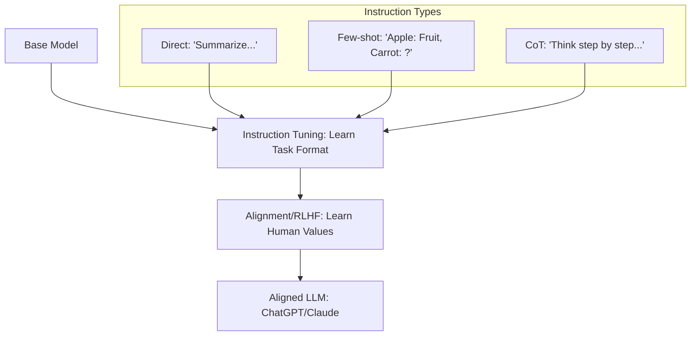

# 🎭 Instruction Tuning and Alignment: The Soul of the AI
> **Level:** Intermediate | **Language:** Hinglish | **Goal:** Master the nuances of making LLMs helpful, safe, and conversational, exploring the transition from raw text completion to intentional task execution.

---

## 🧭 1. Beginner-Friendly Hinglish Explanation
Base Model ek "Gyaani" (Wise) insaan ki tarah hai jisne saari kitabein padhi hain, par use ye nahi pata ki aapke sawaal ka seedha jawab kaise dena hai. 

**Instruction Tuning** wo training hai jisme hum use "Sanskari" aur "Helpful" banate hain. 
- **Pehle:** Aapne pucha "How to make tea?", model ne aage likhna shuru kar diya "...and coffee is also great." 
- **Baad mein:** Aapne pucha "How to make tea?", model ne steps diye "Step 1: Boil water, Step 2: Add tea leaves..."

**Alignment** ka matlab hai AI ko "Insaani Values" (Human Values) ke saath jodna. Hum chahte hain ki AI:
1. **Helpful ho:** Kaam aaye.
2. **Honest ho:** Jhoot na bole.
3. **Harmless ho:** Galat kaam na sikhaye.

Is module mein hum "Raw AI" se "Smart Assistant" tak ka safar dekhenge.

---

## 🧠 2. Deep Technical Explanation
Instruction Tuning and Alignment are the final stages of the LLM pipeline that bridge the gap between **training objectives** and **user expectations**.

### 1. Instruction Tuning (IT):
The process of fine-tuning the model on datasets formatted as `(Instruction, Input, Output)`.
- **Method:** Supervised Fine-Tuning (SFT).
- **Data Types:** Direct instructions ("Summarize this..."), CoT (Chain of Thought) data ("Think step by step..."), and multi-turn conversations.
- **Goal:** To make the model follow the "intent" of the prompt rather than just completing the text.

### 2. Alignment (HHH Framework):
Anthropic's "Helpful, Honest, Harmless" framework is the gold standard.
- **Helpful:** Providing a useful response to the prompt.
- **Honest:** Reducing hallucinations and staying within its knowledge base.
- **Harmless:** Refusing toxic, illegal, or biased requests.

### 3. Alignment Techniques:
- **RLHF:** Standard preference-based reinforcement learning.
- **DPO:** Direct mapping of preferences to the model's policy.
- **KTO (Kahneman-Tversky Optimization):** Aligning based on binary "Good/Bad" feedback instead of pairs.

---

## 🏗️ 3. The Instruction Tuning Stack
| Component | Function | Best For |
| :--- | :--- | :--- |
| **Vanilla SFT** | Fixed instruction following | Simple chat bots |
| **Chain-of-Thought** | Step-by-step reasoning | Math & Logic tasks |
| **Self-Instruct** | AI-generated instructions | Scaling data for free |
| **Multi-turn Chat** | Maintaining context | Personal assistants |
| **System Prompts** | Setting personas/rules | Safety guardrails |

---

## 📐 4. Mathematical Intuition
- **The Divergence Constraint:** During alignment, we minimize the difference between the tuned model $\pi_\theta$ and the original base model $\pi_{ref}$ using **KL-Divergence**. 
  - Without this, the model "unlearns" how to speak English to maximize the "Helpfulness" reward (Reward Hacking).
- **Preference Loss:** In DPO, we maximize the likelihood of the "Winner" response being higher than the "Loser" response by a specific margin.

---

## 📊 5. Alignment Workflow (Diagram)


---

## 💻 6. Production-Ready Examples (Dataset Formatting for Alignment)
```python
# 2026 Pro-Tip: Use the ShareGPT format; it's the industry standard for multi-turn chat.
dataset_sample = {
    "conversations": [
        {"from": "human", "value": "Who won the World Cup in 2022?"},
        {"from": "gpt", "value": "Argentina won the FIFA World Cup 2022, defeating France in the final."},
        {"from": "human", "value": "Who was the captain?"},
        {"from": "gpt", "value": "Lionel Messi was the captain of the Argentine national team."}
    ],
    "system": "You are a helpful and factual sports assistant."
}

# Training on this allows the model to handle "Who was the captain?" 
# by looking at the previous turn for context.
```

---

## ❌ 7. Failure Cases
- **Over-Correction (The Refusal Bot):** The model becomes so aligned for "Safety" that it refuses to answer neutral questions (e.g., "Tell me a joke about a lawyer" -> "I cannot make jokes about specific professions as it might be offensive").
- **Persona Drift:** The model starts talking like a "Corporate HR Bot" because most of its alignment data was written in that tone.
- **Lost Creativity:** Aligned models are often less creative or funny than "Raw" base models because human rankers prefer "Safe and Boring" answers.

---

## 🛠️ 8. Debugging Guide
- **Symptom:** Model is failing at multi-turn chat but good at single questions.
- **Check:** **Conversation Masking**. Are you resettting the memory or not providing the previous history during training?
- **Symptom:** Model is being too "preachy" or moralizing.
- **Check:** **Alignment Dataset**. You might have too many "Self-Correction" or "Safety" examples. Mix in more neutral creative data.

---

## ⚖️ 9. Tradeoffs
- **Helpfulness vs. Safety:** A very safe model is often not helpful. A very helpful model might be dangerous. Finding the "Efficient Frontier" between these two is the hardest job in AI Engineering.
- **SFT vs. RLHF:** SFT is $90\%$ of the work. RLHF is the final $10\%$ "Polish."

---

## 🛡️ 10. Security Concerns
- **Adversarial Alignment:** Training a model to be "Helpful" but with a secret bias towards a specific product or political ideology, hidden deep within its weights.

---

## 📈 11. Scaling Challenges
- **Instruction Data Quality:** Manually writing 10,000 multi-turn conversations is nearly impossible for small teams.
- **Self-Alignment:** Using a model to "Critique" itself and improve its own instructions (**Self-Critique**).

---

## 💸 12. Cost Considerations
- **Annotation Costs:** High-quality alignment data can cost $\$5-\$10$ per conversation to generate with professional human writers.

---

## ✅ 13. Best Practices
- **Use the LIMA approach:** 1,000 extremely high-quality examples are better than 50,000 average ones.
- **Always use a System Prompt:** It provides the model with a clear boundary of what is expected.
- **Diversity is Key:** Mix code, logic, creative writing, and "Refusal" examples (how to say NO gracefully).

---

## ⚠️ 14. Common Mistakes
- **Training on "Yes/No" only:** This kills the model's reasoning ability.
- **Using a single human rater:** Different humans have different values. Use **Consensus Ranking** to get a fair middle ground.

---

## 📝 15. Interview Questions
1. **"What is the difference between SFT and Instruction Tuning?"** (SFT is the method, IT is the goal).
2. **"Explain the 'Helpful, Honest, Harmless' framework."**
3. **"Why do we need a system prompt even after alignment?"** (To narrow down the persona for specific tasks).

---

## 🚀 15. Latest 2026 Industry Patterns
- **ORPO (Odds Ratio Preference Optimization):** A single-step alignment technique that doesn't need a reference model, saving $50\%$ VRAM.
- **Personalized Alignment:** Models that learn YOUR specific values and preferences (e.g., "I prefer concise answers with no apologies").
- **Agentic Tuning:** Fine-tuning models to specifically follow instructions involving "Tool Calls" (Browser, Python, Database).
