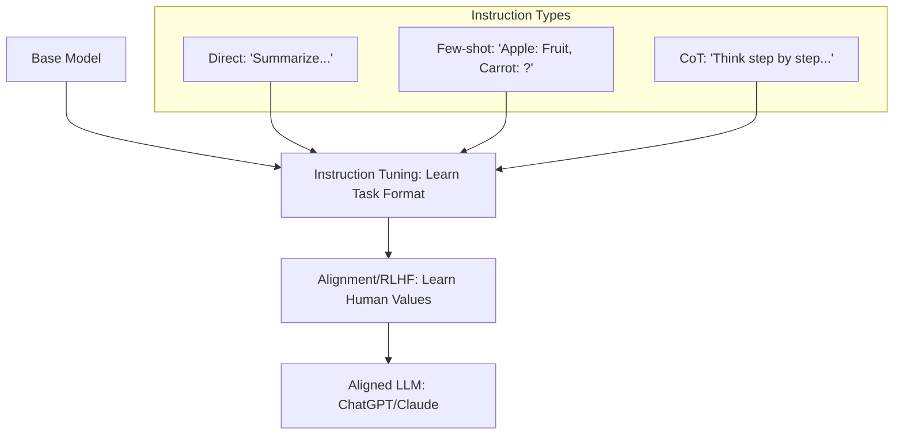

# 🎭 Instruction Tuning and Alignment: The Soul of the AI
> **Level:** Intermediate | **Language:** Hinglish | **Goal:** LLMs ko helpful, safe, aur conversational banane ke nuances ko master karein, raw text completion se intentional task execution ke transition ko explore karte hue.

---

## 🧭 1. Beginner-Friendly Hinglish Explanation
Base Model ek "Gyaani" (Wise) insaan ki tarah hai jisne saari kitabein padhi hain, par use ye nahi pata ki aapke sawaal ka seedha jawab kaise dena hai. 

**Instruction Tuning** wo training hai jisme hum use "Sanskari" aur "Helpful" banate hain. 
- **Pehle:** Aapne pucha "How to make tea?", model ne aage likhna shuru kar diya "...and coffee is also great." 
- **Baad mein:** Aapne pucha "How to make tea?", model ne steps diye "Step 1: Boil water, Step 2: Add tea leaves..."

**Alignment** ka matlab hai AI ko "Insaani Values" (Human Values) ke saath jodna. Hum chahte hain ki AI:
1. **Helpful ho:** Kaam aaye.
2. **Honest ho:** Jhoot na bole.
3. **Harmless ho:** Galat kaam na sikhaye.

Is module mein hum "Raw AI" se "Smart Assistant" tak ka safar dekhenge.

---

## 🧠 2. Deep Technical Explanation
Instruction Tuning aur Alignment LLM pipeline ke final stages hain jo **training objectives** aur **user expectations** ke beech ke gap ko bridge karte hain.

### 1. Instruction Tuning (IT):
Model ko `(Instruction, Input, Output)` format wale datasets par fine-tune karne ka process.
- **Method:** Supervised Fine-Tuning (SFT).
- **Data Types:** Direct instructions ("Summarize this..."), CoT (Chain of Thought) data ("Think step by step..."), aur multi-turn conversations.
- **Goal:** Model se prompt ke "intent" (irade/meaning) ko follow karwana, na ki sirf text ko aage complete karna.

### 2. Alignment (HHH Framework):
Anthropic ka "Helpful, Honest, Harmless" framework iska gold standard hai.
- **Helpful:** Prompt ka ek useful aur kaam aane wala response dena.
- **Honest:** Hallucinations ko kam karna aur apne knowledge base ke andar hi rehna.
- **Harmless:** Toxic, illegal, ya biased requests ko refuse karna.

### 3. Alignment Techniques:
- **RLHF:** Standard preference-based reinforcement learning.
- **DPO:** Preferences ko directly model ki policy par map karna.
- **KTO (Kahneman-Tversky Optimization):** Pairs ki jagah binary "Good/Bad" feedback ke basis par align karna.

---

## 🏗️ 3. The Instruction Tuning Stack
| Component | Function | Best For |
| :--- | :--- | :--- |
| **Vanilla SFT** | Fixed instruction following | Simple chat bots ke liye |
| **Chain-of-Thought** | Step-by-step reasoning | Math & Logic tasks ke liye |
| **Self-Instruct** | AI-generated instructions | Free mein data scale karne ke liye |
| **Multi-turn Chat** | Context ko maintain rakhna | Personal assistants ke liye |
| **System Prompts** | Personas/rules set karna | Safety guardrails ke liye |

---

## 📐 4. Mathematical Intuition
- **The Divergence Constraint:** Alignment ke dauran, hum **KL-Divergence** ka use karke tuned model $\pi_\theta$ aur original base model $\pi_{ref}$ ke beech ke difference ko minimize karte hain.
  - Iske bina, model "Helpfulness" reward ko maximize karne ke liye English bolna hi "bhool" (unlearn) sakta hai (jise Reward Hacking kehte hain).
- **Preference Loss:** DPO mein, hum "Winner" response ke select hone ki likelihood ko "Loser" response se ek specific margin se bada karne ki koshish karte hain.

---

## 📊 5. Alignment Workflow (Diagram)

```mermaid
graph TD
    B[Base Model] --> IT[Instruction Tuning: Learn Task Format]
    IT --> RL[Alignment/RLHF: Learn Human Values]
    RL --> Final[Aligned LLM: ChatGPT/Claude]
    
    subgraph "Instruction Types"
    T1[Direct: 'Summarize...']
    T2[Few-shot: 'Apple: Fruit, Carrot: ?']
    T3[CoT: 'Think step by step...']
    end
    
    T1 & T2 & T3 --> IT
```

---

## 💻 6. Production-Ready Examples (Dataset Formatting for Alignment)
```python
# 2026 Pro-Tip: ShareGPT format ka use karein; ye multi-turn chat ke liye industry standard hai.
dataset_sample = {
    "conversations": [
        {"from": "human", "value": "Who won the World Cup in 2022?"},
        {"from": "gpt", "value": "Argentina won the FIFA World Cup 2022, defeating France in the final."},
        {"from": "human", "value": "Who was the captain?"},
        {"from": "gpt", "value": "Lionel Messi was the captain of the Argentine national team."}
    ],
    "system": "You are a helpful and factual sports assistant."
}

# Is par train karne se model context ke liye previous turn ko dekh kar 
# "Who was the captain?" jaise sawaal ko aaram se handle kar sakta hai.
```

---

## ❌ 7. Failure Cases
- **Over-Correction (The Refusal Bot):** Model "Safety" ke liye itna zyada align ho jata hai ki wo neutral sawalon ke jawab dene se bhi mana kar deta hai (e.g., "Tell me a joke about a lawyer" -> "I cannot make jokes about specific professions as it might be offensive").
- **Persona Drift:** Model ek "Corporate HR Bot" ki tarah baat karna shuru kar deta hai kyunki uska zyada tar alignment data usi tone mein likha gaya tha.
- **Lost Creativity:** Aligned models aksar "Raw" base models ke mukable kam creative ya funny hote hain kyunki human rankers "Safe and Boring" (safe aur boring) answers ko zyada pasand karte hain.

---

## 🛠️ 8. Debugging Guide
- **Symptom:** Model single questions mein to achha hai lekin multi-turn chat mein fail ho raha hai.
- **Check:** **Conversation Masking**. Kya aap memory reset kar rahe hain ya training ke dauran previous history provide nahi kar rahe hain?
- **Symptom:** Model bahut zyada "preachy" (updesh dene wala) ya moralizing ho raha hai.
- **Check:** **Alignment Dataset**. Ho sakta hai aapke paas bahut zyada "Self-Correction" ya "Safety" examples hon. Isme thoda aur neutral creative data mix karein.

---

## ⚖️ 9. Tradeoffs
- **Helpfulness vs. Safety:** Ek bahut safe model aksar helpful nahi hota. Ek bahut helpful model dangerous ho sakta hai. In dono ke beech ek sahi balance ("Efficient Frontier") dhoodhna AI Engineering ka sabse mushkil kaam hai.
- **SFT vs. RLHF:** SFT poore kaam ka $90\%$ hota hai. RLHF sirf final $10\%$ ka "Polish" hota hai.

---

## 🛡️ 10. Security Concerns
- **Adversarial Alignment:** Model ko "Helpful" hone ke liye train karna lekin uske weights ke andar kisi specific product ya political ideology ke liye ek secret bias chhupa kar rakhna.

---

## 📈 11. Scaling Challenges
- **Instruction Data Quality:** Chhoti teams ke liye manually 10,000 multi-turn conversations likhna lagbhag impossible hai.
- **Self-Alignment:** Model ka use karke khud ko hi "Critique" (review) karna aur apni khud ki instructions ko behtar banana (**Self-Critique**).

---

## 💸 12. Cost Considerations
- **Annotation Costs:** Professional human writers ke throw high-quality alignment data generate karwane ki cost $\$5-\$10$ per conversation tak ho sakti hai.

---

## ✅ 13. Best Practices
- **LIMA approach use karein:** 50,000 average examples ke mukable 1,000 behad high-quality examples kahin zyada behtar hote hain.
- **Hamesha System Prompt ka use karein:** Ye model ko ek clear boundary deta hai ki usse kya expected hai.
- **Diversity is Key:** Apne data mein code, logic, creative writing aur "Refusal" examples (gracefully NO bolna) ka mix rakhein.

---

## ⚠️ 14. Common Mistakes
- **Sirf "Yes/No" par train karna:** Ye model ki reasoning ability ko khatam kar deta hai.
- **Sirf ek human rater ka use karna:** Alal-alag humans ki values alag hoti hain. Ek fair middle ground paane ke liye **Consensus Ranking** ka use karein.

---

## 📝 15. Interview Questions
1. **"SFT aur Instruction Tuning ke beech kya difference hai?"** (SFT method hai, IT goal hai).
2. **"Helpful, Honest, Harmless framework ko explain karein."**
3. **"Alignment ke baad bhi humein system prompt ki zaroorat kyu hoti hai?"** (Specific tasks ke liye persona ko narrow down karne ke liye).

---

## 🚀 15. Latest 2026 Industry Patterns
- **ORPO (Odds Ratio Preference Optimization):** Ek single-step alignment technique jisme reference model ki zaroorat nahi hoti, jisse $50\%$ VRAM bachta hai.
- **Personalized Alignment:** Aise models jo aapki specific values aur preferences ko seekhte hain (e.g., "Mujhe bina apologies ke concise answers pasand hain").
- **Agentic Tuning:** Models ko specifically "Tool Calls" (Browser, Python, Database) wale instructions ko follow karne ke liye fine-tune karna.

