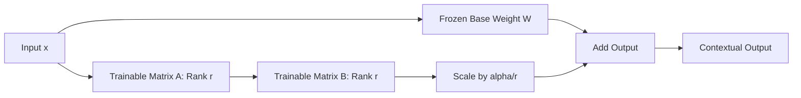

# 📉 LoRA & PEFT: Fine-Tuning Giant Models on a Budget
> **Level:** Advanced | **Language:** Hinglish | **Goal:** Master Parameter-Efficient Fine-Tuning (PEFT), focusing on LoRA (Low-Rank Adaptation) and QLoRA, to fine-tune massive LLMs using minimal VRAM and compute.

---

## 🧭 1. Beginner-Friendly Hinglish Explanation
Sochiye, aapke paas ek 70 Billion parameters wala model hai (Llama-3). Is model ko "Fine-tune" karne ka matlab hai uske saare 70B weights ko update karna. Iske liye aapko $140GB$ se zyada VRAM chahiye, jo sirf supercomputers ke paas hota hai.

**LoRA (Low-Rank Adaptation)** ek "Jugaad" (Smart Hack) hai. 
LoRA kehta hai: "Asli model ke weights ko mat chhedo. Unhe 'Freeze' kar do. Bas unke sath do chote-chote blocks (Matrices) laga do."
- Jab AI kuch seekhta hai, toh wo sirf in chote blocks ko update karta hai.
- Ye chote blocks asli model ke $1\%$ se bhi kam hote hain.
- **Result:** Aap ek 70B model ko apne ghar ke ek gaming GPU (jaise RTX 4090) par fine-tune kar sakte hain.

Is module mein hum seekhenge ki kaise "Kam parameters" mein "Zyada intelligence" paida karein.

---

## 🧠 2. Deep Technical Explanation
PEFT techniques aim to achieve performance comparable to full fine-tuning while only updating a tiny fraction of parameters.

### 1. LoRA (Low-Rank Adaptation):
Instead of updating the weight matrix $W$ (size $d \times d$), we represent the update $\Delta W$ as the product of two small matrices $A$ and $B$.
- $W_{updated} = W + \Delta W = W + (B \times A)$
- Matrix $A$ is $d \times r$, Matrix $B$ is $r \times d$.
- $r$ (Rank) is a very small number (e.g., 8 or 16).
- **The Magic:** Since $r \ll d$, the number of trainable parameters drops from $d^2$ to $2 \times d \times r$. (A $1,000x$ reduction!).

### 2. QLoRA (Quantized LoRA):
A further improvement where the base model is frozen in **4-bit precision** (using NF4 - NormalFloat4).
- This reduces the memory requirement of the base model by $4x$.
- You can now fine-tune a 70B model on a single 48GB GPU.

### 3. Other PEFT Techniques:
- **Prefix Tuning:** Adding trainable "virtual tokens" at the beginning of the prompt.
- **Prompt Tuning:** Only learning the embeddings of a specific "Task Prompt."
- **Adapter Layers:** Inserting small bottleneck layers inside each Transformer block.

---

## 🏗️ 3. PEFT Comparison Table
| Technique | Trainable Params | VRAM Usage | Performance | Ease of Use |
| :--- | :--- | :--- | :--- | :--- |
| **Full Fine-Tuning** | 100% | Extremely High | Best | Hard |
| **LoRA** | 0.1% - 1% | Low | Excellent | Very Easy |
| **QLoRA** | < 0.1% | Extremely Low | Good | Easy |
| **Prefix Tuning** | < 0.01% | Low | Average | Moderate |

---

## 📐 4. Mathematical Intuition
- **The Low-Rank Hypothesis:** Researchers found that during fine-tuning, the changes to weights ($\Delta W$) actually have a "low intrinsic dimension." This means you don't need to update every dimension to get the job done; a few "principal directions" (Rank $r$) are enough.
- **Alpha ($\alpha$) Scaling:** When using LoRA, we scale the output by $\frac{\alpha}{r}$. This allows us to change the Rank without having to re-tune the learning rate.

---

## 📊 5. LoRA Architecture (Diagram)


---

## 💻 6. Production-Ready Examples (Implementing LoRA with PEFT library)
```python
# 2026 Pro-Tip: Use PEFT + BitsAndBytes for 4-bit QLoRA.
from peft import LoraConfig, get_peft_model, prepare_model_for_kbit_training
from transformers import AutoModelForCausalLM, BitsAndBytesConfig

# 1. 4-bit Quantization Config
bnb_config = BitsAndBytesConfig(
    load_in_4bit=True,
    bnb_4bit_quant_type="nf4",
    bnb_4bit_compute_dtype="float16"
)

# 2. Load Base Model (Frozen)
model = AutoModelForCausalLM.from_pretrained(
    "meta-llama/Llama-3-8B",
    quantization_config=bnb_config
)

# 3. LoRA Configuration
lora_config = LoraConfig(
    r=16, # Rank
    lora_alpha=32,
    target_modules=["q_proj", "v_proj"], # Which layers to adapt
    lora_dropout=0.05,
    task_type="CAUSAL_LM"
)

# 4. Wrap the model
model = get_peft_model(model, lora_config)

# Only 0.1% of parameters are now 'Trainable'!
model.print_trainable_parameters()
```

---

## ❌ 7. Failure Cases
- **Wrong Target Modules:** If you only apply LoRA to the "Query" layer and ignore the "Value" layer, the model might not learn complex relationships. **Fix:** Apply to all linear layers for best results.
- **Rank is too low:** If $r=1$, the model might be too "stupid" to learn the task.
- **Rank is too high:** If $r=512$, you are basically doing full fine-tuning and losing all memory benefits.

---

## 🛠️ 8. Debugging Guide
- **Symptom:** Loss is not decreasing.
- **Check:** **Target Modules**. Are the names correct? (Llama uses `q_proj`, BERT uses `query`).
- **Symptom:** Out of Memory (OOM) during training.
- **Check:** **Gradient Checkpointing**. Enable it to save VRAM by re-calculating activations during backprop.

---

## ⚖️ 9. Tradeoffs
- **Inference Latency:** Standard LoRA adds a tiny bit of latency. **Fix:** After training, "Merge" the LoRA weights into the base model (`model.merge_and_unload()`) for zero-latency inference.
- **Portability:** LoRA "Adapters" are tiny ($50MB$). You can share them on the internet easily, unlike a 140GB full model.

---

## 🛡️ 10. Security Concerns
- **Adapter Swapping:** In a production server, you can swap LoRA adapters in milliseconds to serve 100 different users. However, if one adapter is malicious, it could potentially leak data from the "Shared" base model's cache.

---

## 📈 11. Scaling Challenges
- **Multiple Adapters:** Running a server with 1,000 different LoRA adapters for 1,000 different customers requires specialized kernels like **LoRAX** or **S-LoRA**.

---

## 💸 12. Cost Considerations
- **Training Cost:** You can fine-tune a Llama-3-8B on an AWS `g5.xlarge` instance for less than $\$1$ per hour using QLoRA. This is the ultimate cost-saver.

---

## ✅ 13. Best Practices
- **Use $r=8$ to $32$:** This is the "Sweet Spot."
- **Apply to all Linear layers:** `target_modules=["q_proj", "k_proj", "v_proj", "o_proj", "gate_proj", "up_proj", "down_proj"]`.
- **Use NF4:** It is mathematically superior to standard 4-bit quantization for AI weights.

---

## ⚠️ 14. Common Mistakes
- **Forgetting to set `requires_grad=False`:** If you don't freeze the base model, LoRA is useless.
- **Not merging weights for production:** Running separate matrices in production is $10\%$ slower.

---

## 📝 15. Interview Questions
1. **"What is the core mathematical idea behind LoRA?"** (Low-rank decomposition of weight updates).
2. **"Difference between LoRA and QLoRA?"** (Base model precision: 16-bit vs 4-bit).
3. **"How does LoRA reduce the VRAM requirement?"** (By reducing the number of gradients that need to be stored in memory).

---

## 🚀 15. Latest 2026 Industry Patterns
- **DoRA (Weight-Decomposed Low-Rank Adaptation):** A new method that outperforms LoRA by decomposing the weights into magnitude and direction.
- **LongLoRA:** A specialized LoRA that allows extending the context window of a model (e.g., from 8k to 32k) with very little compute.
- **PEFT for Multimodal:** Using LoRA to "teach" a text model how to understand images by only adapting the "Projection" layers.
