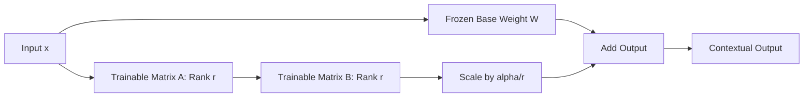

# 📉 LoRA & PEFT: Fine-Tuning Giant Models on a Budget
> **Level:** Advanced | **Language:** Hinglish | **Goal:** Parameter-Efficient Fine-Tuning (PEFT) ko master karein, LoRA (Low-Rank Adaptation) aur QLoRA par focus karte hue, taaki minimal VRAM aur compute ka use karke massive LLMs ko fine-tune kiya ja sake.

---

## 🧭 1. Beginner-Friendly Hinglish Explanation
Sochiye, aapke paas ek 70 Billion parameters wala model hai (Llama-3). Is model ko "Fine-tune" karne ka matlab hai uske saare 70B weights ko update karna. Iske liye aapko $140GB$ se zyada VRAM chahiye, jo sirf supercomputers ke paas hota hai.

**LoRA (Low-Rank Adaptation)** ek "Jugaad" (Smart Hack) hai. 
LoRA kehta hai: "Asli model ke weights ko mat chhedo. Unhe 'Freeze' kar do. Bas unke sath do chote-chote blocks (Matrices) laga do."
- Jab AI kuch seekhta hai, toh wo sirf in chote blocks ko update karta hai.
- Ye chote blocks asli model ke $1\%$ se bhi kam hote hain.
- **Result:** Aap ek 70B model ko apne ghar ke ek gaming GPU (jaise RTX 4090) par fine-tune kar sakte hain.

Is module mein hum seekhenge ki kaise "Kam parameters" mein "Zyada intelligence" paida karein.

---

## 🧠 2. Deep Technical Explanation
PEFT techniques ka main aim full fine-tuning ke barabar performance achieve karna hota hai, wo bhi parameters ke ek bahut hi tiny fraction (chhote hisse) ko update karke.

### 1. LoRA (Low-Rank Adaptation):
Weight matrix $W$ (size $d \times d$) ko directly update karne ke bajaye, hum update $\Delta W$ ko do chhote matrices $A$ aur $B$ ke product ke roop mein represent karte hain.
- $W_{updated} = W + \Delta W = W + (B \times A)$
- Matrix $A$ ka size $d \times r$ hai, aur Matrix $B$ ka size $r \times d$ hai.
- $r$ (Rank) ek bahut hi chhota number hota hai (jaise 8 ya 16).
- **The Magic:** Kyunki $r \ll d$ hota hai, isliye trainable parameters ki sankhya $d^2$ se ghat kar sirf $2 \times d \times r$ reh jati hai. (Lagbhag $1,000x$ ki bachat!).

### 2. QLoRA (Quantized LoRA):
Ye ek aur advanced step hai jahan base model ko **4-bit precision** (NF4 - NormalFloat4 ka use karke) mein freeze kar diya jata hai.
- Isse base model ki memory requirement $4x$ tak kam ho jati hai.
- Ab aap ek single 48GB GPU par bhi 70B model ko fine-tune kar sakte hain.

### 3. Other PEFT Techniques:
- **Prefix Tuning:** Prompt ke shuruat mein trainable "virtual tokens" add karna.
- **Prompt Tuning:** Sirf kisi specific "Task Prompt" ke embeddings ko seekhna (learn karna).
- **Adapter Layers:** Har ek Transformer block ke andar chhote bottleneck layers insert karna.

---

## 🏗️ 3. PEFT Comparison Table
| Technique | Trainable Params | VRAM Usage | Performance | Ease of Use |
| :--- | :--- | :--- | :--- | :--- |
| **Full Fine-Tuning** | 100% | Extremely High | Best | Hard |
| **LoRA** | 0.1% - 1% | Low | Excellent | Very Easy (Bahut Aasan) |
| **QLoRA** | < 0.1% | Extremely Low | Good | Easy (Aasan) |
| **Prefix Tuning** | < 0.01% | Low | Average | Moderate |

---

## 📐 4. Mathematical Intuition
- **The Low-Rank Hypothesis:** Researchers ne paaya hai ki fine-tuning ke dauran weights mein hone wale changes ($\Delta W$) actually ek "low intrinsic dimension" rakhte hain. Iska matlab ye hai ki kaam poora karne ke liye aapko har ek dimension ko update karne ki zaroorat nahi hai; kuch "principal directions" (Rank $r$) hi kafi hain.
- **Alpha ($\alpha$) Scaling:** LoRA use karte samay, hum output ko $\frac{\alpha}{r}$ se scale karte hain. Isse hum bina learning rate ko re-tune kiye Rank ko change kar sakte hain.

---

## 📊 5. LoRA Architecture (Diagram)

```mermaid
graph LR
    X[Input x] --> Base[Frozen Base Weight W]
    X --> A[Trainable Matrix A: Rank r]
    A --> B[Trainable Matrix B: Rank r]
    
    Base --> Sum[Add Output]
    B --> Scaling[Scale by alpha/r]
    Scaling --> Sum
    Sum --> Result[Contextual Output]
```

---

## 💻 6. Production-Ready Examples (Implementing LoRA with PEFT library)
```python
# 2026 Pro-Tip: 4-bit QLoRA ke liye PEFT + BitsAndBytes ka use karein.
from peft import LoraConfig, get_peft_model, prepare_model_for_kbit_training
from transformers import AutoModelForCausalLM, BitsAndBytesConfig

# 1. 4-bit Quantization Config
bnb_config = BitsAndBytesConfig(
    load_in_4bit=True,
    bnb_4bit_quant_type="nf4",
    bnb_4bit_compute_dtype="float16"
)

# 2. Base Model ko Load karein (Frozen)
model = AutoModelForCausalLM.from_pretrained(
    "meta-llama/Llama-3-8B",
    quantization_config=bnb_config
)

# 3. LoRA Configuration
lora_config = LoraConfig(
    r=16, # Rank
    lora_alpha=32,
    target_modules=["q_proj", "v_proj"], # Kin layers ko adapt karna hai
    lora_dropout=0.05,
    task_type="CAUSAL_LM"
)

# 4. Model ko wrap karein
model = get_peft_model(model, lora_config)

# Ab parameters ka sirf 0.1% hi 'Trainable' hai!
model.print_trainable_parameters()
```

---

## ❌ 7. Failure Cases
- **Wrong Target Modules:** Agar aap LoRA ko sirf "Query" layer par apply karte hain aur "Value" layer ko ignore kar dete hain, to model complex relationships nahi seekh payega. **Fix:** Best results ke liye sabhi linear layers par apply karein.
- **Rank is too low:** Agar $r=1$ hai, to model task ko seekhne ke liye bahut zyada "stupid" (na-samajh) reh jayega.
- **Rank is too high:** Agar $r=512$ hai, to aap basically full fine-tuning hi kar rahe hain aur saare memory benefits kho rahe hain.

---

## 🛠️ 8. Debugging Guide
- **Symptom:** Loss decrease nahi ho raha hai.
- **Check:** **Target Modules**. Kya names sahi hain? (Llama `q_proj` use karta hai, BERT `query` use karta hai).
- **Symptom:** Training ke dauran Out of Memory (OOM) error aa raha hai.
- **Check:** **Gradient Checkpointing**. Backpropagation ke dauran activations ko re-calculate karke VRAM bachane ke liye ise enable karein.

---

## ⚖️ 9. Tradeoffs
- **Inference Latency:** Standard LoRA thodi si latency add kar deta hai. **Fix:** Training ke baad, zero-latency inference ke liye LoRA weights ko base model ke saath "Merge" kar dein (`model.merge_and_unload()`).
- **Portability:** LoRA "Adapters" bahut chhote hote hain ($50MB$). Aap inhe internet par aaram se share kar sakte hain, jabki ek 140GB ka full model share karna bahut mushkil hota hai.

---

## 🛡️ 10. Security Concerns
- **Adapter Swapping:** Ek production server mein, aap 100 different users ko serve karne ke liye milliseconds mein LoRA adapters ko swap kar sakte hain. Lekin, agar koi ek adapter malicious (kharaab/attack vector) hai, to wo "Shared" base model ke cache se potentially data leak kar sakta hai.

---

## 📈 11. Scaling Challenges
- **Multiple Adapters:** 1,000 different customers ke liye 1,000 different LoRA adapters wala server chalane ke liye **LoRAX** ya **S-LoRA** jaise specialized kernels ki zaroorat hoti hai.

---

## 💸 12. Cost Considerations
- **Training Cost:** QLoRA ka use karke aap AWS ke `g5.xlarge` instance par Llama-3-8B ko $\$1$ per hour se bhi kam cost mein fine-tune kar sakte hain. Ye ultimate cost-saver hai.

---

## ✅ 13. Best Practices
- **$r=8$ se $32$ use karein:** Ye iska "Sweet Spot" (sahi range) hai.
- **Saari Linear layers par apply karein:** `target_modules=["q_proj", "k_proj", "v_proj", "o_proj", "gate_proj", "up_proj", "down_proj"]`.
- **NF4 ka use karein:** AI weights ke liye standard 4-bit quantization ke mukable NF4 mathematically superior hai.

---

## ⚠️ 14. Common Mistakes
- **`requires_grad=False` set karna bhool jana:** Agar aap base model ko freeze nahi karenge, to LoRA useless ho jayega.
- **Production ke liye weights ko merge na karna:** Production mein separate matrices ko run karna $10\%$ slow hota hai.

---

## 📝 15. Interview Questions
1. **"LoRA ke piche ka core mathematical idea kya hai?"** (Weight updates ka low-rank decomposition).
2. **"LoRA aur QLoRA ke beech kya difference hai?"** (Base model precision: 16-bit vs 4-bit).
3. **"LoRA VRAM requirement ko kaise reduce karta hai?"** (Memory mein save hone wale gradients ki sankhya ko kam karke).

---

## 🚀 15. Latest 2026 Industry Patterns
- **DoRA (Weight-Decomposed Low-Rank Adaptation):** Ek naya method jo weights ko magnitude aur direction mein decompose karke LoRA se behtar perform karta hai.
- **LongLoRA:** Ek specialized LoRA jo bahut kam compute ke sath model ke context window ko extend (e.g., 8k se 32k tak) karne ki permission deta hai.
- **PEFT for Multimodal:** Text model ko sirf "Projection" layers ko adapt karke images samajhna "sikhane" ke liye LoRA ka use karna.

