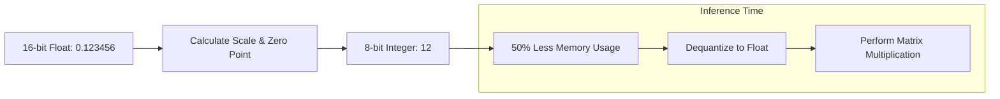

# 💎 Quantization Techniques: Squeezing Intelligence into Silicon
> **Level:** Advanced | **Language:** Hinglish | **Goal:** Master the art of model compression, covering how to convert 16-bit floating point weights into 8-bit, 4-bit, or even 1-bit integers to run massive AI on consumer hardware.

---

## 🧭 1. Beginner-Friendly Hinglish Explanation
Standard AI models bahut "Bhaari" hote hain. Ek 70B model ko load karne ke liye 140GB VRAM chahiye. Kyun? Kyunki har weight ek "16-bit Float" (decimal number) hota hai. 

**Quantization** ka matlab hai "Precision kam karna". 
Sochiye aapke paas ek scale hai jo 0.00001 gram tak naap sakta hai. Par aapko sirf "Kilo" mein cheezein chahiye. Aap 0.99998 ko "1" bol denge. 
- Hum 16-bit decimal numbers ko chote integers (jaise 8-bit ya 4-bit) mein badal dete hain.
- **Result:** Model ka size $4x$ se $8x$ kam ho jata hai. 
- **Fayda:** Jo model pehle 10 lakh ki GPU par chalta tha, ab wo aapke 1 lakh ke laptop par chal sakta hai. 

Quantization hi wo secret hai jiski wajah se AI 2026 mein "Har jeb" (Every pocket) mein pahunch chuka hai.

---

## 🧠 2. Deep Technical Explanation
Quantization is the process of mapping a large set of values (Floating Point) to a smaller, finite set (Integers).

### 1. The Math of Quantization:
To convert $x_{float}$ to $x_{int}$:
$$x_{int} = \text{round}(\frac{x}{scale} + \text{zero\_point})$$
To get it back (Dequantization):
$$x_{float} = (x_{int} - \text{zero\_point}) \times scale$$

### 2. Common Precision Types:
- **FP16 / BF16 (16-bit):** Standard training precision. No compression.
- **INT8 (8-bit):** $2x$ compression. Used in standard production servers.
- **FP4 / NF4 (4-bit):** $4x$ compression. The "Sweet Spot" for running Llama-3 locally.
- **1-bit / 1.58-bit:** Experimental. Every weight is only `-1, 0, 1`.

---

## 🏗️ 3. Quantization Strategy Matrix
| Method | Bits | File Format | Use Case |
| :--- | :--- | :--- | :--- |
| **FP16** | 16 | `.safetensors` | Training and High-end Research |
| **BitsAndBytes** | 8 / 4 | On-the-fly | Easy fine-tuning (QLoRA) |
| **GGUF (llama.cpp)**| 4 / 5 / 6 | `.gguf` | Local CPU + Apple Metal |
| **EXL2 / GPTQ** | 4 | `.exl2` | High-speed local GPU inference |
| **AWQ** | 4 | `.awq` | Server-side optimized inference |

---

## 📐 4. Mathematical Intuition
- **The "Outlier" Problem:** In LLMs, some neurons have extremely large values (outliers) compared to others. If we quantize everyone equally, we lose these important signals.
- **SmoothQuant / AWQ:** These techniques "Smooth" the outliers by shifting the scale to other layers before quantizing, keeping the accuracy high.
- **NF4 (NormalFloat 4):** A specialized 4-bit distribution that follows a "Normal Distribution," which is how most neural network weights are naturally spread.

---

## 📊 5. Quantization Flow (Diagram)


---

## 💻 6. Production-Ready Examples (Using 4-bit Quantization)
```python
# 2026 Pro-Tip: Always use BitsAndBytes for easy local testing.
from transformers import AutoModelForCausalLM, BitsAndBytesConfig

# 1. Configure 4-bit loading
quant_config = BitsAndBytesConfig(
    load_in_4bit=True,
    bnb_4bit_compute_dtype="bfloat16",
    bnb_4bit_quant_type="nf4", # NormalFloat4 is best for LLMs
    bnb_4bit_use_double_quant=True # Quantize the quantization constants!
)

# 2. Load the model
# It will only take ~5.5GB of VRAM instead of 16GB!
model = AutoModelForCausalLM.from_pretrained(
    "meta-llama/Llama-3-8B",
    quantization_config=quant_config,
    device_map="auto"
)
```

---

## ❌ 7. Failure Cases
- **The "Stupidity" Degradation:** If you quantize a small model (like 1B) to 2-bits, it will start repeating words or failing at simple grammar. Small models suffer more from quantization than large ones.
- **Inference Slowdown:** If your hardware doesn't support "Integer Math" natively, the GPU has to "Dequantize" every weight back to float before calculating, which can actually make the model SLOWER even if it's smaller.

---

## 🛠️ 8. Debugging Guide
- **Symptom:** Model works fine but outputs are very repetitive.
- **Check:** **Quantization error**. You might have pushed the bit-rate too low. Try moving from 4-bit to 5-bit or 6-bit.
- **Symptom:** "Illegal Instruction" or "CUDA Error".
- **Check:** **Library version**. BitsAndBytes needs a very specific version of CUDA and PyTorch.

---

## ⚖️ 9. Tradeoffs
- **Size vs. Accuracy:** A 4-bit model loses about $1-2\%$ accuracy but saves $75\%$ memory. For most users, this is a no-brainer.
- **PTQ (Post-Training Quantization) vs. QAT (Quantization-Aware Training):** 
  - PTQ is fast (takes minutes).
  - QAT is slow (needs retraining) but results in $10\%$ better accuracy.

---

## 🛡️ 10. Security Concerns
- **Adversarial Quantization:** An attacker could craft a model where the 16-bit version is safe, but the 4-bit quantized version has a "Hidden Backdoor" due to the way rounding happens.

---

## 📈 11. Scaling Challenges
- **Large Context OOM:** Quantization saves weight memory, but the **KV-Cache** is still in 16-bit. For long context (128k), you MUST use **KV-Cache Quantization** as well.

---

## 💸 12. Cost Considerations
- **Hardware Savings:** Instead of buying an NVIDIA A100 ($10,000$), you can run a quantized Llama-3-70B on two RTX 3090s ($1,500$ total). This is how individual developers are beating big companies.

---

## ✅ 13. Best Practices
- **Use GGUF for CPU/Mac:** It is the most robust and widely supported.
- **Use EXL2 for NVIDIA GPU:** It is significantly faster for local generation.
- **Always use `nf4` for 4-bit:** It is mathematically optimized for LLM weights.

---

## ⚠️ 14. Common Mistakes
- **Quantizing twice:** Never quantize a model that has already been quantized.
- **Ignoring the Activation Scale:** If your model has "Outliers," simple INT8 will fail. Use **SmoothQuant**.

---

## 📝 15. Interview Questions
1. **"What is the difference between FP16 and INT8 quantization?"**
2. **"Explain the 'Outlier' problem in LLM quantization."**
3. **"What is NF4 and why is it better than standard 4-bit?"**

---

## 🚀 15. Latest 2026 Industry Patterns
- **1.58-bit Ternary LLMs:** A new research from Microsoft showing that we can build LLMs where weights are only `-1, 0, or 1`. These models don't need "Multiplication," only "Addition," making them $10x-50x$ faster.
- **BitNet:** The first production-ready 1-bit Transformer architecture.
- **On-the-fly Quantization:** Web browsers (using WebGPU) that can quantize a model in real-time as they download it from HuggingFace.
