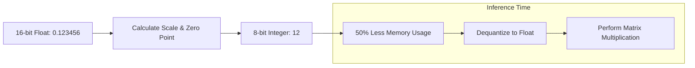

# 💎 Quantization Techniques: Squeezing Intelligence into Silicon
> **Level:** Advanced | **Language:** Hinglish | **Goal:** Model compression ki art ko master karein, jisme seekhein ki kaise 16-bit floating point weights ko 8-bit, 4-bit, ya 1-bit integers mein convert kiya jata hai taaki consumer hardware par massive AI run kiya ja sake.

---

## 🧭 1. Beginner-Friendly Hinglish Explanation
Standard AI models bahut "Bhaari" hote hain. Ek 70B model ko load karne ke liye 140GB VRAM chahiye. Kyun? Kyunki har weight ek "16-bit Float" (decimal number) hota hai. 

**Quantization** ka matlab hai "Precision kam karna". 
Sochiye aapke paas ek scale hai jo 0.00001 gram tak naap sakta hai. Par aapko sirf "Kilo" mein cheezein chahiye. Aap 0.99998 ko "1" bol denge. 
- Hum 16-bit decimal numbers ko chote integers (jaise 8-bit ya 4-bit) mein badal dete hain.
- **Result:** Model ka size $4x$ se $8x$ kam ho jata hai. 
- **Fayda:** Jo model pehle 10 lakh ki GPU par chalta tha, ab wo aapke 1 lakh ke laptop par chal sakta hai. 

Quantization hi wo secret hai jiski wajah se AI 2026 mein "Har jeb" (Every pocket) mein pahunch chuka hai.

---

## 🧠 2. Deep Technical Explanation
Quantization ek process hai jisme values ke ek bade set (Floating Point) ko ek chhote aur finite set (Integers) par map kiya jata hai.

### 1. The Math of Quantization:
$x_{float}$ ko $x_{int}$ mein convert karne ke liye formula:
$$x_{int} = \text{round}(\frac{x}{scale} + \text{zero\_point})$$
Ise wapas paane ke liye (Dequantization):
$$x_{float} = (x_{int} - \text{zero\_point}) \times scale$$

### 2. Common Precision Types:
- **FP16 / BF16 (16-bit):** Standard training precision. Isme koi compression nahi hota.
- **INT8 (8-bit):** $2x$ compression. Standard production servers mein use kiya jata hai.
- **FP4 / NF4 (4-bit):** $4x$ compression. Local machine par Llama-3 chalane ke liye ye "Sweet Spot" hai.
- **1-bit / 1.58-bit:** Experimental stage par hai. Isme har weight sirf `-1, 0, 1` hi hota hai.

---

## 🏗️ 3. Quantization Strategy Matrix
| Method | Bits | File Format | Use Case |
| :--- | :--- | :--- | :--- |
| **FP16** | 16 | `.safetensors` | Training aur High-end Research ke liye |
| **BitsAndBytes** | 8 / 4 | On-the-fly | Easy fine-tuning (QLoRA) ke liye |
| **GGUF (llama.cpp)**| 4 / 5 / 6 | `.gguf` | Local CPU + Apple Metal ke liye |
| **EXL2 / GPTQ** | 4 | `.exl2` | High-speed local GPU inference ke liye |
| **AWQ** | 4 | `.awq` | Server-side optimized inference ke liye |

---

## 📐 4. Mathematical Intuition
- **The "Outlier" Problem:** LLMs mein, kuch neurons ki values dusron ke mukable extremely large (outliers) hoti hain. Agar hum sabhi ko equally quantize kar denge, to hum in important signals ko kho denge.
- **SmoothQuant / AWQ:** Ye techniques outliers ko quantize karne se pehle scale ko dusri layers par shift karke "Smooth" karti hain, jisse accuracy high bani rehti hai.
- **NF4 (NormalFloat 4):** Ek specialized 4-bit distribution jo "Normal Distribution" ko follow karti hai, kyunki zyada tar neural network weights naturally isi tarah spread hote hain.

---

## 📊 5. Quantization Flow (Diagram)

```mermaid
graph LR
    FP16[16-bit Float: 0.123456] --> Scale[Calculate Scale & Zero Point]
    Scale --> INT8[8-bit Integer: 12]
    INT8 --> Storage[50% Less Memory Usage]
    
    subgraph "Inference Time"
    Storage --> Deq[Dequantize to Float]
    Deq --> Compute[Perform Matrix Multiplication]
    end
```

---

## 💻 6. Production-Ready Examples (Using 4-bit Quantization)
```python
# 2026 Pro-Tip: Aasan local testing ke liye hamesha BitsAndBytes ka use karein.
from transformers import AutoModelForCausalLM, BitsAndBytesConfig

# 1. 4-bit loading ko configure karein
quant_config = BitsAndBytesConfig(
    load_in_4bit=True,
    bnb_4bit_compute_dtype="bfloat16",
    bnb_4bit_quant_type="nf4", # NormalFloat4 LLMs ke liye best hai
    bnb_4bit_use_double_quant=True # Quantization constants ko bhi quantize karein!
)

# 2. Model ko load karein
# Ye 16GB ki jagah sirf ~5.5GB VRAM hi lega!
model = AutoModelForCausalLM.from_pretrained(
    "meta-llama/Llama-3-8B",
    quantization_config=quant_config,
    device_map="auto"
)
```

---

## ❌ 7. Failure Cases
- **The "Stupidity" Degradation:** Agar aap kisi chhote model (jaise 1B) ko 2-bits par quantize karte hain, to wo words repeat karna shuru kar dega ya simple grammar mein fail hone lagega. Chhote models bade models ke mukable quantization se zyada suffer karte hain.
- **Inference Slowdown:** Agar aapka hardware natively "Integer Math" support nahi karta hai, to GPU ko calculation se pehle har ek weight ko wapas float mein "Dequantize" karna padta hai, jisse model small hone ke bawajud actually SLOWER (slow) ho sakta hai.

---

## 🛠️ 8. Debugging Guide
- **Symptom:** Model sahi kaam kar raha hai lekin outputs bahut repetitive hain.
- **Check:** **Quantization error**. Ho sakta hai aapne bit-rate ko bahut zyada low kar diya ho. 4-bit ke bajaye 5-bit ya 6-bit par shift karke dekhein.
- **Symptom:** "Illegal Instruction" ya "CUDA Error".
- **Check:** **Library version**. BitsAndBytes ko CUDA aur PyTorch ke ek specific version ki zaroorat hoti hai.

---

## ⚖️ 9. Tradeoffs
- **Size vs. Accuracy:** Ek 4-bit model lagbhag $1-2\%$ accuracy lose karta hai lekin $75\%$ memory bacha leta hai. Zyada tar users ke liye, ye ek straightforward decision (no-brainer) hai.
- **PTQ (Post-Training Quantization) vs. QAT (Quantization-Aware Training):**
  - PTQ fast hota hai (kuch minutes lagte hain).
  - QAT slow hota hai (fir se train karna padta hai) lekin isse $10\%$ behtar accuracy milti hai.

---

## 🛡️ 10. Security Concerns
- **Adversarial Quantization:** Koi attacker ek aisa model tayyar kar sakta hai jiska 16-bit version safe ho, lekin rounding ke tarike ki wajah se uska 4-bit quantized version ek "Hidden Backdoor" (chhipa hua backdoor) contain karta ho.

---

## 📈 11. Scaling Challenges
- **Large Context OOM:** Quantization model weight memory to bacha leta hai, lekin **KV-Cache** abhi bhi 16-bit mein hota hai. Long context (128k) ke liye, aapko **KV-Cache Quantization** ka bhi use karna hoga.

---

## 💸 12. Cost Considerations
- **Hardware Savings:** Ek NVIDIA A100 ($10,000$) khareedne ke bajaye, aap do RTX 3090s ($1,500$ total) par quantized Llama-3-70B chala sakte hain. Kuch is tarah individual developers badi companies ko beat kar rahe hain.

---

## ✅ 13. Best Practices
- **CPU/Mac ke liye GGUF use karein:** Ye sabse robust hai aur iska support sabse wide hai.
- **NVIDIA GPU ke liye EXL2 use karein:** Ye local generation ke liye kafi faster hai.
- **4-bit ke liye hamesha `nf4` use karein:** Ye LLM weights ke liye mathematically optimized hai.

---

## ⚠️ 14. Common Mistakes
- **Do baar quantize karna:** Aise model ko kabhi quantize na karein jo pehle se quantize kiya ja chuka ho.
- **Activation Scale ko ignore karna:** Agar aapke model mein "Outliers" hain, to simple INT8 fail ho jayega. **SmoothQuant** ka use karein.

---

## 📝 15. Interview Questions
1. **"FP16 aur INT8 quantization ke beech kya difference hai?"**
2. **"LLM quantization mein 'Outlier' problem ko explain karein."**
3. **"NF4 kya hai aur ye standard 4-bit se behtar kyu hai?"**

---

## 🚀 15. Latest 2026 Industry Patterns
- **1.58-bit Ternary LLMs:** Microsoft ki ek nayi research jo dikhati hai ki hum aise LLMs bana sakte hain jahan weights sirf `-1, 0, ya 1` hote hain. In models ko "Multiplication" ki zaroorat nahi hoti, sirf "Addition" chahiye hota hai, jisse ye $10x-50x$ faster ho jate hain.
- **BitNet:** Pehli production-ready 1-bit Transformer architecture.
- **On-the-fly Quantization:** Web browsers (WebGPU ka use karke) jo HuggingFace se download karte samay hi model ko real-time mein quantize kar sakte hain.

