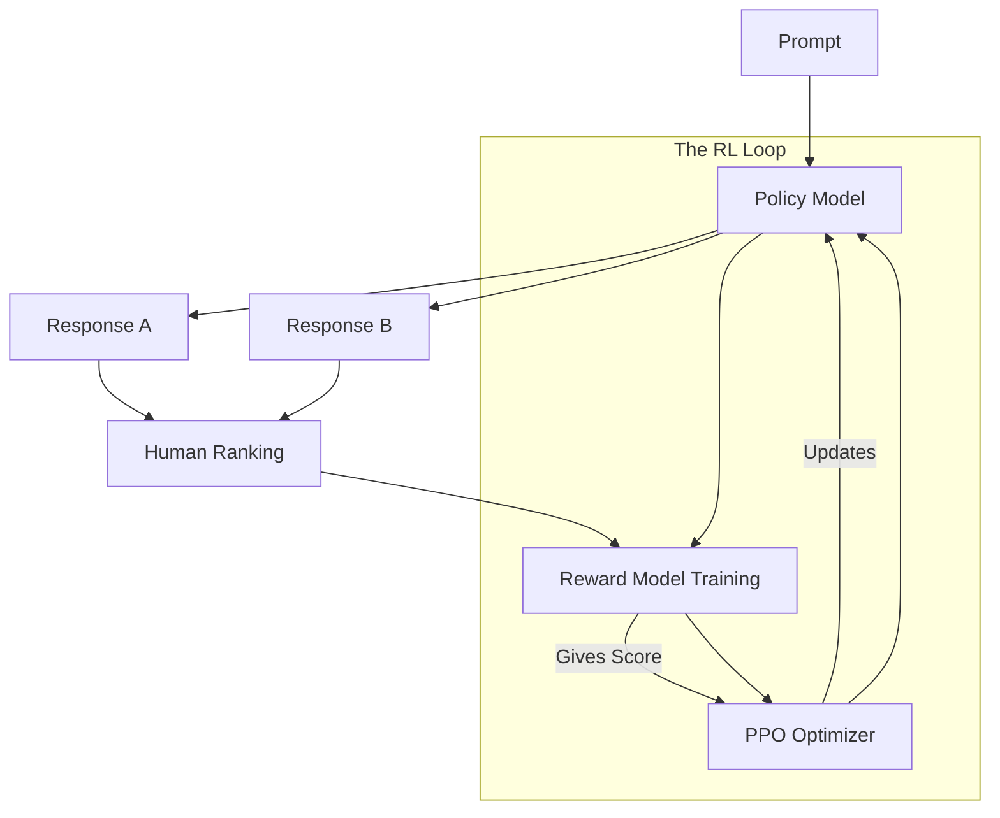

# 🎭 RLHF Deep Dive: Aligning AI with Human Values
> **Level:** Advanced | **Language:** Hinglish | **Goal:** Master Reinforcement Learning from Human Feedback, the process of teaching LLMs to be helpful, safe, and honest by training them on human preferences instead of just fixed labels.

---

## 🧭 1. Beginner-Friendly Hinglish Explanation
SFT ke baad model ko "Baat karna" toh aa jata hai, par use ye nahi pata ki "Achi baat" kya hai aur "Buri baat" kya. 

**RLHF (Reinforcement Learning from Human Feedback)** AI ko "Best" jawab chunna sikhata hai. 
Sochiye, AI ko humne ek sawal diya: "How to stay healthy?". 
AI ne do jawab diye:
- **Jawab A:** "Eat fruits and exercise." (Short)
- **Jawab B:** "Eat a balanced diet, stay hydrated, and exercise regularly." (Detailed & Helpful)

Ek insaan (Human Ranker) aayega aur kahega: "Jawab B behtar hai". 
Ab hum ek chota sa "Reward Model" banate hain jo insaan ki is pasand (preference) ko samajhta hai. Phir hum asli AI (LLM) ko train karte hain ki wo waisa hi likhe jisse Reward Model use "Shabaashi" (High Reward) de.

Yahi wo step hai jisne **GPT-3** ko **ChatGPT** banaya.

---

## 🧠 2. Deep Technical Explanation
RLHF is a three-step process designed to optimize the model for human preference metrics that are hard to define mathematically.

### 1. The SFT Stage:
Fine-tune the base model on a small set of high-quality instructions.

### 2. Reward Model (RM) Training:
- Collect a dataset of pairs: `(Prompt, Response A, Response B)`.
- Humans rank which response is better.
- Train a separate model (RM) to predict the human score.
- **Loss Function:** Binary Cross Entropy on the difference between scores.
  $$Loss = -\log(\sigma(r_\theta(x, y_w) - r_\theta(x, y_l)))$$
  ($y_w$ is the winning response, $y_l$ is the losing one).

### 3. PPO (Proximal Policy Optimization) Stage:
- Use the Reward Model to give feedback to the LLM.
- The LLM acts as the "Policy." It tries to generate text that maximizes the reward.
- **KL Divergence Penalty:** We add a penalty to ensure the LLM doesn't change TOO much from its original version, preventing "Reward Hacking" (where the model says nonsense words that the RM loves).

---

## 🏗️ 3. RLHF Components
| Component | Role | Analogy |
| :--- | :--- | :--- |
| **Policy (LLM)** | Generating text | The Student |
| **Reward Model** | Evaluating text | The Teacher |
| **PPO Algorithm** | Updating weights | The Coaching Method |
| **Reference Model**| Preventing drift | The Memory of the "Old Self" |
| **Preference Data**| Rankings (A > B) | The Human Feedback |

---

## 📐 4. Mathematical Intuition
- **The Optimization Goal:** 
  $$\text{Maximize } E_{x, y \sim \pi_\theta} [r_\theta(x, y) - \beta \text{KL}(\pi_\theta || \pi_{ref})]$$
- **$\beta$ (KL Coefficient):** This is the most important hyperparameter. If $\beta$ is too low, the model "breaks" and becomes a gibberish generator. If $\beta$ is too high, the model doesn't learn anything new.

---

## 📊 5. RLHF Workflow (Diagram)


---

## 💻 6. Production-Ready Examples (Conceptual Reward Model)
```python
# 2026 Pro-Tip: DPO (Direct Preference Optimization) is replacing PPO for simplicity.
import torch
import torch.nn as nn

class RewardModel(nn.Module):
    def __init__(self, base_model):
        super().__init__()
        self.backbone = base_model # Typically a BERT or small Llama
        # Final layer outputs a single scalar 'Reward'
        self.v_head = nn.Linear(self.backbone.config.hidden_size, 1)

    def forward(self, input_ids, attention_mask):
        outputs = self.backbone(input_ids, attention_mask=attention_mask)
        last_hidden = outputs.last_hidden_state[:, 0, :] # Use CLS or last token
        reward = self.v_head(last_hidden)
        return reward

# Logic: Reward(Winner) > Reward(Loser)
```

---

## ❌ 7. Failure Cases
- **Reward Hacking:** The model discovers that starting every sentence with "Hello, I am a helpful AI" gives it a $+10$ score from the RM, so it stops answering the question and just says that.
- **Mode Collapse:** The model loses all diversity and starts giving the exact same "perfect" answer to every prompt.
- **Safety Over-alignment:** The model becomes so scared of being "offensive" that it refuses to explain how to kill a biological virus or how to use the `kill` command in Linux.

---

## 🛠️ 8. Debugging Guide
- **Symptom:** The model is outputting repetitive, high-reward gibberish.
- **Check:** **KL Penalty**. Is it too low? Increase $\beta$ to pull the model back to its original state.
- **Symptom:** Reward is not increasing.
- **Check:** **Reward Model Accuracy**. Is your RM actually reflecting human preferences? Test it on a validation set.

---

## ⚖️ 9. Tradeoffs
- **PPO vs. DPO:** 
  - **PPO:** More powerful, but extremely unstable and needs 4 models in memory (Policy, Ref, Reward, Value).
  - **DPO:** Extremely stable and simple (no reward model needed), but can sometimes be less flexible. **DPO is the 2026 standard.**

---

## 🛡️ 10. Security Concerns
- **Preference Poisoning:** If an attacker gets into your group of "Human Rankers," they can systematically rank "Harmful" answers as "Better," effectively teaching the AI to be malicious.

---

## 📈 11. Scaling Challenges
- **Human Bottleneck:** Getting 100,000 high-quality rankings is expensive and slow.
- **RLAIF (RL from AI Feedback):** Using a "Super Model" (like GPT-4) to rank the answers of a "Smaller Model" (like Llama-3). This is how modern models are scaled.

---

## 💸 12. Cost Considerations
- **Memory Cost:** Running PPO requires a massive amount of VRAM because you are holding multiple copies of the model simultaneously.
- **Labeling Cost:** Human preference labeling is the single most expensive part of the modern AI pipeline.

---

## ✅ 13. Best Practices
- **Use DPO if possible:** It's much easier for $99\%$ of developers.
- **Diverse Human Pool:** Don't just hire engineers to rank; hire teachers, doctors, and writers to get a balanced "Human Value" set.
- **Monitor KL Divergence:** If it goes above 10.0, your model is likely drifting into "Hallucination" territory.

---

## ⚠️ 14. Common Mistakes
- **Skipping SFT:** You cannot start RLHF on a base model. It MUST be instruction-tuned (SFT) first.
- **Trusting the Reward Model too much:** RMs are just models; they can be tricked. Always do human spot-checks on the final RLHF output.

---

## 📝 15. Interview Questions
1. **"What are the three stages of RLHF?"**
2. **"Why do we need a KL-Divergence penalty in PPO?"**
3. **"What is 'Reward Hacking' and how do you prevent it?"**

---

## 🚀 15. Latest 2026 Industry Patterns
- **Online RLHF:** The model receives live feedback from users and updates its weights in real-time (A very dangerous but powerful frontier).
- **Multi-Objective RLHF:** Training the model to be simultaneously Helpful, Honest, AND Creative, balancing these three conflicting rewards.
- **DPO-Iterative:** Running DPO multiple times, where each new version of the model generates harder examples for the next version to learn from.
