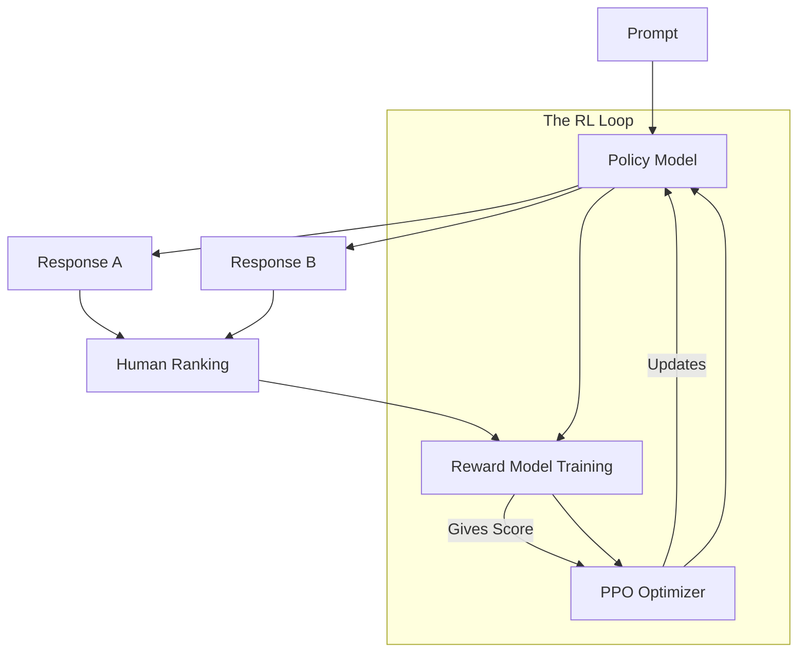

# 🎭 RLHF Deep Dive: Aligning AI with Human Values
> **Level:** Advanced | **Language:** Hinglish | **Goal:** Reinforcement Learning from Human Feedback ko master karein, jo LLMs ko helpful, safe, aur honest banane ki process hai, unhe human preferences par train karke bajaye sirf fixed labels ke.

---

## 🧭 1. Beginner-Friendly Hinglish Explanation
SFT ke baad model ko "Baat karna" toh aa jata hai, par use ye nahi pata ki "Achi baat" kya hai aur "Buri baat" kya. 

**RLHF (Reinforcement Learning from Human Feedback)** AI ko "Best" jawab chunna sikhata hai. 
Sochiye, AI ko humne ek sawal diya: "How to stay healthy?". 
AI ne do jawab diye:
- **Jawab A:** "Eat fruits and exercise." (Short)
- **Jawab B:** "Eat a balanced diet, stay hydrated, and exercise regularly." (Detailed & Helpful)

Ek insaan (Human Ranker) aayega aur kahega: "Jawab B behtar hai". 
Ab hum ek chota sa "Reward Model" banate hain jo insaan ki is pasand (preference) ko samajhta hai. Phir hum asli AI (LLM) ko train karte hain ki wo waisa hi likhe jisse Reward Model use "Shabaashi" (High Reward) de.

Yahi wo step hai jisne **GPT-3** ko **ChatGPT** banaya.

---

## 🧠 2. Deep Technical Explanation
RLHF ek three-step process hai jise model ko insaani preference metrics ke liye optimize karne ke liye design kiya gaya hai, jinhe mathematically define karna mushkil hota hai.

### 1. The SFT Stage:
Base model ko high-quality instructions ke ek chhote set par fine-tune kiya jata hai.

### 2. Reward Model (RM) Training:
- Pairs ka ek dataset collect kiya jata hai: `(Prompt, Response A, Response B)`.
- Humans rank karte hain ki kaun sa response behtar hai.
- Human score ko predict karne ke liye ek alag model (RM) ko train kiya jata hai.
- **Loss Function:** Scores ke beech ke difference par Binary Cross Entropy lagayi jati hai.
  $$Loss = -\log(\sigma(r_\theta(x, y_w) - r_\theta(x, y_l)))$$
  (yahan $y_w$ winning response hai aur $y_l$ losing response hai).

### 3. PPO (Proximal Policy Optimization) Stage:
- Reward Model ka use LLM ko feedback dene ke liye kiya jata hai.
- LLM ek "Policy" ki tarah act karta hai. Ye aisa text generate karne ki koshish karta hai jo reward ko maximize kare.
- **KL Divergence Penalty:** Hum ek penalty add karte hain taaki ye ensure kiya ja sake ki LLM apne original version se bahut ZYADA change na ho. Isse "Reward Hacking" (jahan model reward paane ke liye ajeeb-o-gareeb words bolne lagta hai jo RM ko pasand aate hain) ko roka jata hai.

---

## 🏗️ 3. RLHF Components
| Component | Role | Analogy |
| :--- | :--- | :--- |
| **Policy (LLM)** | Text generate karna | Student (Chhatra) |
| **Reward Model** | Text ko evaluate karna | Teacher (Shikshak) |
| **PPO Algorithm** | Weights ko update karna | Coaching Method (Sikhane ka Tarika) |
| **Reference Model**| Drift ko rokna | "Purane Self" (purane roop) ki memory |
| **Preference Data**| Rankings (A > B) | Human Feedback (Insaani feedback) |

---

## 📐 4. Mathematical Intuition
- **The Optimization Goal:**
  $$\text{Maximize } E_{x, y \sim \pi_\theta} [r_\theta(x, y) - \beta \text{KL}(\pi_\theta || \pi_{ref})]$$
- **$\beta$ (KL Coefficient):** Ye sabse important hyperparameter hai. Agar $\beta$ bahut kam hai, to model "break" ho jata hai aur gibberish (faltu) generator ban jata hai. Agar $\beta$ bahut high hai, to model kuch naya nahi seekh pata.

---

## 📊 5. RLHF Workflow (Diagram)

```mermaid
graph TD
    Data[Prompt] --> LLM[Policy Model]
    LLM --> R1[Response A]
    LLM --> R2[Response B]
    R1 & R2 --> Human[Human Ranking]
    Human --> RM[Reward Model Training]
    
    RM -- "Gives Score" --> PPO[PPO Optimizer]
    PPO -- "Updates" --> LLM
    
    subgraph "The RL Loop"
    LLM --> RM --> PPO --> LLM
    end
```

---

## 💻 6. Production-Ready Examples (Conceptual Reward Model)
```python
# 2026 Pro-Tip: Simplicity ke liye DPO (Direct Preference Optimization) ab PPO ko replace kar raha hai.
import torch
import torch.nn as nn

class RewardModel(nn.Module):
    def __init__(self, base_model):
        super().__init__()
        self.backbone = base_model # Aamtaur par ek BERT ya chhota Llama model
        # Final layer ek single scalar 'Reward' output karti hai
        self.v_head = nn.Linear(self.backbone.config.hidden_size, 1)

    def forward(self, input_ids, attention_mask):
        outputs = self.backbone(input_ids, attention_mask=attention_mask)
        last_hidden = outputs.last_hidden_state[:, 0, :] # CLS ya last token use karein
        reward = self.v_head(last_hidden)
        return reward

# Logic: Reward(Winner) > Reward(Loser)
```

---

## ❌ 7. Failure Cases
- **Reward Hacking:** Model ko pata chal jata hai ki har sentence ko "Hello, I am a helpful AI" se start karne par RM use $+10$ score deta hai, isliye wo sawaal ka jawab dena chhod kar bas yahi bolne lagta hai.
- **Mode Collapse:** Model apni saari diversity kho deta hai aur har ek prompt ka bilkul same "perfect" (sahi) answer dene lagta hai.
- **Safety Over-alignment:** Model "offensive" hone se itna zyada darr jata hai ki wo kisi biological virus ko kill karne ka tarika batane se ya Linux mein `kill` command use karna sikhane se bhi mana kar deta hai.

---

## 🛠️ 8. Debugging Guide
- **Symptom:** Model repetitive, high-reward gibberish (faltu text) output kar raha hai.
- **Check:** **KL Penalty**. Kya ye bahut low hai? Model ko uski original state par wapas laane ke liye $\beta$ ko badhayein.
- **Symptom:** Reward increase nahi ho raha hai.
- **Check:** **Reward Model Accuracy**. Kya aapka RM sach mein human preferences ko represent kar raha hai? Validation set par ise test karein.

---

## ⚖️ 9. Tradeoffs
- **PPO vs. DPO:**
  - **PPO:** Zyada powerful hai, lekin behad unstable hota hai aur memory mein 4 models ki zaroorat hoti hai (Policy, Ref, Reward, Value).
  - **DPO:** Behad stable aur simple hai (kisi reward model ki zaroorat nahi hoti), lekin kabhi-kabhi kam flexible ho sakta hai. **DPO 2026 ka standard hai.**

---

## 🛡️ 10. Security Concerns
- **Preference Poisoning:** Agar koi attacker aapke "Human Rankers" ke group mein shamil ho jata hai, to wo systematically "Harmful" (nuksaandeh) answers ko "Better" rank de sakta hai, jisse AI malicious (kharaab/harmful) banna seekh jayega.

---

## 📈 11. Scaling Challenges
- **Human Bottleneck:** 100,000 high-quality rankings lena kafi expensive aur slow hota hai.
- **RLAIF (RL from AI Feedback):** Ek "Smaller Model" (jaise Llama-3) ke answers ko rank karne ke liye ek "Super Model" (jaise GPT-4) ka use karna. Modern models ko kuch isi tarah scale kiya jata hai.

---

## 💸 12. Cost Considerations
- **Memory Cost:** PPO run karne ke liye massive amount mein VRAM ki zaroorat hoti hai kyunki aap ek saath model ki multiple copies memory mein rakh rahe hote hain.
- **Labeling Cost:** Insaani preference labeling modern AI pipeline ka sabse zyada expensive (kharchila) hissa hai.

---

## ✅ 13. Best Practices
- **Agar possible ho to DPO use karein:** Ye $99\%$ developers ke liye kafi aasan hai.
- **Diverse Human Pool:** Rank karne ke liye sirf engineers ko hi hire na karein; ek balanced "Human Value" set paane ke liye teachers, doctors, aur writers ko bhi hire karein.
- **KL Divergence ko monitor karein:** Agar ye 10.0 se upar jata hai, to aapka model likely "Hallucination" territory mein ja raha hai.

---

## ⚠️ 14. Common Mistakes
- **SFT ko skip karna:** Aap base model par directly RLHF start nahi kar sakte. Ise pehle instruction-tuned (SFT) kiya jana zaroori hai.
- **Reward Model par bahut zyada trust karna:** RMs sirf models hain; inhe trick kiya ja sakta hai. Final RLHF output ka hamesha insaani spot-check (cross-check) karein.

---

## 📝 15. Interview Questions
1. **"RLHF ke teen stages kya hain?"**
2. **"PPO mein KL-Divergence penalty ki zaroorat kyu hoti hai?"**
3. **"Reward Hacking kya hai aur aap ise kaise prevent karte hain?"**

---

## 🚀 15. Latest 2026 Industry Patterns
- **Online RLHF:** Model ko users se live feedback milta hai aur wo real-time mein apne weights ko update karta hai (Ye ek bahut hi khatarnak lekin powerful field hai).
- **Multi-Objective RLHF:** Model ko ek saath Helpful, Honest, aur Creative hone ke liye train karna, in teenon aapas mein contrast karne wale rewards ko balance karte hue.
- **DPO-Iterative:** DPO ko multiple times run karna, jahan model ka har naya version agle version ke seekhne ke liye behtar/mushkil examples generate karta hai.

