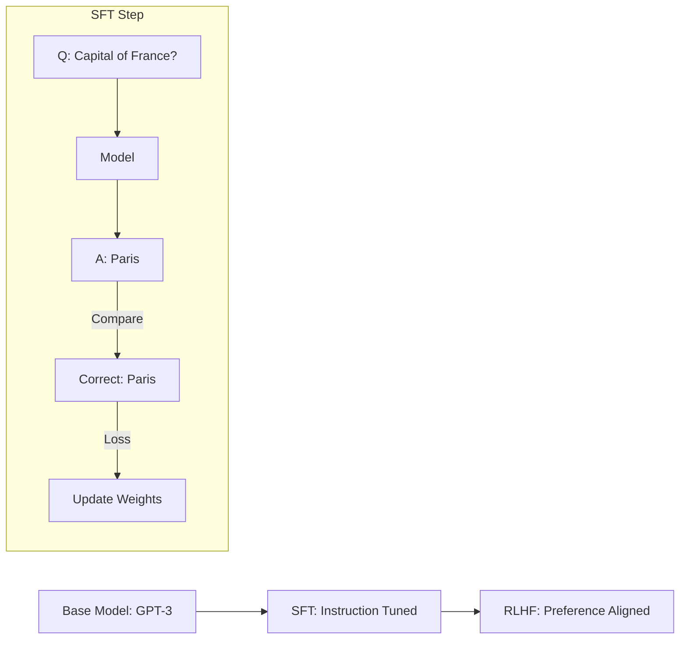

# 🎯 Supervised Fine-Tuning (SFT): The Art of Instruction
> **Level:** Advanced | **Language:** Hinglish | **Goal:** Master the second stage of the LLM pipeline, where a general-purpose "Base Model" is transformed into a "Chat Assistant" using high-quality human-labeled instruction datasets.

---

## 🧭 1. Beginner-Friendly Hinglish Explanation
Pretraining ke baad model ek "Library" ki tarah hota hai—use sab pata hai, par use "Baat karna" nahi aata. Agar aap use bologe "Write a poem," toh ho sakta hai wo aur 10 poems ki list de de (kyunki internet par aisa hi hota hai).

**SFT (Supervised Fine-Tuning)** wo process hai jisme hum model ko "Adab" (Instructions) sikhate hain. 
- Hum model ko hazaaron examples dikhate hain:
  - **Input:** "Write a poem about a cat."
  - **Output:** "In the garden, soft and small..." (Written by a human).
- AI in examples ko dekh kar samajh jata hai ki: "Jab koi mujhse kuch puchta hai, toh mujhe uska Jawab dena hai, na ki sirf sentence continue karna."

SFT hi wo step hai jo ek raw LLM ko **ChatGPT** ya **Claude** banata hai.

---

## 🧠 2. Deep Technical Explanation
SFT is the process of further training a pre-trained model on a dataset of **Instruction-Response** pairs.

### The Process:
1. **Dataset Preparation:** Curating datasets like Alpaca, ShareGPT, or custom internal data. The format is typically `{"instruction": "...", "input": "...", "output": "..."}`.
2. **Causal Language Modeling (Again):** We use the same next-token prediction objective, but only calculate the loss on the **Response** part of the sequence. We ignore the loss on the "Instruction" part to avoid "learning" the user's prompt.
3. **Hyperparameters:** SFT usually requires a much lower learning rate ($1e-5$) and very few epochs (1 to 3). Training too long leads to **Catastrophic Forgetting**.

---

## 🏗️ 3. SFT vs. Pretraining
| Feature | Pretraining | SFT |
| :--- | :--- | :--- |
| **Data Source** | Raw Internet (Trillions of tokens) | Human-labeled (10k - 100k pairs) |
| **Objective** | Learn "Knowledge" | Learn "Format & Behavior" |
| **Labels** | None (Self-supervised) | Human-written "Golden" responses |
| **Compute Cost** | High (Millions of dollars) | Low (Hundreds of dollars) |
| **Risk** | Bias, Toxicity | Overfitting, Memorization |

---

## 📐 4. Mathematical Intuition
- **The Masked Loss:** 
  In SFT, the prompt part $x_{1...p}$ is passed through the model, but we only calculate the cross-entropy loss for $x_{p+1...n}$ (the response).
  $$Loss = -\sum_{t=p+1}^{n} \log P(x_t | x_{1...t-1})$$
- **Catastrophic Forgetting:** If you over-train on "Medical Questions," the model might lose its ability to "Write Code." We often mix in a small percentage ($5-10\%$) of original pretraining data to maintain general intelligence.

---

## 📊 5. The Alignment Journey (Diagram)


---

## 💻 6. Production-Ready Examples (SFT with HuggingFace TRL)
```python
# 2026 Pro-Tip: Use the TRL (Transformer Reinforcement Learning) library for easy SFT.
from trl import SFTTrainer
from transformers import AutoModelForCausalLM, TrainingArguments
from datasets import load_dataset

# 1. Load Dataset (Instruction-Response pairs)
dataset = load_dataset("tatsu-lab/alpaca", split="train")

# 2. Setup SFT Trainer
# This handles the masking of the prompt automatically!
trainer = SFTTrainer(
    model="meta-llama/Llama-3-8B",
    train_dataset=dataset,
    dataset_text_field="text",
    max_seq_length=512,
    args=TrainingArguments(
        output_dir="./output",
        per_device_train_batch_size=4,
        learning_rate=2e-5,
        num_train_epochs=1,
        logging_steps=10,
    ),
)

# trainer.train()
```

---

## ❌ 7. Failure Cases
- **The "Yes-man" Syndrome:** If your SFT data is too polite, the model will never say "I don't know," even for impossible questions.
- **Overfitting to Format:** If all your training examples start with "Sure, I can help with that!", the model will start every single response with that phrase.
- **Vram OOM:** Fine-tuning a 70B model requires $140GB+$ of VRAM. **Fix:** Use **QLoRA** (4-bit quantization).

---

## 🛠️ 8. Debugging Guide
- **Symptom:** Model is repeating the user's prompt in the output.
- **Check:** **Loss Masking**. Are you accidentally calculating loss on the input/prompt?
- **Symptom:** Model is hallucinating more after SFT.
- **Check:** **Data Quality**. Does your SFT dataset contain wrong facts? The model will "un-learn" its pretraining knowledge if the SFT data contradicts it.

---

## ⚖️ 9. Tradeoffs
- **Full Fine-tuning vs. LoRA:** Full fine-tuning is more powerful but needs $10x$ more VRAM. LoRA is almost as good and can run on a single gaming GPU.
- **Epochs:** 1 epoch is usually enough. 5 epochs will make the model "robotic" and biased toward the training set.

---

## 🛡️ 10. Security Concerns
- **Poisoning SFT Data:** If an attacker gets one malicious example into your 50,000-example SFT set (e.g., a "backdoor"), they can trigger specific behaviors in the final product.

---

## 📈 11. Scaling Challenges
- **Data Quality Wall:** We have enough raw data, but high-quality **Human Labeled** data is scarce. In 2026, we use "Synthetic SFT" (using GPT-4 to create data for Llama-3).

---

## 💸 12. Cost Considerations
- **Human Annotation:** Hiring 100 experts to write 50,000 instruction pairs costs $\$500,000+$.
- **Compute:** SFT is $1,000x$ cheaper than pretraining. It usually costs $\$100-\$5,000$ in GPU credits.

---

## ✅ 13. Best Practices
- **Data over Model:** 1,000 "Perfect" human-written examples are better than 1,000,000 "Average" AI-generated examples.
- **Diversity:** Ensure your SFT data covers Code, Math, Creative Writing, and Safety.
- **Packing:** Combine multiple short examples into one $4096$-token sequence to keep the GPU busy and training fast.

---

## ⚠️ 14. Common Mistakes
- **Training on too many epochs:** You will lose the model's creativity.
- **Not using Chat Templates:** Every model has a different template (e.g., `[INST]`, `<|user|>`). If you fine-tune on a different template than the base model, it will fail.

---

## 📝 15. Interview Questions
1. **"What is the difference between Pretraining and SFT?"**
2. **"Why do we mask the prompt tokens during SFT loss calculation?"**
3. **"What is 'Catastrophic Forgetting' and how do you prevent it?"**

---

## 🚀 15. Latest 2026 Industry Patterns
- **DPO (Direct Preference Optimization):** A new method that combines SFT and RLHF into one single math step, making model alignment $2x$ faster and more stable.
- **Constitutional AI:** Using a "Source of Truth" document to automatically generate SFT examples that follow specific ethical rules.
- **LIMA (Less Is More for Alignment):** A landmark discovery that showed you only need **1,000 extremely high-quality** examples to align a model, not 50,000.
