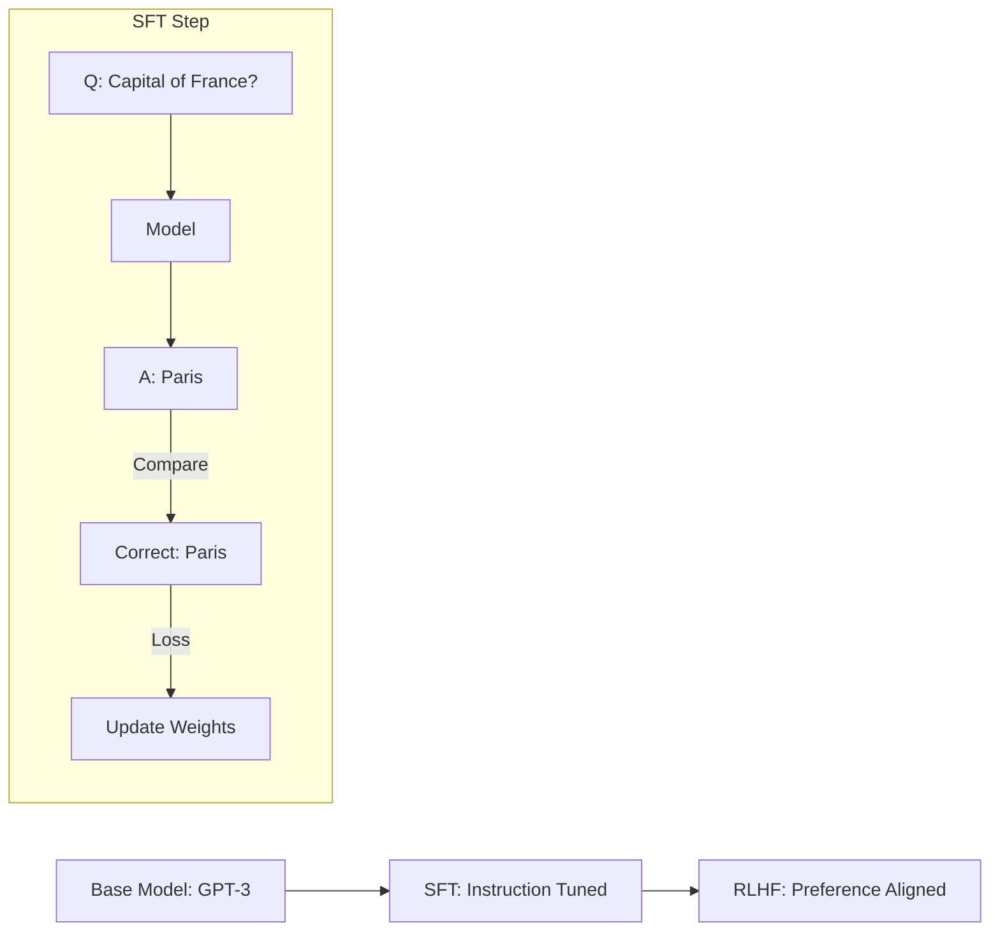

# 🎯 Supervised Fine-Tuning (SFT): The Art of Instruction
> **Level:** Advanced | **Language:** Hinglish | **Goal:** LLM pipeline ke second stage ko master karein, jahan ek general-purpose "Base Model" ko high-quality human-labeled instruction datasets ka use karke "Chat Assistant" mein transform kiya jata hai.

---

## 🧭 1. Beginner-Friendly Hinglish Explanation
Pretraining ke baad model ek "Library" ki tarah hota hai—use sab pata hai, par use "Baat karna" nahi aata. Agar aap use bologe "Write a poem," toh ho sakta hai wo aur 10 poems ki list de de (kyunki internet par aisa hi hota hai).

**SFT (Supervised Fine-Tuning)** wo process hai jisme hum model ko "Adab" (Instructions) sikhate hain. 
- Hum model ko hazaaron examples dikhate hain:
  - **Input:** "Write a poem about a cat."
  - **Output:** "In the garden, soft and small..." (Written by a human).
- AI in examples ko dekh kar samajh jata hai ki: "Jab koi mujhse kuch puchta hai, toh mujhe uska Jawab dena hai, na ki sirf sentence continue karna."

SFT hi wo step hai jo ek raw LLM ko **ChatGPT** ya **Claude** banata hai.

---

## 🧠 2. Deep Technical Explanation
SFT ek pretrained model ko **Instruction-Response** pairs ke dataset par aage train karne ka process hai.

### The Process:
1. **Dataset Preparation:** Alpaca, ShareGPT ya custom internal data jaise datasets ko curate karna. Iska format aamtaur par `{"instruction": "...", "input": "...", "output": "..."}` hota hai.
2. **Causal Language Modeling (Again):** Hum wahi same next-token prediction objective use karte hain, lekin loss sirf sequence ke **Response** part par hi calculate karte hain. Hum "Instruction" part par loss ko ignore karte hain taaki model user ke prompt ko "learn" (seekhna) na kare.
3. **Hyperparameters:** SFT ke liye aamtaur par bahut low learning rate ($1e-5$) aur bahut kam epochs (1 se 3) ki zaroorat hoti hai. Bahut zyada training karne se **Catastrophic Forgetting** ho sakti hai.

---

## 🏗️ 3. SFT vs. Pretraining
| Feature | Pretraining | SFT |
| :--- | :--- | :--- |
| **Data Source** | Raw Internet (Trillions of tokens) | Human-labeled (10k - 100k pairs) |
| **Objective** | "Knowledge" seekhna | "Format & Behavior" seekhna |
| **Labels** | None (Self-supervised) | Human-written "Golden" responses |
| **Compute Cost** | High (Millions of dollars) | Low (Hundreds of dollars) |
| **Risk** | Bias, Toxicity | Overfitting, Memorization |

---

## 📐 4. Mathematical Intuition
- **The Masked Loss:** 
  SFT mein, prompt part $x_{1...p}$ ko model se pass kiya jata hai, lekin hum cross-entropy loss sirf $x_{p+1...n}$ (response) ke liye hi calculate karte hain.
  $$Loss = -\sum_{t=p+1}^{n} \log P(x_t | x_{1...t-1})$$
- **Catastrophic Forgetting:** Agar aap "Medical Questions" par over-train kar dete hain, to ho sakta hai model "Write Code" (code likhne) ki ability kho de. General intelligence ko maintain rakhne ke liye hum aksar original pretraining data ka ek chhota percentage ($5-10\%$) mix kar dete hain.

---

## 📊 5. The Alignment Journey (Diagram)

```mermaid
graph LR
    Base[Base Model: GPT-3] --> SFT[SFT: Instruction Tuned]
    SFT --> RLHF[RLHF: Preference Aligned]
    
    subgraph "SFT Step"
    Input["Q: Capital of France?"] --> Model[Model]
    Model --> Pred["A: Paris"]
    Pred -- "Compare" --> Target["Correct: Paris"]
    Target -- "Loss" --> Weights[Update Weights]
    end
```

---

## 💻 6. Production-Ready Examples (SFT with HuggingFace TRL)
```python
# 2026 Pro-Tip: Aasan SFT ke liye TRL (Transformer Reinforcement Learning) library ka use karein.
from trl import SFTTrainer
from transformers import AutoModelForCausalLM, TrainingArguments
from datasets import load_dataset

# 1. Dataset Load karein (Instruction-Response pairs)
dataset = load_dataset("tatsu-lab/alpaca", split="train")

# 2. SFT Trainer Setup karein
# Ye automatically prompt ki masking ko handle kar leta hai!
trainer = SFTTrainer(
    model="meta-llama/Llama-3-8B",
    train_dataset=dataset,
    dataset_text_field="text",
    max_seq_length=512,
    args=TrainingArguments(
        output_dir="./output",
        per_device_train_batch_size=4,
        learning_rate=2e-5,
        num_train_epochs=1,
        logging_steps=10,
    ),
)
```

---

## ❌ 7. Failure Cases
- **The "Yes-man" Syndrome:** Agar aapka SFT data bahut zyada polite (namra) hai, to model kabhi "I don't know" (mujhe nahi pata) nahi kahega, chahe question kitna bhi impossible kyu na ho.
- **Overfitting to Format:** Agar aapke saare training examples "Sure, I can help with that!" se start hote hain, to model har ek response ko usi phrase se shuru karne lagega.
- **Vram OOM:** Ek 70B model ko fine-tune karne ke liye $140GB+$ VRAM ki zaroorat hoti hai. **Fix:** **QLoRA** (4-bit quantization) ka use karein.

---

## 🛠️ 8. Debugging Guide
- **Symptom:** Model output mein user ke prompt ko hi repeat kar raha hai.
- **Check:** **Loss Masking**. Kya aap galti se input/prompt par loss calculate kar rahe hain?
- **Symptom:** SFT ke baad model zyada hallucinate kar raha hai.
- **Check:** **Data Quality**. Kya aapke SFT dataset mein galat facts hain? Agar SFT data model ke pretraining knowledge ko contradict karega, to model use "un-learn" (bhool) kar dega.

---

## ⚖️ 9. Tradeoffs
- **Full Fine-tuning vs. LoRA:** Full fine-tuning zyada powerful hai lekin iske liye $10x$ zyada VRAM ki zaroorat hoti hai. LoRA lagbhag utna hi achha hai aur ek single gaming GPU par chal sakta hai.
- **Epochs:** Aamtaur par 1 epoch kafi hota hai. 5 epochs model ko "robotic" bana denge aur training set ke prati biased kar denge.

---

## 🛡️ 10. Security Concerns
- **Poisoning SFT Data:** Agar koi attacker aapke 50,000 examples wale SFT set mein ek malicious example (jaise ki "backdoor") ghusa deta hai, to wo final product mein specific behaviors trigger kar sakta hai.

---

## 📈 11. Scaling Challenges
- **Data Quality Wall:** Humare paas raw data to kafi hai, lekin high-quality **Human Labeled** data bahut kam hai. 2026 mein, hum "Synthetic SFT" (Llama-3 ke liye data create karne ke liye GPT-4 ka use) karte hain.

---

## 💸 12. Cost Considerations
- **Human Annotation:** 50,000 instruction pairs likhne ke liye 100 experts ko hire karne ki cost $\$500,000+$ ho sakti hai.
- **Compute:** SFT pretraining ke mukable $1,000x$ sasta hai. Isme aamtaur par GPU credits mein $\$100-\$5,000$ ka kharch aata hai.

---

## ✅ 13. Best Practices
- **Data over Model:** 1,000,000 "Average" AI-generated examples ke mukable 1,000 "Perfect" human-written examples kahin behtar hote hain.
- **Diversity:** Ye ensure karein ki aapke SFT data mein Code, Math, Creative Writing aur Safety sabhi covers hon.
- **Packing:** GPU ko busy rakhne aur training ko fast karne ke liye multiple short examples ko ek hi $4096$-token sequence mein combine karein.

---

## ⚠️ 14. Common Mistakes
- **Bahut zyada epochs par train karna:** Isse aap model ki creativity kho denge.
- **Chat Templates use na karna:** Har model ka template alag hota hai (e.g., `[INST]`, `<|user|>`). Agar aap base model se different template par fine-tune karenge, to ye fail ho jayega.

---

## 📝 15. Interview Questions
1. **"Pretraining aur SFT ke beech kya difference hai?"**
2. **"SFT loss calculation ke dauran hum prompt tokens ko mask kyu karte hain?"**
3. **"Catastrophic Forgetting kya hai aur aap ise kaise prevent karte hain?"**

---

## 🚀 15. Latest 2026 Industry Patterns
- **DPO (Direct Preference Optimization):** Ek naya method jo SFT aur RLHF ko ek hi mathematical step mein combine karta hai, jisse model alignment $2x$ faster aur zyada stable ho jata hai.
- **Constitutional AI:** Specific ethical rules ko follow karne wale SFT examples ko automatically generate karne ke liye ek "Source of Truth" document ka use karna.
- **LIMA (Less Is More for Alignment):** Ek landmark discovery jo batati hai ki model ko align karne ke liye aapko sirf **1,000 extremely high-quality** examples ki zaroorat hoti hai, na ki 50,000.
