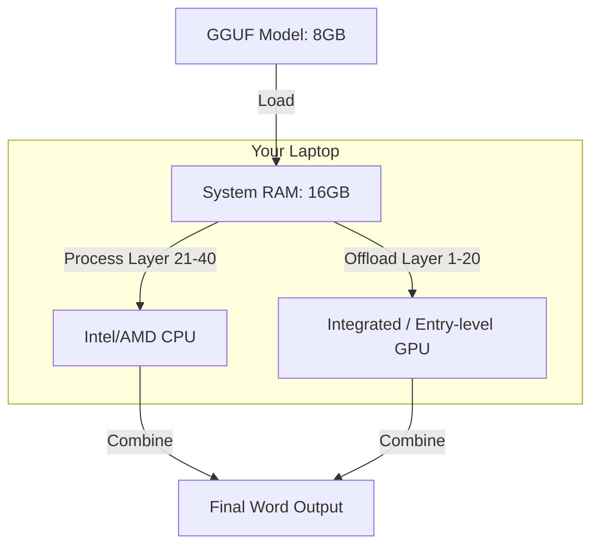

# 🧊 llama.cpp: AI for Everyone, Everywhere
> **Level:** Intermediate | **Language:** Hinglish | **Goal:** Master the art of local LLM execution, exploring GGUF format, CPU inference, Apple Silicon optimization, and the 2026 patterns for deploying AI on "Edge" devices without expensive GPUs.

---

## 🧭 1. Beginner-Friendly Hinglish Explanation
Bade AI models ko chalane ke liye mahange NVIDIA GPUs chahiye hote hain. Par kya ho agar aapko model apne **Laptop**, **Phone**, ya **Raspberry Pi** par chalana ho?

**llama.cpp** ek aisa magic tool hai jo LLMs ko "Aam Aadmi" ke liye banata hai.
- **Pure C++:** Isse kisi bhari library (Python/PyTorch) ki zaroorat nahi hai. Ye bahut "Lightweight" hai.
- **Quantization King:** Ye model ko itna compress kar deta hai (GGUF format mein) ki wo aapke laptop ki RAM mein fit ho jata hai.
- **Hardware Agnostic:** Ye Intel CPU, AMD GPU, Apple M3 chip, aur NVIDIA GPUs par bhi chalta hai.

2026 mein, agar aapko "Privacy" chahiye ya aapke paas internet nahi hai, toh llama.cpp hi wo rasta hai jisse aap AI ko apne control mein rakh sakte hain.

---

## 🧠 2. Deep Technical Explanation
llama.cpp is a high-performance C++ implementation of the Llama (and many other) architectures.

### 1. The GGUF Format (The 'Container'):
- Successor to GGML. It's a single binary file that contains both **Weights** and **Metadata** (Tokenizer info, Model config).
- It is designed to be "Extensible"—new features can be added without breaking old models.

### 2. Quantization (The 'Compression'):
- llama.cpp popularized the **K-Quants** (Q4_K_M, Q5_K_S).
- It uses sophisticated "Weight Grouping" to ensure that the model loses almost no "Intelligence" even when compressed to 4-bits.

### 3. Unified Memory (Apple Silicon):
- On Mac (M1/M2/M3), the CPU and GPU share the same RAM. llama.cpp is highly optimized for **Metal API**, allowing it to run 70B models on a MacBook Pro at usable speeds.

### 4. Grammar-Constrained Sampling:
- A unique feature where you can force the model to output ONLY valid JSON or a specific format using **GBNF grammars.**

---

## 🏗️ 3. llama.cpp vs. vLLM
| Feature | llama.cpp | vLLM |
| :--- | :--- | :--- |
| **Primary Goal** | **Local / Edge Portability** | High-Throughput Server |
| **Language** | C++ (Native) | Python / C++ |
| **VRAM Requirement** | Low (Can offload to RAM) | High (Needs GPU) |
| **Setup Complexity** | Very Low | Moderate |
| **Format** | **GGUF** | AWQ / GPTQ / FP16 |
| **Best For** | Laptop / Private Chat / IoT | API Provider / Chatbot |

---

## 📐 4. Mathematical Intuition
- **Perplexity Loss ($P$):** 
  When you compress a model from 16-bit to 4-bit, the "Perplexity" (how confused the model is) increases slightly.
  - FP16: $5.60$
  - Q4_K_M: $5.62$
  - **Tradeoff:** You save **$75\%$** memory for only **$0.3\%$** loss in intelligence. This is why llama.cpp is so popular.

---

## 📊 5. The Hardware Offloading (Diagram)


---

## 💻 6. Production-Ready Examples (Running Llama-3 Locally)
```bash
# 2026 Pro-Tip: Use 'main' for CLI and 'server' for an API.

# 1. Download the GGUF model (e.g., from HuggingFace Bartowski)
# 2. Run the interactive chat
./main -m llama-3-8b.Q4_K_M.gguf \
    -n 512 \
    --repeat_penalty 1.1 \
    --color \
    -i -r "User:" \
    -p "You are a helpful assistant."

# 3. Run as an API Server (OpenAI Compatible)
./server -m llama-3-8b.Q4_K_M.gguf \
    --port 8080 \
    --threads 8
```

---

## ❌ 7. Failure Cases
- **Slow Inference (1 tok/sec):** Usually happens because the model is too big for your RAM and the OS is swapping to the SSD (which is $1000x$ slower). **Fix: Use a smaller Quantization.**
- **CPU Overheating:** Running a heavy model on a laptop for 2 hours can make it extremely hot.
- **Metal/CUDA mismatch:** Not compiling with the right flags (`LLAMA_CUDA=1` or `LLAMA_METAL=1`), causing it to fall back to "Slow CPU" only.

---

## 🛠️ 8. Debugging Guide
- **Symptom:** "Out of Memory" even if RAM is free.
- **Check:** **GPU Layers (`-ngl`)**. You might be trying to offload too many layers to your small GPU VRAM. Reduce the number (e.g., set `-ngl 10`).
- **Symptom:** "Garbled output."
- **Check:** **Tokenizer / Prompt Template**. llama.cpp needs the exact right prompt format (Llama-3, ChatML, etc.) for each model.

---

## ⚖️ 9. Tradeoffs
- **CPU vs GPU Inference:** 
  - CPU is slower but has huge RAM (128GB+). 
  - GPU is $10x$ faster but limited RAM (8-24GB).
- **Quantization level:** 
  - Q2 (2-bit) is tiny but "Hallucinates" a lot. 
  - Q8 (8-bit) is perfect but large.

---

## 🛡️ 10. Security Concerns
- **Binary Execution:** llama.cpp is a compiled binary. Only download it from the official **ggerganov/llama.cpp** GitHub repo to avoid malware.

---

## 📈 11. Scaling Challenges
- **Concurrent Users:** llama.cpp is NOT a server-first engine. If 10 people use it at once, it will be very slow compared to vLLM.

---

## 💸 12. Cost Considerations
- **Total Cost:** **$\$0$**. You run it on hardware you already own. This is the cheapest way to learn AI Engineering.

---

## ✅ 13. Best Practices
- **Use 'Q4_K_M'**: It is the "Gold Standard" for balance between size and quality.
- **Enable Mlock:** Use the `--mlock` flag to prevent the OS from moving the model to the slow disk.
- **Set Threads correctly:** Usually, set threads to the number of **Physical CPU Cores**, not logical ones.

---

## ⚠️ 14. Common Mistakes
- **Downloading 'GGML'**: It's an old, dead format. Only use **GGUF**.
- **Not using 'mmap'**: Forgetting to enable mmap (it's on by default now) which allows for "Instant" model loading.

---

## 📝 15. Interview Questions
1. **"What is the difference between GGML and GGUF?"**
2. **"Explain how llama.cpp allows offloading layers to the GPU."**
3. **"Why is C++ better than Python for local AI inference?"** (Speed, memory control, no dependencies).

---

## 🚀 15. Latest 2026 Industry Patterns
- **Vision Support (Llava):** llama.cpp now handles images perfectly, allowing you to build "Local Vision AI."
- **MoE Optimization:** Incredible speedups for models like Mixtral on Apple Silicon.
- **Mobile Integration:** llama.cpp is now inside thousands of 2026 Android/iOS apps for "Privacy-first" local assistant features.
